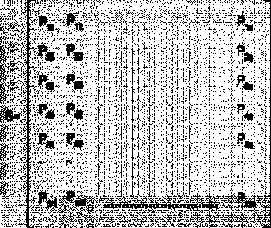
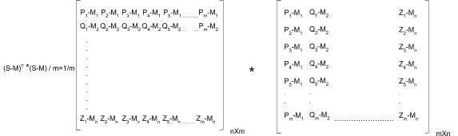
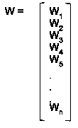
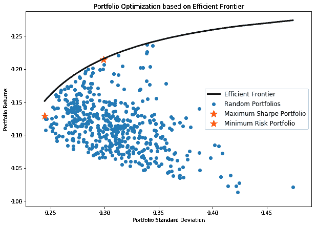

# 协方差矩阵和投资组合方差:计算与分析

> 原文：<https://blog.quantinsti.com/calculating-covariance-matrix-portfolio-variance/>

由[瓦伦·迪瓦卡](https://www.linkedin.com/in/varun-divakar-b862a667/)

在这篇博客中，我们将学习如何为 m 天的 n 只股票的投资组合创建协方差矩阵。

**协方差矩阵**用于计算股票投资组合的标准偏差，进而由投资组合经理用于量化与特定投资组合相关的风险。

本文涵盖:

*   投资组合分析是如何工作的？
*   [什么是协方差？](#what-is-covariance)
*   [如何计算协方差？](#how-to-calculate-covariance)
*   [计算协方差的步骤](#steps-to-calculate-covariance)
    *   [步骤 1 -获取股票数据](#step-1-getting-stock-data)
    *   [步骤 2 -计算股票的平均价格](#step-2-calculating-the-average-price-of-stock)
    *   [第三步-降低价格](#step-3-demeaning-the-prices)
    *   [步骤 4 -协方差矩阵](#step-4-covariance-matrix)
    *   [步骤 5 -投资组合差异](#step-5-portfolio-variance)
*   [基于有效前沿的投资组合优化](#portfolio-optimization-based-on-efficient-frontier)
*   [计算标准差](#calculating-standard-deviation)
*   [总结](#summary)

* * *

## ****投资组合分析是如何工作的？**T3】**

让我们理解投资组合分析是如何工作的。假设我们的投资组合中有 4 只股票，我们希望为每只股票分配最优资本，这样我们的风险最小。

为此，我们需要首先创建多个权重不同的投资组合，以反映每只股票的不同资本配置，并计算每个组合的标准差，然后选择风险最低的一个。

**预期投资组合方差= SQRT (W T *(协方差矩阵)* W)**

上面的等式给出了投资组合的标准差，换句话说，就是与投资组合相关的风险。

在这个等式中，

*   **W** 是表示资本分配的权重，协方差矩阵表示每只股票之间的相互依赖性。
*   **W T** '是同权矩阵的转置。

让我们了解一下什么是协方差，如何计算多只股票的协方差。

* * *

## ****什么是协方差？**T3】**

协方差是两个随机变量的联合可变性的度量。

*   如果两个变量同时增加和减少，那么**协方差值**将为**正**。
*   相反，如果一个增加而另一个减少，那么协方差将是负的。

* * *

## ****如何计算协方差？**T3】**

让我们逐步理解如何计算投资组合中“n”只不同股票的协方差。

* * *

## 计算协方差的步骤

假设我们投资组合中的“n”只股票(S 1 ，S 2 ，…S n )的收盘价如下所示。

### 步骤 1 -获取股票数据

<figure class="kg-card kg-image-card"></figure>

我们将把这些股票数据合并到一个矩阵中，并将其命名为“S”:

<figure class="kg-card kg-image-card"></figure>

### 步骤 2 -计算股票的平均价格

如你所见，每只股票都由过去“m”天的收盘价组成。使用这些数据，我们将首先计算每只股票的平均价格。

例如，股票 1 的平均价格如下所示:

<figure class="kg-card kg-image-card"></figure>

接下来，我们将“n”只股票的所有平均值保存在一个名为“M”的矩阵中，如下所示:

<figure class="kg-card kg-image-card"></figure>

我们的最终目标是理解一只股票的行为与另一只股票的行为之间的关系。要比较两只价格区间完全不同的股票，首先需要建立一个共同的基础。因此，为了使股票走势的比较更加均衡，我们从股票价格中减去股票价格的平均值。

这将创建一个新的去均值股票价格，这将有助于比较一只股票的运动如何从其均值依赖于另一只股票的运动从其均值。让我们了解如何创建一个去意义的系列。

### 降低价格

首先，我们从相应股票的收盘价中减去平均股价。这将为我们提供具有去均值得分的矩阵，或者一个数据点离其均值有多远的度量。

<figure class="kg-card kg-image-card"></figure>

### 步骤 4 -协方差矩阵

一旦我们有了去均值价格序列，我们通过将去均值价格序列的转置与其自身相乘并除以“m”(数据点的数量)来建立不同股票的协方差，这给出了协方差矩阵:

<figure class="kg-card kg-image-card"></figure>

<figure class="kg-card kg-image-card"></figure>

在生成的协方差矩阵中，对角线元素表示股票的方差。

此外，协方差矩阵沿对角线对称，这意味着:

**【21】=σ【12】**

### 步骤 5 -投资组合差异

一旦我们有了投资组合中所有股票的协方差，我们就需要计算投资组合的**标准差。为此，我们首先需要决定每只股票的权重或资本分配百分比。**

在创建权重矩阵时，我们需要记住矩阵中所有单个组件的总和应该等于 1，因为它们是总投资的百分比。

对于包含“n”只股票的投资组合，权重分布由矩阵“W”给出

<figure class="kg-card kg-image-card"></figure>

投资组合的预期回报由下式给出:

**预期投资组合收益= M * W**

投资组合的方差由下式给出

**预期投资组合方差= WT *(协方差矩阵)* W**

* * *

## 计算标准偏差

一旦我们计算了投资组合方差，我们就可以通过对方差求平方根来计算投资组合的**标准差**或**波动率**。

人们可以通过改变投资组合中股票的资本配置权重来构建各种投资组合。一旦你将这些投资组合绘制成图表，它看起来会像这样:

<figure class="kg-card kg-image-card"></figure>

这里的黑线表示有效边界，它表示给定风险下的最大利润。

* * *

## 摘要

使用该图，您可以轻松获得不同要求的投资组合权重组合，如**最小风险**和**最高夏普比率**。假设你是一名养老基金经理，试图将风险降至最低，你会选择一个标有黄色星号的投资组合。

同样，如果你是对冲基金经理，试图获得最佳风险回报组合，你会选择一组用红星标出的投资组合权重。因此在这篇博客中，我们按照一定的步骤创建了投资组合的协方差矩阵。

你可以从我们的[量化投资组合管理](https://quantra.quantinsti.com/course/quantitative-portfolio-management)课程中学习如何使用 **MPT** (现代投资组合理论)和其他技术，如**风格投资**。

* * *

**推荐阅读**

*   [使用蒙特卡洛模拟的投资组合优化](/portfolio-optimization-maximum-return-risk-ratio-python)
*   [投资组合分析:绩效测量和评估](/portfolio-analysis-performance-measurement-evaluation)
*   [投资组合分析:计算风险和回报](/portfolio-analysis-calculating-risk-returns)
*   [使用线性判别分析进行量化投资组合管理](/linear-discriminant-analysis-quantitative-portfolio-management)

* * *

<small>*免责声明:股票市场的所有投资和交易都涉及风险。在金融市场进行交易的任何决定，包括股票或期权或其他金融工具的交易，都是个人决定，只能在彻底研究后做出，包括个人风险和财务评估以及在您认为必要的范围内寻求专业帮助。本文提到的交易策略或相关信息仅供参考。*T3】</small>