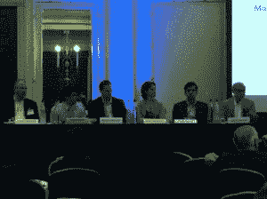

# 第四届年会-行为模型和情绪分析

> 原文：<https://blog.quantinsti.com/4th-annual-conference-behavioural-models-sentiment-analysis/>

**日期:【2014 年 6 月 16 日至 20 日**

**地点:**伦敦

QuantInsti 联合创始人、董事兼教员 Rajib Ranjan Borah 受邀于 2014 年 6 月 16 日至 20 日在伦敦举行的“第四届年会:应用于金融的行为模型和情绪分析”上发表演讲。

### **关于发布会**

本次会议是全球最大的金融新闻和情绪分析会议，有来自世界各地的 180 名与会者参加。发言者和小组成员名单包括

(一)该领域领先的学术研究专业人员，

(二)设计该领域研究工具和产品的供应商的专业人员，以及

(iii)金融行业的主要从业者，他们是交易和风险管理新闻分析的早期用户。

该活动包括一个为期两天的会前研讨会，主题为“市场微观结构、流动性和自动化交易研讨会”,于 6 月 16 日和 17 日在伦敦惠誉学习中心举办。

主要会议于 6 月 18 日和 19 日在伦敦格罗夫纳广场千禧梅菲尔酒店举行。

随后于 6 月 20 日在伦敦惠誉学习中心举办了一个关于“使用新闻专线和微博(Twitter)进行情感分类和观点挖掘”的会后研讨会。

### **QuantInsti 参加会议**

Rajib 在会前研讨会上主持了 12 场研讨会中的 6 场，也是一个会议小组的发言人:“利用新闻和社交媒体数据进行市场监控和运营风险控制”。研讨会的重点是市场微观结构和算法交易的概念，需要自动化的量化策略，如量化新闻分析。他们还以算法的方式探索了基于新闻分析的交易策略的技术和数量方面。

会议上的小组讨论探讨了交易员和风险经理如何利用量化的新闻评分来监控统计套利策略中的风险。该小组还讨论了不同地区的新监管方法以及使用新闻分析来增强监管数据挖掘能力的方法。

此外，惠誉学习的 [CQF 项目](https://www.quantinsti.com/courses/cqf/)(CQF 威尔莫特)的过去和现在的学生也在线参加了这些会议，惠誉学习是企业赞助商之一，它对这些会议进行了直播。