# 使用 Python 进行交易的决策树

> 原文：<https://blog.quantinsti.com/decision-tree/>

马里奥·比萨·培尼亚

决策树是一种用于分类和回归问题的机器监督学习方法，也称为 CART。

请记住，分类问题试图将未知元素归类到一个类或类别中；输出总是分类变量(即是/否、上/下、红/蓝/黄等)。)

回归问题试图预测一个数字，例如第二天的收益。它不能与用于研究变量之间关系的线性回归混淆。虽然分类和回归问题有不同的目标，但树有相同的结构:

*   根节点位于顶部，没有传入路径。
*   内部节点或测试节点位于中间，可以位于不同的级别或子空间，并且具有传入和传出路径。
*   叶节点或决策节点在底部，有传入路径，但没有传出路径，在这里我们可以找到预期的输出。

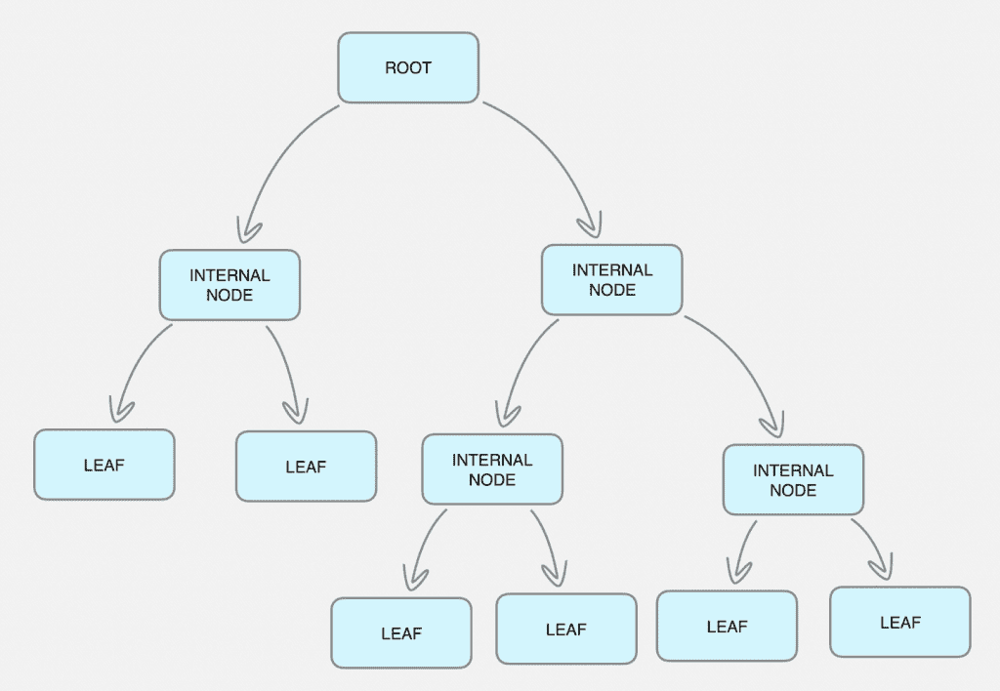

多亏了 Python 的 Sklearn 库，树是自动为我们创建的，以我们假设认为负责我们正在寻找的输出的预测变量为起点。

在这篇决策树的介绍文章中，我们将用 Python 创建一个分类决策树，来预测我们将要分析的金融工具第二天是上涨还是下跌。

我们还将[制作一个决策树](https://quantra.quantinsti.com/course/decision-trees-analysis-trading-ernest-chan)来预测第二天指数的具体回报。

### **准备环境**

确保您有以下可用的软件，以便遵循示例:

*   Python 3.6
*   熊猫数据结构库。
*   带有科学数学函数的 Numpy 库。
*   Quandl 图书馆检索市场数据。
*   计算技术指标的 Ta-lib 库。
*   Sklearn ML 库来构建树并执行分析。(以及其他许多事情)
*   Graphviz 库来绘制树。

### **构建决策树**

构建分类[决策树](https://quantra.quantinsti.com/course/decision-trees-analysis-trading-ernest-chan)或回归决策树的方式与我们组织输入数据和预测变量的方式非常相似，然后，通过调用相应的函数，分类决策树或[回归决策树](https://quantra.quantinsti.com/course/trading-with-machine-learning-regression)将根据我们必须指定的一些标准自动为我们创建。

构建决策树的主要步骤是:

1.  检索金融工具的市场**数据**。
2.  引入**预测**变量(即[技术指标](https://quantra.quantinsti.com/course/trading-using-options-sentiment-indicators)，情绪指标，广度指标等)。)
3.  设置**目标**变量或所需输出。
4.  **在训练和测试数据之间分割**数据。
5.  生成决策树**训练**模型。
6.  **测试**和**分析**模型。

如果我们看一下前四个步骤，它们是数据处理的常见操作。如果你是[决策树](https://quantra.quantinsti.com/course/decision-trees-analysis-trading-ernest-chan)的新手，预测器和目标变量对你来说可能听起来很陌生。但是，它们只不过是数据框中包含某种类型指示器的附加列。这些指标或预测指标用于预测目标变量，即分类模型的金融工具将上涨或下跌，或回归模型的未来价格水平。同样，拆分数据在任何回测过程(ML 或 not)中都是一项强制性任务，其思想是用一组数据来训练模型，用另一组未在训练中使用的数据来测试模型。

步骤 5 和 6 与[决策树](https://quantra.quantinsti.com/course/decision-trees-analysis-trading-ernest-chan)的 ML 算法特别相关。正如我们将看到的，Python 中的实现非常简单。然而，很好地理解参数化和结果分析是非常重要的。这篇文章非常实用，如果想更深入地了解基础数学，我们建议阅读文章底部的参考资料。

### **获取数据**

任何算法的原材料都是数据。在我们的例子中，它们是金融工具的时间序列，如指数、股票等。它通常包含开盘价、最高价、最低价、收盘价和成交量等细节。这些信息以一定的频率记录下来，如分钟、小时、天或周，形成时间序列。

有多个数据源可以下载数据，免费的和高级的。免费每日数据最常见的来源是 Quandl、雅虎或谷歌或我们信任的任何其他数据源。

在这里，我们将通过 [Quandl](https://www.quandl.com/) 检索来自埃米尼标准普尔 500 二十年的每日数据。

```
import quandl
df = quandl.get("CHRIS/CME_ES2")
df.head()
df.tail()
df.shape
```

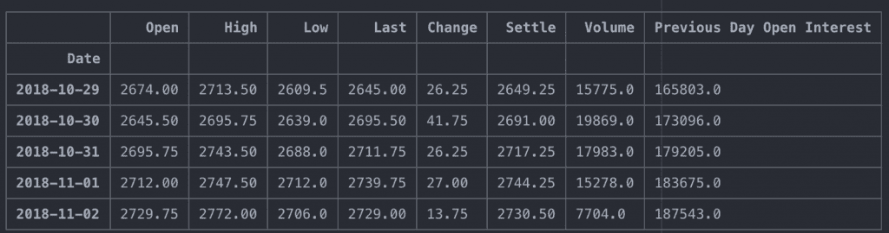

```
(5391, 8)
```

我们现在有超过 21 年的埃米尼·S&P500 的可用数据。我们将使用结算价作为收盘价参考。

### **创建预测器**

预测变量是我们认为与市场行为相关的数据。这些数据可以是多种多样的，如技术指标、市场数据、情绪数据、广度数据、基本面数据、政府数据等。这将有助于我们对市场的未来行为做出预测。

这里我们将测试趋势跟踪和区间交易的经典指标，它们是:

*   导弹电子搜索系统
*   （同 antitransmit-receive）反收发
*   ADX
*   RSI
*   MACD

因此，决策树算法应该帮助我们选择指标及其参数的最佳组合，以最大化作为目标的预期输出。

我们将通过计算用作预测指标的指标来准备数据，为此，我们将使用 [Ta-lib](https://blog.quantinsti.com/install-ta-lib-python/) 库:

```
import talib as ta
df['EMA10'] = ta.EMA(df['Settle'].values, timeperiod=10)
df['EMA30'] = ta.EMA(df['Settle'].values, timeperiod=30)
df['ATR'] = ta.ATR(df['High'].values, df['Low'].values, df['Settle'].values, timeperiod=14)
df['ADX'] = ta.ADX(df['High'].values, df['Low'].values, df['Settle'].values, timeperiod=14)
df['RSI'] = ta.RSI(df['Settle'].values, timeperiod=14)
macd, macdsignal, macdhist = ta.MACD(df['Settle'].values, fastperiod=12, slowperiod=26, signalperiod=9)
df['MACD'] = macd
df['MACDsignal'] = macdsignal
df.tail()
```

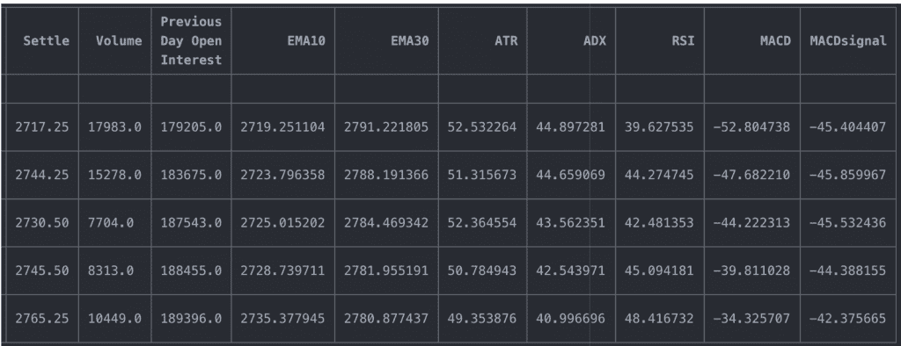

我们已经计算了指标，但有必要强调的是，我们是用标准参数计算的，这些参数可以而且必须优化，因为决策树与预先计算的指标一起工作。

另一方面，EMAs 和 MACDs 并不是这样，因为信号来自相对于均线的价格，或者相对于另一个均线的价格。让我们计算作为平均值和 MACD 预测值的列。

```
import numpy as np
df['ClgtEMA10'] = np.where(df['Settle'] > df['EMA10'], 1, -1)
df['EMA10gtEMA30'] = np.where(df['EMA10'] > df['EMA30'], 1, -1)
df['MACDSIGgtMACD'] = np.where(df['MACDsignal'] > df['MACD'], 1, -1)
df.tail()
```

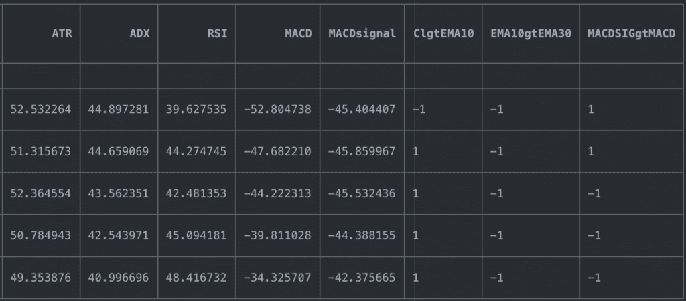

我们现在拥有的是可能的交易规则，我们将在决策树中引入这些规则，以帮助我们确定这些指标的最佳组合，从而使结果最大化。

*   EMA，我们感兴趣的是什么时候价格高于平均线，什么时候最快的平均线高于最慢的平均线。
*   ATR(14)，我们对触发信号的阈值感兴趣。
*   ADX(14)，我们感兴趣的是触发信号的阈值。
*   RSI(14)，我们感兴趣的是触发信号的阈值。
*   MACD，我们对 MACD 信号何时出现在 MACD 上空感兴趣。

在这个例子中，分类决策树和回归决策树的预测变量将是相同的，尽管目标变量是不同的，因为对于分类算法，输出将是分类的，而对于回归算法，输出将是连续的。

通过我们的 Quantra 课程，学习[如何制作决策树](https://quantra.quantinsti.com/course/decision-trees-analysis-trading-ernest-chan)利用人工智能技术预测市场和寻找交易机会。

### **创建目标变量**

正如我们已经说过的，分类和回归决策树有不同的目标。分类决策树试图通过提供分类变量来表征未来，即市场上涨或下跌，而回归决策树试图预测未来值，即未来市场价格。

我们将在这里为这两类问题创建目标变量，尽管每一类都将使用自己的目标。

```
df['Return'] = df['Settle'].pct_change(1).shift(-1)
df['target_cls'] = np.where(df.Return > 0, 1, 0)
df['target_rgs'] = df['Return']
df.tail()
```

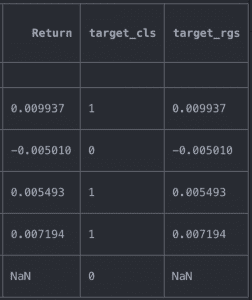

回归算法的目标变量( **target_rgs** )使用滞后回报，这是因为我们希望算法根据当前可用的信息了解第二天发生了什么。

分类算法的目标变量( **target_cls** )也使用滞后回报，但是因为输出是分类的，所以我们必须转换它。如果回报是正的，我们指定 1，如果是负的，我们指定 0。

### **获取决策树数据集**

我们已经准备好了所有的数据！我们已经下载了市场数据，应用了一些技术指标作为预测变量，并为每种类型的问题定义了目标变量，为分类决策树定义了分类变量，为回归决策树定义了连续变量。

我们将执行一个小操作来净化数据，并准备每个算法将使用的数据集。我们必须清除丢弃 NA 数据的数据，这一步对于干净地计算树是至关重要的。

接下来，我们将创建预测变量的数据集，也就是说，我们已经计算的指标，该数据集是我们将要创建的两个决策树(分类决策树和回归决策树)所共有的。

```
predictors_list = ['ATR', 'ADX','RSI', 'ClgtEMA10', 'EMA10gtEMA30', 'MACDSIGgtMACD']
X = df[predictors_list]
X.tail()
```

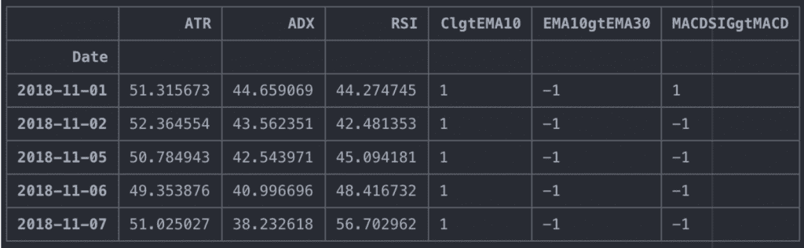

然后，我们为分类决策树选择目标数据集:

```
y_cls = df.target_cls
y_cls.tail()
```

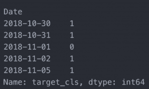

最后，我们为回归决策树选择目标数据集:

```
y_rgs = df.target_rgs
y_rgs.tail()
```

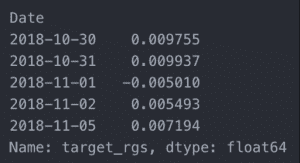

### **将数据分成训练和测试数据集**

完成数据集准备的最后一步是将它们分成**训练**和**测试**数据集。这对于用一组数据(通常是 70%或 80%以及剩余部分)拟合模型来测试模型的良好性是必要的。如果我们不这样做，我们将冒过度拟合模型的风险。我们希望在模型拟合后，用未知数据测试模型，以评估模型的准确性。

我们将创建训练数据集，其中 70%的数据来自预测变量和目标变量数据集，其余 30%用于测试模型。

对于分类决策树，我们将使用 sklearn 模型*选择库中的**训练*测试*分割**函数来分割数据集。由于输出是分类的，因此训练和测试数据集成比例很重要**train*****test _ split**函数将预测器和目标数据集以及一些输入参数作为输入:

*   **test_size** :测试数据集的大小，在本例中，30%的数据用于测试，因此 70%用于训练。
*   **random_state** :由于采样是随机的，这个参数允许我们在每次执行中重现相同的随机性。
*   **分层**:为了确保训练和测试样本数据成比例，我们将参数设置为 yes。这意味着，例如，如果正回报的天数多于负回报的天数，则训练样本和测试样本将保持相同的比例。

```
from sklearn.model_selection import train_test_split
y=y_cls
X_cls_train, X_cls_test, y_cls_train, y_cls_test = train_test_split(X, y, test_size=0.3, random_state=432, stratify=y)

print (X_cls_train.shape, y_cls_train.shape)
print (X_cls_test.shape, y_cls_test.shape)
```

这里我们有:

*   训练预测变量数据集:X_cls_train
*   训练目标变量数据集:y_cls_train
*   测试预测变量数据集:X_cls_test
*   测试目标变量数据集:y_cls_test

对于回归决策树，我们只是以指定的速率分割数据，因为输出是连续的，所以我们不担心训练和测试数据集中输出的比例。

```
train_length = int(len(df)*0.70)
X_rgs_train = X[:train_length]
X_rgs_test = X[train_length:]
y_rgs_train = y_rgs[:train_length]
y_rgs_test = y_rgs[train_length:]

print (X_rgs_train.shape, y_rgs_train.shape)
print (X_rgs_test.shape, y_rgs_test.shape)
```

同样，这里我们有:

*   训练预测变量数据集:X_rgs_train
*   训练目标变量数据集:y_rgs_train
*   测试预测变量数据集:X_rgs_test
*   测试目标变量数据集:y_rgs_test

到目前为止，我们已经完成了:

*   下载市场数据。
*   计算我们将用作预测变量的指标。
*   定义目标变量。
*   将数据分为训练集和测试集。

除了在获取目标变量和分割数据集的程序上略有不同外，迄今所采取的步骤是相同的。

### **用于分类的决策树**

现在让我们使用 sklearn.tree 库中的 DecisionTreeClassifier 函数创建分类决策树。

虽然 DecisionTreeClassifier 函数有许多参数，我邀请您了解并尝试一下(help(DecisionTreeClassifier))，但在这里我们将看到创建分类决策树的基础。

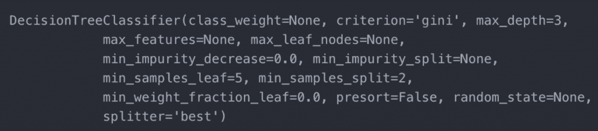

基本上是指算法必须用哪些参数来构建树，因为它遵循一种递归的方法来构建树，我们必须设置一些限制来创建它。

*   **标准**:对于分类决策树，我们可以选择基尼或熵和信息增益，这些标准指的是损失函数，以评估学习机算法的性能，并且最常用于分类算法，虽然这超出了本文的范围，但基本上可以帮助我们调整模型的准确性，并且构建树的算法停止评估根据损失函数没有获得改善的分支。
*   **max_depth** :树的最大层数。
*   **min_samples_leaf** :该参数是可优化的，表示我们希望在树叶中拥有的最小样本数。

```
from sklearn.tree import DecisionTreeClassifier
clf = DecisionTreeClassifier(criterion='gini', max_depth=3, min_samples_leaf=6)
clf
```

现在，我们将使用训练数据集来训练模型，我们拟合了模型，并且算法已经完全训练好了。

```
clf = clf.fit(X_cls_train, y_cls_train)
clf
```

现在，我们需要使用模型对未知数据进行预测，为此，我们将使用 30%的数据进行测试，最后评估模型的性能。但是首先，让我们用图形来看看 ML 算法为我们自动创建的分类决策树。

### **可视化分类决策树**

我们有一个非常强大的工具，可以帮助我们图形化地分析 ML 算法自动生成的树。该图显示了最大化输出的最重要节点，如果适用，将帮助我们确定一些有用的交易规则。

graphviz 库允许我们用图形表示决策树分类器函数用训练数据自动创建的树。

```
from sklearn import tree
import graphviz
dot_data = tree.export_graphviz(clf, out_file=None,filled=True,feature_names=predictors_list)
graphviz.Source(dot_data)
```

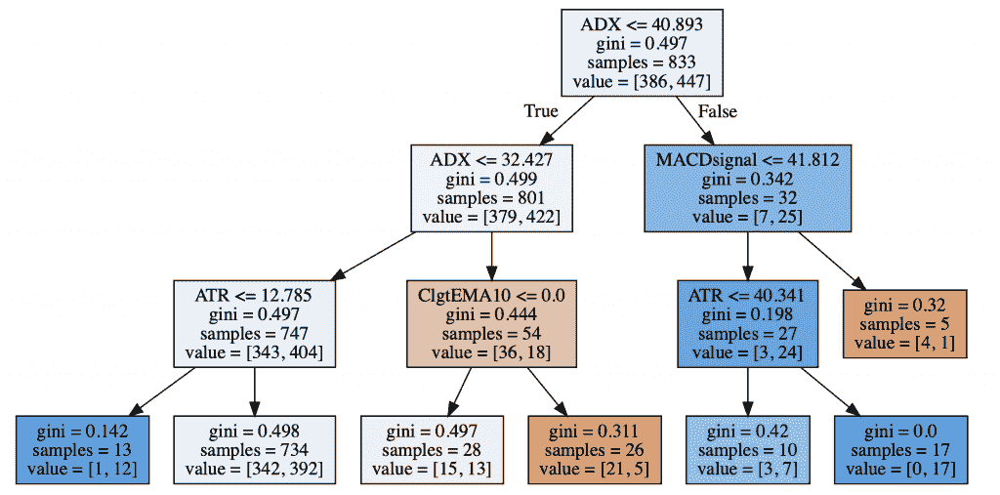

请注意，该图像仅显示了最重要的节点。在此图中，我们可以看到每个节点中的所有相关信息:

*   用于分割数据集的预测变量。
*   基尼不纯值。
*   该节点上可用的数据点的数量
*   属于每个类别的目标变量数据点的数量，1 和 0。

我们可以观察一对纯节点，这使我们能够推导出一种可能的交易规则。例如:

*   在从左边开始的第三片叶子上，当收盘价低于 EMA10 且 ATR 高于 51.814 且 RSI 低于或等于 62.547 时，标记减少。
*   从左边开始的第五片叶子上，我们可以推导出以下规律:当 ADX 小于等于 19.243，RSI 小于等于 62.952，RSI 大于 62.547 时，行情上行。

### **进行预测**

现在，让我们使用为测试保留的数据集进行预测，这部分将让我们知道该算法在训练中使用未知数据时是否可靠。

```
y_cls_pred = clf.predict(X_cls_test)
```

### **性能分析**

最后，我们只能通过与训练过程中获得的结果进行比较来评估算法在未知数据上的性能。为此，我们将使用 sklearn.metrics 库的 classification_report 函数。

该报告显示了一些有助于我们评估算法优劣的参数:

*   精度:表明我们预测的质量。
*   回忆一下:表明我们预测的质量。
*   **F1-得分**:显示精度和召回率的调和平均值。
*   **支持**:作为权重计算精度、召回率和 F-1 的平均值。

任何高于 0.5 的数字通常被认为是一个好数字。

```
from sklearn.metrics import classification_report
report = classification_report(y_cls_test, y_cls_pred)
print(report)
```

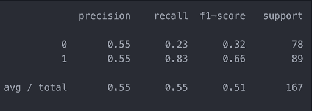

### **回归决策树**

现在让我们使用 sklearn.tree 库中的 DecisionTreeRegressor 函数创建回归决策树。

虽然 DecisionTreeRegressor 函数有许多参数，我希望您了解并尝试一下(help(DecisionTreeRegressor))，但这里我们将看到创建回归决策树的基础。

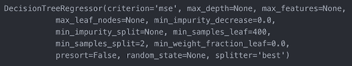

基本上是指算法必须用哪些参数来构建树，因为它遵循一种递归的方法来构建树，我们必须设置一些限制来创建它。

*   **标准**:对于分类决策树，我们可以选择平均绝对误差(MAE)或均方误差(MSE)，这些标准与损失函数相关，用于评估学习机算法的性能，并且最常用于回归算法，虽然这超出了本文的范围，但基本上可以帮助我们调整模型的准确性，以及构建树的算法，停止评估根据损失函数没有获得改善的分支。这里我们将默认参数设为均方误差(MSE)。
*   max_depth :树将拥有的最大级别数，这里我们将默认参数设为 none。
*   **min_samples_leaf** :这个参数是可优化的，表示我们希望树拥有的最少叶子数。

```
# Regression tree model
from sklearn.tree import DecisionTreeRegressor
dtr = DecisionTreeRegressor(min_samples_leaf = 200)
```

现在，我们将使用训练数据集来训练模型，我们调整模型，算法将已经得到充分训练。

```
dtr.fit(X_rgs_train, y_rgs_train)
```

现在，我们需要使用模型对未知数据进行预测，为此，我们将使用 30%的数据进行测试，最后评估模型的性能。但是首先，让我们用图形来看看 ML 算法自动为我们创建的回归[决策树](https://quantra.quantinsti.com/course/decision-trees-analysis-trading-ernest-chan)。

### **可视化模型**

为了可视化该树，我们再次使用 graphviz 库，它为我们提供了用于分析的回归决策树的概述。

```
from sklearn import tree
import graphviz
dot_data = tree.export_graphviz(dtr,
                  out_file=None,
                  filled=True,
                  feature_names=predictors_list)
graphviz.Source(dot_data)
```


在此图中，我们可以看到每个节点中的所有相关信息:

*   用于分割数据集的预测变量。
*   MSE 的值。
*   该节点上可用的数据点数

通过我们的 Quantra 课程，学习如何使用人工智能技术制作决策树来预测市场和寻找交易机会。

### **结论**

这看起来像是我们发现了一个水晶球，但事实并非如此。掌握这些技术需要大量的学习和对背后的数学技术的整体理解。

显然，树很容易创建和提取一些有用的规则，但事实是，要创建决策树，它们需要参数化，这些参数可以而且必须优化。

为了继续加深我们对决策树的了解，并真正帮助我们提取可靠的交易规则，我们将在下一篇文章中使用集成机制来创建一个健壮的模型，该模型结合了一个算法创建的模型。

*   并行集成方法或平均方法:通过一种算法创建多个模型，预测是所有模型的平均值；
    *   制袋材料
    *   随机子空间
    *   随机森林

*   序贯集成方法或 boosting 方法:该算法创建序贯模型，对每个新模型进行改进，以减少前一个模型的偏差；
    *   AdaBoosting
    *   梯度推进

我们已经在这个博客中学习了如何使用 Python 创建分类和回归决策树，现在我们可以在 Ernest P. Chan 博士的课程中学习高级概念和策略。

*免责声明:股票市场的所有投资和交易都涉及风险。在金融市场进行交易的任何决定，包括股票或期权或其他金融工具的交易，都是个人决定，只能在彻底研究后做出，包括个人风险和财务评估以及在您认为必要的范围内寻求专业帮助。本文提到的交易策略或相关信息仅供参考。T3】*