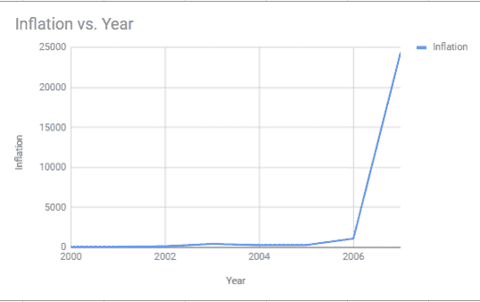

# 影响外汇市场交易的 9 个因素

> 原文：<https://blog.quantinsti.com/forex-market-trading-factors/>

以[重香重香](https://www.linkedin.com/in/rekhit/)

外汇市场交易并不困难，如果你有一个基本的想法，当一个国家的外汇将发生变化。

但是你是怎么知道的？

经过一段时间后，人们意识到外汇市场会受到某些宏观经济因素的影响。在这篇文章中，我会带你通过一些影响外汇市场交易的因素。

要阅读外汇市场交易的基础和要点，可以访问[这篇文章](https://blog.quantinsti.com/basics-forex-trading-beginners/)。

我们现在来看一下清单。以下是影响外汇市场交易的 9 个因素

### **政治格局**

当政府愿意采取措施提高人民的生活水平时，经济就会增长。因此，一个稳定的政府可能是一个投资者友好国家的第一个标志。这意味着经济增长的障碍更少，机会更大。

**与外汇市场交易的关系:**交易者可能会购买政治局势稳定的国家的货币。

**外汇交易领域的例子:**

英国退出欧盟的消息导致英镑对美元的汇率下跌。 [1](https://www.independent.co.uk/voices/brexit-sterling-pound-record-low-31-years-theresa-may-tory-conference-make-us-poorer-a7344626.html)

### 通货膨胀率

没什么好惊讶的。如果一个国家的通货膨胀率与另一个国家相比相对较低，那么与通货膨胀率较高的货币相比，该国的货币预计会升值。

**与外汇市场交易的关系:**投资者会寻求购买通货膨胀率较低的货币。

**外汇交易领域的例子:**

正如你在图表中看到的，随着津巴布韦通货膨胀率的上升，其货币价值急剧贬值。因此，津巴布韦元对外汇交易者来说并不是一个有吸引力的目的地。

### **利率**

我想用一个店主向五个孩子出售钢笔的例子来解释这个问题。

假设你是卖 10 卢比钢笔的店主。现在，五个孩子拿着 10 卢比的钞票来找你要一支笔，但问题是你只有三支笔。一种情况是，你发起了一场竞价战，最需要它的人会出价这支笔的两倍或三倍。但是等等！还有一个办法。

假设你意识到其中两个孩子现在并不真的需要这支笔。所以你告诉他们把 10 卢比存到你这里，当你有新的股票时，你会把它给他们。为了增加交易的甜头，你说你会给他们 1 卢比和笔。两个孩子同意了，你的问题就解决了。

诚然，这是一种过于简化的说法，但这就是每当央行决定通胀率失控时，它就会通过提高利率来控制通胀率，从而控制市场上的货币量的逻辑。

利率上升对投资者来说是一个好兆头，因为货币利率上升会导致货币利率上升。

**它与外汇市场交易的关系:**随着收益率的提高，投资者会被利率较高的经济体所吸引。这增加了对货币的需求，反过来也增加了汇率。

**外汇交易领域的例子:**

印度央行提高了利率，以遏制卢比的下跌。 [3](https://qz.com/india/1298205/urjit-patel-led-rbi-hikes-interest-rate-first-time-since-narendra-modi-took-over/)

### **政府债务**

你会把钱给一个已经负债的人吗？你不会的。

这里是同样的概念，一个国家的债务越高，它吸引外资的机会就越低，这反过来降低了该国的汇率。

**它与外汇市场交易的关系:**投资者可能会看到多年来政府债务的趋势，以确定投资该国货币是否是一个明智的决定

**外汇交易领域的例子:**

印度卢比疲软的原因之一是政府债务并未因油价上涨而减少。

### **贸易条件(出口价格对进口价格的比率)**

贸易条件可以解释为出口价格与进口价格的比率。如果该国的贸易条件很大，即他们的出口大于进口，货币总是会升值，会有需求。这意味着它的货币价值将大于另一个贸易条件相对较低的国家。

**与外汇市场交易的关系:**投资者可能希望投资于一个出口大于进口的国家。

**外汇交易领域的例子:**

由于中国的贸易条件大多是积极的，这是一个有吸引力的外汇交易来源。 [4](https://www.theglobaleconomy.com/China/Terms_of_trade/)

### **猜测**

这不完全是一个可衡量的因素。如果有人猜测货币汇率将会上升，其他投资者将会要求更多的货币，其货币汇率将会进一步上升。另一方也是如此。

**它与外汇市场交易的关系:**这里的诀窍是识别跟风效应，并确保在效应消失前退出。

**外汇交易领域的例子:**

在 2005 年至 2006 年期间，由于美国房地产市场的贷款利率较低，有人猜测房地产价格将会上涨，而这反过来会提高美元的价值。

### **资本市场**

通过观察资本市场的趋势，你可以大致了解经济状况。股票市场的长期下跌通常表明投资者信心不足，因此，可以用来预测与其他国家相比的汇率。

**与外汇市场交易的关系:**如果资本市场呈现上升趋势，这意味着汇率将上升。

**外汇交易领域的例子:**

自 2005 年以来，随着中国资本市场的飙升，美元/CNY 货币对下降，这意味着人民币走强。[5](https://tradingeconomics.com/china/stock-market)[T5】6](https://www.macrotrends.net/2575/us-dollar-yuan-exchange-rate-historical-chart)

### **就业数据**

每个国家都会定期发布就业率。这是经济运行良好的另一个标志。如果经济停滞不前，高失业率意味着经济增长与人口增长不同步。

**与外汇市场交易的关系:**高失业率可能导致货币贬值，从而降低该货币的汇率。

**外汇交易领域的例子:**

9 月份美国非农就业报告以乐观的基调发布后，美元指数(DXY)即美元相对于一篮子外币的表现从 94.95 上升至 95.35。 [7](https://www.dailyfx.com/forex/market_alert/2018/09/07/US-Dollar-Jumps-after-All-Around-Solid-August-US-Nonfarm-Payrolls-Report.html)

### **经济规划**

一个国家的货币和财政政策会给你一个好主意，它是否对投资者友好。因此，如果政府有吸引外国资本的计划和激励措施，投资者可能会涌向这个国家，增加对特定货币的需求。

**与外汇市场交易的关系:**由于海外的大量投资，该国的货币汇率将会上升。

**外汇交易领域的例子:**

在提交 2018 年预算后，在国内市场，BSE 和 NSE 呈下降趋势，据估计，印度股票总共损失了 460 万卢比。

谈到外汇市场交易，卢比兑美元汇率下跌了 44 便士。

这些是每个投资者在开始外汇交易前应该知道的几个因素。

在阅读了这篇关于影响外汇交易的各种因素的文章后，你不仅知道了[外汇交易策略](https://quantra.quantinsti.com/course/Value-Strategy-Forex)的基础，还了解了某些因素是如何影响外汇市场交易的。

但是，为什么就此打住呢？我们来试着理解一下，如何评价一个国家的汇率相对于其他一篮子国家的汇率。提示:它叫 REER。让我们现在就去看那篇文章。

您可以报名参加 Quantra 上的[外汇交易策略](https://quantra.quantinsti.com/course/Value-Strategy-Forex)课程，学习根据实际有效汇率(REER)等基本面创建价值策略。

*免责声明:股票市场的所有投资和交易都有风险。在金融市场进行交易的任何决定，包括股票或期权或其他金融工具的交易，都是个人决定，只能在彻底研究后做出，包括个人风险和财务评估以及在您认为必要的范围内寻求专业帮助。本文提到的交易策略或相关信息仅供参考。*