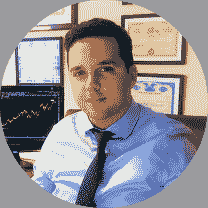

# 风险管理:最大化长期增长

> 原文：<https://blog.quantinsti.com/risk-management-webinar-25-october-2018/>

[https://www.youtube.com/embed/kt1jSw9BDt0?rel=0](https://www.youtube.com/embed/kt1jSw9BDt0?rel=0)

### **2018 年 10 月 25 日星期四 IST 时间下午 6:30 |格林威治时间下午 13:00 |格林尼治时间晚上 9:00**

### **会议大纲**

风险管理是系统交易中最容易被忽视但又非常重要的方面。在本次网络研讨会中，您将学习风险管理技术，以克服最常见的挑战。本课程将向你解释最佳杠杆、对冲和风险指标的概念。

*   风险管理和真正的挑战
*   最佳杠杆:凯利公式，最大下降
*   市场风险:止损、波动目标、风险价值
*   对冲技术
*   风险指标

### **演示文稿**

您可以点击此处查看本次网络研讨会的 powerpoint 演示文稿:

[//www.slideshare.net/slideshow/embed_code/key/zgHApx33zUxziJ](//www.slideshare.net/slideshow/embed_code/key/zgHApx33zUxziJ)

**[Risk Management: Maximising Long-Term Growth Presentation](//www.slideshare.net/QuantInsti/risk-management-maximising-longterm-growth-presentation "Risk Management: Maximising Long-Term Growth Presentation")** from **[QuantInsti](//www.slideshare.net/QuantInsti)**

### **Python 代码**

您可以从这里下载网上研讨会中展示的 python 代码:

### **演讲者**

#### **Marco nicolás Dibo(Quanticko Trading 首席执行官)**

Marco 的职业生涯是作为交易员和投资组合经理度过的，他特别关注股票和衍生品市场。

他专门研究量化金融和算法交易，目前担任阿根廷 Valores S.A .的量化交易部门主管。Marco 还是 Quanticko Trading S.A .的联合创始人兼首席执行官，quanti cko Trading s . a .是一家致力于开发高频交易策略和交易软件的公司。Marco 拥有圣安德烈斯大学的经济学学士学位和金融学硕士学位。Marco 是 EPAT 的成功校友，并在课程中撰写了一个关于配对交易策略和使用 Quantstrat 进行回溯测试的项目。