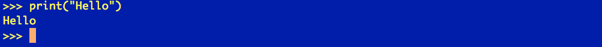
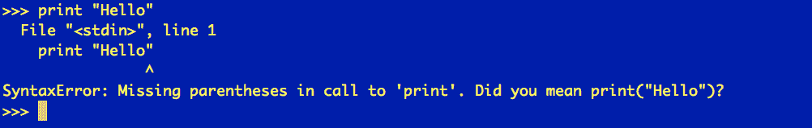
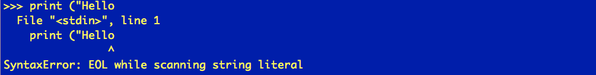
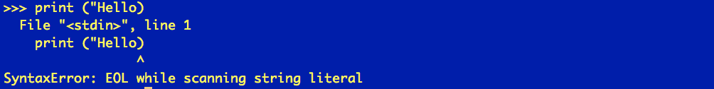
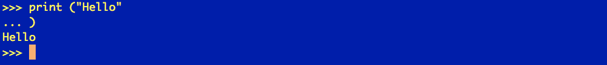
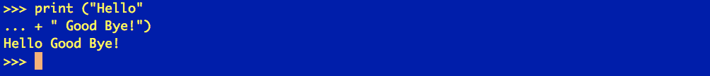
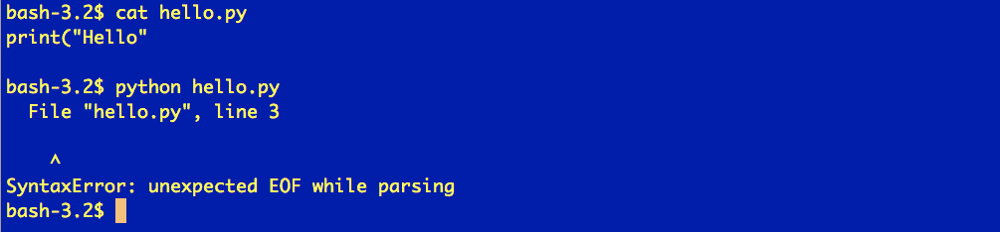
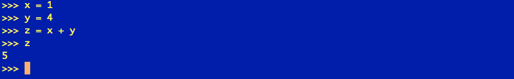
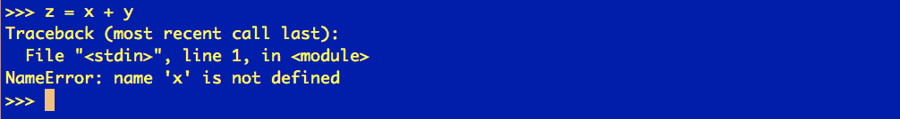

# 在 Python 中处理错误和异常

> 原文：<https://blog.quantinsti.com/dealing-python-error-exceptions/>


马里奥·比萨·培尼亚

所有程序员迟早都会发现自己花了大量时间处理代码中的错误。因此，有必要了解我们发现的错误类型以及如何处理它们。想了解更多关于 Python 进行交易的知识，也可以查看[这篇文章](https://blog.quantinsti.com/getting-started-python-trading/)

这篇文章将尝试用简单的语言回顾 Python 错误解释和 Python 错误解决的各个方面。

[](https://www.quantinsti.com/python-basics-handbook)T3】

### **理解 Python 中的错误和异常**

有两种错误:Python 语法错误和 Python 异常。

**Python 语法错误**通常很容易检测和修复。除非我们在不包含 Python 解析器的文本编辑器中编写代码，否则编辑器通常会告诉我们何时出现了**语法错误**，也就是说，何时我们编写了 Python 无法理解的代码。

**Python 异常**则相反，是只有在代码执行时才能检测到的错误。在这里，代码在语法上是正确的，但是在执行时，它在某一行遇到了一些问题，导致代码无法继续执行。

Python 语法错误必须立即纠正，否则，我们无法对代码做任何事情。Python 异常是运行时可能发生的异常情况，我们能做的最好的事情是控制它们，以防止异常结束执行。

让我们看看如何处理这类错误。

### **Python 语法错误**

用一个非常简单的例子，让我们看看 Python 语法错误是如何表现的。

我们将看到的第一件事是一个语法正确的代码，我们希望用 Python 3 在屏幕上打印一条消息:



由于没有 Python 语法错误，Python 给出了我们正在寻找的输出。

现在让我们试着做同样的事情，但是用 Python 2 的风格(记住，这里我们用的是 Python 3):



虽然对于 Python 2 来说，这个语句不成问题，但是 Python 3 解释器希望找到要打印的消息周围的括号。因此，这就是它让我们知道的方式，清楚地告诉我们有一个 Python 语法错误，并为我们提供了一个可能的解决方案。

现在让我们犯一些愚蠢的错误来观察 Python 的输出:



这里我们忘记了结束引号和括号，Python 解释器告诉我们在行尾(EOL)有问题，即行尾不是预期的。

我们将尝试通过犯另一个 Python 语法错误来纠正它:



这里我们关闭了 print 语句，但让字符串保持开放。Python 解释器再次给出一条错误消息，指出行尾仍然不正确。

好的，我们现在要关闭字符串文字，但是这次我们不关闭输出。


这里发生了什么？ Python 没有给我们提供预期的输出，但也没有抛出错误。相反，它显示了一行二级提示(三个点…)，即解释器正在等待更多信息。在这种情况下，我们可以关闭括号，甚至向 print 语句添加更多信息。





这里 Python 给了我们向 print 语句添加更多信息的机会，因为解释器仍然是打开的，并且在等待输入。直到我们结束句子，Python 解释器才知道我们已经完成了打印，因此期望我们输入更多的信息。

在迄今为止的例子中，我们已经在解释器中直接引入了语句，但是如果代码在文件中会发生什么呢？



在这里，它表示在文件结尾(EOF)有一个 Python 错误。然而这一次，它不允许我们输入任何信息，这是因为我们启动 Python 来运行文件。如果这个文件包含错误，Python 会返回到操作系统终端，指出文件和发现错误的行。

### **Python** **异常**

Python 异常是一种错误，只有在运行时发现异常时才会触发。

**例如:**

```
z = x + y
```

从语法上来说，这是正确的，但是指令结束的好坏取决于它从 x 和 y 得到的值，如果它们有值的话。

假设:

```
x = 1 & y = 4:
```



该指令将毫无问题地执行，并将给出以下结果:

```
 5 for z.
```

如果 x 和/或 y 没有声明/初始化会发生什么？



我们得到一个异常，在这种情况下，称为 **NameError** ，它停止执行。这是因为它没有找到我们想要添加的变量(它们不存在，它们没有被声明或初始化)

如果 x 和/或 y 是字符，会发生什么？


我们得到一个 Python 异常，在这种情况下，称为 **TypeError** ，它停止执行。发生这种情况是因为我们试图添加一个有几个字母的数字，由于不可能完成这个操作，解释器抛出了一个异常。

到目前为止，我们只看到了两个异常: **NameError** 和 **TypeError** ，但是在 Python 中嵌入了更多的 Python 异常。此外，这是一个基本的优势，我们可以声明、捕捉和处理我们自己的 Python 异常。

处理 Python 异常的另一个最重要的方面是我们可以控制它们。也就是说，一旦出现异常情况，我们可以控制该异常并正确处理它，以允许代码继续执行，而不是停止执行。

在下一篇文章中，我们将看到如何处理异常，以及如何让我们的程序更加健壮。

### **接下来的步骤**

对于那些渴望了解更多关于 Python，它在算法和量化交易领域的使用和应用，或者只是想开始用 Python 进行交易的人，他们可以选择 [Quantra](https://quantra.quantinsti.com) 的 [Python For Trading](https://quantra.quantinsti.com/course/python-for-trading) 课程。它从头开始涵盖了重要的概念，也有助于发展和提高专门针对交易的 Python 技能。

*免责声明:股票市场的所有投资和交易都有风险。在金融市场进行交易的任何决定，包括股票或期权或其他金融工具的交易，都是个人决定，只能在彻底研究后做出，包括个人风险和财务评估以及在您认为必要的范围内寻求专业帮助。本文提到的交易策略或相关信息仅供参考。*