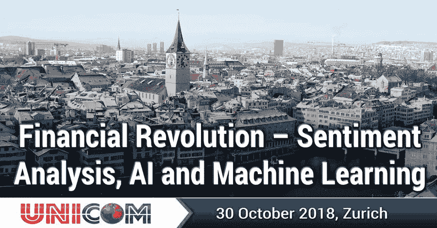

# 金融革命——情绪分析、人工智能和机器学习

> 原文：<https://blog.quantinsti.com/conference-zurich-sentiment-analysis-ai-ml/>

[金融革命——情绪分析、人工智能和机器学习](http://conference.unicom.co.uk/sentiment-analysis/2018/zurich/)—**苏黎士，2018 年 10 月 30 日**

### **概述**

了解**情感分析**、 **AI** 和**机器学习**的创新如何影响和惠及**金融领域**；探索**研究**和**实践**交汇处最本质的问题，了解**最新模型**和**方法，**演示如何使用人工智能和机器学习方法成功生成投资决策。

演讲者包括阿伦·维尔马、**彭博；**马蒂亚斯 Uhl，**瑞银；**安德斯·巴利，森蒂菲；Gautam Mitra，OptiRisk &客座教授，UCL；项羽和克里斯蒂娜·埃尔文-塞耶斯，OptiRiskRonald Hochreiter，吴维也纳经贸大学&金融数据科学研究院。

除了会议之外，还有一个名为“[日内交易技术和策略](http://conference.unicom.co.uk/sentiment-analysis/2018/zurich/index.php/workshop/)的研讨会，这是一次非常实用的实践体验，由**iRage Capital(印度)**首席执行官 Rajib Ranjan Borah 和【巴西】阿尔费纳斯联邦大学 Humberto Brandã主讲。这次会议在伦敦、新加坡、香港和班加罗尔取得了巨大成功；现在轮到瑞士了。

### **为什么要参加？**

*   聆听来自英国、美国、欧洲和印度/香港的顶尖学科专家的演讲
*   该方案包括最新的最先进的研究，实际应用和案例研究
*   期待技术和深入的介绍和讨论；我们喜欢刺激你的脑细胞！
*   与所有参与者，包括主持人、投资者和参展商，全天都有极好的交流机会。

### **涵盖的主题**

*   机器学习和深度学习的基础和应用
*   应用于数据、文本和多媒体的模式分类器、自然语言处理(NLP)和人工智能
*   情绪得分与新古典金融模型相结合
*   以定性和定量方法为基础的财务分析
*   应用于金融的预测和规范分析
*   行为和认知科学
*   人工智能的未来及其对工业的影响

### **参加本次活动，赢取 Earn 持续专业发展学分**

联通已向 GARP 注册了该计划，以获得持续专业发展(CPD)学分。参加本课程可获得 7 个 GARP 持续专业发展学分。如果你是注册的[金融风险经理](http://www.garp.org/#!/frm/%20?utm_source=frm_cpd&utm_medium=email&utm_campaign=frm_approvedproviders) (FRM)，请在你的[信用追踪器中记录这一活动。](http://www.garp.org/#!/cpd/)