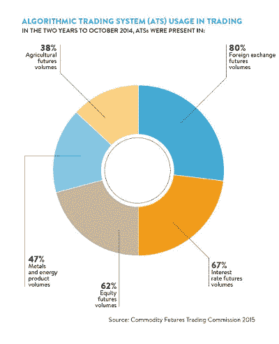
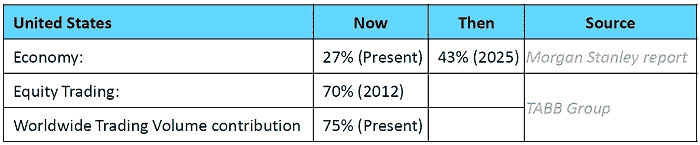
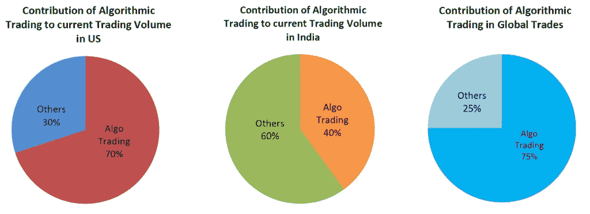
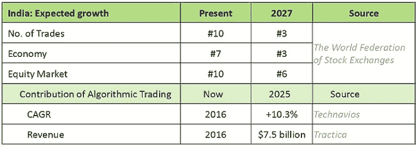
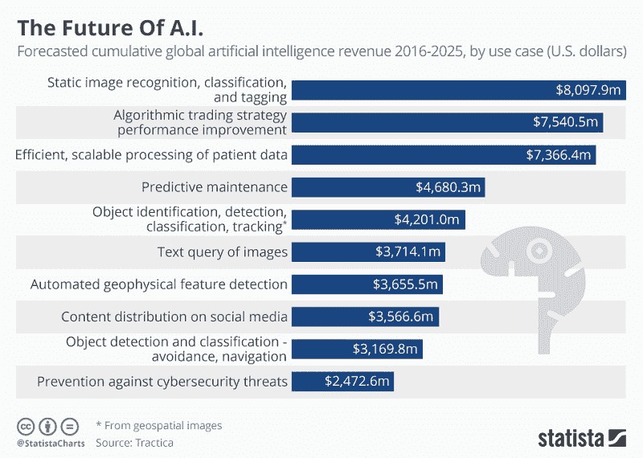

# 算法交易的增长和未来

> 原文：<https://blog.quantinsti.com/growth-future-algorithmic-trading/>

由[维拉伊·巴加](https://www.linkedin.com/in/virajbhagat/)

回顾原始时代，当火是人类最伟大的成就时，谁能在他们最疯狂的梦想中想到我们人类今天所取得的成就？

我经常惊讶于从公元前 300 年的基本欧几里得算法到现代算法的奇妙交易之旅。看看信息在地球上传播的速度。

今天，[算法交易](https://quantra.quantinsti.com/course/getting-started-with-algorithmic-trading)是近年来谈论最多的技术之一。它通过消除人为错误和改变当今金融市场的互联方式，赋予了交易公司在快速发展的市场中更大的权力。它的使用归功于大多数市场，甚至归功于**商品交易**，如图所示:

我们很想知道与这个问题有关的许多其他因素。我们想知道算法交易的未来会是什么样子。

我们渴望学习交易的秘密，它会为我们举行。

这正是我们在这篇博客中所探索的。

## 为什么要选择算法交易？

过去几年，算法交易无可挑剔地崛起。一些表现最好的对冲基金将其成功归功于此。算法交易没有人类的情感，没有延迟，以技术为导向，快节奏，即时准确地执行交易指令。

目前，交易发生在微秒到纳秒的范围内，仅一毫秒就占了市场交易每年数百万的收入。除了易用性、定制化等，匿名性、成本和速度是算法交易的许多理想品质中的几个。

随着交易领域的地理位置加速变得无关紧要，全球任何市场上发生的事件几乎同时发生，并产生积极影响。

随着进化而进化才公平。

## 谁在赶时髦？

*   主要贸易公司
*   经纪商
*   零售商
*   高水平投资的跨国投资银行

这已经对所有领域产生了多米诺骨牌效应，因为这些方面是相互关联的，并对彼此的机会、发展和进步产生了显著的影响。

图表 1 和 2——资料来源:莫顿·格兰茨、罗伯特·基塞尔；图表 3 -资料来源:汤森路透

随着许多国家的大多数交易在算法交易的基础上实现自动化和可靠性，它极大地改变了交易场景。这无疑给了我们更多开始使用它的理由。

令人惊讶的是**印度**正在迎来一场经济和技术革命，这场革命将彻底改变数字世界！

更快的速度意味着快速高效的警戒、监控、安全和强健的架构。编程和构建系统的知识，谨慎的使用和彻底的测试将帮助分析交易者以万无一失的方式实施正确的策略。即使该系统变得自力更生，也需要通过不断的评估来检查其进展和功能，这将带来**具有多种特征的不断增长的职业机会**。

定量研究分析师、衍生品交易员、商业分析师、顾问、定量分析师、策略分析师的工作岗位将出现在衍生品、交易、电子做市和风险管理领域。

## 算法交易的法规

法规管理并致力于消除对特定市场的任何威胁。但在这样做的时候，它不得不经常扼杀创新，并保持检查到位，以避免不当行为或滥用。至关重要的是，监管机构应精通算法的操作，并具有灵活性，能够在需要时参与新的立法。

最近，欧洲的立法鼓励自动化，许多监管方面的改进和变化都支持算法交易和**高频交易(HFT)** ，因为它带来了透明度和问责制。这为其成长和扩散铺平了道路。

面临的挑战主要是在已经支离破碎的市场中风险评估能力和运营效率不足。

## 机器学习和算法交易

**机器学习**通过提供强大的工具从全球各地处理的数据中提取模式，在算法的基础上增加了一层智能，使技术有机会实时研究它。智能机器很可能会引领整个交易革命，因为它的发展和更新的技术正日益占据主导地位，例如:

*   量子计算
*   加密货币
*   区块链技术
*   云计算
*   金融科技
*   大数据
*   物联网 IoT 等。

机器学习与以下技术的结合可以创造奇迹:

*   纳米技术在贸易中的应用
*   允许 HFT 在 74 纳秒内执行的定制芯片可能会进一步发展，以吸引价值数百万的投资
*   超高速微波传输技术，以光速传输数据
*   使用加密货币提供服务的公司数量可能会增加
*   诸如将延迟进一步降低到 20 纳秒以下等成就。

## 人工智能和算法交易

人工智能可能能够在没有任何影响的情况下进行交易，因为它将推动交易策略的改进。

## 未来的交易系统

未来的系统可以研究我们在整个交易历史过程中存档的所有历史数据，轻松地分析这些数据，找出趋势，什么可行，什么不可行。它还可以教会自己轻松预测未来市场，同时交易多个账户和策略以分散风险，并拒绝或接受实时出价和报价。

如果市场不喜欢你的交易策略规则，系统的自学习算法会根据不同的模式调整交易，并改变规则以适应市场条件。

它可以同时检查全球多个市场状况，节省大量时间，并消除任何微小的时间差距或发生错误的可能性。

随着交易变得有意识并意识到买/卖出错的影响，或者市场波动在交易所下降并在没有任何人为干预的情况下迎接挑战以从中恢复，市场崩溃可能会成为过去。因此，我们可以期待消除某些差异，如闪存崩溃。

**算法**可以直接编程到芯片中，以提高效率和简化通信。特定的全局调节和断路开关也可以被编程。

想象一下一个如此强大的系统，它具有大数据和连接的广阔范围，如物联网的快速互联网速度和千兆次浮点运算处理能力，整合了结构化和非结构化数据，利用实时全球新闻，在一个算法引擎中包含实时社交媒体和全球当前和历史股票数据。

现在这将是一件大事。

## 额外内容

以下是我们在算法交易的[提问环节](/algo-trading-ama-5-december-2017/)中遇到的一些最常见的问题。

#### 问:如果我有一个显示真实的回溯测试和前向测试结果的程序，我将来应该如何处理它以保持它在市场上持续盈利？

**回复:**一种策略的持续盈利可能是一件困难的事情，不会发生你有一种策略却一直从中赚钱的情况。这是我们的参与者问得最多的问题之一。你需要把它看做一门生意，交易是一门严肃的生意，它不仅仅是买卖，尽管那是你最终要做的事情，最终它是关于生意的。任何业务都是关于你保持的利润和你获得的竞争优势，如果你有一个交易策略，你认为它会继续为你赚钱，它可能不会这样工作。

拥有竞争优势很重要，交易策略也是如此，你需要不断调整它，因为市场会不断变化，更重要的是市场微观结构会不断变化。最好是不断改进你的策略，基本上每天你都要向前迈一步，因为你不能静止不动，希望走完全程。

#### 问题:algo 交易在加密货币热潮中的作用是什么？

**回复:**没什么大不了的，很不一样的球类运动。很少有来自世界各地的国际 EPAT 参与者一直致力于加密货币相关项目，并且还创建了使用自动化工具进行加密货币交易的系统，因为一些加密货币交易所确实提供了超额 API。这是有的，但我不认为算法交易有任何作用。这肯定不是因为人们使用算法来购买加密货币，而是因为人们试图以任何可能的方式进行投资，是的，波动性非常不同。所以再次回答这个问题，我不认为算法交易目前在加密货币领域有任何作用。

#### 问题:人工智能算法会改变 algo 交易的未来吗？

**回复:**除了大机构之外，它肯定会给个人和散户交易者很多权力，因为有了人工智能和人工智能，不仅仅是执行速度的问题。为了更快地执行，你需要高端的基础设施，这对于许多交易者来说不成问题。但是，许多分析可以在云上完成，如果你不得不拥有物理基础设施，那么与物理基础设施相比，云已经变得便宜得多，这就是你训练算法所需要的。在 ML 和 AI 中有许多算法，如强化、监督等。因此，所有这些算法对于零售商来说都是可用的和可获得的，具有高计算能力和可承受的成本。这将改变算法交易的发展方式，算法交易将在未来完成所有交易，我们预计散户的参与将超过高频交易或少数大型机构。

从无人驾驶汽车到送餐无人机，自动化是前进的方向，金融业不能被排除在外。因此，越来越多的自动化和工具将不断出现，因为人们越来越意识到并学习所有这些东西，将会有更好的工具以更好的价格为他们提供，不仅是对大型机构，对零售也是如此。

## 下一步是什么？

我们都熟悉算法交易的历史和算法交易的演变，我们大多数人都亲眼目睹了这些变化，或者参与了这些永远改变了世界的非凡时刻。但在这个过程中，这些时刻改变了人们的生活，将底层经济推向顶层，并将一个拥有算法交易知识的普通人与业内一些最优秀的人相提并论。

未来的交易将基于许多我们无法想象的新技术。绝对值得等待，看看我们在未来的交易中处于什么位置。

**未来就是算法。交易进化的下一步是算法。这是巨大的。**

谁不想成为这个奇妙旅程的一部分呢！你也可以 [**从基本概念**](https://www.quantinsti.com/) 开始，比如[自动交易架构](/automated-trading-system/)、[市场微观结构](/market-microstructure/)、[策略回溯测试系统](/backtesting/)和[订单管理系统](/automated-trading-order-management-system/)，然后铺好自己的路。

如果你想学习算法交易的各个方面，那么你需要参加由 QuantInsti 提供的最全面的[算法交易课程](https://www.quantinsti.com/epat) EPAT，该课程为你提供成为成功交易者所需的技能。

*免责声明:本文* *中提供的所有数据和信息仅供参考。QuantInsti 对本文中任何信息的准确性、完整性、现时性、适用性或有效性不做任何陈述，也不对这些信息中的任何错误、遗漏或延迟或因其显示或使用而导致的任何损失、伤害或损害承担任何责任。所有信息均按原样提供。*