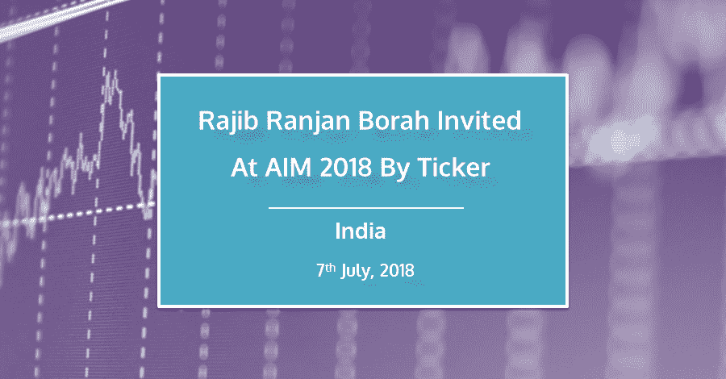
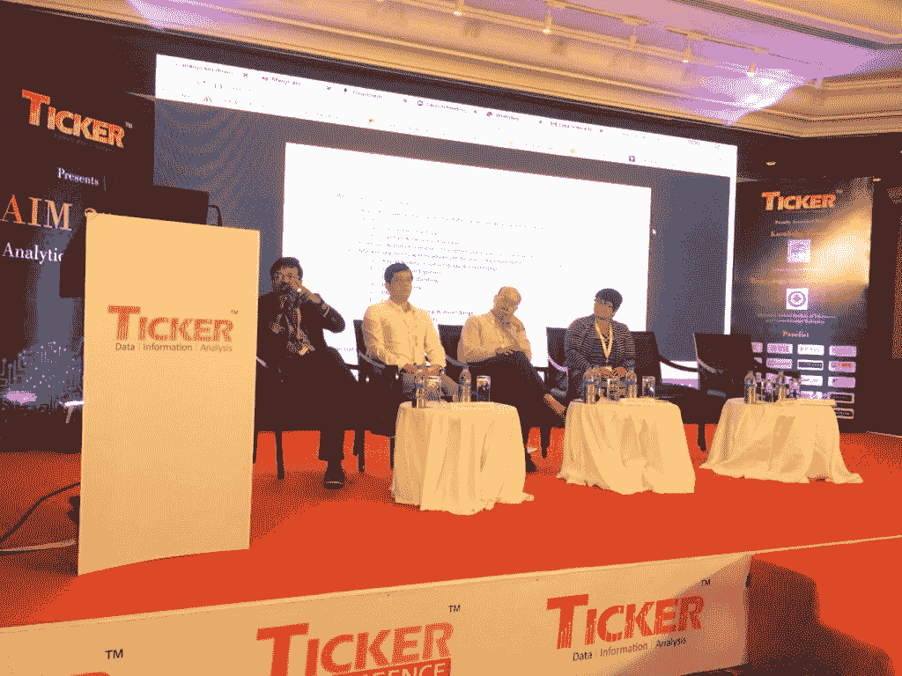
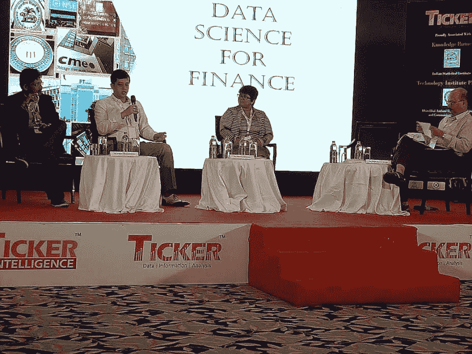

# Rajib Ranjan Borah 通过 Ticker 邀请参加 AIM 2018

> 原文：<https://blog.quantinsti.com/ticker-aim-2018/>

### **简介**

由 Ticker 主办的 AIM 2018 旨在解决任何盲点，并探索孵化一些成果的可能性，以及弥合行业需求和主题专家之间的差距。

rajib ran Jan Borah(iRage 和 QuantInsti 首席执行官)应邀参加了 Ticker 于 2018 年 7 月 7 日(周六)在孟买 Leela Palaces 举办的“市场分析(AIM 2018)”的“金融数据科学”讨论小组。

小组讨论由 Diganta Mukerjee 博士(印度统计研究所)主持，参加讨论的有 K . R.C Murty 先生(德意志银行印度分行集团首席信息官副总裁)、Pallab Bhattacharya 先生(雪绒花金融服务部副主任)、Rajib Ranjan Borah 先生(iRage 和 QuantInsti 首席执行官)、Ujjyaini Mitra 女士(Viacom 18 Media PVT . ltd . AVP 战略分析主管)

### **会议亮点**

人工智能/机器学习是当今任何行业的最新热门话题。尽管对其进行了深入研究，但至少在印度的金融服务领域，其潜力仍未得到充分发掘。

金融数据的速度、种类和数量都出现了爆炸式增长。社交媒体活动、移动交互、服务器日志、实时市场反馈、客户服务记录、交易细节、来自现有数据库的信息——洪水永无止境。为了理解这些庞大的数据集，公司越来越多地向数据科学家寻求答案。这些活动包括:

*   捕捉和分析新的数据源，建立预测模型和市场事件模拟
*   使用 Hadoop、NoSQL 和 Storm 等技术挖掘非传统数据集(如地理位置、情感数据)，并将其与更传统的数据(如贸易数据)相结合

### **活动照片**

以下是此次活动的更多图片:

### **关于 Rajib Ranjan Borah**

iRage 首席执行官 Rajib Ranjan Borah 先生是 iRage 的联合创始人，iRage 是一家高频交易公司，管理着印度最广泛的交易所交易期权投资组合。他还是 QuantInsti 的联合创始人和董事，QuantInsti 是一家“算法和量化交易”培训和研究机构，培训了来自 130 多个国家的数千名专业人士。他之前的经验包括在所有主要的美国和欧洲交易所(Optiver，Amsterdam)进行高频交易；数据分析技术(甲骨文公司)；商业战略咨询(普华永道)和股票衍生品研究(纽约州彭博市)。Rajib 拥有 IIM 加尔各答的 MBA 学位，是一名来自卡纳塔克邦 NIT 的计算机工程师。

### **关于股票行情**

TickerPlant Limited 是金融信息服务行业领先的全球内容提供商之一，整合并传播超低延迟数据馈送、新闻和信息。