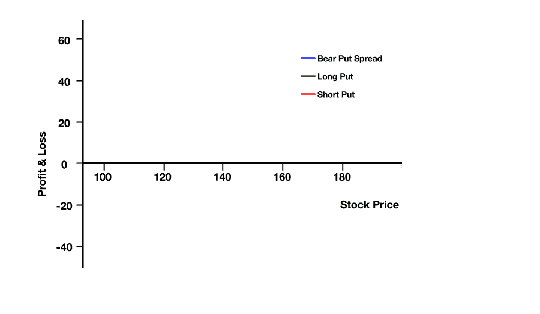
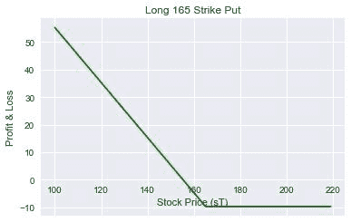
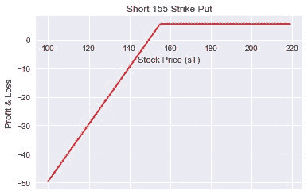
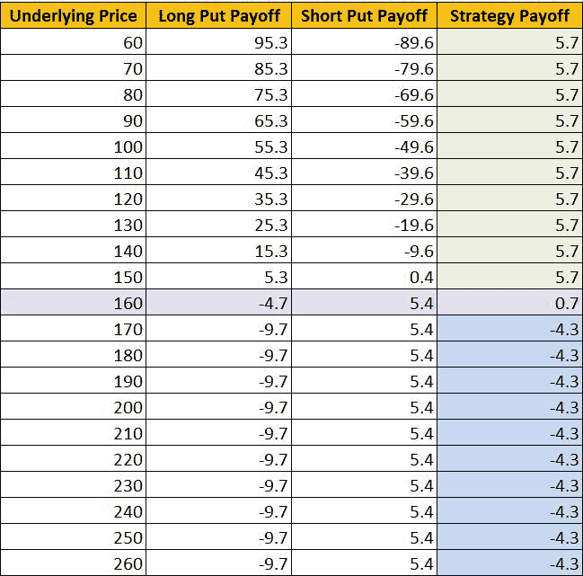
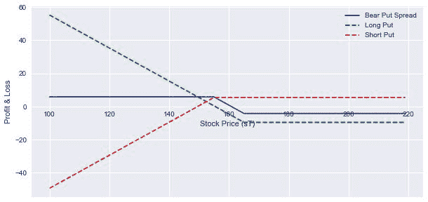

# Python 中的熊差价期权交易策略

> 原文：<https://blog.quantinsti.com/bear-spread-options-trading-strategy-in-python/>

由[维拉伊·巴加](https://www.linkedin.com/in/virajbhagat/)

### **什么是点差交易？**

买卖相同股票的同类型期权称为[价差交易](https://blog.quantinsti.com/butterfly-spread-options-trading-strategy-python/)。它限制了你的风险，因为你知道两个选项之间的差价，但同时减少了回报，因此利润有限。在建立差价时，卖出期权抵消买入期权。它提供了对风险的可见性，要求中高水平的交易，因此适用于高级用户

### **什么是熊市蔓延？**

熊市价差是一种期权价差策略，与预期基础证券价格下跌时的牛市价差相反。这些策略的应用成本较低，并且利润最高。这里，一个[买入期权，然后卖出一个执行价格更低的期权](https://blog.quantinsti.com/iron-condor-options-trading-strategy/)。如果你适度看跌，或者想降低对冲多头头寸的成本，那么看涨期权价差或看跌期权价差可能就是答案。

### **什么是垂直熊市价差？**

垂直差价的最佳解释如下:

*   带有 a 的期权:-以较低的成交价格卖出-以较高的成交价格买入

*   输入净贷方或净借方:取决于使用买入还是卖出
*   必须定义收益和损失:交易的最大损失和最大收益是通过选择期权的执行价格来实现的
*   目标:当股票价格稳定或下跌(不明显)时获利

### **熊市价差交易策略的品质**

熊传播策略的品质可以列举如下:

*   当股票预期下跌，但不会低于一个强支撑位时，用于出色的交易
*   利润或最大值。损失可以提前确定
*   两种差价有相似的收益结构
*   根据到期时间选择罢工
*   利润和损失是有上限的

### **何时选择熊市蔓延策略？**

*   当你适度看空市场时，价差最容易被利用
*   只有当你预期波动性会增加时，才实施这个策略(尤其是在这个系列的后半部分)
*   如果看涨期权的溢价比看跌期权更有吸引力，选择看跌期权价差而不是看跌期权价差
*   如果股票在短期内崩溃:看跌期权差价是一个更好的赌注，因为长期看跌期权的回报是即时的

**最常用的方法:**如果交易与交易相反，比较每个价差的最大损失，确定哪个会产生最小的损失，并相应地练习看涨或看跌价差

### **你需要什么样的** **熊市蔓延策略？**

如果想要交易熊差价期权，必须满足以下标准:

*   标的股票价格可能下跌
*   到期日与股价下跌的日期相匹配
*   执行价格

**考虑:**被认为价格会下降的标的资产/股票的价格**风险:**同时买入一份执行价格较高的 ITM 看跌期权，并以较低的执行价格卖出一份 OTM 看跌期权，从而降低成本，进而降低交易风险。**期权到期:**两个期权的到期日相同

### **构建熊差价期权交易策略**

*   购买 1 ITM 看跌期权
*   卖出 1 OTM 看跌期权
*   唯一的区别是执行价格

**该策略在理想情况下应该是这样的:** [](https://d1rwhvwstyk9gu.cloudfront.net/2018/06/Bear-Spread-graph.gif) 通常，人们似乎会问这样的问题来质疑看跌期权的垂直价差和看涨期权的垂直价差以及不同类型的看跌期权价差之间的差异:

### **垂直空头信用价差和垂直空头借方价差有什么区别？**

**或**

### **垂直熊信用利差与** **垂直熊借贷利差——哪一个更好？**

**或**

### **熊市价差有哪些不同类型？**

**或**

### **垂直价差有哪些不同类型？**

这里有一个简单的对比来帮助你理解两者的区别。

| 熊市价差 | 纵向空头信用利差(看涨) | 垂直空头借方差价(卖出) |
| 为...建立 | 如果使用买入期权，则为净信用 | 如果使用看跌期权，则为净借方 |
| 传播类型 | 信用利差(产生净信用) | 借方差价是指在进入交易时产生的借方，导致净借方 |
| 也被称为 | 空头/空头/信用买入价差 | 看跌/多头看跌价差或看跌借方价差/垂直 |
| 接受这个交易，如果 | 标的股票将保持在卖出看涨期权的执行价格以下 | 标的股票可能会下跌，但不会崩盘 |
| 费用 | 较少的 | 更大的 |
| 杠杆作用 | 较少的 | 更大的 |
| 复杂性 | 较少的 | 更大的 |
| 涉及的资本 | 更大的 | 较少的 |
| 购买 | 一次成交价格(OTM) | 一次成交价格(ITM) |
| 出售 | 以较低的履约价格(ITM) | 以较低的履约价格(OTM) |
| 金钱 | –会立即将钱存入您的账户–您在交易开始时就获得了收入 | –会让你花钱购买–你在交易开始时付款 |
| 损耗 | 有限的 | 减少的 |
| 收益 | 限于股票价值下跌时收到的净溢价利润 | 有限的 |
| 最大值利润 | 收到的信贷净额 | 执行价格的差额减去交易的净成本 |
| 最大值风险 | 执行价格的差额减去开始时收到的净信贷 | 价差的初始成本 |
| 公式 | 净信贷=收到的保费-支付的保费盈亏平衡=下限+净信贷最大利润=净信贷最大损失=差价-净信贷 | 净借方=支付的保费-收到的保费盈亏平衡=更高的执行价-净借方最大利润=差价-净借方最大损失=净借方 |
| 观察 | 在熊市或调整的最后阶段，当股票接近低谷时 | 钠 |
| 战略 | 卖出看涨期权 A，买入看涨期权 B | 买入看跌 X，卖出看跌 Y |
| 执行价格 | 呼叫 B >呼叫 A | 放 X >放 Y |
| 借方/贷方 | 信用 | 借方 |
| 最大值获得 | 收到保险费 | (X-Y)-已付保费 |
| 最大值失败 | (B-A)-收到的溢价 | 收到保险费 |
| 收支平衡 | A +溢价 | x–溢价 |
| 何时使用 | –如果一个人对一只股票持中性或中度看跌态度–市场已经大幅反弹(因此看涨期权溢价已经膨胀)-波动性是有利的–有充足的时间到期 | 如果你适度看跌一只股票或其他证券 |

现在，为了用更简单的方式解释它，利用这些概念，我将带你通过一个例子来更好地理解这个主题。

### **空头价差交易策略示例**

为此，我们以看跌期权交易策略**最大利润为例:**最大利润=多头看跌期权的执行价格-空头看跌期权的执行价格-支付的净溢价最大利润潜力=(看跌期权执行价格-支付的净借方)x 100 标的价格< /=空头看跌期权的执行价格预计利润概率:价外价差小于 50%，价内价差约为 50%，价内价差大于 50%。**最大损失:**最大损失=支付的净溢价最大潜在损失=支付的净借记 x 100 标的价格> /=长期看跌期权的执行价格**盈亏平衡点** =长期看跌期权的执行价格-支付的净溢价到期盈亏平衡点=长期看跌期权执行价格-支付的净借记**到期后产生的头寸:**如果到期时整个看跌期权价差是价内的，则长期看跌期权到期时为-100 股，短期看跌期权到期时为+100 股，净值为无股票头寸。然而，如果只有长期看跌期权在到期时有效，那么最终的头寸将是每份合同-100 股。

### **实施熊差价期权策略**

在这个例子中，我将使用阿达尼企业有限公司(股票代码:ADANIENT)的期权。

*   现货价格:160
*   看跌期权执行价格:165 英镑(溢价:9.7 英镑)
*   看跌期权执行价格:155 英镑(溢价 5.4 英镑)

#### **Python 中如何计算熊差价期权交易策略收益？**

现在，让我用 Python 编程代码带你看一下收益图。

##### **导入库**

```
import numpy as np
 import matplotlib.pyplot as plt
 import seaborn 
 seaborn.set(style="darkgrid")

```

##### **放收益**

```
def put_payoff(sT, strike_price, premium):
     return np.where(sT < strike_price, strike_price - sT, 0) - premium

*# Adani Enterprises Ltd Spot Price*
 s0 = 160

 *# Long Put*
 strike_price_long_put =165
 premium_long_put = 9.7

 *# Short Put*
 strike_price_short_put = 155
 premium_short_put = 5.4

 *# Range of put option at expiry*
 sT = np.arange(100,220,1)

long_put_payoff = put_payoff(sT, strike_price_long_put, premium_long_put)

 fig, ax = plt.subplots()

 ax.spines['bottom'].set_position('zero')
 ax.plot(sT, long_put_payoff, color ='g')
 ax.set_title('Long 165 Strike Put')
 plt.xlabel('Stock Price (sT)')
 plt.ylabel('Profit & Loss')
 plt.show()

```



```
short_put_payoff = put_payoff(sT, strike_price_short_put, premium_short_put) * -1.0

 fig, ax = plt.subplots()
 ax.spines['bottom'].set_position('zero')
 ax.plot(sT, short_put_payoff, color ='r')
 ax.set_title('Short 155 Strike Put')
 plt.xlabel('Stock Price (sT)')
 plt.ylabel('Profit & Loss')
 plt.show()
```



##### **看跌收益**

理想情况下，收益应该是以表格形式计算出来的。你可以**下载文末可下载格式的计算熊价差策略收益的 excel 表**。

```
fig, ax = plt.subplots(figsize=(10,5))
 ax.spines['bottom'].set_position('zero')
 ax.plot(sT, Bear_Put_payoff, color ='b', label = 'Bear Put Spread')
 ax.plot(sT, long_put_payoff,'--', color ='g', label ='Long Put')
 ax.plot(sT, short_put_payoff,'--', color ='r', label ='Short Put')
 plt.legend()
 plt.xlabel('Stock Price (sT)')
 plt.ylabel('Profit & Loss')
 plt.show()
```

最终的输出应该是这样的:

```
Bear_Put_payoff = long_put_payoff + short_put_payoff 

 fig, ax = plt.subplots()
 ax.spines['bottom'].set_position('zero')
 ax.plot(sT, Bear_Put_payoff, color ='b')
 ax.set_title('Bear Put Spread Payoff')
 plt.xlabel('Stock Price (sT)')
 plt.ylabel('Profit & Loss')
 plt.show()
```

##### **看跌价差收益**


```
 profit = max (Bear_Put_payoff)
 loss = min (Bear_Put_payoff)

 print ("Max Profit %.2f" %profit)
 print ("Max Loss %.2f" %loss)

  5.70
 -4.30
```

**Max。利润:最高 5.70 印度卢比。损失:-4.30 印度卢比**

### **结论**

如果你适度看跌，认为波动性正在上升，并希望限制你的风险，最好的策略是看跌价差。

现代交易需要系统的方法，需要引导自己远离直觉交易。通过我们的[系统期权交易](https://quantra.quantinsti.com/course/systematic-options-trading)课程，学习如何以系统的方式交易期权。此外，你可以探索期权交易策略，如蝴蝶，铁秃鹰和传播策略。立即注册！

### **下载数据文件**

*   熊市价差交易策略- Python Code.ipynb
*   熊利差收益策略计算. xlsx

*<small>免责声明:股票市场的所有投资和交易都涉及风险。在金融市场进行交易的任何决定，包括股票或期权或其他金融工具的交易，都是个人决定，只能在彻底研究后做出，包括个人风险和财务评估以及在您认为必要的范围内寻求专业帮助。本文提到的交易策略或相关信息仅供参考。</small>T3】*