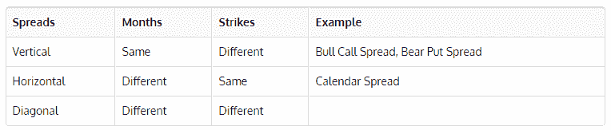
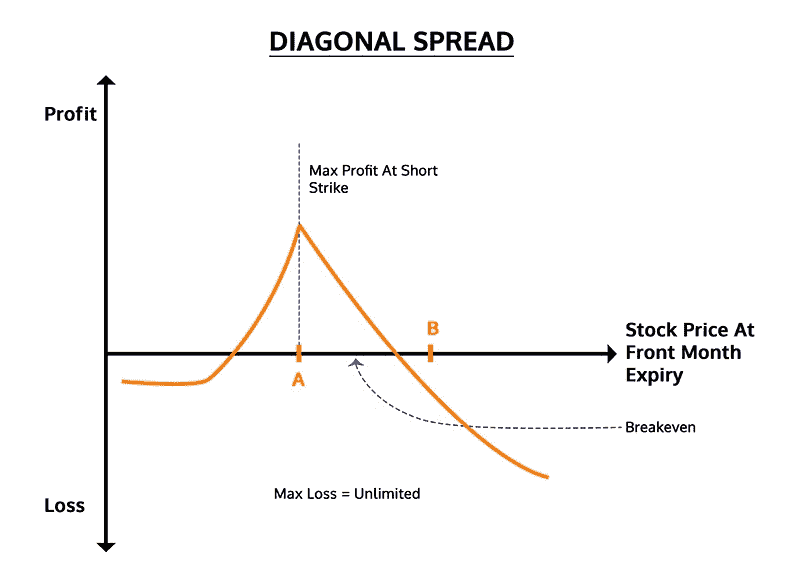
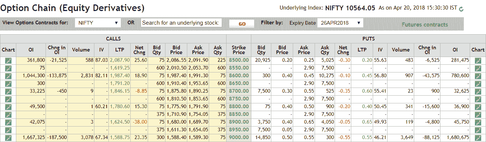
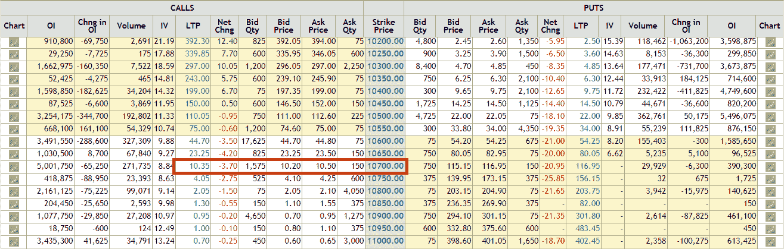
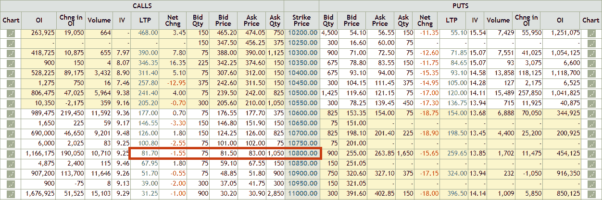
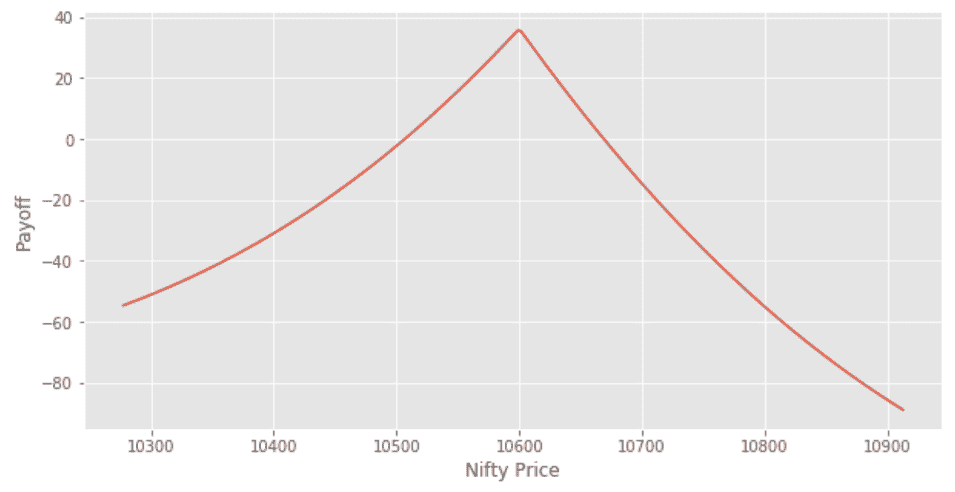

# Python 中的对角点差期权交易策略

> 原文：<https://blog.quantinsti.com/diagonal-spreads-options-trading-strategy-python/>

到了 [Viraj Bhagat](https://www.linkedin.com/in/virajbhagat/)

市场发展迅速，交易在很短的时间内完成。无数的交易者和无数的策略在这个过程中扮演着他们的角色。在一天结束的时候，一些人漂浮着，而一些人向上航行，一些人绊倒，甚至跌倒，第二天再站起来。交易期权在这方面起着关键的作用，因为它们为交易者提供了创造多种策略的能力，但却耗费了时间。市场上有很多这样的策略，花时间去学习它们和研究它们的技术细节是很重要的。虽然股票可能只允许一个人交易看跌或看涨，但他们经常横向移动，但在特定的范围内。正是在这种情况下，你进入了一个对角线传播。

## **什么是价差？**

证券的同时买入和卖出被称为**价差**或**价差交易**或**相对价值交易**，通常以期货合约和期权为支柱进行。除此之外，有时也使用证券。价差可以由买入或卖出构成，既可以是借方价差，也可以是贷方价差。基于月份和分支的关系，创建跨页结构并将其区分为垂直跨页、水平跨页和对角跨页。

## **什么是对角线传播？**

对角传播策略是:

*   一个[期权交易策略](https://quantra.quantinsti.com/course/options-trading-strategies-python-intermediate)
*   两步战略
*   结合了长通话日历分布和短通话分布

## **垂直价差、水平价差和对角价差的比较**

根据 Investopedia 的说法，对角线传播利用不同的月份和打击，它沿对角线移动，因此得名。



虽然据说这些在以前的报纸上被称为:<sup>[【1】](http://Fidelity.com)</sup>

*   期权价格>以表格方式列出
*   执行价格>按行列出，即垂直列出
*   过期时间>列中列出，即水平

因此，对角线分布意味着在不同行和列中存在具有不同执行价格和到期日的期权。

## **日历跨页和对角线跨页的差异**

对角价差的近期前景可能是看跌或看涨。它类似于日历跨页，因为:

*   卖出近期期权
*   买入长期期权
*   利用即将到期选项中的快速时间衰减

## **什么是对角线呼叫传播？**

当前景略微乐观时，人们会卖出较高的近月看涨期权，而卖出较低的远月看涨期权

## **什么是对角卖出价差？**

当前景略微看跌时，人们卖出较低的近月看跌期权，而卖出较高的远月看跌期权

## **什么时候执行对角扩展？**

*   你认为会上涨(如果买入)或再次下跌(如果卖出)的短期弱势或强势，然后利用它
*   该策略是在短期内控制风险，如果市场运行平稳，它就可以在长期内开放
*   当为了钱而执行时，它允许满足保证金要求
*   空头期权到期自动柜员机无价值> IV 扩大>增加剩余多头期权的价格>保留卖出期权的全部信用>降低我们拥有的多头期权的成本基础
*   对角线价差>短边到期无价值>金钱>买入>长边价差

## **改变是关键！**

一个人必须时刻注意和警惕他/她的策略的表现。如果在任何情况下，传播需要一些调整，它将不得不小心，以防止任何损失。一个人可以在战略实施后，通过持续研究市场并暗示其战略的变化来获得最大利益，从而将它作为一种优势。

## **从对角价差交易策略中获利**

对角线价差的最大利润可描述如下:

*   最大值利润=收到的净信贷* -为买入期权支付的溢价(买入期权 B)
*   *净信贷是通过卖出买入期权 A)获得的

## **对角线价差交易策略的损失**

对角线排列的最大损失可描述如下:

*   对于净信贷:最大损失=执行 A–执行 B–净信贷记录。
*   对于净借方:最大损失=执行 A–执行 B +已付净借方

## **对角扩展策略的设置**

如果交易朝着我们的方向快速发展，你可能会赔钱。因此，与其他跨页相比，对角线跨页的设置非常重要。它涉及同时购买:

*   同等数量的选择
*   这两个选项应该属于同一类
*   两者应该具有相同的基础安全性
*   两种不同的执行价格
*   2 个不同的到期月

**一个电话的对角线传播看起来像这样:** [](https://d1rwhvwstyk9gu.cloudfront.net/2018/06/Diagonal-Spread-diagram.jpg)

## **策略(在‘呼叫’的情况下)**

*   卖出 1 个 OTM 看涨期权-较低的执行价格-交割月
*   购买 1 个 OTM 看涨期权–B–更高的执行价格–后一个月(长期)
*   股票通常会低于执行价 A

我们将借助一个例子来解释这个策略。

## **长呼对角传播**

#### **实施多头对角价差交易策略**

我将解释使用长时间看涨期权的对角线传播的示例，为此，我将使用 NIFTY(Ticker-NIFTY)**的示例。以下是 NIFTY **[](https://d1rwhvwstyk9gu.cloudfront.net/2018/06/Diagonal-Spread-Option-Chain.png) 的期权链。我们现在将从 2018 年 4 月和 2018 年 5 月获取 2 个看涨期权价格**2018 年 4 月:**[](https://d1rwhvwstyk9gu.cloudfront.net/2018/06/Call-Price-Apr.-2018.png)**2018 年 5 月:** [ ](https://d1rwhvwstyk9gu.cloudfront.net/2018/06/Call-Price-May-2018.png)

### **策略**

```
# Importing Libraries
# Data manipulation
import numpy as np
import pandas as pd
# To plot
import matplotlib.pyplot as plt
import seaborn
plt.style.use('ggplot')
# BS Model
import mibian
# Importing Libraries
 ​
# Data manipulation
import numpy as np
import pandas as pd
 ​
# To plot
import matplotlib.pyplot as plt
import seaborn
plt.style.use('ggplot')
 ​
# BS Model
import mibian
# Nifty futures price
nifty_april_fut = 10595.40
nifty_may_fut = 10625.50
 ​
april_strike_price = 10700
may_strike_price = 10800
 ​
april_call_price = 10
may_call_price = 82
setup_cost = may_call_price - april_call_price
 ​
# Today's date is 20 April 2018\. Therefore, days to April expiry is 7 days and days to May expiry is 41 days.
days_to_expiry_april_call = 6
days_to_expiry_may_call = 41
 ​
# Range of values for Nifty
sT = np.arange(0.97*nifty_april_fut,1.03*nifty_april_fut,1)
 ​
#interest rate for input to Black-Scholes model
interest_rate = 0.0
# Front-month IV
april_call_iv = mibian.BS([nifty_april_fut, april_strike_price, interest_rate, days_to_expiry_april_call],
callPrice=april_call_price).impliedVolatility
print "Front Month IV %.2f" % april_call_iv,"%"
 ​
# Back-month IV
may_call_iv = mibian.BS([nifty_may_fut, may_strike_price, interest_rate, days_to_expiry_may_call],
callPrice=may_call_price).impliedVolatility
print "Back Month IV %.2f" % may_call_iv,"%"
Front Month IV 8.53 %
Back Month IV 11.26 %
# Changing days to expiry to a day before the front-month expiry
days_to_expiry_april_call = 0.001
days_to_expiry_may_call = 35 - days_to_expiry_april_call
 ​
df = pd.DataFrame()
df['nifty_price'] = sT
df['april_call_price'] = np.nan
df['may_call_price'] = np.nan
 ​
# Calculating call price for different possible values of Nifty
for i in range(0,len(df)):
df.loc[i,'april_call_price'] = mibian.BS([df.iloc[i]['nifty_price'], april_strike_price, interest_rate, days_to_expiry_april_call],
volatility=april_call_iv).callPrice
```

```
# Since, interest rate is considered 0%, 35 is added to the nifty price to get the Nifty December futures price.
df.loc[i,'may_call_price'] = mibian.BS([df.iloc[i]['nifty_price']+35, may_strike_price, interest_rate, days_to_expiry_may_call],
volatility=may_call_iv).callPrice
df.head()
    nifty_price april_call_price may_call_price
0    10277.538        0.0             27.305711
1    10278.538        0.0             27.455138
2    10279.538        0.0             27.605211
3    10280.538        0.0             27.755935
4    10281.538        0.0             27.907309
```

```
df['payoff'] = df.may_call_price - df.april_call_price - setup_cost
plt.figure(figsize=(10,5))
plt.ylabel("Payoff")
plt.xlabel("Nifty Price")
plt.plot(sT,df.payoff)
plt.show()
```

[T2】](https://d1rwhvwstyk9gu.cloudfront.net/2018/06/Diagonal-Spread-Payoff-Graph.png)

```
max_profit = max(df['payoff'])
min_profit = min(df['payoff'])
 ​
print "%.2f" %max_profit
print "%.2f" %min_profit
35.55
-88.94
```

**最大利润:35.55 印度卢比** **最大损失:88.94 印度卢比**

## **结论**

经验丰富的老手和更高级的人最常采用这种策略，因为它包括卖出 2 个期权，同时具有一定的波动性和可预测性；但股价稳定。因此，要实施这种策略，你需要对市场和他的选择相当透彻。

现代交易需要系统的方法，需要引导自己远离直觉交易。通过我们的[系统期权交易](https://quantra.quantinsti.com/course/systematic-options-trading)课程，学习如何以系统的方式交易期权。此外，你可以探索期权交易策略，如蝴蝶，铁秃鹰和传播策略。立即注册！

### **下载数据文件**

*   对角扩散期权策略——Python 代码

*<small>免责声明:股票市场的所有投资和交易都涉及风险。在金融市场进行交易的任何决定，包括股票或期权或其他金融工具的交易，都是个人决定，只能在彻底研究后做出，包括个人风险和财务评估以及在您认为必要的范围内寻求专业帮助。本文提到的交易策略或相关信息仅供参考。</small>T3】*