# Python 中的翡翠蜥蜴期权交易策略

> 原文：<https://blog.quantinsti.com/jade-lizard-options-trading-strategy-python/>

由[维拉伊·巴加](https://www.linkedin.com/in/virajbhagat/)

Newer technologies, better software, improvements in connectivity, etc. happening at a tremendous pace has led to a boom in the way knowledge is shared and accessed. Trading has always maintained the front seat position for primary advantage and the same goes for trading strategies. Every trading strategy can't give you the same outcome, and it is also true that neither can assure consistent returns for longer durations. To stay up in the game, one has to keep learning, evolving and making their strategy even better. Options were created to help manage the risk better. [Options trading strategies](https://blog.quantinsti.com/basics-options-trading/) are widely practised today and produce various results under various conditions. Some of the well-known strategies are:

*   **[跨期期权交易策略](https://blog.quantinsti.com/straddle-options-trading-strategy-python/) :** 买入或卖出相同数量的具有相同到期日和相同执行价格的看涨期权和看跌期权
*   **[扼杀期权交易策略](https://blog.quantinsti.com/long-strangle-option-strategy-in-python/) :** 类似于多空的风险概况；扩大盈亏平衡点并产生较低的最大值。利润和较低的损失

我们都读过像[铁鹰](https://blog.quantinsti.com/iron-condor-options-trading-strategy/)、[蝴蝶扩散](https://blog.quantinsti.com/butterfly-spread-options-trading-strategy-python/)、[熊叫梯](https://blog.quantinsti.com/bear-call-ladder-options-trading-strategy-python/)等许多交易策略。但是，在我看来，有一种策略在高隐含波动率期间能提供良好的结果，那就是**翡翠蜥蜴**。但是在我们去翡翠蜥蜴之前，让我们先了解一下蜥蜴在交易中的意义。

### **交易中的蜥蜴是什么？**

蜥蜴是一种期权交易策略，交易者通过这种策略从交易中获利

*   在跨骑和勒死的情况下，蜥蜴降低了上行风险
*   当底层向走向停留或漂移时，它们是最有益的
*   高利润产生于高 IV 和非熊市环境

### **翡翠蜥蜴期权交易策略**

这是一种中性或看涨的定制期权交易策略，具有特殊性。

*   它包括卖空交易和卖空交易差价
*   由于它由一个短期看涨期权价差组成，因此它略微看涨
*   它没有上行风险
*   它利用了看跌期权和看涨期权溢价的高波动性
*   执行的方式是:由完全信用产生的价值(从三叉持仓) **>** 之间的差额称为持仓执行价格

### **什么时候练翡翠蜥蜴？**

如果有高 IV 和/或如果股票最近下跌，即股票超卖，通常实行 Jade Lizard 交易策略。

### **翡翠蜥蜴交易策略的组成部分**

它包括:

1.  使用看涨期权的空头垂直价差，以及
2.  以低于看涨期权执行价格的执行价格卖出的看跌期权

在 Jade Lizard 期权交易策略中，我们卖出一个看跌期权和卖出一个看跌期权信用利差(确保收到的总信用大于利差的宽度),前提是标的不应大幅波动。在这里，收取的溢价大于看涨期权价差的宽度**翡翠蜥蜴看起来像这样:** 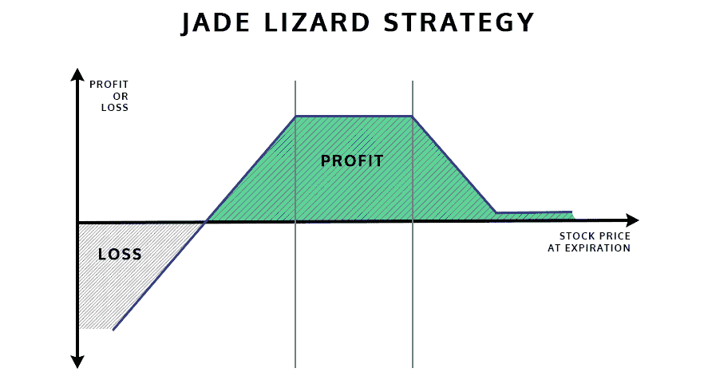

### **翡翠蜥蜴策略的设置**

**利润:**利润这里是从期初交易 **Max 中收到的信用。获利:**标的在价差的看跌和做空之间到期。**损失:**如果信用小于看涨期权价差的宽度，并且有向上的移动**步骤:**

*   步骤 1 -以一个执行价格购买一个看涨期权
*   步骤 2 -以低于步骤 1 中买入的看涨期权的执行价格卖出看涨期权
*   第三步-以低于上述两个看涨期权的执行价卖出一个 OTM 看跌期权

```
<u>Note</u>: In case OTM Puts are bought, the Lizard will face the opposite direction
```

简而言之:**翡翠蜥蜴=卖出扼死+买入 OTM 看涨期权**在这里，交易的信用大于看涨期权的宽度

```
**Caution**: 
Remember! Don’t confuse Jade Lizard with Big Lizard Strategy where, 
Big Lizard = Sell Straddle + Buy OTM call
```

**做出的假设:**

*   丰富度:裸卖出交易>裸买入交易
*   丰富度(溢价):做空买入价差>做空卖出价差

### **大蜥蜴交易策略和翡翠蜥蜴交易策略的区别**

*   大蜥蜴的交易策略和翡翠蜥蜴非常相似，是跨骑和绞杀
*   唯一的区别是，为了降低风险，他们增加了一个期权头寸
*   它们是密切相关的战略
*   在这两种策略中，具有相同到期月份的 3 种不同期权头寸被组合在一起
*   实践这两种策略的目的是最大化回报和最小化风险

**大蜥蜴=卖出多空+买入 OTM 看涨**

**翡翠蜥蜴=卖扼死+买 OTM 召唤**

### **翡翠蜥蜴策略示例**

考虑一个 ABC 公司的例子。Jade Lizard 的设置如下:

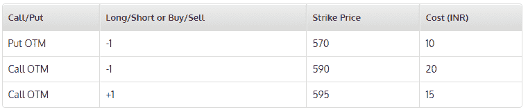

因此，净信贷= 1 OTM 看跌期权+ 1 OTM 看涨期权- 1 OTM 看涨期权净信贷= 10+20-15 **净信贷= 15** 总的来说，我们收到的净信贷为 15 印度卢比盈亏平衡=做空看跌期权-收到的信贷盈亏平衡= 575-15 **盈亏平衡= 560** 因此，在我们的情况下，盈亏平衡将比当前现货价格下降 5.47%。

```
***Note:***

*- Strike Selection and impact of Volatility*
*- Short put profit should be around 70% and the call spread profit around 30%*
*- If the call spread is ITM, we have to buy it back*
```

### **实施翡翠蜥蜴期权战略**

在这个例子中，我将使用 Tech Mahindra(股票代号:TechM)期权。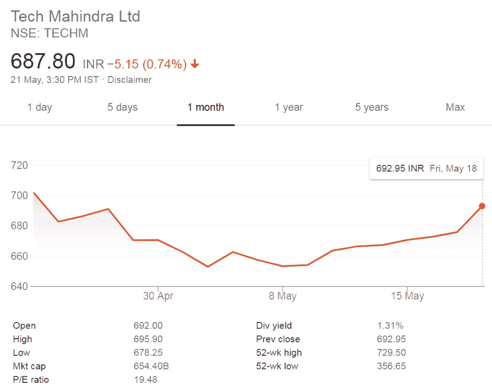过去 1 个月的股价变动(来源——谷歌财经)科技公司 Mahindra Ltd .的股价出现了相当大的变动，过去 1 个月最高为 702，最低为 652.95。为了这个例子的目的；我将卖出 1 美元的看跌期权，卖出 1 美元的看涨期权，买入 1 美元的看涨期权。以下是 TechM 的期权链，截止日期为 2018 年 5 月 31 日，来自 nseindia.com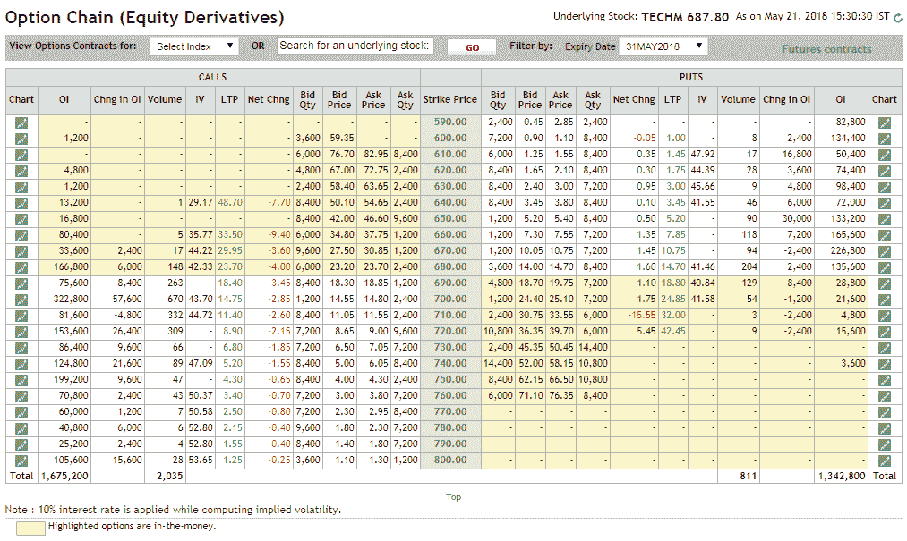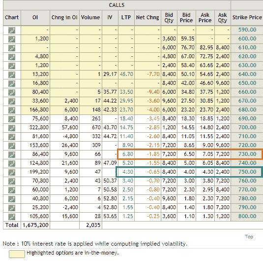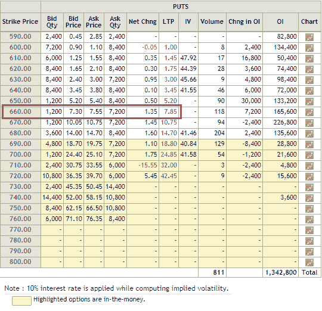理想情况下，以下应该是这个翡翠蜥蜴交易策略的收益。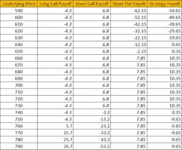

### **用 Python 计算翡翠蜥蜴期权策略收益**

现在，让我用 Python 编程代码带你看一下收益图。

#### **导入库**

```
import numpy as np
import matplotlib.pyplot as plt
```

#### **电话支付**

```
def call_payoff(sT, strike_price, premium):
return np.where(sT > strike_price, sT - strike_price, 0) - premium
# TECHM Stock price
spot_price = 688

# Long call
strike_price_long_call = 750
premium_long_call = 4.30

# Short call
strike_price_short_call = 730
premium_short_call = 6.80

# Stock price range at expiration of the call
sT = np.arange(0.9*spot_price,1.1*spot_price,1)
payoff_long_call = call_payoff(sT, strike_price_long_call, premium_long_call)

fig, ax = plt.subplots()
ax.spines['bottom'].set_position('zero')
ax.plot(sT,payoff_long_call,label='Long Strike Call',color='g')
plt.xlabel('Stock Price')
plt.ylabel('Profit and Loss')
plt.legend()
plt.show()
```

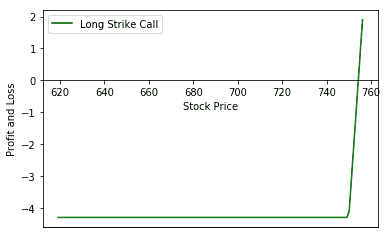

```
payoff_short_call = call_payoff(sT, strike_price_short_call, premium_short_call) * -1.0

fig, ax = plt.subplots()
ax.spines['bottom'].set_position('zero')
ax.plot(sT,payoff_short_call,label='Short Strike Call',color='r')
plt.xlabel('Stock Price')
plt.ylabel('Profit and Loss')
plt.legend()
plt.show()
```

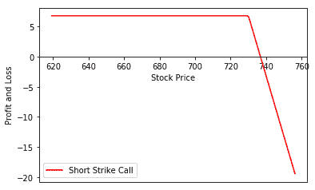

#### **放收益**

```
def put_payoff(sT, strike_price, premium):
return np.where(sT < strike_price, strike_price - sT, 0) - premium
# stock price
spot_price = 688

# Short put
strike_price_short_put = 660
premium_short_put = 7.85

# Stock price range at expiration of the put
sT = np.arange(0.9*spot_price,1.1*spot_price,1)
payoff_short_put = put_payoff(sT, strike_price_short_put, premium_short_put) * -1.0

fig, ax = plt.subplots()
ax.spines['bottom'].set_position('zero')
ax.plot(sT,payoff_short_put,label='Short Strike Put',color='m')
plt.xlabel('Stock Price')
plt.ylabel('Profit and Loss')
plt.legend()
plt.grid()
plt.show()
```

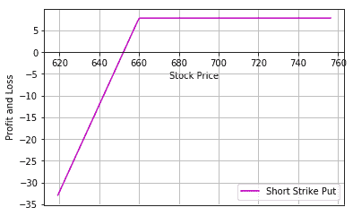

#### **翡翠蜥蜴的收益**

```
payoff = payoff_long_call + payoff_short_call + payoff_short_put

fig, ax = plt.subplots()
ax.spines['bottom'].set_position('zero')
ax.plot(sT,payoff_long_call,'--',label='Long Strike Call',color='g')
ax.plot(sT,payoff_short_call,'--',label='Short Strike Call',color='r')
ax.plot(sT,payoff_short_put,'--',label='Short Strike Put',color='m')
ax.plot(sT,payoff,label='Jade Lizard Payoff')
plt.xlabel('Stock Price')
plt.ylabel('Profit and Loss')
plt.legend()
plt.grid()
plt.show()
```

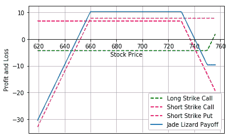

#### **翡翠蜥蜴编队**

```
payoff = payoff_long_call + payoff_short_call + payoff_short_put

fig, ax = plt.subplots()
ax.spines['bottom'].set_position('zero')
ax.plot(sT,payoff,label='Jade Lizard Payoff')
plt.xlabel('Stock Price')
plt.ylabel('Profit and Loss')
plt.legend()
plt.grid()
plt.show()
```

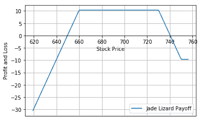

```
profit = max(payoff)
loss = min(payoff)
print (profit)
print (loss)
```

```
Max. Profit: 10.35 Max. Loss:  -30.45
```

### **结论**

从上面的剧情来看，对于翡翠蜥蜴期权策略 Max。利润和最大值。可以观察到损失。在本文中，我们通过一个真实的市场例子以及理解如何用 Python 计算策略，涵盖了 Jade Lizard 交易策略的所有要素。回报也可以在 Excel 表格的帮助下计算，我已经提供了一个可下载的文件和 Python 代码。

### **下一步**

你是否热衷于学习更多关于[算法交易](https://www.quantinsti.com/epat/)的知识？联系我们，了解不同的金融策略世界观。 [QuantInsti](https://www.quantinsti.com/) 帮助人们获得适用于各种交易工具和平台的技能。算法交易(EPAT)的[高管课程](https://www.quantinsti.com/epat/)涵盖了统计学&计量经济学、金融计算&技术和算法&量化交易等培训模块。EPAT 让你具备成为成功交易者所需的技能。*免责声明:股票市场的所有投资和交易都有风险。在金融市场进行交易的任何决定，包括股票或期权或其他金融工具的交易，都是个人决定，只能在彻底研究后做出，包括个人风险和财务评估以及在您认为必要的范围内寻求专业帮助。本文提到的交易策略或相关信息仅供参考。*

### **下载数据文件**

*   翡翠蜥蜴期权策略- Python 代码
*   翡翠蜥蜴收益计算- Excel 表