# 多项式回归:向线性模型添加非线性

> 原文：<https://blog.quantinsti.com/polynomial-regression-adding-non-linearity-to-a-linear-model/>

拉马克·科尔曼

### **简介**

在这篇文章中，我们将学习如何解决线性模型的一个关键问题，即线性假设。我们将了解线性回归，这是一种基本的统计学习技术，了解模型下正在发生的事情，一些我们希望了解的事情，然后了解更多关于模型的一些弱点。然后，我们将介绍多项式回归的思想，作为线性模型的一个关键弱点的解决方案，即本文中的线性回归。

#### **让我们回顾一下线性回归**

Linear Regression is a machine learning technique that allows us to associate one or more explanatory variables with an dependent variable, or response. In Linear Regression, we desire to predict an actual numerical response.As in all machine learning models, we are trying to approximate ***f(x)***, or the function that accurately describes the relationship between our independent and dependent variables. This establishment of causality between indicators and trades is the key feature that is common to all [machine learning based trading models](https://blog.quantinsti.com/polynomial-regression-adding-non-linearity-to-a-linear-model/). In parametric models we save some time by making some assumptions about the structure of our function,***f(x)***. In Linear Regression, we assume that ***f(x)***, is linear. You may recall from algebra that the equation for a line is ***y = mx + b***, where y is our response, m is the slope, or derivative in calculus terms, and ***b***, is our intercept, or the value of ***y*** when ***x***, or our explanatory variable is equal to ***0***. The Simple Linear Regression equation is below: 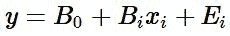 Here the coefficients of the line simply take a different form and we add an error term, ***E<sub>i</sub>***. The error term accounts for noise that we can't model, or randomness. Though libraries and packages make our lives easier by abstracting away a lot of the computations, there's quite a few things happening when we build a [machine learning based Linear Regression model](https://quantra.quantinsti.com/course/trading-with-machine-learning-regression). Our objective is to approximate our coefficients, ***B<sub>0</sub>***, or our intercept, and ***B<sub>1</sub>***, our slope. Once we have values for our coefficients, we can then plug them into our linear equation so that we can predict the value of our response given some value for ***X***. But how do we find these coefficients?The equation for our slope or ***B<sub>1 </sub>***is below: 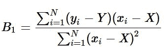 where ***Y*** (i.e. uppercase Y), is the mu of ***y***, and ***X***, is the mu of ***x***.The equation for our intercept ***B<sub>0 </sub>***is below: 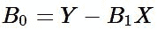 where ***Y*** is the mu of ***y***, ***B<sub>1</sub>***, is our predicted slope, and ***X***, is the mu of our explanatory variable. These computations are done for us when using libraries and packages in R and Python.As usual, a key question that we have when developing our model is whether or not our observation is analogous to the entire population. In other words, does this sample actually represent the total population or is what we've observed purely random. This is where our statistical hypothesis testing skills come in. The test statistic for simple linear regression is below: 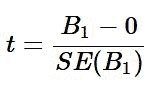 Regression assumes that there exists some relationship between our x and y variables. So our null hypothesis for our hypothesis test or our ***H<sub>0</sub>*** is ***B<sub>1</sub>*** ***= 0***, and our alternate hypothesis or ***HA*** is ***B<sub>1 </sub>******≠ 0***. Essentially, the null is stating that our slope is 0, or that there is no relationship between our variables. To test this, we calculate how many deviations from 0 our ***B<sub>1</sub>*** is. In the above equation, ***B<sub>1</sub>*** is our predicted slope and ***SE(B<sub>1</sub>) ***is the standard error of our slope. The standard error is a way measuring the deviation of our slope. The equation for the standard error of ***B<sub>1</sub>*** is below: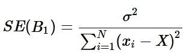where ***σ<sup>2 </sup>***= ***V ar(E)***, or is the variance of our error term. We use our data to estimate this variable by calculating our RSE or residual sum of squares by the equation below: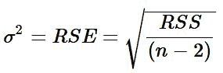where *n* is the number of observations and *RSS* is our residual sum of squares. Our RSS can be found by the following equation: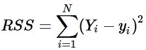 where ***Y<sub>i</sub>*** is the actual value of the response and ***y<sub>i</sub>*** is our prediction for the **i*<sub>th</sub>* ** observation.Our test statistic in Simple Linear Regression corresponds to a Gaussian Distribution. Thus, once we calculate our t-stat, and assign a significance level, we can then use the same to either reject or fail to reject the null hypothesis, ***H<sub>0</sub>***. Notice that I didn't say that we would either reject or accept the null. This is because failing to reject the null does not necessarily mean that we accept the null. We just weren't able to reject it at some significance level, or within some confidence interval.We would then get our *α*, or p-value. Our p-value tells us that given the null hypothesis being true, how likely we are to observe a value of our test statistic greater than or equal to the one that we observed. Stated another way, our p-value tells us the probability of our null hypothesis being true given the t-statistic we observed. It is also the lowest significance level where by we can reject the null hypothesis,***H<sub>0.</sub>***In some cases we wouldn't have a single predictor variable, but may have multiple variables. These explanatory variables may be quantitative, qualitative, or a mix of both. Our equation changes somewhat to account for multiple variables. The equation for multiple linear regression is below: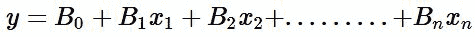The above equation for multiple linear regression is similar to our initial simple linear regression equation with the exception that we now have a slope, ***B<sub>1</sub>***, variable for each of our *x* terms. This simply expresses the relationship between that specific *x* and our response *y*. Our test statistic and distribution also changes from the t-statistic and Gaussian distribution to the f-statistic and f-distribution.

#### 让我们建立一个模型

Now that we have reviewed linear regression, we can construct a model to make predictions. We'll use PNB and our objective is to predict the next closing price.Let's get our libraries

```
#data analysis and manipulation
import numpy as np
import pandas as pd

#data collection
import pandas_datareader as pdr

#data visualization
import matplotlib.pyplot as plt
import seaborn as sns
```

Let's import our data.

```
#setting our testing period
start='2016-01-01'
end='2018-01-01'
pnb=pdr.get_data_yahoo('PNB.NS',start, end)
```

Let's check the head of our data.

```
pnb.head()
```

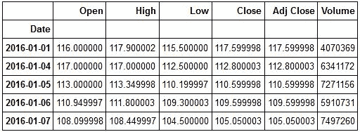 Let's see how PNB performed over our sample period.

```
plt.figure(figsize=(10,6))
plt.plot(pnb['Close'])
plt.title('PNB 2016-2018 Performance')
plt.show()
```

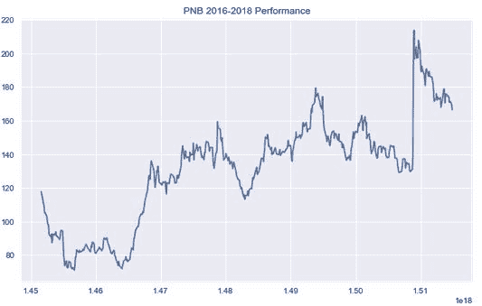

We can now create the explanatory variables that we will use to predict PNB's closing price. We will use a mix of quantitative and qualitative variables.Let's add our predictors to our data frame. But first, we'll make a copy of our original dataframe. This is a good practice should we need to go back and reinitialise our data in the future.

```
#making a copy of our data frame
PNB=pnb.copy()
```

```
#creating our predictor variables

#Lag 1 Predictor
PNB['Lag 1']=PNB['Close'].shift(1)

#Lag 2 Predictor
PNB['Lag 2']=PNB['Close'].shift(2)

#Higher High Predictor
PNB['Higher High']=np.where(PNB['High'] > PNB['High'].shift(1),1,-1)

#Lower Low Predictor
PNB['Lower Low']=np.where(PNB['Low'] < PNB['Low'].shift(1),1,-1)
```

现在让我们回顾一下我们的 PNB 数据框架。

```
PNB.head()
```

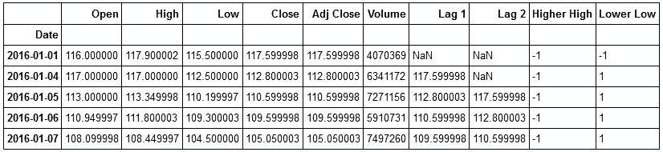

现在让我们从 sci-kit learn 导入我们的线性回归模型。

```
from sklearn.linear_model import LinearRegression
```

现在我们有了模型，让我们从 sklearn 导入我们的 train *test* split 对象。

```
from sklearn.model_selection import train_test_split
```

现在我们准备为我们的数据创建训练和测试集。但是首先，让我们初始化 X 和 y 变量。请记住，X 表示我们的预测变量，y 表示我们的反应或我们实际试图预测的东西。

```
#creating our predictor variables
X=PNB.drop(['Open','High','Low','Close','Volume','Adj Close'],axis=1)

#initializing our response variable
y=PNB['Close']
```

现在，我们准备将数据分成训练集和测试集。

```
X_train, X_test, y_train, y_test= train_test_split(X,y,test_size=.20, random_state=101)
```

We now have our training and testing sets. Note, random_state above is used so that when you recreate this model you get the same output as we have here.We are now ready to fit our model and make predictions. We will first initialise our model.

```
lm=LinearRegression()
```

现在，我们可以将训练集传递到模型中。我们必须首先在 X_train 集合中填充 NaN 值。

```
#fitting our model to our training data
lm.fit(X_train.fillna(0),y_train)
```

LinearRegression(copy_X=True, fit_intercept=True, n_jobs=1, normalize=False)Now that we have fit our model to our data, let's use it to make predictions. We will pass in our X_test set into the predict method. X_test are the features that our model hasn't seen.

```
#making predictions
predictions=lm.predict(X_test.fillna(0))
```

现在我们有了我们的预测，我们可以检查我们的模型表现如何。我们希望查看各种不同的东西来评估我们模型的性能。我们的模型的 ***R <sup>2</sup>*** ，R 平方告诉我们我们的反应中可以由我们的预测器解释的百分比方差。我们也想看看我们的模型的错误。我们的误差告诉我们，我们的模型偏离实际响应值有多大。我们的目标是创建一个尽可能降低误差的模型。

We can also check our model's coefficients. These are the values for ***B<sub>1 </sub>****x**i* or the slopes for each of our features.

```
#checking our model's coefficients
lm.coef_
```

array([ 0.93707237, 0.01904699, 0.27980978, -1.93943157])Let's get our model's ***R<sup>2 </sup>***value. We will import metrics from sklearn.

```
from sklearn import metrics
```

```
#getting our R-Squared value
print('R-Squared:',metrics.explained_variance_score(y_test,predictions))
```

R-Squared: 0.987638195799Now let's check our errors. We'll look at our MSE, or Mean Squared Error, MAE, or Mean Absolute Error, and RMSE, or Root Mean Squared Error.

```
#printing our errors
print('MSE:',metrics.mean_squared_error(y_test,predictions))
print('MAE:',metrics.mean_absolute_error(y_test,predictions))
print('RMSE:',np.sqrt(metrics.mean_squared_error(y_test,predictions)))
```

平均海平面上升率:11.1707624541 平均海平面上升率:2.4868751955 RMSE:3.

现在让我们画出我们的实际反应和我们的预测反应。我们也可以计算我们的残差或误差。

```
sns.jointplot(predictions,y_test,kind='regplot')
plt.xlabel('Predictions')
plt.ylabel('Actual')
```

<matplotlib.text.text at=""></matplotlib.text.text>

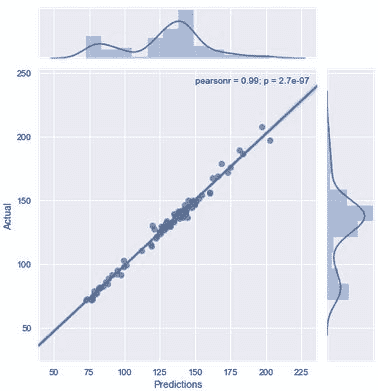

上面的图表明我们的预测和实际反应高度相关。它还显示了一个非常小的 p 值。现在让我们画出我们的残差。

```
residuals=y_test-predictions
```

```
#plotting residuals
sns.distplot(residuals,bins=100)
```

<matplotlib.axes._subplots.axessubplot at=""></matplotlib.axes._subplots.axessubplot>

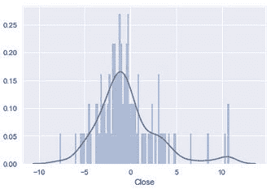

Now let's plot our residuals to our predictions.

```
sns.jointplot(residuals,predictions)
```

<seaborn.axisgrid.jointgrid at=""></seaborn.axisgrid.jointgrid>


Let's take a moment to understand what we've covered thus far. We began by creating our features using both quantitative or numerical and qualitative or categorical data. We split our data into 80% training and 20% testing sets. We fit our model to our data and then used it to make predictions by passing in our X_test set or the features that our model hadn't yet seen. We then evaluated our model computing our R-Squared and our errors.We computed our residuals or our errors, by calculating the difference between our y_test and our predictions. A key assumption of Linear Regression is linearity. This means that the model assumes that despite changes in our x values, the slope remains constant. To check this assumption, we can plot a distribution of our residuals. If our residuals are normally distributed, then it would mean that our assumption of linearity is true.We also plotted our residuals to our predictions. This is another method for testing our data for linearity. In simple linear regression we could have plotted our residuals to our ***X***, or predictor variable. Here, because we have multiple predictors, we plot our residuals, or errors, to our predictions.When we plot a distribution of our residuals they doesn't appear to be normally distributed. Also from viewing the plot of our residuals to our predictions we can see that our data is not exactly linear. This means that we could improve our model and reduce our errors by using a non-linear model. We can achieve this goal by introducing polynomial regression.

### **多项式回归**

We'll use polynomial regression to transform our linear model to better fit our non linear data.You may be wondering why its called polynomial regression. The method is named so because we transform our linear equation into a polynomial equation. In our PNB example, we have four features. Our linear equation currently is the following: 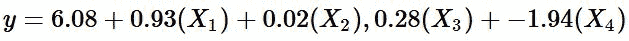 We can retrieve our ***B<sub>0 </sub>***and ***B<sub>1</sub>*** by calling the .coef_ and .intercept methods on our lm model Checking our ***B<sub>1</sub>***

```
lm.intercept_
```

数组([ 0.93707237，0.01904699，0.27980978，-1.93943157])

检查我们的***B<sub>0</sub>**T5】*

```
lm.intercept_
```

6.0817053905353902

我们将创建一个数据框架来更好地显示我们的系数。

```
coefficients=pd.DataFrame(lm.coef_,index=X_train.columns,columns=['Coefficients'])
```

```
coefficients
```

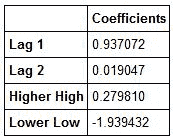

现在我们可以清楚地看到我们的***B<sub>1</sub>**T5】s 对于每一个特征。让我们想象一下我们的特征，这样我们就知道我们想要改变哪些特征。*

We can see that our Lag 1 predictor has the highest coefficient. This indicates that it explains approximately 94% of the variation in our response variable. Let's do a regression plot to form the basis of what a linear relationship between our X and Y variables looks like.

```
sns.jointplot(PNB['Lag 1'], PNB['Close'], kind='regplot')
```

<seaborn.axisgrid.jointgrid at=""></seaborn.axisgrid.jointgrid>

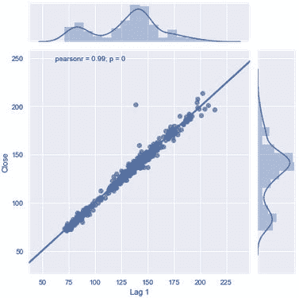

我们的 lower low 特性具有最低的***B<sub>1</sub>**T5】系数。让我们想象一下。*

```
plt.figure(figsize=(10,6))
sns.boxplot(x='Lower Low',y='Close',hue='Lower Low',data=PNB)
```

c:\ anaconda 3 \ lib \ site-packages \ seaborn \ categorial . py:482:future warning:remove*na 不推荐使用，它是一个私有函数。请勿使用。框*数据=移除 *na(组*数据[色调 _ 遮罩])

<matplotlib.axes._subplots.axessubplot at=""></matplotlib.axes._subplots.axessubplot>

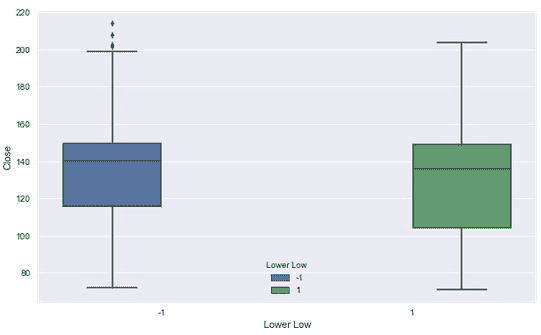

我们可以看到滞后 1 特征和滞后 2 特征的系数之间的显著下降。让我们想象一下我们的第二阶段特征。

```
plt.figure(figsize=(10,6))
sns.lmplot('Lag 2', 'Close', data=PNB)
```

<seaborn.axisgrid.FacetGrid at 0x1f41102e400><matplotlib.figure.Figure at 0x1f41241dda0>

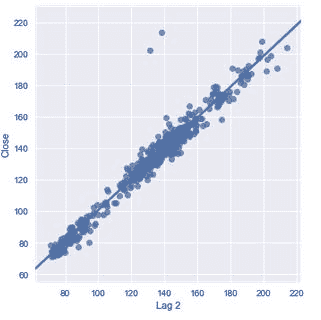

We can see quite a difference between the fit of our Lag 2 feature compared to that of our Lag 1 feature. This is something we want to make a note of. Our Lag 1 feature has a coefficient of 94% while our Lag 2 feature's coefficient is 2%. This can be seen by how close our data is to our best fit line. This is a significant decline given the distance between Lag 1 and Lag 2\. We can also see in both cases that we have points that are remote to our data and our line.Now let's visualize our Higher Highs versus our Close.

```
plt.figure(figsize=(10,6))
sns.boxplot(x='Higher High',y='Close',data=PNB)
```

c:\ anaconda 3 \ lib \ site-packages \ seaborn \ categorial . py:454:future warning:remove*na 不推荐使用，它是一个私有函数。请勿使用。框*数据=移除 *na(组*数据)

<matplotlib.axes._subplots.axessubplot at=""></matplotlib.axes._subplots.axessubplot>

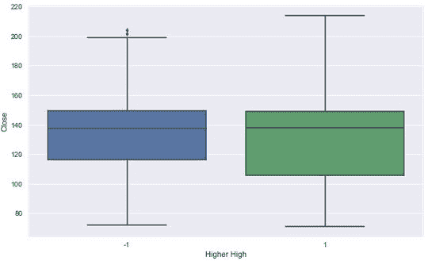

Let's transform our linear equation in an effort to reduce our Mean Squared Error. Our model appears to fit our data well and could be due to the relationship between Lag 1 and the Closing Price. However, we can't necessarily give all the credit to Lag 1 because it is possible that some relationship exists between the explanatory variables that could be muting their true relationship to our response. This is the additive assumption of linear models. Linear models assume that our predictor variables' presence has no effect on the remaining variables ability to predict our response. To test this we could build a simple regression model for each variable and compare it to our current model. We might also examine the correlations between our explantory variables as well.We're going to transform our Lag 2 variable. It is somewhat strange that out Lag 2 coefficient deviates greatly from our Lag 1\. We will rewrite our equation to include the square of Lag 2 and build our model and see if this reduces our MSE. To implement this, let's add this new variable to our dataframe.Before adding our new variable, let's check our PNB dataframe.

```
PNB.head()
```

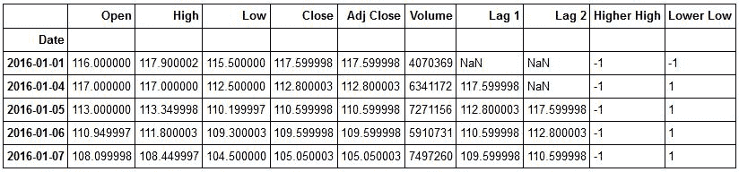

现在让我们添加我们的***lag 2<sup>2</sup>**T5】变量。*

```
PNB['Lag 2 Squared']=PNB['Lag 2']**2
```

让我们重新检查我们的数据框架。

```
PNB.head()
```

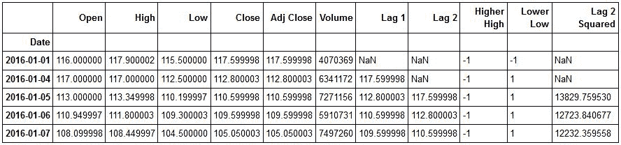

好了，现在让我们重建我们的模型，看看我们是否能够减少我们的 MSE。

```
polynomial_model=LinearRegression()
```

我们现在可以设置 X 和 y 变量了。

```
#dropping all columns except our features and storing in X
X_2=PNB.drop(['Open','High','Low','Close','Adj Close','Volume','Lag 2'],axis=1)

#Initializing our Response 
y_2=PNB['Close']
```

We can now do our train test split.

```
X_train_2, X_test_2, y_train_2, y_test_2=train_test_split(X_2,y_2,test_size=0.2,random_state=101)
```

现在我们有了训练和测试数据，我们可以用它来拟合我们的模型并生成预测。

```
#fitting our model
polynomial_model.fit(X_train_2.fillna(0),y_train_2)
```

线性回归(copy*X =真，fit*intercept =真，n_jobs=1，normalize =假)

我们刚刚用多项式模型拟合了我们的训练数据。现在让我们用它来使用我们的测试数据进行预测。

```
predictions_2=polynomial_model.predict(X_test_2)
```

我们刚刚做了预测。现在，我们可以计算系数、残差和误差。让我们首先创建一个数据帧来保存多项式模型的系数。

```
polynomial_df=pd.DataFrame(polynomial_model.coef_,index=X_train_2.columns,columns=['Polynomial Coefficients'])
```

现在让我们来看看多项式 df。

```
polynomial_df.head()
```

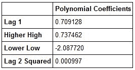

现在让我们创建我们的残差，并绘制它们。然后，我们将重新计算模型的指标。

```
sns.distplot(residuals_2,bins=100)
```

<matplotlib.axes._subplots.axessubplot at=""></matplotlib.axes._subplots.axessubplot>

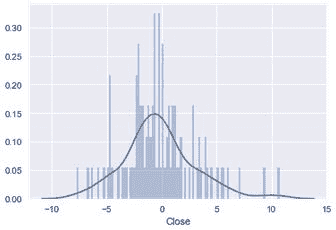 Let's now calculate our MSE, MAE, RMSE and our R-Squared.Recall that in order to calculate our R-Squared we use the explained variance score in sklearn.

```
R_Squared_2=metrics.explained_variance_score(y_test_2,predictions_2)
```

```
#printing the R-Squared of our polynomial model
print('Polynomial Model R-Squared:',R_Squared_2)
```

多项式模型的 R 平方:0.98825888889

现在让我们来计算我们的误差。

```
#Calculating MSE
MSE_2=metrics.mean_squared_error(y_test_2,predictions_2)
#Calculating MAE
MAE_2=metrics.mean_absolute_error(y_test_2,predictions_2)
#Calculating RMSE
RMSE_2=np.sqrt(MSE_2)

#Printing out Errors
print('Polynomial MSE:',MSE_2)
print('Polynomial MAE:', MAE_2)
print('Polynomial RMSE:',RMSE_2)
```

Polynomial MSE: 10.451263391 Polynomial MAE: 2.42279636464 Polynomial RMSE: 3.23284138043Okay. We can see that we have achieved our objective of further reducing our errors and have also improved our R-Squared.Let's now write our polynomial equation for PNB.

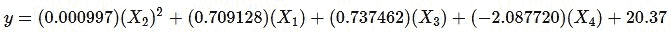

#### 好的。我们来复习一下！

We started by getting an understanding of Linear Regression and what happens under the hood when we create a model. We learned some of the computations that take place and then collected data for PNB. We built a linear model to predict the closing price of PNB. We used Lag 1 and Lag 2, Higher High, and Lower Low as predictors for our model. After building our model we were able to use the .coef *and .intercept* methods to get our coefficients and create our linear equation.Plotting our residuals showed that our data was not linear, and linearity is a major assumption of our model. We decided to transform our linear equation into a basic polynomial equation to account for the non-linearity in our data in an effort to see if we could improve our MSE.After doing some exploratory data analysis on our first model, we decided to transform our Lag 2 variable due to the deviation between it and the Lag 1's coefficients. Could this variable have given us an early indication of the non-linear nature of our data?After building our first model, we received an R-Squared of .9876, a MSE of 11.171, a MAE of 2.49, and a RMSE of 3.34\. After fitting our polynomial model our R-Squared improved to .9883, our MSE improved to 10.451, our MAE improved to 2.42 and our RMSE improved to 3.23.These results showed that our polynomial regression model had some merit in addressing the non-linear nature of our data. There are other considerations and other models that can address non-linearity. This post introduced one method. There are considerations such as the degrees of the polynomial model(i.e. how many transforms you do) that will affect the model's bias-variance tradeoff. Essentially, the more flexible a model is, the more likely it is to have low bias but high variance. The more inflexible the model, the more likely it is to have high bias and low variance. We want a model somewhere in between ideally with low bias and low variance. As we transform our equation, we make it more flexible. This allows us to better fit our data when it is non-linear but if we do to many transformations, we will overfit our data and our model will have high variance, or in other words only work on our training data.

### **了解更多信息**

Sign up for our latest course on ‘[Trading with Machine Learning](https://quantra.quantinsti.com/course/trading-with-machine-learning-regression)‘ on Quantra. This course covers core concepts such as regression, classification, and SVM, everything is covered in a simplified manner with additional reading material provided for advanced learners. You can also leverage from hands-on coding experience and downloadable strategies to continue learning post course completion.*Disclaimer: All investments and trading in the stock market involve risk. Any decisions to place trades in the financial markets, including trading in stock or options or other financial instruments is a personal decision that should only be made after thorough research, including a personal risk and financial assessment and the engagement of professional assistance to the extent you believe necessary. The trading strategies or related information mentioned in this article is for informational purposes only.*