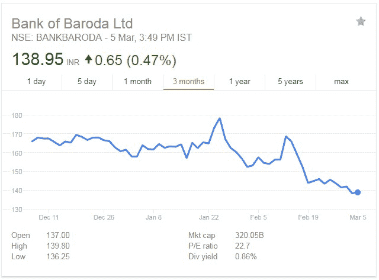
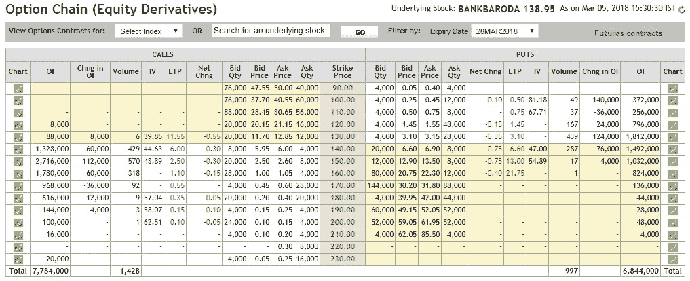
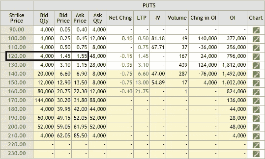
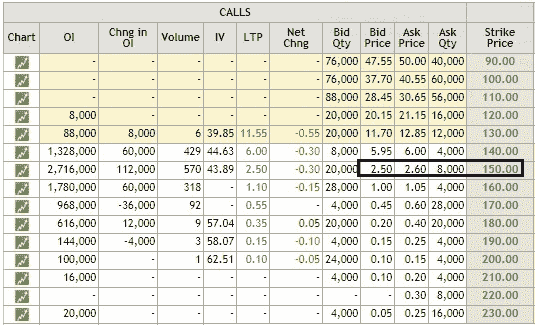
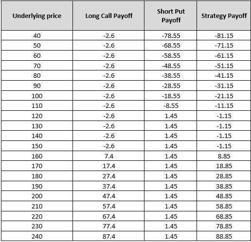
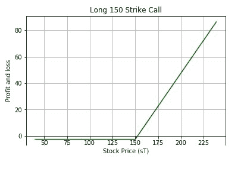
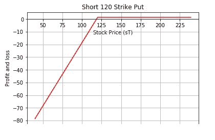
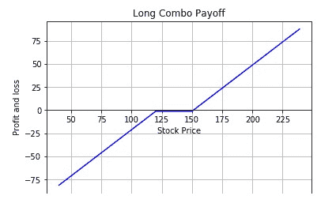
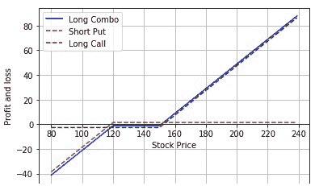

# 交易选项:多头组合交易策略

> 原文：<https://blog.quantinsti.com/trading-options-long-combo-trading-strategy/>

由尼廷·塔帕尔

## **简介**

在我最近关于一些最流行的期权交易策略的博客中，我谈到了包含有限风险和回报的策略。我以前的文章中解释的策略包括[期权多头扼杀](https://blog.quantinsti.com/long-strangle-option-strategy-in-python/)、[看涨期权价差](https://blog.quantinsti.com/bull-call-spread-strategy/)和[铁鹰](https://blog.quantinsti.com/iron-condor-options-trading-strategy)有一个共同点，那就是它是为谨慎的交易者准备的，他们希望以低到中等水平的风险进行最小的投资，但回报较低。基于反馈和需求，这一次我将带你经历一个包含无限风险和回报的策略。

我们今天将学习“长组合策略”,它很容易理解和实施。

[点击*至*tweet tweet = " Trading Options:Long Combo Trading Strategy by @ quantin STI " quote = " Trading Options:Long Combo Trading Strategy "]

## **什么是多头连击交易策略？**

作为期权交易者，如果你看好市场，也就是说，你预计股价会上涨，你可以考虑使用多头组合策略。它包括卖出看跌期权和买入看涨期权。

### **策略特征**

**期权的价格-**

*   卖出 1 份 OTM 看跌期权(下限)
*   购买 1 个 OTM 电话(更高的罢工)

**最大利润:**无限制

**最大损失:**无限制(下限+净保费)

**盈亏平衡:**更高的履约价+净溢价

## **如何实施这一战略？**

为了简单起见，我将在一个真实的市场场景中执行这个策略。

让我在巴罗达银行有限公司股票期权(代码:BANKBARODA)上实施这个策略。考虑到我看好这只股票的事实，我假设由于股价处于历史低点(考虑到过去 3 个月)，我预计它会由于一些外部因素而上涨。

银行巴罗达过去 3 个月的股价变动(来源——谷歌财经)



截至 2018 年 3 月 5 日，巴罗达银行的股价为 138.95 印度卢比。

以下是巴罗达银行有限公司 2018 年 3 月 5 日<sup>日</sup>到期日的期权链。



我将采取以下立场:

*   以 1.45 印度卢比的价格卖出 120 份看跌期权
*   以 2.60 印度卢比买入 150 份看涨期权





来源:nseindia.com

下面是一系列基础价格的收益情况:



## **现在，让我们用 Python 代码向您展示收益汇总:**

**长期买入回报**

```py
def long_call(sT, strike_price, premium_paid):
    return np.where(sT > strike_price, sT - strike_price, 0)-premium_paid
# Stock price
spot_price = 138.95
```

```py
# Long call
strike_price = 150
premium_paid = 2.60
```

```py
# Stock price range of call at expiration
sT = np.arange(40,240,1)
long_call_payoff = long_call(sT, strike_price, premium_paid)
```

```py
fig, ax = plt.subplots()
ax.spines['bottom'].set_position('zero')
ax.plot(sT,long_call_payoff,color='g')
ax.set_title('Long 150 Strike Call')
plt.xlabel('Stock Price (sT)')
plt.ylabel('Profit and loss')
plt.legend()
plt.grid()
plt.show()
```



**看跌回报**

```py
def short_put(sT, strike_price, premium_recived):
    return np.where(sT > strike_price, 0, sT- strike_price) + premium_received
# Stock price
spot_price = 138.95
```

```py
# Short Put
strike_price = 120
premium_received = 1.45
```

```py
# Stock price range of put at expiration
sT = np.arange(40,240,1)
short_put_payoff = short_put(sT, strike_price, premium_received)
```

```py
fig, ax = plt.subplots()
ax.spines['bottom'].set_position('zero')
ax.plot(sT,short_put_payoff,color='r')
ax.set_title('Short 120 Strike Put')
plt.xlabel('Stock Price (sT)')
plt.ylabel('Profit and loss')
plt.legend()
plt.grid()
plt.show()
```



**长连击收益**

```py
long_combo_payoff = long_call_payoff + short_put_payoff
```

```py
fix , ax = plt.subplots()
ax.spines['bottom'].set_position('zero')
ax.plot(sT,long_combo_payoff,color='b')
ax.set_title('Long Combo Payoff')
plt.xlabel('Stock Price')
plt.ylabel('Profit and loss')
plt.legend()
plt.grid()
plt.show()
```



```py
print max(long_combo_payoff)
print min(long_combo_payoff)
87.85000000000001
-81.14999999999999
long_combo_payoff = long_call_payoff + short_put_payoff
```

```py
fix , ax = plt.subplots()
ax.spines['bottom'].set_position('zero')
ax.plot(sT,long_combo_payoff,color='b')
ax.plot(sT,short_put_payoff,'--',color='r')
ax.plot(sT,long_call_payoff,'--',color='g')
ax.set_title('Long Combo Payoff')
plt.xlabel('Stock Price')
plt.ylabel('Profit and loss')
plt.legend()
plt.grid()
plt.show()
```



## **下一步**

如果你是第一次接触[期权交易](https://quantra.quantinsti.com/course/options-trading-strategies-python-intermediate)并且想学习基础知识，你可以阅读我们在[上的帖子《期权交易基础知识解读](https://blog.quantinsti.com/basics-options-trading/)，了解期权的特性。

如果你想学习算法交易的各个方面，那就去看看算法交易(EPAT)中的 T2 高管课程。该课程涵盖了统计学&计量经济学、金融计算&技术和算法&定量交易等培训模块。EPAT 让你具备成为成功交易者所需的技能。[现在报名](https://www.quantinsti.com/epat/)！

您可以报名参加 Quantra 上的[期权交易课程](https://quantra.quantinsti.com/course/options-trading-strategies-python-advanced),在您的交易中创建成功的策略和应用知识。它涵盖了零售和机构交易策略。

***免责声明**:股票市场的所有投资和交易都有风险。在金融市场进行交易的任何决定，包括股票或期权或其他金融工具的交易，都是个人决定，只能在彻底研究后做出，包括个人风险和财务评估以及在您认为必要的范围内寻求专业帮助。本文提到的交易策略或相关信息仅供参考。*

### **下载数据文件**

*   Long+Combo.ipynb