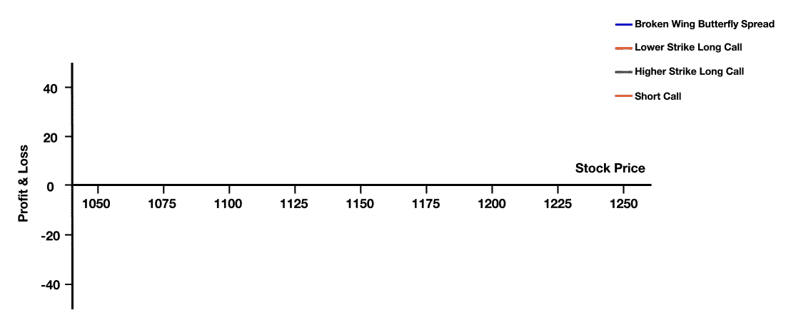
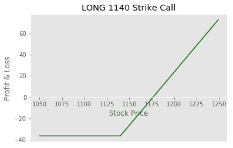
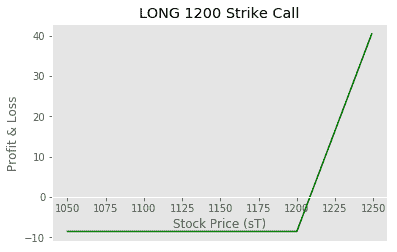
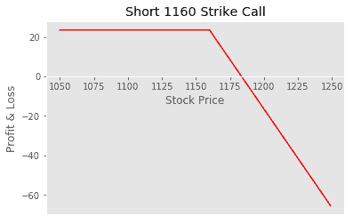
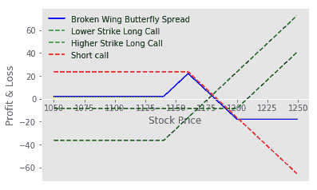
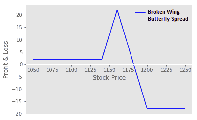

# Python 中的断翼蝴蝶期权交易策略

> 原文：<https://blog.quantinsti.com/broken-wing-butterfly-options-trading-strategy-python/>


由[维拉伊·巴加](https://www.linkedin.com/in/virajbhagat/)

与过去相比，如今期权交易更受欢迎，这导致了各种类型的[期权交易](https://blog.quantinsti.com/basics-options-trading/)策略的产生。有些留了下来，有些进化了，而有些可能已经不复存在。蝴蝶期权就是这样一种已经被交易者实践多年的期权。期权交易者练习一种改良的[蝴蝶效应](https://blog.quantinsti.com/butterfly-spread-options-trading-strategy-python/)来获得或增加收入。

对于许多期权交易者来说，蝴蝶差价是一种从在预测范围内收盘的基础资产中获利的方式。然而，这样做的缺点是，如果价格接近所选择的执行价格参数，就会发生资本的完全损失。

### **什么是断翅蝴蝶策略？**

在我们之前的博客中，我们已经过了蝴蝶期权交易策略和[铁蝴蝶策略](https://blog.quantinsti.com/iron-butterfly-options-trading-strategy/)。然而，这个家庭还有一个成员值得一提。断翅蝴蝶通常被称为“跳击蝴蝶”。

Futuresmag 创造了“断翼蝴蝶”，这是一种强有力的蝴蝶替代品，其目标是零成本启动交易。

这是一个著名的高级期权策略，建立在蝴蝶差价的积极特征上。不像长蝴蝶，人们必须支付新的借方，断翼蝴蝶策略是一种净信贷策略，经常被用来增加 POP(盈利概率)。

断翼蝴蝶策略与蝴蝶相同，其中卖出价差通常比买入价差更大。它是一个长的蝶式排列，长的走向与短的走向不等距，即。最远的 OTM 翼调整到更远的 OTM。较宽的一面被称为“破损”面，这就是该策略的名称。

要理解这项技术的复杂性，从基础开始很重要。在这里，我们将奠定基础，然后建立一些股票期权市场的断翼蝴蝶策略的例子。

### **断翅蝴蝶战略方向**

*   中性/轻微方向性
*   断翼蝴蝶的买入和卖出更多的是一种定向策略，而不是标准的蝴蝶策略
*   一方比另一方有更大的风险，并在另一端补偿风险

**该策略在理想情况下应该是这样的:**



### **断翅蝴蝶期权策略集锦**

#### **最大利润**

较窄利差的宽度+收到的贷方-或-较窄利差的宽度-支付的借方

当标的以期权的短期执行价格到期时，利润最大。

与长蝴蝶价差相比，交易断翅蝴蝶价差允许我们增加盈利的可能性，因为尾部上限弥补了其他尾部盈利的损失

#### **最大损失**

最大的损失发生在最大的货币期权到期时。

#### **如何计算盈亏平衡**

##### **断翅唤蝶**

**净信贷**:做空+息差收窄+收到信贷

**净借方**:

*   向上:短线+较窄价差的宽度-借方已付
*   向下:较低的多头看涨期权+已支付的借方

##### **断了翅膀放蝴蝶**

**净信贷**:短冲-较窄利差-收到的信贷

**净借方**:

*   向上:更高的长期看跌期权-借方已付
*   向下:(短冲-较窄价差的宽度)+借方已付

#### **利润对比**

对于买入和卖出的蝴蝶差价，当标的以中间的卖空执行价格到期时，你的最大利润就产生了。

潜在利润=冲次 B -冲次 A +支付的净借方或潜在利润=冲次 B -冲次 A +收到的净贷方

##### **叫断翅蝴蝶扩散**

这些都有一个看涨的市场假设

利润=交易(为新信贷而进行的交易)+基础价格(is

利润=基础价格(is

##### **放断了翅膀的蝴蝶展开**

这些都有看跌市场的假设

利润=交易(净信贷)+基础价格(is >到期时的卖空期权)

利润=基础价格(is >卖空执行价格)-收到的信用(出售差价)-长差价的宽度

#### 风险(最大值。损失)

冲 C -冲 D -收到净贷方或冲 C -冲 D +支付净借方

### **断翼蝴蝶期权交易策略**

断翅蝶就像是在长叫蝶传播里面嵌入了一个短叫垂直传播。

**建立净贷方(或相对较小的借方):**这是通过其中包含的短期买入垂直价差实现的。

**死击:**分别建立蝶式展开和短垂直展开时发生。这就需要买入和卖出一个带有 Strike 的看涨期权，两者相互抵消。

### **设置一个** **断翅蝴蝶策略**

*   差价可以由所有看涨期权或所有看跌期权构成
*   一般来说，股票将处于或低于罢工 A
*   执行价格是等距的
*   所有选项都有相同的到期月份，即。2018 年 3 月 28 日

交易包括两个做空期权和一个高于和低于做空期权的做多期权:

*   买入 1 份看涨期权/看跌期权(高于短期行权价)- A
*   卖出两个看涨期权，执行价格为 B
*   跳过执行价格 C
*   买入 1 份看涨期权/看跌期权(低于短期行权价)–D

### **例子**

举一个以卢比交易的 RELINFRA 的样本股票。100:

*   在 XYZ 买 1 120 电话
*   在 XYZ 销售 2 105 个电话
*   在 XYZ 买 1 100 电话
*   净信贷=卢比。10

在这个例子中，120 呼叫距离短击 15 点，而 100 呼叫距离短击 5 点。此外，如果上涨时打击扩大，交易将被记入贷方，因此，没有下跌风险。

一只普通的长蝴蝶与卢比这样的执行价格相平衡。100/-卢比。105/-，卢比。120/-(两个长翼选项与中间的短翼选项距离相等)。

一只折翼蝴蝶的价格会像卢比。100/-卢比。105/-，卢比。120/-(长 Rs。120/-选项为 Rs。15/-远离中间选项，而 Rs。100/-长选项只有 Rs。5/-远)。

### **实施断翅蝴蝶交易策略**

在这个例子中，我将使用 INFOSYS(股票代码:Infosys)期权。

*   现货价格:1164
*   看涨期权执行价格:1140 英镑(溢价:36.5 英镑)
*   做空看涨期权执行价格:1160 英镑(溢价:23.5 英镑)
*   看涨期权 2 执行价格:1200 英镑(溢价:8.5 英镑)

### **策略**

我们将从导入库开始。

#### **导入库**

```
import numpy as np
import matplotlib.pyplot as plt
#import seaborn
plt.style.use('ggplot')
```

#### **电话支付**

```
def call_payoff (sT, strike_price, premium):
return np.where(sT> strike_price, sT-strike_price, 0)-premium
# Infosys Spot Price
s0 = 1164
 ​
# Long Call (A)
lower_strike_price_long_call= 1140
premium_lower_strike_long_call = 36.5
 ​
# Short Call (B)
strike_price_short_call = 1160
premium_short_call = 23.5
 ​
# Long Call (D)
higher_strike_price_long_call = 1200
premium_higher_strike_long_call = 8.5
 ​
# Range of call option at expiration
sT = np.arange(1050,1250,1)
```

#### **长期买入回报**

#### **降低买入看涨期权的回报**

```
lower_strike_long_call_payoff = call_payoff(sT, lower_stirke_price_long_call, premium_lower_strike_long_call)
 ​
fig, ax = plt.subplots()
ax.spines['bottom'].set_position('zero')
ax.plot(sT,lower_strike_long_call_payoff, color='g')
ax.set_title('LONG 1140 Strike Call')
plt.xlabel('Stock Price')
plt.ylabel('Profit & Loss')
plt.grid()
 ​
plt.show()
```



#### **更高的看涨期权收益**

```
higher_strike_long_call_payoff = call_payoff(sT, higher_strike_price_long_call, premium_higher_strike_long_call)
 ​
fig, ax = plt.subplots()
ax.spines['bottom'].set_position('zero')
ax.plot(sT,higher_strike_long_call_payoff, color='g')
ax.set_title('LONG 1200 Strike Call')
plt.xlabel('Stock Price (sT)')
plt.ylabel('Profit & Loss')
plt.grid()
 ​
plt.show()
```



#### **短期买入回报**

```
Short_call_payoff = call_payoff(sT, strike_price_short_call, premium_short_call)*-1.0
 ​
fig, ax = plt.subplots()
ax.spines['bottom'].set_position('zero')
ax.plot(sT, Short_call_payoff, color='r')
ax.set_title('Short 1160 Strike Call')
plt.xlabel('Stock Price')
plt.ylabel('Profit & Loss')
plt.grid()
 ​
plt.show()
```



### **断翅蝴蝶蔓延开去**

```
BrokenWing_Butterfly_spread_payoff = lower_strike_long_call_payoff + higher_strike_long_call_payoff + 2 *Short_call_payoff
 ​​
fig, ax = plt.subplots()
ax.spines['bottom'].set_position('zero')
ax.plot(sT,BrokenWing_Butterfly_spread_payoff ,color='b', label= 'Broken Wing Butterfly Spread')
ax.plot(sT, lower_strike_long_call_payoff,'--', color='g',label='Lower Strike Long Call')
ax.plot(sT, higher_strike_long_call_payoff,'--', color='g', label='Higher Strike Long Call')
ax.plot(sT, Short_call_payoff, '--', color='r', label='Short call')
 ​
plt.legend()
plt.grid()
plt.xlabel('Stock Price')
plt.ylabel('Profit & Loss')
plt.show()
```



```
BrokenWing_Butterfly_spread_payoff = lower_strike_long_call_payoff + higher_strike_long_call_payoff + 2 *Short_call_payoff
 ​
fig, ax = plt.subplots()
ax.spines['bottom'].set_position('zero')
ax.plot(sT,BrokenWing_Butterfly_spread_payoff ,color='b', label= 'Broken Wing Butterfly Spread')
plt.legend()
plt.xlabel('Stock Price')
plt.ylabel('Profit & Loss')
plt.grid()
plt.show()
```



```
profit = max(BrokenWing_Butterfly_spread_payoff)
loss = min(BrokenWing_Butterfly_spread_payoff)
 ​
print ("Max Profit %.2f" %profit)
print ("Max Loss %.2f" %loss)

Max Profit: 22.00
Max Loss: 18.00
```

### **结论**

由于甜蜜点很窄，而且你在一个策略中交易三个不同的期权，跳过打击蝴蝶可能更适合更高级的期权交易者。经验丰富的老兵和更高应该普遍实行它

如果市场下跌，这两种策略都可能在到期时亏损，但断翅蝴蝶价差对下跌是持久的，可以承受更大的亏损。也就是说，断翅蝴蝶的收支平衡比蝴蝶好，因为它会提供更多的保护。

### **一些相关术语**

[**蝴蝶价差:**](https://blog.quantinsti.com/butterfly-spread-options-trading-strategy-python/) 它是多头价差和空头价差的结合，是一种中性的交易策略，因为它的风险选项和盈利潜力有限

**短蝴蝶:**与长蝴蝶相反，在股票价格可能向两个方向变动时使用

 ****长蝶泳:**使用看跌期权练习长蝶泳

[**铁蝴蝶:**](https://blog.quantinsti.com/iron-butterfly-options-trading-strategy/) 它也是牛熊价差的组合，一种有限风险和有限利润的交易策略，其中包括使用四种不同的期权

**翼展:**成员以各种飞行生物命名的翼展家族

### **下一步**

一步一步的指导，帮助你学习如何使用移动平均交叉策略来交易漂亮的期权。使用 Python 编程探索交叉信号的回溯测试，以从您的交易策略中获得最佳结果。

*免责声明:股票市场的所有投资和交易都有风险。在金融市场进行交易的任何决定，包括股票或期权或其他金融工具的交易，都是个人决定，只能在彻底研究后做出，包括个人风险和财务评估以及在您认为必要的范围内寻求专业帮助。本文提到的交易策略或相关信息仅供参考。*

### **下载数据文件**

*   断翼蝴蝶期权策略- Python 代码**