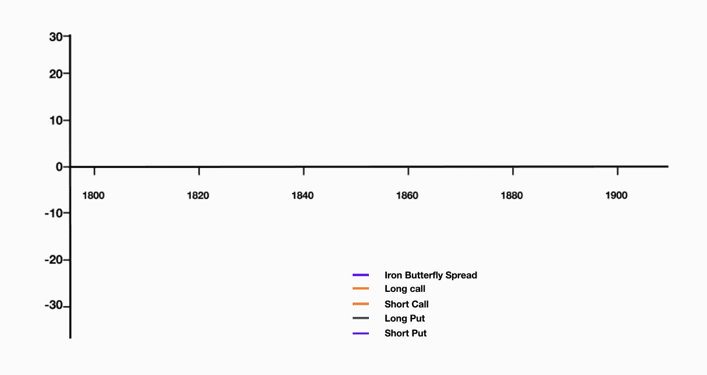
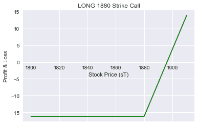
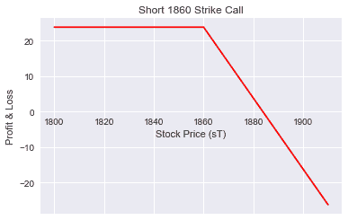
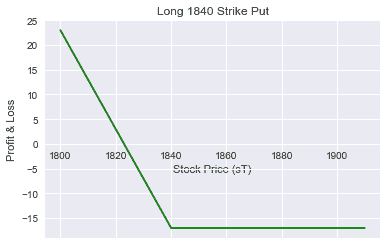
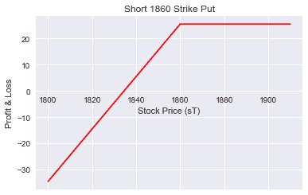
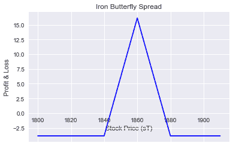
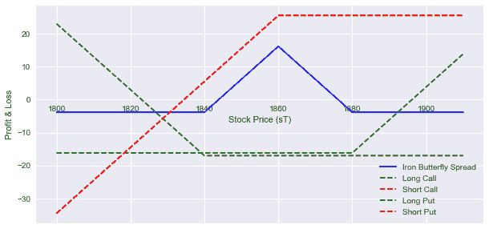

# Python 中的铁蝴蝶期权策略

> 原文：<https://blog.quantinsti.com/iron-butterfly-options-trading-strategy/>


由[维拉伊·巴加](https://www.linkedin.com/in/virajbhagat/)

赚钱的方式有很多种，期权为交易者提供了许多不可复制的独特方式，从而为他们提供了便利。同样，在各种各样的期权中，并不是所有的都是高风险的，都有助于限制重大损失，比如铁蝴蝶期权策略，它限制了交易者的输赢金额。

铁蝴蝶期权交易策略是一种[期权交易策略](https://quantra.quantinsti.com/course/options-trading-strategies-python-basic)。它是[蝴蝶扩散](https://blog.quantinsti.com/butterfly-spread-options-trading-strategy-python/)选项的一部分。同样，这种策略也是多头价差和空头价差的组合。

因为它是一种有限风险和有限利润的交易策略，包括使用四种不同的选项；适合专业交易者。这就像同时运行卖空交易和卖空交易，两者的价差在峰值处汇合。由于它是短期利差的组合，因此可以建立净信贷。

主要在基础资产波动性较低时使用，即使价格在特定时间有轻微波动，它也增加了赚取较小有限利润的可能性。人们不得不经常支付平仓，因为所有的[期权](https://quantra.quantinsti.com/course/options-trading-strategies-python-basic)在这个价差中失效的可能性很低。

这种交易有可能带有方向性的偏见。如果罢工 B 高于股价，这将被视为一个看涨的交易。如果罢工 B 低于股价，这将是一个看跌交易。

### **构造:**

*   买 1 低 OTM 放一(牛)
*   卖出 1 个中型自动柜员机卖出期权(多头)
*   卖出 1 个中间 ATM 看涨期权 B(空头)
*   买 1 更高的 OTM 呼叫 C(熊)

*   执行价格是等距的
*   所有选项都有相同的到期月份
*   这导致了交易的净信用

**该策略在理想情况下应该是这样的:**



#### **收益**

**Max。利润:**潜在利润等于收到的净信贷，因此是有限的。当基础期权到期时的价格等于买入期权和卖出期权的执行价格时，所有期权都将毫无价值地到期。结果，[期权](https://quantra.quantinsti.com/course/options-trading-strategies-python-basic)交易员将进入交易时收到的全部净信贷作为利润。

**Max。损失:**这里的最大损失是看涨期权和看跌期权的执行价格之间的差额，不包括收到的净溢价。风险发生在高峰期，并且仅限于此。当价格出现以下情况时，会发生有限的损失:

*   跌破买入看跌期权的下限，或
*   上涨/等于买入看涨期权的较高执行价

#### **盈亏平衡点**

盈亏平衡点上限=卖空看涨期权的执行价格+收到的净溢价下限=卖空看跌期权的执行价格-收到的净溢价

### **实施战略**

在这个例子中，我将使用 HDFC(股票代码:HDFC)期权。假设，HDFC 在 2018 年 3 月 1 日以 1860 印度卢比交易，期权在 2018 年 3 月 28 日到期。

*   现货价格:1860
*   看涨期权执行价:1880 英镑(溢价:16.15 英镑)-买入
*   空头看涨期权执行价:1860(溢价:23.8) -卖出
*   看跌期权执行价:1840(溢价:17.00) -卖出
*   看跌期权执行价:1860 英镑(溢价:25.50 英镑)-买入

**这个策略的 Python 代码如下:**

#### **导入库**

```
import numpy as np
import matplotlib.pyplot as plt
import seaborn
from tabulate import tabulate
seaborn.set(style='darkgrid')
```

#### **电话支付**

```
def call_payoff(sT, strike_price, premium):
    return np.where(sT > strike_price, sT - strike_price, 0)-premium
```

```
# HDFC Spot Price
s0 = 1860
# Long Call
strike_price_long_call = 1880
premium_long_call = 16.15
# Short Call
strike_price_short_call = 1860
premium_short_call = 23.8
# Range of call option at expiry
sT = np.arange(1800,1920,10)
```

##### **长期买入回报**

```
long_call_payoff = call_payoff(sT, strike_price_long_call, premium_long_call )

fig, ax = plt.subplots()
ax.spines['bottom'].set_position('zero')
ax.plot(sT, long_call_payoff, color='g')
ax.set_title('LONG 1880 Strike Call')
plt.xlabel('Stock Price (sT)')
plt.ylabel('Profit & Loss')

plt.show()
```

##### 

##### **短期买入回报**

```
short_call_payoff = call_payoff(sT, strike_price_short_call, premium_short_call )*-1.0

fig, ax = plt.subplots()
ax.spines['bottom'].set_position('zero')
ax.plot(sT, short_call_payoff, color='r')
ax.set_title('Short 1860 Strike Call')
plt.xlabel('Stock Price (sT)')
plt.ylabel('Profit & Loss')

plt.show()
```

#### 

#### **放收益**

```
def put_payoff(sT, strike_price, premium):
    return np.where(sT < strike_price, strike_price - sT, 0) - premium
```

```
# HDFC Spot Price
s0 = 1860
# Long Put
strike_price_long_put =1840
premium_long_put = 17
# Short Put
strike_price_short_put = 1860
premium_short_put = 25.5
# Range of put option at expiry
sT = np.arange(1800,1920,10)
```

##### **多头平仓**

```
long_put_payoff = put_payoff(sT, strike_price_long_put, premium_long_put)

fig, ax = plt.subplots()
ax.spines['bottom'].set_position('zero')
ax.plot(sT, long_put_payoff, color ='g')
ax.set_title('Long 1840 Strike Put')
plt.xlabel('Stock Price (sT)')
plt.ylabel('Profit & Loss')
plt.show()
```

##### 

##### **看跌回报**

```
short_put_payoff = put_payoff(sT, strike_price_short_put, premium_short_put)*-1.0

fig, ax = plt.subplots()
ax.spines['bottom'].set_position('zero')
ax.plot(sT, short_put_payoff, color ='r')
ax.set_title('Short 1860 Strike Put')
plt.xlabel('Stock Price (sT)')
plt.ylabel('Profit & Loss')
plt.show()
```

#### 

#### **铁蝶心悦**

```
Iron_Butterfly_payoff = long_call_payoff + short_call_payoff + long_put_payoff + short_put_payoff 

fig, ax = plt.subplots()
ax.spines['bottom'].set_position('zero')
ax.plot(sT, Iron_Butterfly_payoff, color ='b')
ax.set_title('Iron Butterfly Spread')
plt.xlabel('Stock Price (sT)')
plt.ylabel('Profit & Loss')
plt.show()
```



```
profit = max (Iron_Butterfly_payoff)
loss = min (Iron_Butterfly_payoff)
print ("Max Profit %.2f" %profit)
print ("Min Loss %.2f" %loss)

Max Profit 16.15
Min Loss -3.85
```

```
fig, ax = plt.subplots(figsize=(10,5))
ax.spines['bottom'].set_position('zero')
ax.plot(sT, Iron_Butterfly_payoff, color ='b', label ='Iron Butterfly Spread')
ax.plot(sT, long_call_payoff,'--', color ='g', label = 'Long Call')
ax.plot(sT, short_put_payoff,'--', color ='r', label = 'Short Call')
ax.plot(sT, long_put_payoff,'--', color ='g',label = 'Long Put')
ax.plot(sT, short_put_payoff,'--', color ='r',label = 'Short Put')
plt.legend()
plt.xlabel('Stock Price (sT)')
plt.ylabel('Profit & Loss')
plt.show()
```

最终的收益图应该是这样的:



平仓发生在中间执行价和四个独立头寸的上限或下限之间的某个位置，导致利润最大化。由于大多数铁蝴蝶是用相当窄的价差创造出来的，因此遭受损失的几率相应地更高。铁蝴蝶旨在为投资者提供稳定的收入，同时限制他们的风险。通常只适合有经验的期权交易者。

所有交易者应小心沟通，并将该策略的开始和结束描述为“净借方的开始”或“净贷方的结束”。

“铁蝴蝶”的范围更窄，获得了更多的溢价卖出期权，而且由于风险回报更高，它与“铁秃鹰”相比有更好的风险回报比。因此，铁蝴蝶可以在更广泛的市场中上演，既有较低的波动性，也有较高的波动性。

### **一些相关术语**

**[多头看涨蝴蝶](https://blog.quantinsti.com/long-call-butterfly-strategy-python/) :** 在该策略中，所有看涨[期权](https://quantra.quantinsti.com/course/options-trading-strategies-python-basic)的到期日相同，成份股各执行价格之间的距离相同。

**反向铁蝶:**铁蝶的反向策略一般在 IV 预计增加时使用。

**翼展:**翼展科，其成员以飞行生物命名。

您可以在 Quantra 上报名参加这个[免费在线 python 课程](https://quantra.quantinsti.com/course/options-trading-strategies-python-basic)，了解基本术语和概念，这将有助于您的以旧换新选择。

### **下一步**

在我们的下一篇文章中，我们将使用 excel 模型交易美元/印度卢比货币对的期权头寸。这里的执行价格是以卢比对美元的汇率计算的。我们持有该标的(美元/印度卢比对)的不同期权头寸(看涨期权和看跌期权)。[点击这里](https://blog.quantinsti.com/usdinr-option-payoff-excel-model/)立即阅读。

*免责声明:股票市场的所有投资和交易都有风险。在金融市场进行交易的任何决定，包括股票或期权或其他金融工具的交易，都是个人决定，只能在彻底研究后做出，包括个人风险和财务评估以及在您认为必要的范围内寻求专业帮助。本文提到的交易策略或相关信息仅供参考。*

### **下载数据文件**

*   铁蝴蝶期权交易策略——Python 代码