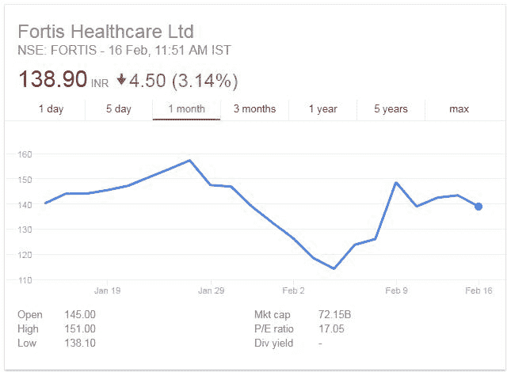
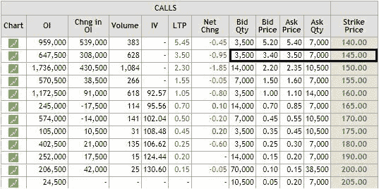
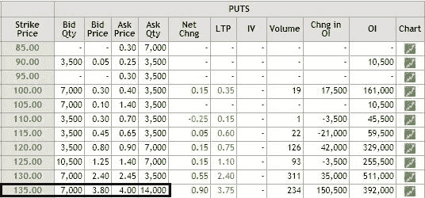
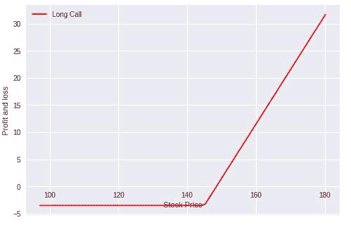
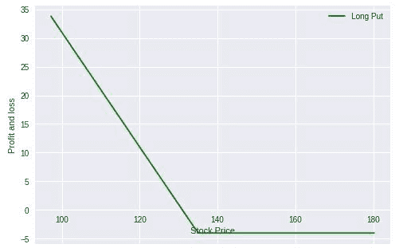
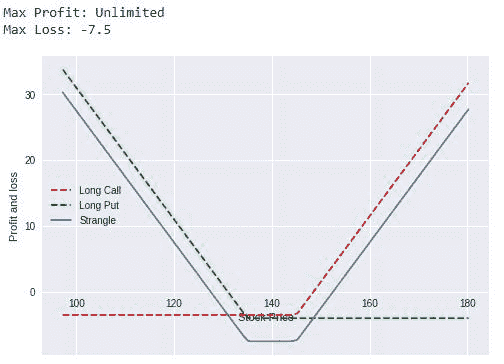

# Python 中的长扼杀选项策略

> 原文：<https://blog.quantinsti.com/long-strangle-option-strategy-in-python/>


由尼廷·塔帕尔

### **简介**

从事期权交易的交易者享受着选择投资规模和降低交易过程中损失风险的优势。与市场上的许多其他工具相比，期权被认为是成本有效且风险较低的。关于期权交易，我最喜欢的是有许多策略可以练习和遵循。然而，许多交易者不理解他们可以使用的策略范围，这些策略最适合他们的交易风格。

举几个例子


今天，我们来谈谈多头扼杀交易策略。

### **什么是期权交易中的‘长扼杀’？**

多头扼杀是最受欢迎的[期权交易策略](https://blog.quantinsti.com/moving-average-crossover-trade-nifty-options/)之一，允许交易者持有到期周期相同但执行价格不同的看涨和看跌期权。

#### 战略要点

要购买的期权的价格:

1.  从投入的资金中
2.  资金看涨期权之外

利润潜力:无限

最大损失:买入溢价+卖出溢价

盈亏平衡:上涨时的盈亏平衡=执行价+买入溢价+卖出溢价

下跌时的盈亏平衡=执行价格-买入溢价-卖出溢价

### **如何实施这一战略？**

在这个例子中，我将使用富通医疗保健有限公司(股票代码:Fortis)的期权。如果标的资产大幅波动，无论其走势如何，交易者都会从多头扼杀策略中受益。如果你看看下面的图表，就会发现富通的股价也是如此

过去 1 个月的股价走势(来源——谷歌财经)



富通集团的股票价格有很大波动，在过去的一个月里，最高为 157.30 印度卢比，最低为 114.20 印度卢比。根据 Google Finance，当前价值为 138.90 印度卢比，IV 为 83.35%

就本例而言；我会买 1 份价外看跌期权和 1 份价外看涨期权。

这里是富通 2018 年 2 月 22 日 日 到期日的期权链。






来源:[【nseindia.com】](https://www.nseindia.com/)

我将为行使价为 135 印度卢比的看跌期权支付 4 印度卢比，为行使价为 145 印度卢比的看涨期权支付 3.50 印度卢比。期权将于 2018 年 2 月 22 日 和 到期，为了让我从中获利，富通的股票在到期前应该会出现大幅波动。

启动该交易所支付的净溢价将为 7.50 印度卢比，因此在该策略实现盈亏平衡之前，股票需要下跌至 127.5 印度卢比或上涨至 152.50 印度卢比。考虑到各种因素导致的市场大幅波动，并考虑到市场从最近的下跌中复苏的过程，我们可以假设这里有机会获利。

### **Python 中如何计算策略收益？**

现在，让我用 Python 编程代码带你浏览一下收益图。

#### **导入库**

```
import numpy as np
import matplotlib.pyplot as plt
import seaborn
```

#### **定义参数**

```
# Fortis stock price 
spot_price = 138.90

# Long put
strike_price_long_put = 135
premium_long_put = 4

# Long call
strike_price_long_call = 145 
premium_long_call = 3.50

# Stock price range at expiration of the put
sT = np.arange(0.7*spot_price,1.3*spot_price,1)
```

#### **电话支付**

我们定义一个函数来计算购买看涨期权的收益。该函数将 sT 作为输入，sT 是到期时股票价格、认购期权的执行价格和认购期权的溢价的可能值的范围。它返回看涨期权的收益。

```
def call_payoff(sT, strike_price, premium):
 return np.where(sT > strike_price, sT - strike_price, 0) – premium
payoff_long_call = call_payoff(sT, strike_price_long_call, premium_long_call)

# Plot
fig, ax = plt.subplots()
ax.spines['bottom'].set_position('zero')
ax.plot(sT,payoff_long_call,label='Long Call',color='r')
plt.xlabel('Stock Price')
plt.ylabel('Profit and loss')
plt.legend()
plt.show()
```



#### **放收益**

我们定义一个函数来计算购买看跌期权的收益。该函数将 sT 作为输入，sT 是到期时股票价格、看跌期权的执行价格和看跌期权的溢价的可能值的范围。它返回看跌期权的收益。

```
def put_payoff(sT, strike_price, premium):
 return np.where(sT < strike_price, strike_price - sT, 0) – premium
payoff_long_put = put_payoff(sT, strike_price_long_put, premium_long_put)

# Plot
fig, ax = plt.subplots()
ax.spines['bottom'].set_position('zero')
ax.plot(sT,payoff_long_put,label='Long Put',color='g')
plt.xlabel('Stock Price')
plt.ylabel('Profit and loss')
plt.legend()
plt.show()
```



#### **扼死回报**

```
payoff_strangle = payoff_long_call + payoff_long_put

print ("Max Profit: Unlimited")
print ("Max Loss:", min(payoff_strangle))

# Plot
fig, ax = plt.subplots()
ax.spines['bottom'].set_position('zero')

ax.plot(sT,payoff_long_call,'--',label='Long Call',color='r')
ax.plot(sT,payoff_long_put,'--',label='Long Put',color='g')

ax.plot(sT,payoff_strangle,label='Strangle')
plt.xlabel('Stock Price')
plt.ylabel('Profit and loss')
plt.legend()
plt.show()
```



正如你在上面的收益图中看到的，任何人的最大损失是持有看涨和看跌期权支付的总溢价，在我的例子中是 7.50 印度卢比。这是指执行价格介于我们在到期时购买的两个期权之间。

另一方面，一旦股价向任何方向大幅波动，你可以获得的利润是无限的。

在我的下一篇文章中，我将谈论“看涨期权传播策略”

### **下一步**

如果你想学习算法交易的各个方面，那就去看看算法交易(EPAT)中的 T2 高管课程。该课程涵盖了统计学&计量经济学、金融计算&技术和算法&定量交易等培训模块。EPAT 让你具备成为成功交易者所需的技能。[现在报名](https://www.quantinsti.com/epat/)！

***免责声明**:股票市场的所有投资和交易都有风险。在金融市场进行交易的任何决定，包括股票或期权或其他金融工具的交易，都是个人决定，只能在彻底研究后做出，包括个人风险和财务评估以及在您认为必要的范围内寻求专业帮助。本文提到的交易策略或相关信息仅供参考。*

### **下载数据文件**

*   option _ thrught _ strategy . ipynb