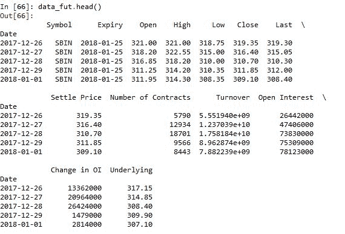
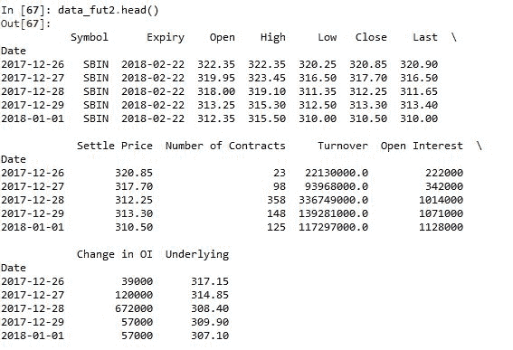
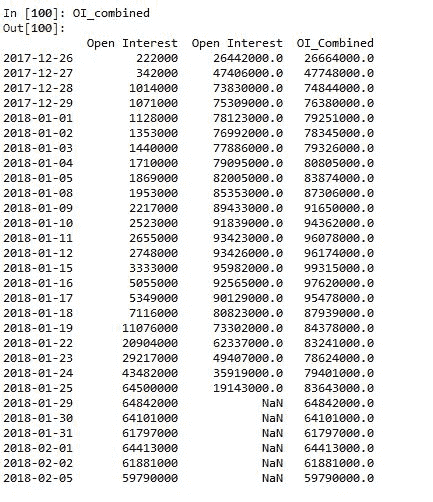
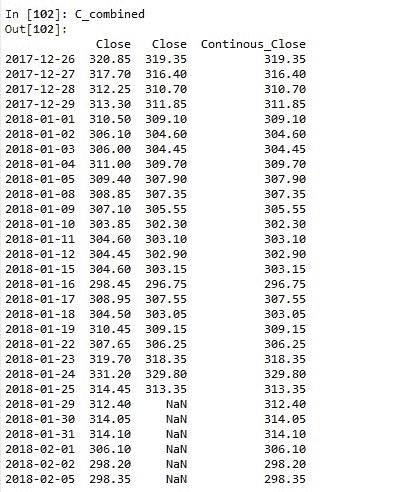
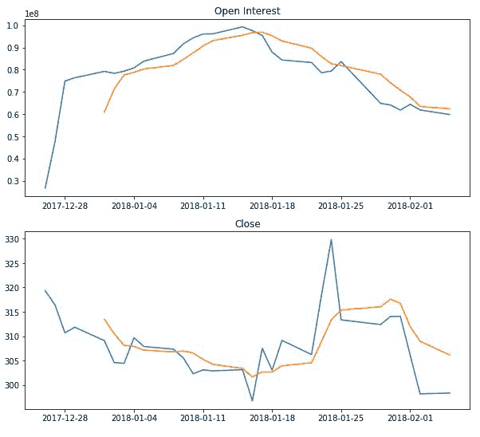
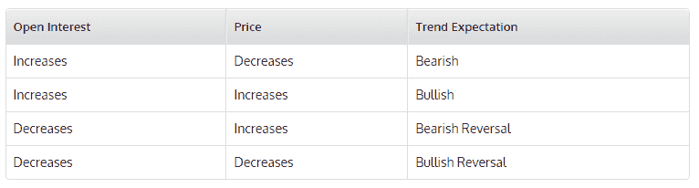
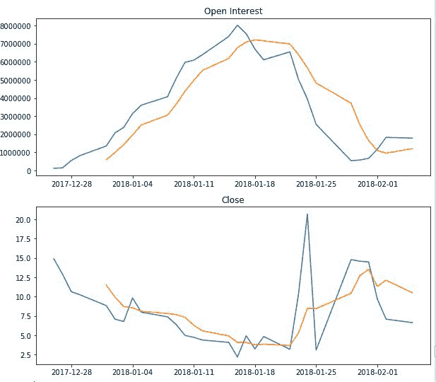

# 对使用 Python 进行期权交易感兴趣

> 原文：<https://blog.quantinsti.com/open-interest-options-trading-python/>

由[瓦隆·迪瓦卡尔](https://www.linkedin.com/in/varun-divakar-b862a667/)

### **什么是期权交易的未平仓合约？**

未平仓权益是股票/指数投资者活动的一个非常好的指标。与日交易量不同，日交易量的增加或减少与波动强度没有直接关系，未平仓合约是对市场波动强度的直接衡量。为了进一步解释，如果股票价格的上涨与未平仓合约的增加相关联，那么你可以确定新的头寸已经增加，或者对股票/指数有了新的兴趣。这是一个[指标](/build-technical-indicators-in-python/)，可以很容易地用于期货和期权交易的[基础](/basics-options-trading/)。今天，让我们尝试使用 Python 构建一个未平仓合约交易，以检查一些关于未平仓合约表示什么的基本假设。这个博客是对[傻瓜期权交易的介绍。](https://quantra.quantinsti.com/course/options-trading-strategies-python-basic)

### **在哪里可以找到未结利息数据？**

首先，让我们提取一个股票/指数的数据，并从该未平仓合约数据中验证未平仓合约。让我们拉动股票 SBI(印度国家银行)的期货价格，并检查其价格和未平仓合约的趋势。当合约生效或即将到期时，股票增加未平仓合约是很常见的。相反，当股票接近到期时，它的未平仓头寸就会减少。因此，为了检查期货的未平仓合约是增加还是减少，我们将不得不考虑远期和第二个月期货合约的合并未平仓合约。这将为您提供完整的画面，并避免在合同展期期间出现任何异常情况。

### **使用未平仓合约的期权交易**

在这篇博客中，我将向您展示如何在一月合约成为前一个月之后提取期货数据，然后我们将提取同一时间段的下个月合约(二月)信息，并检查组合未平仓合约。我已经用包 [nsepy](https://github.com/swapniljariwala/nsepy) (感谢 Swapnil Jariwala 分享代码)拉了 NSE 股票的数据。

### **拉数据**

```
from nsepy import get_history
from datetime import date
import pandas as pd
import matplotlib.pyplot as plt

stock="SBIN"
start=start=date(2017,12,26)
end=date(2018,1,25)
end2=date(2018,2,5)
data_fut = get_history(symbol=stock,futures=True,start=start, end=end,
expiry_date=date(2018,1,25))
data_fut2 = get_history(symbol=stock,futures=True,start=start, end=end2,
expiry_date=date(2018,2,22))
```

让我们打印并检查两份合同的数据。  *data_fut* 包含 1 月合约的期货数据， *data_fut2* 包含 2 月合约的期货数据。现在，让我们将两个合同的未平仓权益结合起来，并绘制变更图。

```
OI_combined= pd.concat([data_fut2['Open Interest'],data_fut['Open Interest']],
axis=1)
OI_combined['OI_Combined']=OI_combined.sum(axis=1)
```



### **绘制数据**

```
plt.figure(1,figsize=(10,9))
plt.subplot(211)
plt.title('Open Interest')
plt.plot(OI_combined.OI_Combined,label='OI')
plt.plot(OI_combined.OI_Combined.rolling(5).mean(),label='OI')
plt.legend(['OI','OI_mean'])
```

接下来，我们签订一份连续合约，在到期后展期，并检查股票在同一时期的表现。

```
C_combined= pd.concat([data_fut2['Close'],data_fut['Close']],axis=1)
C_combined['Continous_Close']=C_combined.iloc[:,1].fillna(C_combined.iloc[:,0])
```



```
plt.subplot(212)
plt.title('Close')
plt.plot(C_combined.Continous_Close)
plt.plot(C_combined.Continous_Close.rolling(5).mean())
plt.legend(['Close','Close_mean'])
plt.show()
```

如你所见，我将两个期货合约与 1 月份合约的收盘价结合起来，直到其到期，然后与 2 月份的合约结合起来。

### **分析数据**

现在让我们来分析股票是如何交易的，以及我们是否有机会在这张综合未平仓合约图中交易。首先，让我们把这两个图表放在一起，然后你可以看到组合 OI(未平仓合约)在到期前开始下降，但价格保持上升。这通常被认为是一个看跌信号，因为它表明交易者正在平仓或开始做空，因此未平仓头寸正在减少。这给我们留下了一个很好的做空点，正好在到期前，当背离显著增加时。我将留给你一个小而重要的表格，它将有助于确定趋势的强度。



为了最终确认，让我们提取同一时期同一股票的期权数据并进行验证。

```
data_fut = get_history(symbol=stock,start=start, end=end,option_type='CE',
strike_price=310, expiry_date=date(2018,1,25))
data_fut2 = get_history(symbol=stock,start=start, end=end2,option_type='CE',
strike_price=310,
expiry_date=date(2018,2,22))
OI_combined= pd.concat([data_fut2['Open Interest'],data_fut['Open Interest']],
axis=1)
plt.figure(1,figsize=(10,9))
plt.subplot(211)
plt.title('Open Interest')
plt.plot(OI_combined.sum(axis=1),label='OI')
plt.plot(OI_combined.sum(axis=1).rolling(5).mean())

C_combined= pd.concat([data_fut2['Close'],data_fut['Close']],axis=1)
C_combined['Continous_Close']=C_combined.iloc[:,1].fillna(C_combined.iloc[:,0])

plt.subplot(212)
plt.title('Close')
plt.plot(C_combined.Continous_Close,label='Close')
plt.plot(C_combined.Continous_Close.rolling(5).mean())
plt.show()
```



### **结论**

如你所见，期权合约的未平仓合约在到期前也出现了大幅减少。这进一步坚定了我们的信念，即市场可能会出现调整。

***免责声明**:股票市场的所有投资和交易都有风险。在金融市场进行交易的任何决定，包括股票或期权或其他金融工具的交易，都是个人决定，只能在彻底研究后做出，包括个人风险和财务评估以及在您认为必要的范围内寻求专业帮助。本文提到的交易策略或相关信息仅供参考。*

### **下载数据文件**

*   开放兴趣交易 Python 代码