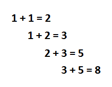
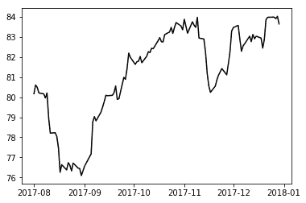
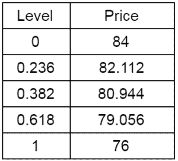
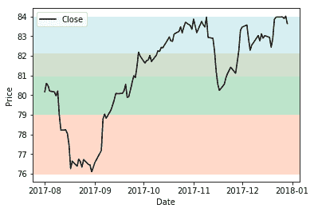

# Python 中的斐波那契回撤交易策略

> 原文：<https://blog.quantinsti.com/fibonacci-retracement-trading-strategy-python/>

由[伊山沙阿](https://www.linkedin.com/in/ishan-shah-18393828/)

斐波纳契交易工具用于确定支撑位/阻力位或确定价格目标。正是斐波那契数列在自然界的存在吸引了技术分析师的注意力，让他们使用斐波那契数列进行交易。斐波那契数列在寻找任何广泛交易的证券的关键水平方面有着神奇的作用。在这篇文章中，我将解释著名的斐波那契交易策略之一:回撤，以确定支撑位。

### **斐波那契数列**

斐波那契数列是一系列数字，从 0 和 1 开始，其中每个数字都是前两个数字的和。



斐波纳契数列是 0，1，1，2，3，5，8，13，21，34，55，89，144，233，377，610……它延伸到无穷大，可以用下面的公式来概括:

**X<sub>n</sub>= X<sub>n-1</sub>+X<sub>n-2</sub>T7】**

### 关于斐波那契数列，有哪些有趣的事实？

斐波那契数列有一些有趣的性质。将序列中的任意数字除以前一个数字；比率始终约为 **1.618** 。

```
Xn/Xn-1 = 1.618
55/34 = 1.618
89/55 = 1.618
144/89 = 1.618
```

**1.618 被称为黄金比例**。我建议在谷歌图片上搜索黄金比例的例子，你会惊喜地发现这个比例与自然的相关性。

同样，将序列中的任意一个数除以下一个数；该比率始终约为 0.618。

```
Xn/Xn+1 = 0.618
34/55 = 0.618
55/89 = 0.618
89/144 = 0.618
```

0.618 用百分比表示为 61.8%。0.618 的平方根是 0.786 (78.6%)。

当序列中的任何一个数被它右边两位的数整除时，也会发现类似的一致性。

```
Xn/Xn+2 = 0.382
13/34 = 0.382
21/55 = 0.382
34/89 = 0.382
```

0.382 以百分比表示为 38.2%

同样，当序列中的任何一个数被它右边三位的数整除时，也存在一致性。

```
Xn/Xn+3 = 0.236
21/89 = 0.236
34/144 = 0.236
55/233 = 0.236
```

0.236 以百分比表示为 23.6%。

23.6%、38.2%、61.8%和 78.6%的比率被称为斐波那契比率。

### **斐波那契回撤交易策略**

斐波纳契比率 23.6%、38.2%和 61.8%可用于[时间序列分析](/starting-time-series/)以找到支撑位。每当价格大幅上涨或下跌时，它通常会在继续向原来的方向移动之前回撤。例如，如果股票价格从 200 美元涨到 250 美元，那么在继续上涨之前，它很可能会回调到 230 美元。使用斐波纳契比率预测 230 美元的回撤水平。


我们可以通过一个简单的数学计算得出 230 美元总上涨= $250 - $200 = $50 上涨的 38.2% = 38.2% * 50 = $ 19.1 回撤预测= $250 - $19.1 = $230.9

任何低于 230 美元的价格水平都为交易者提供了一个很好的机会，在趋势的方向上建立新的头寸。同样，我们可以计算 23.6%，61.8%和其他斐波纳契比率。

### **如何找到斐波那契回撤水平？**

正如我们现在所知，回撤是与最初趋势相反的价格运动。为了预测斐波纳契回撤水平，我们应该首先确定总的向上移动或总的向下移动。为了标记这个移动，我们需要选择图表上最近的最高点和最低点。

让我们以埃克森美孚为例来理解斐波纳契回撤构造

```
# To import stock prices
from pandas_datareader import data as pdr
# To plot
import matplotlib.pyplot as plt
df = pdr.get_data_google('XOM','2017-08-01', '2017-12-31')
fig, ax = plt.subplots()
ax.plot(df.Close, color='black')
```



从图表中可以看出，从 2017 年 9 月到 2017 年 10 月底，价格有大幅上涨。在这种情况下，最低价格是 76 美元，最高价格是 84 美元。8 美元是总的上升趋势。

```
price_min = 76 #df.Close.min()
```

```
price_max = 84 #df.Close.max()
```

斐波纳契比率 23.6%、38.2%和 61.8%的回撤水平计算如下:

```
# Fibonacci Levels considering original trend as upward move
diff = price_max - price_min
level1 = price_max - 0.236 * diff
level2 = price_max - 0.382 * diff
level3 = price_max - 0.618 * diff

print "Level", "Price"
print "0 ", price_max
print "0.236", level1
print "0.382", level2
print "0.618", level3
print "1 ", price_min

ax.axhspan(level1, price_min, alpha=0.4, color='lightsalmon')
ax.axhspan(level2, level1, alpha=0.5, color='palegoldenrod')
ax.axhspan(level3, level2, alpha=0.5, color='palegreen')
ax.axhspan(price_max, level3, alpha=0.5, color='powderblue')

plt.ylabel("Price")
plt.xlabel("Date")
plt.legend(loc=2)
plt.show()
```

**输出:** 



23.6%的第一回撤位 82.10 美元，38.6%的第二回撤位 80.90 美元，61.8%的下一回撤位 79.05 美元。在 11 月中旬，埃克森美孚股价下跌至 80.40 美元，(跌破 38.6%的回撤水平)，然后继续上行。

### **如何使用斐波那契回撤交易策略？**

当你想买一只特定的股票，但由于股价大幅上涨而未能如愿时，可以使用回撤水平。在这种情况下，等待价格修正到斐波纳契回撤水平，如 23.6%、38.2%和 61.8%，然后买入股票。比率 38.2%和 61.8%是最重要的支撑位。

这种斐波纳契回撤交易策略在更长的时间间隔内更有效，像任何指标一样，将该策略与其他[技术指标](/build-technical-indicators-in-python/)一起使用，如 RSI、[【MACD】](/strategy-using-trend-following-indicators-macd-st-adx/)和[蜡烛图](/candlestick-patterns-meaning/)可以提高成功的概率。

祝 Fibonacci trading:)好运

### **下一步**

从网上可用的各种加密货币中获取数据的来源有很多。在我们的文章“[使用数据提取技术的加密货币交易策略](/cryptocurrencies-data-strategy/ "Permalink to Cryptocurrencies Trading Strategy With Data Extraction Technique")中，学习使用 python 库 coinmarketcap 来提取数据。要了解更多的量化交易策略，你可以通过

[量化交易策略和模型](https://quantra.quantinsti.com/course/quantitative-trading-strategies-models)课程

.

***免责声明:*** *股票市场的一切投资和交易都涉及风险。在金融市场进行交易的任何决定，包括股票或期权或其他金融工具的交易，都是个人决定，只能在彻底研究后做出，包括个人风险和财务评估以及在您认为必要的范围内寻求专业帮助。本文提到的交易策略或相关信息仅供参考。*

### **下载 Python 代码**

*   斐波那契回撤交易策略 Python 代码