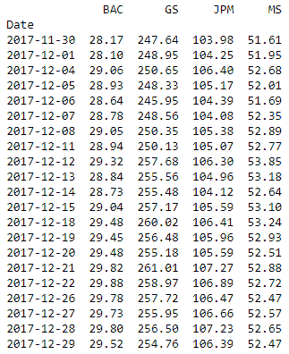
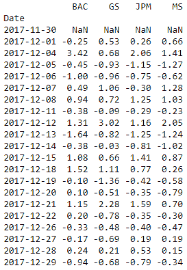
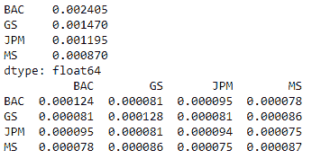
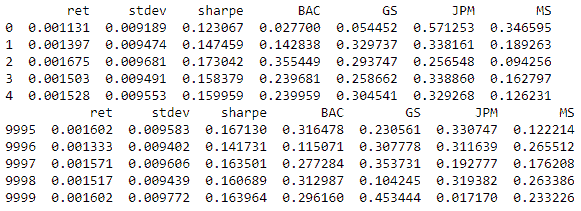
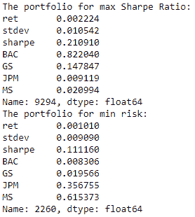
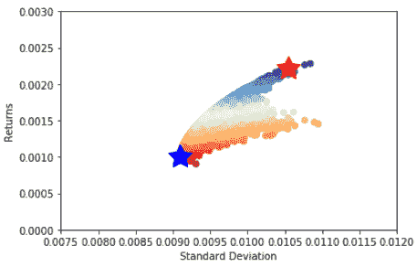

# 基于蒙特卡罗模拟的投资组合优化

> 原文：<https://blog.quantinsti.com/portfolio-optimization-maximum-return-risk-ratio-python/>

由[曼德普·考尔](https://www.linkedin.com/in/mandeep-kaur-6b5313104/)

在本系列的[前一篇博客](/portfolio-analysis-calculating-risk-returns/)中，我们看到了如何计算一个投资组合的均值和风险(或标准差)，该投资组合包含“ **n** ”股票数量，每只股票“ **i** ”权重为“ **w <sub>i</sub>** ”。

在这篇博客中，我们将看到如何通过改变这些权重来进行[投资组合优化](/portfolio-optimization-methods/)。所谓投资组合优化，我们是指根据投资者的要求，得到满足三个条件中任何一个的投资组合。

### ****投资组合优化的条件****

1.  在期望的预期回报水平下风险最小的投资组合。
2.  在期望的风险水平(以标准差或方差衡量的风险)下给出最大预期回报的投资组合。
3.  具有最大风险回报率(或[夏普比率](/sharpe-ratio-applications-algorithmic-trading/))的投资组合。

### ****年收益率和标准差****

为了简化我们在这篇博客中的分析，我们将处理每日回报和标准差，并将只考虑 1 个月的[股票数据](/basic-operations-stock-data-using-python/)(2017 年 12 月)。然而，在实践中，我们使用年度回报和标准差。将日收益和标准差转换为年收益的公式如下所示(假设一年中有 252 个交易日):

**年收益率=日收益率* 252** **年标准差=日标准差* 252**

让我们考虑一个由银行/金融服务部门的四只股票组成的投资组合，即:美国银行(Bank of America)、高盛(Goldman Sachs)、摩根大通(JP Morgan Chase & Co)(JPM)和摩根士丹利(mor gan Stanley)(MS)。

首先，我们将为所有四只股票分配随机权重，保持权重之和为 1。我们将像在之前的博客中一样计算投资组合的回报率和标准差，并记录下来。然后，我们将对我们的投资组合进行蒙特卡洛模拟，以获得股票的最佳权重。我们将使用 [python](/python-trading/) 来演示如何实现投资组合优化。在进入一步一步的流程之前，让我们快速看一下[蒙特卡洛模拟](/monte-carlo-simulation/)。

### ****蒙特卡洛模拟****

这种模拟广泛用于投资组合优化。在本次模拟中，我们将为股票分配随机权重。需要记住的重要一点是，权重的总和应该始终为 1。在这些权重的每个特定组合中，我们将计算投资组合的回报和标准差，并保存它。然后，我们将改变权重，分配一些随机值，并重复上述程序。

迭代的次数取决于交易者愿意接受的误差。迭代次数越多，优化的精度就越高，但代价是计算和时间。出于这个博客的目的，我们将把自己限制在 10000 次这样的迭代。在这 10000 个回报和相应标准差的结果中，我们可以通过识别满足上述 3 个条件中任何一个的投资组合来实现投资组合优化。

### ****Python 中的投资组合优化过程****

让我们从导入相关的[库](/python-trading-library/)并获取 2017 年 12 月的股票数据开始。

```
*#Import relevant libraries*
import pandas as pd
import numpy as np
import pandas_datareader.data as web
import matplotlib.pyplot as plt
```

```
*#Fetch data from yahoo and save under DataFrame named 'data'*
stock = ['BAC', 'GS', 'JPM', 'MS']
data = web.DataReader(stock,data_source="yahoo",start='12/01/2017',end='12/31/2017')['Adj Close']
```

```
*#Arrange the data in ascending order*
data=data.iloc[::-1]
print (data.round(2))
```

数据如下所示:

<figure class="kg-card kg-image-card"></figure>

然后，我们将这些股票价格转换成收益，并将其保存在名称' **stock_ret** 下。

```
*#Compute stock returns and print the returns in percentage format*
stock_ret = data.pct_change()
print (stock_ret.round(4)*100)
```

<figure class="kg-card kg-image-card"></figure>

我们现在将计算所有股票的平均回报和协方差矩阵。

```
*#Calculate mean returns and covariances of all four the stocks*
mean_returns = stock_ret.mean()
cov_matrix = stock_ret.cov()
print (mean_returns)
print (cov_matrix)
```

<figure class="kg-card kg-image-card"></figure>

让我们定义一个数组来保存每次迭代的结果。该数组将保存迭代中每一步的回报、标准差、[夏普比率](/sharpe-ratio-applications-algorithmic-trading/)和权重。我们将定义一个最初包含全零的结果数组，并将模拟结果保存在该数组中。数组中的列数是 7，用于保存投资组合回报、标准差、夏普比率和所有股票的权重。列的数量将随着[投资组合](/controlling-intraday-risk-profile-10-jan-2017/)中股票的数量而变化，因为我们必须存储所有股票的权重。这就是我们在定义数组时使用“len 函数”的原因。数组中的行数等于迭代次数。

```
*#Set the number of iterations to 10000 and define an array to hold the simulation results; initially set to all zeros*
num_iterations = 10000
simulation_res = np.zeros((4+len(stock)-1,num_iterations))
```

现在让我们继续迭代。

```
for *i* in range(num_iterations):
*#Select random weights and normalize to set the sum to 1*
        weights = np.array(np.random.random(4))
        weights /= np.sum(weights)
```

```
*#Calculate the return and standard deviation for every step*
        portfolio_return = np.sum(mean_returns * weights)
        portfolio_std_dev = np.sqrt(np.dot(weights.T,np.dot(cov_matrix, weights)))
```

```
*#Store all the results in a defined array*
        simulation_res[0,i] = portfolio_return
        simulation_res[1,i] = portfolio_std_dev
```

```
*#Calculate Sharpe ratio and store it in the array*
        simulation_res[2,i] = simulation_res[0,i] / simulation_res[1,i]
```

```
*#Save the weights in the array*
        for j in range(len(weights)):
                simulation_res[j+3,i] = weights[j]
```

然后，我们将输出保存在“ **[熊猫](/tick-tick-ohlc-data-pandas-tutorial/)数据帧** ”中，以便于分析和绘制数据。

```
sim_frame = pd.DataFrame(simulation_res.T,columns=['ret','stdev','sharpe',stock[0],stock[1],stock[2],stock[3]])
print (sim_frame.head())
print (sim_frame.tail())
```

<figure class="kg-card kg-image-card"></figure>

上面的输出显示了模拟结果的一些行。我们现在可以计算具有最大夏普比率或最小风险的投资组合。

```
*#Spot the position of the portfolio with highest Sharpe Ratio*
max_sharpe = sim_frame.iloc[sim_frame['sharpe'].idxmax()]
```

```
*#Spot the position of the portfolio with minimum Standard Deviation*
min_std = sim_frame.iloc[sim_frame['stdev'].idxmin()]
print ("The portfolio for max Sharpe Ratio:\n", max_sharpe)
print ("The portfolio for min risk:\n", min_std)
```

<figure class="kg-card kg-image-card"></figure>

可以使用 matplotlib 库绘制输出，因为相关点可以高亮显示，如下所示:

```
*#Create a scatter plot coloured by various Sharpe Ratios with standard deviation on the x-axis and returns on the y-axis*
plt.scatter(sim_frame.stdev,sim_frame.ret,c=sim_frame.sharpe,cmap='RdYlBu')
plt.xlabel('Standard Deviation')
plt.ylabel('Returns')
plt.ylim(0,.003)
plt.xlim(0.0075,0.012)
```

```
*#Plot a red star to highlight position of the portfolio with highest Sharpe Ratio*
plt.scatter(max_sharpe[1],max_sharpe[0],marker=(5,1,0),color='r',s=600)
```

```
*#Plot a blue star to highlight position of the portfolio with minimum Variance*
plt.scatter(min_std[1],min_std[0],marker=(5,1,0),color='b',s=600)
plt.show()
```

在输出中，红星显示具有最大夏普比率的投资组合，蓝星显示具有最小标准差的点。

<figure class="kg-card kg-image-card"></figure>

从上面的曲线中，我们可以根据上面讨论的三个条件中的任何一个得到所需的最优投资组合的组成。我们可以选择给定风险下回报最大的投资组合，或者给定回报下风险最小的投资组合，或者我们可以简单地选择夏普比率最大的投资组合。

### ****汇总****

为了总结我们的完整分析，我们首先下载了一个月的股票价格数据，并计算了所有股票的平均回报和协方差矩阵(用于计算投资组合的标准偏差)。然后，我们通过随机选择投资组合的权重，运行蒙特卡罗模拟来计算投资组合的风险和回报。然后，我们根据夏普比率或其他条件确定最佳投资组合。

### ****下一步**T3】**

[我们的下一篇博客](/portfolio-analysis-performance-measurement-evaluation/)涵盖了投资组合绩效评估和投资组合绩效衡量的各个方面。它从为什么评估和测量是必要的开始。然后解释如何计算和分析投资组合在特定时期后产生的回报。

**更新**

**我们注意到一些用户在从雅虎和谷歌金融平台下载市场数据时面临挑战。如果您正在寻找市场数据的替代来源，您可以使用 [Quandl](https://www.quandl.com/) 来获得相同的数据。**

****免责声明:**股票市场的所有投资和交易都涉及风险。在金融市场进行交易的任何决定，包括股票或期权或其他金融工具的交易，都是个人决定，只能在彻底研究后做出，包括个人风险和财务评估以及在您认为必要的范围内寻求专业帮助。本文提到的交易策略或相关信息仅供参考。**

### ****下载 Python 代码****

*   使用蒙特卡罗模拟的投资组合优化- Python 代码