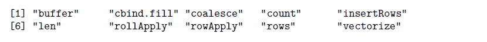
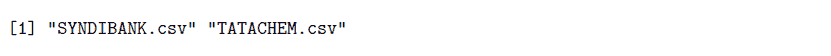
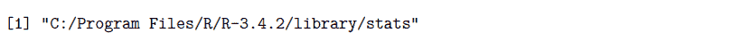
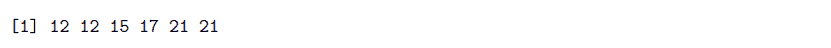
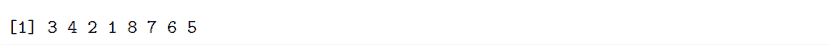
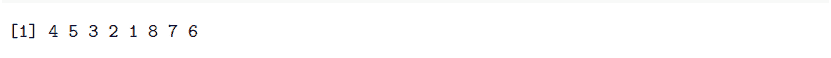

# r 每周简报第 14 卷

> 原文：<https://blog.quantinsti.com/r-weekly-bulletin-vol-xiv/>


本周的 R 公告涵盖了一些列出函数、列出文件的有趣方法，并举例说明了双冒号操作符的使用。希望你喜欢这个 R 周刊。享受阅读！

### 快捷键

1.  新建文档- Ctrl+Shift+N
2.  关闭活动文档- Ctrl+W
3.  关闭所有打开的文档- Ctrl+Shift+W

### 解决问题的想法

#### 如何列出 R 包中的函数

我们可以通过使用“jwutil”s 包来查看特定 R 包中的函数。安装软件包并使用软件包中的 lsf 函数。该函数的语法如下所示:

lsf(包装)

其中 pkg 是包含包名的字符串。

该函数返回给定包中函数名的字符向量。

**举例:**

```
library(jwutil)
library(rowr)
lsf("rowr")
```



#### 如何列出带有特定扩展名的文件

要列出具有特定扩展名的文件，可以使用 list.files 函数中的 pattern 参数。例如，要列出 CSV 文件，请使用以下语法:

**举例:**

```
# This will list all the csv files present in the current working directory.
# To list files in any other folder, you need to provide the folder path.

files = list.files(pattern = "\\.csv$")
# $ at the end means that this is end of the string.
# Adding \. ensures that you match only files with extension .csv

list.files(path = "C:/Users/MyFolder", pattern = "\\.csv$")
```



#### 使用双冒号运算符

双冒号运算符用于访问命名空间中导出的变量。语法如下所示:

pkg::名称

其中 pkg 是包名符号或文字字符串。name 参数是变量名符号或文字字符串。

如果有名称空间，表达式 pkg::name 将返回从包中导出的变量的值。如果该包在调用之前尚未加载，则它将被加载。当我们有来自不同包的同名函数时，使用双冒号操作符是有好处的。在这种情况下，库的加载顺序很重要。

要查看这些冒号操作符的帮助文档，您可以在 R -？::'或帮助(":::")

**举例:**

```
library("dplyr")

first = c(1:6)
second = c(3:9)

dplyr::intersect(first, second)
[1] 3 4 5 6
base::intersect(first, second)
[1] 3 4 5 6
```

在这个例子中，我们有两个同名的函数，但是来自不同的 R 包。在某些情况下，同名函数会产生不同的结果。通过使用双冒号操作符指定各自的包名，R 知道在哪个包中查找该函数。

### 功能去神秘化

#### path.package 函数

path.package 函数返回找到给定包的位置的路径。如果没有提到这个包，那么这个函数将返回所有当前附加包的路径。该函数的语法如下所示:

path.package(包，安静=假)

quiet 参数采用默认值 False。如果将此参数更改为 True，那么如果参数中指定的包没有附加，它将抛出警告；如果没有附加，它将给出错误。

**举例:**

```
path.package("stats")
```



#### fill.na 函数

有不同的 R 包具有填充 NA 值的功能。fill.na 函数是 mefa 包的一部分，它将 na 值替换为同一列中它们上面最近的值。该函数的语法如下所示:

fill.na(x)

其中，x 可以是向量、矩阵或数据帧。

**举例:**

```
library(mefa)
x = c(12,NA,15,17,21,NA)
fill.na(x)
```



#### 等级函数

rank 函数返回向量中值的样本等级。可以用几种方式处理平局(即相等的值)和缺失值。

rank(x，na.last = TRUE，ties.method = c("平均"，"第一"，"随机"，"最大"，"最小"))

其中，x:数字、复数、字符或逻辑向量 na.last:用于控制 NAs 的处理。如果为真，则数据中缺失的值被放在最后；如果为假，则放在第一位；如果 NA，它们被移除；如果“keep ”,则它们与秩 NA ties 一起保存。方法:指定如何处理 ties 的字符串

**例子:**

```
x = c(3, 5, 1, -4, NA, Inf, 90, 43)
rank(x)
```



```
rank(x, na.last = FALSE)
```



### 下一步

使用 RExcel 在 Excel 中实现 R 函数的分步教程。了解如何使用 RExcel 在 R 和 Excel 之间无缝传输数据。[点击这里](https://blog.quantinsti.com/rexcel-tutorial-using-r-excel/)立即阅读。