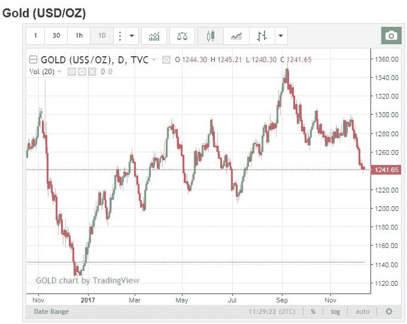

# 从商品分析师到算法交易员

> 原文：<https://blog.quantinsti.com/commodity-analyst-algorithmic-trader/>

管理商品研究工作涉及对商品价格波动的日常理解和绘图。考虑到研究分析师每天获取和管理的数据，很有可能商品分析师要么已经是交易者，要么他很想开始交易。几年前，大宗商品交易并不多见。今天的情况完全不同；在印度总共有 19 个以商品为中心的交易所，我们看到商品交易的大幅增长。当考虑商品时，价格波动可能不剧烈，但是考虑能够将日内交易应用于同样的商品。如果你看一下代表黄金价格波动的图表，你会观察到每小时微小的价格变化和更长时间的大幅度变化。考虑一下，能够利用这些微小的波动并为自己赚钱。

来源:http://www.moneycontrol.com/commodity/gold-price.html

需要回答的问题是，你如何将这种价格变化货币化？你想过通过 Algos 进行交易吗？回答“是”意味着你知道技术要求。如果答案是否定的，让我们先带你了解算法交易的基础知识。

#### **什么是 Algo 交易？**

算法交易(自动化交易、黑箱交易或简单的算法交易)是使用计算机的过程，计算机被编程为遵循一组定义的指令进行交易，以便以人类交易者不可能的速度和频率产生利润。

#### 【Algo 交易是如何运作的？

自动化或算法交易是利用计算机程序生成交易信号、发送订单和管理投资组合。算法使用复杂的电子市场/平台，以类似于电子交易的方式进行交易。不同之处在于，在算法交易中，关于成交量或规模、时机和价格的决策是由算法决定的。

高频交易(HFT)是一种特殊的算法交易，其特点是持仓时间异常短暂，响应时间低，一天内交易量大。写算法是为了利用出现在极短时间内的交易机会，短至毫秒或微秒。每笔交易的保证金很小，通过高速和大量交易来弥补。

#### 为什么选择算法交易？

考虑能够通过自动化买卖过程将你的损失降到最低。交易的准确性和速度是增加的流形，反过来增加你的利润率。你的舒适度提高了，因为你不用担心睡觉时交易价格的下跌或暴涨。您可以根据历史数据对您的策略进行回溯测试，以提高安全性，从而坚持更好的风险管理。所有这些都有一个额外的优势，那就是在交易时，以最快的速度控制情绪。你所需要做的就是将它们自动化。

这里有一个例子，一个来自商品市场的人通过学习算法交易来利用技术。Vippinraj 先生目前担任 Reliance Commodities Limited 的南方区域负责人，此前他在 Motilal Oswal 的商品部门工作。

当他选择参加 QuantInsti 的算法交易管理课程时，他意识到了市场的功能，并获得了很强的交易能力。请继续阅读，了解更多关于他的经历。

### **我们与 Vippinraj 的对话**

> #### What is your educational/professional background? How long have you been engaged in trading?

我的职业生涯始于国际市场。我从 2001 年开始在全球市场交易。对金融市场的热情和激情让我接受了同一领域的一份 T2 工作，这进一步磨练了我的技术和基本面分析技能。

使用各种软件，如彭博、汤森路透、eSignal、Telequote、MT4 等。帮助我理解了国内和全球市场的细微差别。

我获得了金融 MBA 学位我得到了 motil al Oswal-Commodities 的一份工作，这给了我一个深入了解国内市场的机会。我在过去的 11 年里一直在 Reliance Commodities 工作，目前作为区域主管管理南印度(商品&货币部门)。凭借在金融市场 14 年的总体经验，我有机会在不同领域工作，如研究、业务管理和开发、客户管理、咨询服务、实物处置服务等。

> #### **How did you become interested in algorithm trading & Why Quantinsti** **? What's your experience so far?**

我在周围看到的当前趋势和革命性机器交易实践的发展和变化激励我参加算法交易的培训。贸易行业的朋友向我建议 [QuantInsti](https://www.quantinsti.com/) ,我自发地联系他们以了解更多细节。

在与 QuantInsti 的人交谈后，我意识到这是学习算法交易的最好地方。我接受了尊敬的 QuantInsti 教师的讲课，他们反过来激励我完成这门课程。他们总是很乐意回答我的问题，并随时提供帮助。

对于一个有市场知识但不会编程的人来说，学习算法交易有点困难。然而，正如他们所说的，当你有热情和激情去实现你的目标时，没有什么是不可能的。因此，在 QuantInsti 杰出教师的帮助下，我克服了对编码的恐惧。在完成 QuantInsti 的 EPAT培训后，我现在已经获得了使用 Python、R 和 Matlab 编写策略的知识和信心。

到目前为止，这是一个伟大的旅程，我完全喜欢它。

> #### **How did EPAT change your trading practice?**

手动交易有几个缺点，如情绪交易、基于技术指标的策略和偏见，所有这些都会导致不当的交易决策，并导致错误，进而影响交易业绩。

学习 algo 交易帮助我获得了信心，我可以用我的技能来准备策略，分析市场并获得最好的结果。使用 quants 对策略进行回溯测试有助于理解交易系统的有效性和准确性。

> #### **What do you think of EPAT's courses? How does it add value to your career?**

由 QuantInsti 设计的 EPAT是最好的课程之一，它包括从交易基础到自动化技术的每个细节。该课程的课程设置很详细，来自全球各地的教师帮助我们获得了理论和实践方法的知识。这个在线门户网站用户友好，帮助我们与世界各地的其他爱好者互动。

有了 EPAT，我建立交易平台的梦想变得简单了。现在，我可以随时建立一个自动化交易平台，提高对客户的服务质量。这对我的职业生涯绝对是一个福音，它使我能够从整体上看待交易系统，并在使用自动化交易方法时做出公正的决定。

> #### What do you have to say about the employment opportunities offered by Quantinsti **?**

到目前为止，QuantInsti 的安置团队一直非常积极地为我提供各种资料。

> #### Would you recommend QuantInsti to others who wish to engage in algorithm trading?

是的，当然，我会推荐 QuantInsti 给那些热衷于学习和成为 Quant 的人。事实上，我已经推荐了一些来自贸易行业的同事和朋友参加 EPAT，因为这将帮助他们更上一层楼。

### **下一步**

你是否热衷于学习算法交易的各个方面来提高你现有的技能或者自己开始交易？查看算法交易(EPAT)中的[执行程序。该课程涵盖了统计学&计量经济学、金融计算&技术和算法&量化交易等培训模块。EPAT 让你具备成为成功交易者所需的技能。现在注册，开始你的算法交易](https://www.quantinsti.com/epat/)生涯[。](https://blog.quantinsti.com/making-career-algorithmic-trading/)