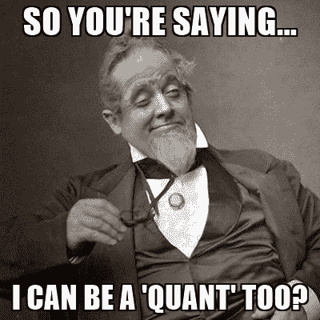
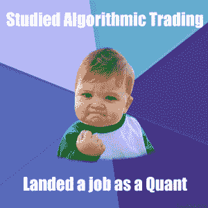

# 关于算法交易，你不知道的 7 件事

> 原文：<https://blog.quantinsti.com/7-things-you-didnt-know-about-algorithmic-trading/>

由[维拉伊·巴加](https://www.linkedin.com/in/virajbhagat/)

*比超速交易更快* *能够在单个实例中飞跃障碍* *比手动交易更强* *它是鸟吗？* *是飞机吗？* *不！* *是**算法交易**！*

有一些信仰，不信仰和谣言阻止人们充分利用算法交易，现在是每个人都意识到它的真正潜力的时候了。因此，我们带给你 7 件事，我们相信每个人都应该知道算法交易。

快速、可靠和无情的算法交易席卷了世界，它是交易进化的下一步，是明天的交易技术。

**事实:** *根据《2016-2020 年全球算法交易市场报告》，算法交易市场正以 10.3%的 CAGR 增长。据《经济时报》报道，截至今天，全球约 75%的交易是自动化的，算法交易占了其中的很大一部分。*

一次又一次，Algo Trading 不得不证明自己的勇气，在全球交易所的交易中赢得一席之地，并清除许多障碍，以获得世界的认可。这在很大程度上是因为人们不愿意轻易接受新技术，尤其是那些可以使工作自动化并消除人力使用的技术。

### 你知道吗！Algo 交易职业培训没有年龄限制

人们经常削弱自己的表现能力，经常低估自己，怀疑自己是否能在以后的生活中交易。一些人说他们老了，或者他们不能应付技术。但是，如果你不愿意打破老式的手工交易方法，这些只是原因。

如果有人真的想取得成就，那么他们需要有意愿、能力、动力和必要的技能，无论如何都要勇往直前。不要让你的年龄或职业阻止你交易！有很多这样的例子，其中一个成功的故事是这个 40 岁的量化分析师[克服一切困难取得成功。他的故事激励着**勇往直前**！](https://blog.quantinsti.com/can-i-be-a-quant-trader-in-my-40s/)

### 你知道 Algo 专业人士有很多职业和工作机会吗？

每个角色对公司的成功都至关重要。像算法经销商、分析师、数据科学家、战略家等职位有各种各样的工作机会。

程序员开始从事算法交易，并成功实现了职业生涯中的一些里程碑。高频交易工作通常会有更高的薪水。许多独立交易员建立了自己的**算法交易平台**，并从中获益。点击这里，了解如何建立自己的交易平台[。](https://blog.quantinsti.com/setting-up-an-algo-trading-desk/)

如今，创业已经成为一种时尚，商人都在争相建立自己的公司，这已经为他们中的许多人带来了成功。一个相关的例子是来自两个不同国家的金融专家德里克和马克西姆，他们如今掌管着一家成功的企业。

### 这需要时间。像酒一样，随着时间的推移越来越好

在几个月内学习算法交易速成课程是不明智的。掌握算法交易需要多年的实践和经验，你的技能很重要，遵循结构化的方法是必要的，这是像我们这样的机构提供的。与以前通过调用利率、经纪人依赖性和结转系统进行交易的做法不同，今天有了开放系统、在线交易、衍生品和算法。再加上监管机构加强监管，交易变得迅速且竞争激烈。

随着加密货币、区块链、人工智能、机器学习等新技术的出现，交易将变得更加富有成效和令人惊讶。谁知道它会把我们引向何方。毕竟只是时间问题。

### **个人交易者可以做算法交易**

所有人都有平等的机会赚钱或赔钱。由于缺乏方法、不切实际的期望和缺乏经验，一个人经常会赔钱。将大公司和对冲基金与个人交易者进行比较是不公平的，因为投资和回报的性质各不相同，差异高达数百万。大公司有强大的资金支持，在最新技术和其他资源上有很高的支出能力。

现实情况是，任何拥有市场知识、经验和理解的人都可以进行算法交易，即使他们与任何公司都没有关联。许多交易者求助于算法交易，T2 有无数的成功故事，激励着许多其他人。与其盲目相信或假设只有大公司才能做 Algo 交易，不如了解事实！你不同意吗？

### **算法交易和高频交易不一样**

**算法交易**是一种自动化的交易系统，它使用先进的数学模型和公式、预编程的交易指令和复杂的算法来进行高速决策和交易，以便在金融市场上执行大订单。在这里，交易是基于定义的标准进行的。它们被分割成更小的部分，因此股票或资产的价格不会受到显著影响。因此，它控制执行成本和市场风险。

**高频交易(HFT)** 是指利用专有算法分析多个市场，并根据市场情况执行大量订单的计算机化交易。它是算法交易的极端版本，以高速度、高换手率和高订单交易比为特征，利用高频金融数据和电子交易工具。在市场**高波动**时期，HFT 利用了短暂的机会。引进这项技术需要巨额投资。

简而言之，HFT 是算法交易的一个子集。

### **时间和延迟是决定因素**

时间和潜伏意味着成功和失败，盈利和亏损。交易是一个时间敏感的生态系统，但距离同样重要。算法交易有助于比竞争对手更快地对市场事件做出反应，从而提高交易的盈利能力。

托管就是这样一种解决方案。交易者可以将他们的服务器与交易所放在一起，即交易引擎在物理上靠近交易所，甚至与计算机服务器所在的交易所在同一栋大楼里。这大大减少了时间和距离方面的疑虑。几个路由器，交换机，电缆和协议的变化是为了减少延迟，而 R&D 对新技术正在进行，如无线数据传输，低数据速率等。

### 谁说交易需要巨额资金？

不是交易的数量，而是你交易的方式，你使用的策略，你的经验和技巧。很可能，这通常不是你使用的设备或你升级机器的费用。有了适当的技能、知识和工具，以及正确的指导，您可以获得最适合您需求的设备，而不是在不必要的、利用率低的昂贵设备上大肆花费。

* * *

### **下一步**

交易展示了未来几年一些有希望的潜在增长。围绕 Algo Trading 出现了各种业务，并被广大交易者群体所接受。你可能有很多关于算法交易的问题。我们都是。

所需要的是有人倾听你的想法和主意，解答你的疑问，并根据你的目的和目标为你指明正确的道路。了解[算法交易](https://www.quantinsti.com/)的各个方面，加入我们强大的领先校友基地，并与我们的全球教师联系。导师是经验的最佳来源，也是获得诚实反馈的[校友](https://www.quantinsti.com/alumni/)。

人们经常通过让他们的算法为他们说话来进行交易。为什么不能？一些成功交易者的故事证实了这样一个事实:通过参加一些精彩的课程，你可以获得交易的技能和知识。算法交易 [(EPAT )](https://www.quantinsti.com/epat/) 的[高管课程通过统计&计量经济学、金融计算&技术和算法&量化交易等培训模块，让你具备成为成功交易者所需的技能。](https://www.quantinsti.com/epat/)

<small>*免责声明:本文提供的所有数据和信息仅供参考。QuantInsti 对本文中任何信息的准确性、完整性、现时性、适用性或有效性不做任何陈述，也不对这些信息中的任何错误、遗漏或延迟或因其显示或使用而导致的任何损失、伤害或损害负责。所有信息均按原样提供。*</small>