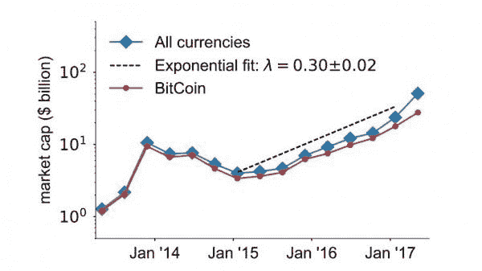
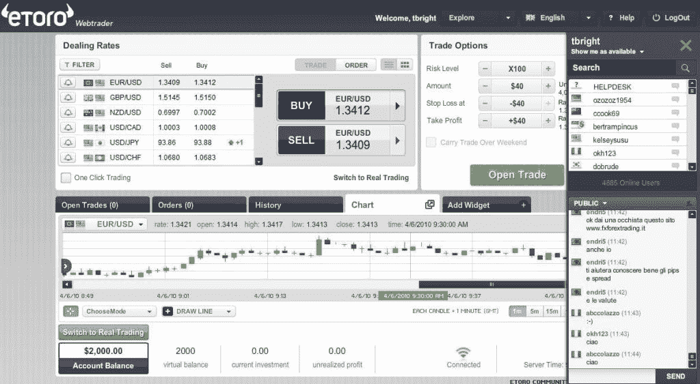
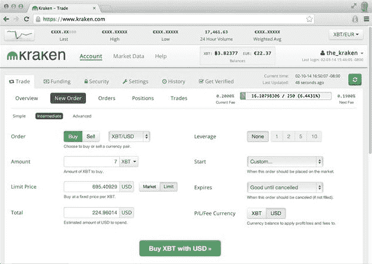
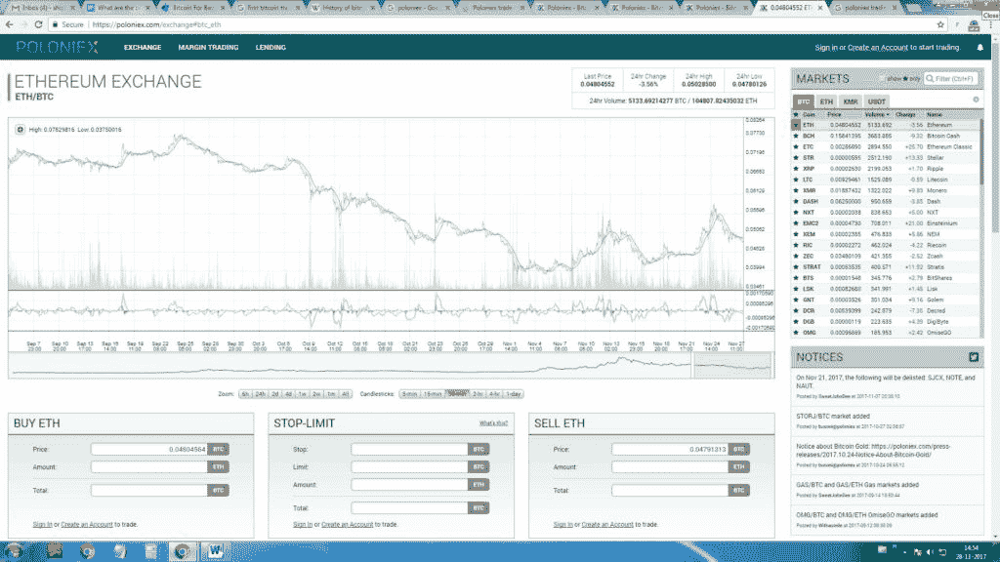
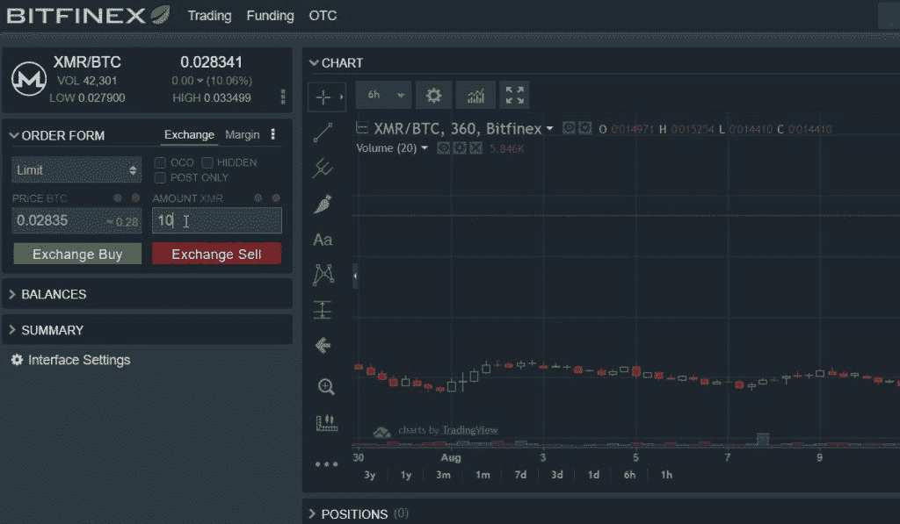
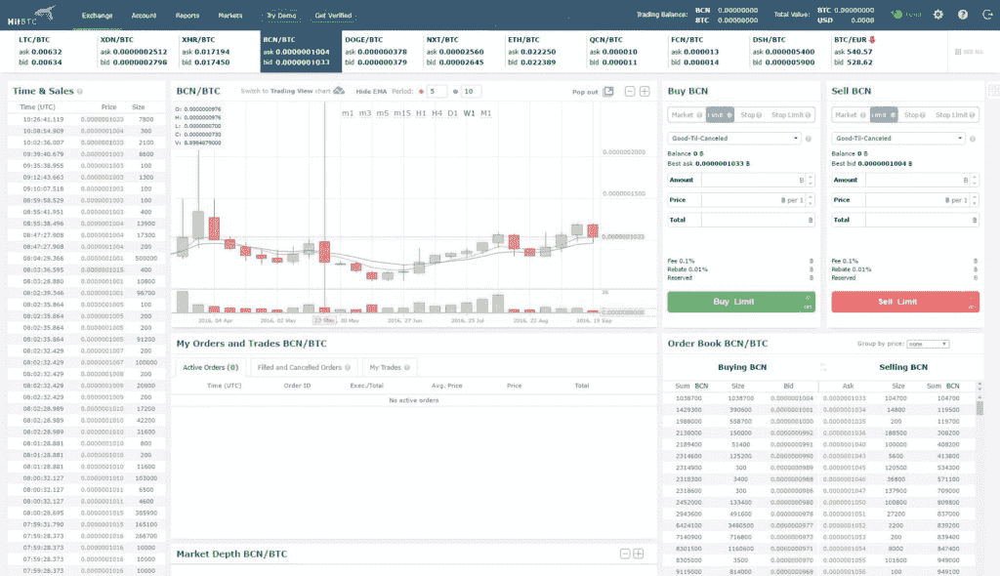
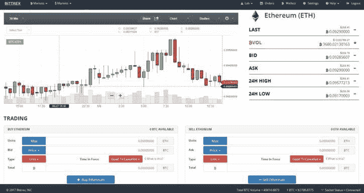
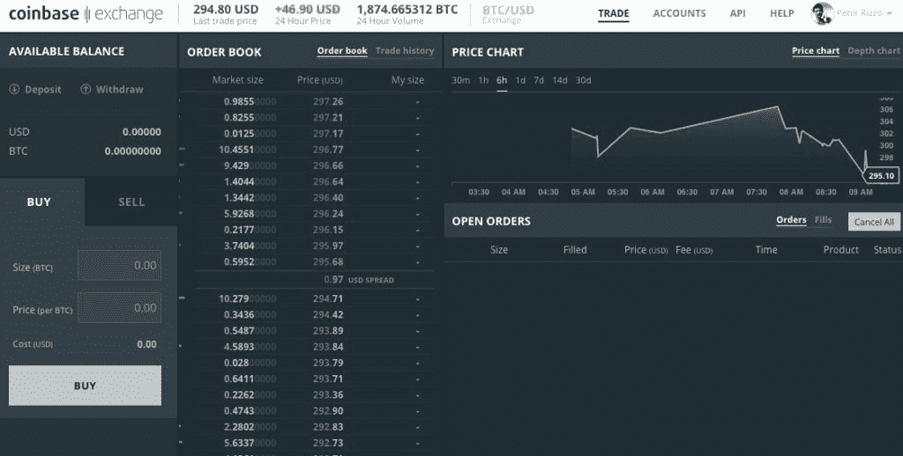
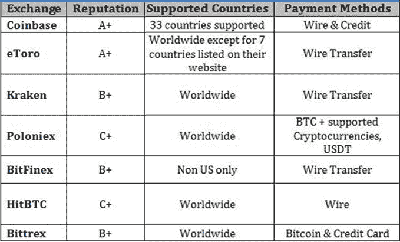

# 9 大加密货币交易平台

> 原文：<https://blog.quantinsti.com/top-9-cryptocurrency-trading-platforms/>

作者[希普拉·特里帕蒂](https://www.linkedin.com/in/shipra-tripathi-5bb84520/)

在我们进入中心主题之前，详细阐述一下加密货币的概念和区块链效应。正如 Daniel Gasteiger 在 TEDxLausanne 的“区块链去神秘化”主题中所说，“区块链只不过是一个数据库，一个公共的数据库，因此不属于任何人。分布式，因此不是集中存储在一台计算机上，而是存储在世界各地的许多计算机上。不断同步以保持交易最新，并通过加密技术进行整体保护，以防止篡改和黑客攻击。这四个特点使这项技术与众不同。丹尼尔对加密货币概念的团结的强烈信念促使他离开他在金融服务领域 20 年的全面职业生涯，专注于区块链概念。想了解更多关于如何制定[加密货币策略](https://quantra.quantinsti.com/course/crypto-trading-strategies-advanced)的信息？阅读我们关于使用数据提取技术的[加密货币交易策略的博客。](https://blog.quantinsti.com/cryptocurrencies-data-strategy/)

### **加密货币交易为什么受欢迎？**

*   可以在全球范围内交易的通用货币的概念，其价值和价格每天都在飙升，这是交易者最赚钱的方面。在最初阶段，1 比特币的交易价格是 0.003 美元，比 1 美分还便宜！这种货币迅速升值，价值数百美元。截至今日，1 比特币等于 9881 美元。

来源:[https://www . technology review . com/s/607947/the-cryptocurrency-market-is-growing-exponentially/](https://www.technologyreview.com/s/607947/the-cryptocurrency-market-is-growing-exponentially/)

*   加密货币基于分布式平台上的知识共享。所有人都可以看到整个交易历史。一个区块链是一个事务线程。一个单元或一个块存储许多事务。块的大小是 1MB，通常存储大约 1000 到 2000 个事务。输入的数据不能被更改，也不能被删除，从而使系统完全透明和可信。工作模型的整个资金流动超出了控制税率、信贷使用和市场货币供应的传统做法。
*   那些相信加密货币的人声称它是人类历史上的下一件大事。加密货币不受任何政府机构的控制，这一事实吸引了大量眼球。想象一种不受流动性、通胀和政府补贴控制的通用货币。这将意味着从事加密货币的经济体的商业活动将被完全私有化。
*   严格来说，在这个领域有太多的东西需要测试和验证，然而加密货币是迄今为止被认为最有利可图的货币形式。大多数国家都没有禁止它，但是大多数国家都坚持严格的不管制和不介入的立场。同理，加密货币交易者总是在寻找最可靠的经纪和 [加密货币交易](https://quantra.quantinsti.com/course/crypto-trading-strategies-intermediate)平台。

### **9 最好的** **加密货币** **交易所**

#### [**eToro**](https://www.etoro.com/)

eToro 是一个社交交易和多资产经纪平台，在塞浦路斯、以色列和英国设有办事处。该平台允许用户观看他人的交易策略并复制它们。该公司的产品 OpenBook 和 WebTraders 允许交易者相互学习。这些功能对用户友好，使用简单，而[费用](https://www.etoro.com/en/customer-service/fees/)取决于市场动态。

#### [**北海巨妖**](https://www.kraken.com/)

**北海巨妖的创新功能声称是为了迎合快速执行、出色支持和高安全性的需求。该组织总部设在美国旧金山。北海巨妖在全球范围内运行，对于不符合条件的国家进行了预验证。该平台接受加密货币和法定货币，交易通过电汇完成，应在银行完成。平台不接受借记卡、信用卡和现金。**

****

**费用低至 0%，取决于你的交易量。计算费用时考虑过去 30 天的交易量。**

#### **[**普罗尼克斯**T3】](https://poloniex.com/)**

**Poloniex 是一家总部位于美国的资产交易所。在 Poloniex 上交易是安全的，交易者可以探索新的和流行的硬币进行投机。它为主要加密资产提供大量保证金交易和贷款服务。据报道，该网站交易的最大用户群来自俄罗斯(6.06%)和美国(24.84%)。该网站的一个与众不同的因素是它不支持法定货币。**

**Poloniex 作为加密货币交易平台很受欢迎，用户寻求转换加密货币、保证金交易和贷款。服务遍及全球。费用取决于制造商和接受者，制造商的名字已经列在清单上，接受者是下订单的人。做市商之所以如此命名，是因为他们维持着市场的流动性。每隔 24 小时，该平台根据过去 30 天市场和接受者之间的交易量计算费用，并动态更新费用。**

****

#### **[**BitFinex**](https://www.bitfinex.com/)**

**Bitfinex，一个流行的加密货币交易平台，非常适合交易大多数加密货币，如比特币、Bcash、以太坊、Iota、NEO、莱特币、EOS、Dash、Ripple、比特币黄金、Monero、Zcash、以太坊经典、OmiseGO、ETP、Santiment、Qtum、Eidoo、Streamr 和 Aventus。**

**BitFinex 既允许限价、市价、止损等传统订单，也允许 Iceberg、OCO 和 Post Only 等算法交易。**

**BitFinex 有三个不同用途的钱包，即。交易所、保证金和融资。费用与北海巨妖相同，交易是零费用还是少量费用取决于交易者在过去 30 天的交易活动。交易费分为“庄家”费和“庄家”费。**

****

#### **[**hit BTC**T3】](https://hitbtc.com/)**

**HitBTC 是一个全球交易平台，自 2013 年开始运营，支持多种货币形式。交易平台拥有交易数字资产、代币和 ico 的市场。**

**HitBTC 为每笔市场交易收取费用，同时允许您交易各种加密货币和法定货币，包括比特币、Dogecoin、莱特币、欧元、美元和一系列鲜为人知的加密货币。你可以点击查看费用详情[。](https://hitbtc.com/fees-and-limits)**

**该平台在想要测试代码的开发人员中很受欢迎，因为该平台也允许演示交易。**

****

#### **[**Bittrex**](https://bittrex.com/)**

**Bitrex 提供对新加密货币令牌的全面审查，并非常重视用户安全。因此被誉为具有良好安全模块的安全钱包。这个加密货币交易平台大量交易 Altcoin。这里列出了[平台的交易费用。区块链的最低交易费规定了存款和取款的费用。](https://bittrex.zendesk.com/hc/en-us/articles/115003684371)**

****

#### **[**位 X**](https://www.bitmex.com/) 位**

**BitMEX 是一家衍生品交易所，提供用比特币买卖的杠杆合约。这是一个加密货币交易平台，提供比特币衍生品交易。交易的衍生品是永续掉期合约，这是一种类似于传统期货合约的衍生产品。掉期合约像现货一样交易，跟踪基础资产。**

****

#### **[**比特币基地**](https://www.coinbase.com/)**

****比特币基地总部位于三藩市，是一个在线比特币交易平台，服务于美国、加拿大、欧洲、英国、澳大利亚和新加坡。每天在比特币基地上最多可以买到 150 美元和 150 英镑。比特币基地提供了非常高的限制。限额取决于您的帐户级别，这取决于您验证了多少信息。****

********

#### ****[**本地比特币**](https://localbitcoins.com/)****

****Localbitcoins 是一个人与人之间交易的门户，你可以在这里直接与卖家互动。在这个平台上，不同国家的人可以将本国货币兑换成比特币。该网站是为寻求更多隐私的临时交易者建议的。该网站使用托管系统，在卖家账户收到资金后进行比特币转账。在本地比特币上注册、购买和销售是完全免费的，而创建广告的本地比特币用户是收费的，如这里提到的。****

****所有受欢迎的比特币交易所及其特点的简明表格对比:****

******T2】******

****寻找更多关于如何开始的指导？阅读我们的博客，了解一位 EPAT 参与者是如何开始[加密货币交易的。](https://blog.quantinsti.com/getting-started-cryptocurrency-algorithmic-trading/)****

### ******下一步******

****如果你想学习一个简单的策略来从各种加密货币平台获取数据，你可以查看我们关于“[加密货币交易策略与数据提取技术](https://blog.quantinsti.com/cryptocurrencies-data-strategy/)”的帖子。该策略将帮助您使用 python 库以分钟的分辨率获取数据。****

*****免责声明:本文中提供的所有数据和信息仅供参考。QuantInsti 对本文中任何信息的准确性、完整性、现时性、适用性或有效性不做任何陈述，也不对这些信息中的任何错误、遗漏或延迟或因其显示或使用而导致的任何损失、伤害或损害承担任何责任。所有信息均按原样提供。*****