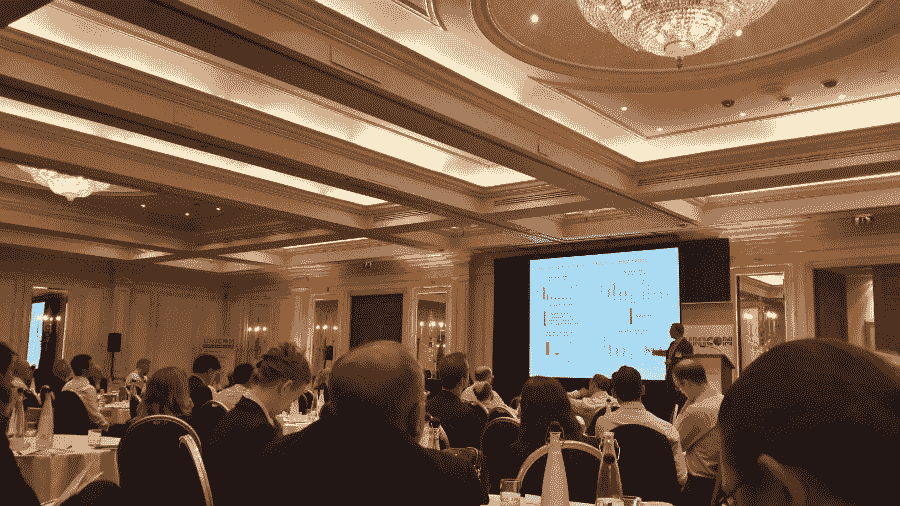
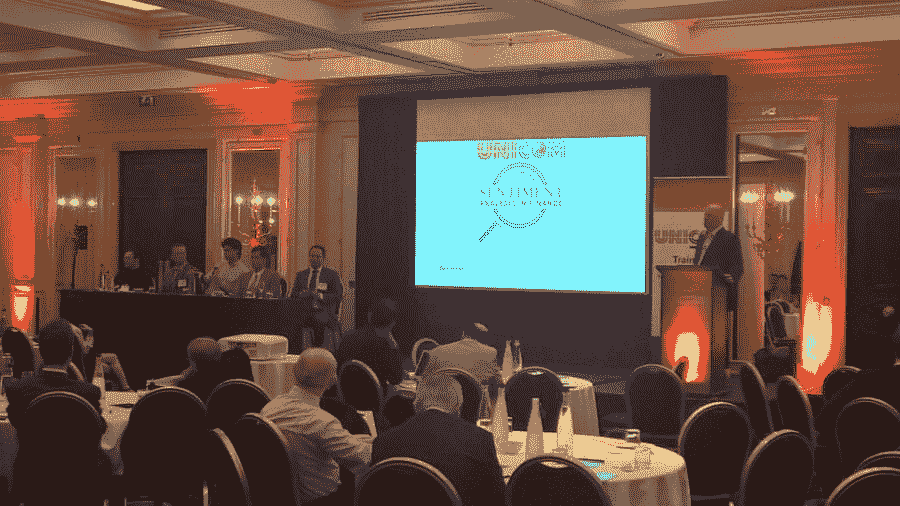

# 第五届金融应用行为模型和情绪分析年会

> 原文：<https://blog.quantinsti.com/5th-annual-conference-behavioural-models-sentiment-analysis-applied-to-finance/>

### 

**日期**:2015 年 7 月 15 - 16 日

**地点**:英国伦敦梅费尔千禧酒店

### **关于发布会**

情感分析已经发展成为一种应用机器学习并对新闻发布中表达的情感进行快速评估的技术。新闻(事件)推动市场，并被量化衡量。分析师和投资者消化金融新闻，他们的看法影响市场，推动股价。会议的目的是介绍这个快速发展领域的最新技术。

这是联通研习会有限公司举办的第五次会议，会议的主题是情绪分析在交易、资金管理和风险控制模型中的应用。这一领域的专家介绍了他们最近的研究成果、案例研究和技术概述。特别是算法交易的话题。这次会议的特点是纳入了社交媒体数据(推特、博客、谷歌趋势、在线搜索)；它们的可信度如何，它们如何影响市场情绪，多种资产类别的情绪分析。

### **会话标题**

*   第一场:金融情感分析的基础和技术
*   第二场:股票资产配置和风险控制中的情绪分析
*   第三场:社交媒体、微博、谷歌趋势
*   第四场会议:利用石油、能源、商品和股票的全球宏观经济

### **谁参加了 2014 年的会议**

*   对冲基金的量化团队
*   投资银行自营交易部门
*   投资基金的量化团队

### **扬声器**

加里·卡赞采夫，彭博；汤森路透的詹姆斯·坎塔雷拉和伊莱贾·德帕尔马；阿曼多·冈萨雷斯和彼得·哈菲兹，拉文帕克，高塔姆·米特拉，项羽和克里斯蒂亚诺·阿贝克斯·瓦莱，OptiRiskStephen Pulman，牛津大学/TheySay 有限公司；Deltix 公司的 Ilya Gorelik 福斯特商学院阿什·柯蒂斯；Ashok Banerjee，印度管理学院(IIM );麦格理的朱利亚诺·德罗西；Richard Peterson，MarketPsych DataDan diBartolomeo，Northfield 信息服务公司；东安格利亚大学诺里奇商学院 Raphael Markellos 赛义德·阿门，泰雷西亚人；Svetlana Borokova，阿姆斯特丹自由大学/荷兰中央银行；华威商学院阿德里安·莱奇福德；Rajib Ranjan Borah，伊拉克资本公司

### **会前和会后研讨会**

*   [**【行为金融:基础】&近期发展**](http://www.unicom.co.uk/eventdetail.php?epd=100) ，7 月 13 日
*   [**市场微观结构流动性&自动化交易**](http://www.unicom.co.uk/eventdetail.php?epd=92)7 月 14 日
*   [**情绪分类&利用新闻专线进行意见挖掘&微博(Twitter)**](http://www.unicom.co.uk/eventdetail.php?epd=94)7 月 17 日

**请联系**[**【info@unicom.co.uk】**T5】](mailto:info@unicom.co.uk)

### **会议费用&报名**

**最终用户组织:【2015 年 5 月 8 日后的标准价格:275 英镑+增值税**

**供应商&顾问:【2015 年 5 月 8 日后的标准价格:750 英镑+增值税**

### **特别促销优惠**

*   手册套装优惠

金融新闻分析手册(2011 年)和金融情绪分析手册(2015 年)

这两本手册的价格是 75 英镑+运费(16 英镑)。

链接:[https://optirisk-systems . com/publications/books/news-analytics-handbook/](https://optirisk-systems.com/publications/books/news-analytics-handbook/)

*   网络研讨会和会议幻灯片

来自**行为模型&情绪分析的所有网络研讨会和会议幻灯片:适用于财务**会议，295 英镑+增值税(@ 20%)。

*   行为模型和情绪分析:应用于金融——7 月 15 日日日& 16 日日

**行为模型&情绪分析:应用于财务**会议每位代表的价格为:275 英镑+增值税(@ 20%)。*(适用于物品 1 的所有买家。折扣代理价格为 195 英镑+增值税(@ 20%)*

链接:[http://conferences.unicom.co.uk/sentiment-analysis/](http://conferences.unicom.co.uk/sentiment-analysis/)

## **活动照片**

<figure class="kg-card kg-gallery-card kg-width-wide"></figure>