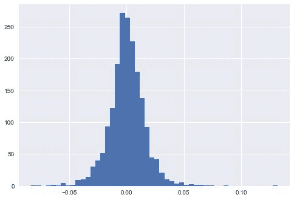
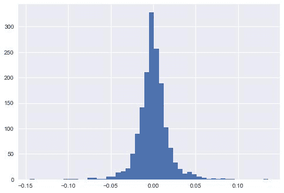
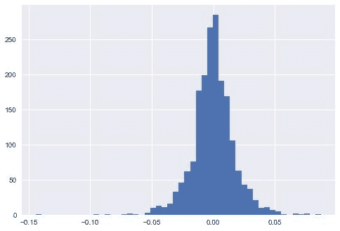
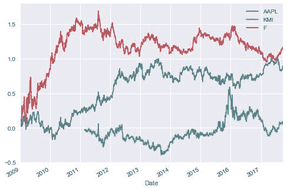

# Python 中的海龟交易

> 原文：<https://blog.quantinsti.com/turtle-trading-in-python/>

由[伊山沙阿](https://www.linkedin.com/in/ishan-shah-18393828/)

海龟交易系统是理查德·丹尼斯发明的，在 20 世纪 80 年代对交易者来说非常有效。但是事实证明，这个系统需要一些调整来反映新的市场情况，并且现在有效。也就是说，趋势仍在发生，这意味着有过多的交易机会。

海龟交易策略的核心是在 55 天突破时建仓。55 天突破是指价格超过过去 55 天的最高价或最低价。完整的策略更加复杂，但是在本文中，我用 Python 编写了策略的关键部分，并交易了苹果公司、Kinder Morgan 公司和福特汽车公司的股票。

* * *

### **Python 代码**

#### 步骤 1:导入必要的库

```
# To get closing price data 
from pandas_datareader import data as pdr 
import yfinance as yf 
yf.pdr_override() 

# Plotting graphs 
import matplotlib.pyplot as plt 
import seaborn 

# Data manipulation 
import numpy as np 
import pandas as pd
```

* * *

#### 第二步:定义一个函数来计算股票的策略表现

*   我们将把 Apple、Kinder Morgan 和 Ford Motor 的股票代码传递给这个函数。

```
def strategy_performance(stock_ticker):
```

*   从 yahoo finance 获取 stock_ticker 的数据

```
stock = pdr.get_data_yahoo(stock_ticker, start="2009-01-01", end="2017-10-01")
```

*   计算 5 天突破和平均值

计算过去 5 天的最高值、最低值和平均值，并存储在数据框架库存中。5 是要在回溯测试中优化的自由参数。熊猫滚动函数用于计算突破和平均值。

```
# 5-days high
 stock['high'] = stock.Close.shift(1).rolling(window=5).max()
 # 5-days low
 stock['low'] = stock.Close.shift(1).rolling(window=5).min()
 # 5-days mean
 stock['avg'] = stock.Close.shift(1).rolling(window=5).mean()
```

*   进入规则

当股票的收盘价高于过去 55 天的高点时，我们做多股票，当股票的收盘价低于过去 55 天的低点时，我们做空股票。

```
stock['long_entry'] = stock.Close > stock.high
stock['short_entry'] = stock.Close < stock.low
```

*   退出规则

如果股价超过过去 55 天的平均值，我们将退出头寸。

```
stock['long_exit'] = stock.Close < stock.avg
stock['short_exit'] = stock.Close > stock.avg
```

*   位置

我们现在将在一列中存储进入和退出信号。多头头寸由 1 表示，空头头寸由-1 表示，退出或无头寸由 0 表示。如果在一段时间内没有头寸，我们将使用 fillna 方法结转以前的头寸。

```
stock['positions_long'] = np.nan 
stock.loc[stock.long_entry,'positions_long']= 1 
stock.loc[stock.long_exit,'positions_long']= 0 

stock['positions_short'] = np.nan 
stock.loc[stock.short_entry,'positions_short']= -1 
stock.loc[stock.short_exit,'positions_short']= 0 

stock['Signal'] = stock.positions_long + stock.positions_short 

stock = stock.fillna(method='ffill')
```

*   战略回报

我们已经计算了股票的对数回报，并乘以信号(1，-1 或 0)得到策略回报。

```
daily_log_returns = np.log(stock.Close/stock.Close.shift(1)) 
 daily_log_returns = daily_log_returns * stock.Signal.shift(1) 

 # Plot the distribution of 'daily_log_returns' 
 print(stock_ticker)
 daily_log_returns.hist(bins=50) 
 plt.show() 
 return daily_log_returns.cumsum()
```

* * *

##### 每日日志回报直方图

苹果公司。



金德·摩根



福特汽车公司



* * *

#### 第三步:创建一个股票投资组合，计算每只股票的策略表现

```
portfolio = ['AAPL','KMI','F'] 
cum_daily_return = pd.DataFrame() 
for stock in portfolio: 
 cum_daily_return[stock] = strategy_performance(stock)

# Plot the cumulative daily returns 
print("Cumulative Daily Returns")
cum_daily_return.plot() 
# Show the plot 
plt.show()
```



* * *

#### **结论**

如果你想修改策略，那么你可以复制这段代码，这应该很简单。你可以在投资组合中增加更多的股票，并评估这些股票的策略表现。

结果的局限性之一是它不包括交易成本。理解上述策略包含大量风险也很重要。你根据其他市场参与者最近的买卖来买卖股票。

这篇关于 Python 中的[量化价值投资策略的文章](https://blog.quantinsti.com/quantitative-value-investing-strategy-python/ "Permalink to Quantitative Value Investing Strategy In Python")结合了价值和量化投资的最佳方面，并将它们应用于一种完全独特的方法来筛选投资股票。

* * *

*<small>更新——我们注意到，一些用户在从雅虎和谷歌金融平台下载市场数据时面临挑战。如果您正在寻找市场数据的替代来源，您可以使用 [Quandl](https://www.quandl.com/) 来获得相同的数据。</small>*

*<small>免责声明:股票市场的所有投资和交易都涉及风险。在金融市场进行交易的任何决定，包括股票或期权或其他金融工具的交易，都是个人决定，只能在彻底研究后做出，包括个人风险和财务评估以及在您认为必要的范围内寻求专业帮助。本文提到的交易策略或相关信息仅供参考。</small>T3】*

* * *

**文件下载中:**海龟交易- Python 代码