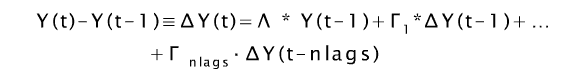
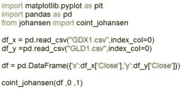
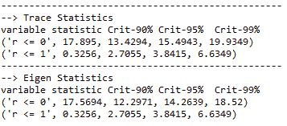

# Johansen 协整测试:学习如何用 Python 实现它

> 原文：<https://blog.quantinsti.com/johansen-test-cointegration-building-stationary-portfolio/>

由[德旺·辛格](https://www.linkedin.com/in/devang-singh-2402882b/)

在这篇博文中，您将了解 Johansen 协整测试的本质，并学习如何用 Python 实现它。另一个流行的协整检验是增强的 Dickey-Fuller (ADF)检验。ADF 试验有局限性，使用 Johansen 试验可以克服这些局限性。

ADF 检验可以用来检验两个时间序列之间的协整关系。Johansen 检验可用于检查最多 12 个时间序列之间的协整性。这意味着可以使用两个以上的时间序列创建资产的静态线性组合，然后可以使用均值回复策略进行交易，如 [Pairs Trading](https://blog.quantinsti.com/pair-trading-strategy-excel-model/) 、Triplets Trading、指数套利和多空投资组合。要了解更多关于这些策略的信息，请报名参加由 E . P . Chan 博士主讲的课程[Python 中的平均还原策略](https://quantra.quantinsti.com/course/python-mean-reversion-strategies-ernest-chan)。
 

第二，ADF 检验在改变两个时间序列的顺序方面给出了不同的结果。这可以通过使用 Johansen 检验来克服，因为它是顺序独立的。现在让我们看看约翰森测试背后的数学原理。

### 约翰森测试背后的数学

约翰森测试是基于时间序列分析。ADF 测试是基于一个自回归模型，一个时间序列的值是基于同一时间序列以前的值回归的。当有一个以上的变量时，您仍然可以将当前价格的关系写成自回归模型中过去价格的线性函数，但为了更准确，该模型被称为向量误差修正模型(VECM)。下面给出的是 VECM 的公式。

在这个等式中，我们有多维变量，因此乘法将是矩阵乘法。因此，该方程中每个滞后项的系数都是矢量项。

在 Johansen 测试中，我们检查 lambda 是否有零特征值。当所有特征值都为零时，这意味着该序列不是协整的，而当一些特征值包含负值时，这意味着可以创建时间序列的线性组合，这将导致平稳性。

这些价格的线性组合代表投资组合的净市场价值。如果投资组合的价值变化通过负回归系数或负特征值与其现值相关，那么我们将得到均值回复或平稳投资组合。这是约翰森测试的精髓。

### Johansen 测试的 Python 实现

现在让我们用 Python 对一对资产进行约翰森测试，这里我们以 GLD - GDX 对为例，GLD 是 SPDR 黄金信托 ETF，GDX 是黄金矿工 ETF。我们可以预期这两种资产是相关的，我们现在将检查这些资产是否是协整的，如果是，那么我们可以在这一对上创建一个配对交易策略，这将被证明是有利可图的。浏览下面提到的代码:

我们将从导入两个库开始。要导入的第一个库是 Pandas 库，它将用于从 CSV 文件中读取数据，然后创建包含两个仪器数据的数据框。

其次，我们将从 johansen 库导入 coint_johansen 函数，这是由 Toledo 大学经济系的 James LeSage 开发的函数。你可以从[这里](https://searchcode.com/codesearch/view/88477497/)下载这段代码。

一旦库被导入，我们通过从 csv 文件中读取数据，将两个证券的数据存储在变量 df *x 和 df* y 中。接下来，我们创建一个数据帧 df，它存储我们必须运行 Johansen 测试的两个时间序列。

然后，我们调用 coint_johansen 函数，将存储时间序列数据(df)的数据帧、0 和 1 作为它的三个参数。自变量中的第二项表示零假设的阶，值 0 意味着它是一个常数项，多项式中没有时间趋势。第三项指定了计算估计量时使用的滞后差分项的数量，这里我们使用单个滞后差分项。

这个测试的输出为我们提供了跟踪统计和特征统计。

迹统计告诉我们特征值之和是否为 0。零假设 r<=0 给出了 17.895 的跟踪统计量，因此零假设可以在 95%的置信水平上被拒绝，因为跟踪统计量的大小大于临界值。请注意，Johansen 测试仅给出了输出的大小，因此我们无需担心符号。

本征统计按照数量级递减的顺序存储本征值，它们告诉我们序列的协整有多强，或者均值回复的趋势有多强。在我们的例子中，可以在 95%的置信水平上拒绝零假设的特征统计，因为 17.5694 大于 14.2639。

特征向量给出了时间序列均值回复线性组合的方程。对应于最高特征值的特征向量代表具有最大均值回复特性的投资组合。零假设是时间序列没有协整，因此当我们拒绝零假设并接受替代假设时，我们认为序列是协整的。

### Johansen 检验的性质

即使时间序列的顺序颠倒，Johansen 测试也会给出相同的结果，您可以将此作为一个练习。这种检验可以作为检验协整的一种独立于顺序的方法。该测试允许我们检查三个一组、四个一组等多达 12 个时间序列之间的协整性。

原因很简单，没有数学家能够计算超过 12 个变量的临界值。因此，结果不能用来拒绝零假设。根据计算能力的可用性，向量误差修正模型甚至可以用于 1000 只股票。它将无法判断股票是否是协整的，但它仍然可以用作预测模型。

### 后续步骤

学习使用蒙特卡罗模拟优化 Python 中的投资组合。[这篇文章](https://blog.quantinsti.com/portfolio-optimization-maximum-return-risk-ratio-python/)解释了如何给你的股票分配随机权重，并计算你的投资组合的年回报率和标准差，这将允许你选择一个具有最大夏普比率的投资组合。