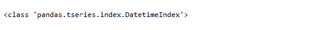
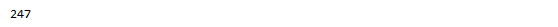
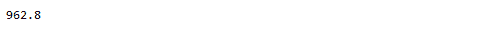
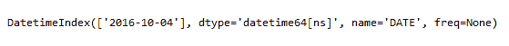
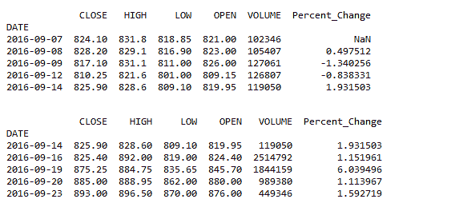
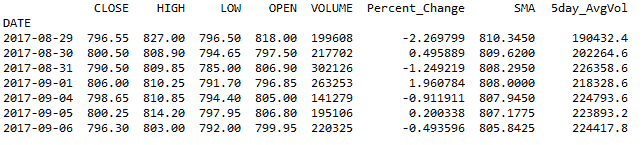

# 使用 Python 对股票数据进行基本操作

> 原文：<https://blog.quantinsti.com/basic-operations-stock-data-using-python/>

由[米林德·帕拉德卡](https://www.linkedin.com/in/milind-paradkar-b37292107/)

本文展示了可以使用 Python 对股票数据执行的基本操作，以分析和构建算法交易策略。我们使用 Python 运行一些可以在股票数据上执行的基本操作，并从从 CSV 文件中读取股票数据开始。

Python 已经成为[发展最快的编程语言](http://www.techrepublic.com/article/which-is-the-fastest-growing-programming-language-hint-its-not-javascript/#ftag=RSS56d97e7)，这源于多种因素，如易学、可读性、简洁性、强大的开发者社区、跨领域应用等。
T3T5】

Python 在交易中也得到了广泛的接受，这导致了基于 Python 的分析平台、Python APIs 和使用 Python 构建的交易策略。

鉴于算法交易 (EPAT)的[高管课程越来越受欢迎且易于学习，它提供了一个专门的模块，涵盖了使用 Python 教授的量化交易策略。](https://www.quantinsti.com/epat)

这篇文章的目的是说明学习 Python 并应用它来制定和分析交易策略是多么容易。如果你是编程新手，这个博客可能会帮助你克服对编程的恐惧。此外，不要忘记查看一些在本博客末尾提供的链接，学习一些已经发布在我们博客上的令人兴奋的交易策略。

让我们来看一下可以使用 Python 对股票数据执行的一些基本操作。我们首先从 CSV 文件中读取股票数据。CSV 文件包含股票的开盘价-最高价-最低价-收盘价(OHLC)和成交量。

```
import pandas as pd
# Load data from csv file
data = pd.read_csv('Basic Operations on Stock Data using Python_UBL.csv')
print(data.head())

```

这里看到的“时间”列指定了当天交易时段的结束时间。要删除该列，我们只需使用“del”命令。

```
# Deleting the "TIME" column
del data['TIME']
```


现在，让我们使用 type 函数来检查对象是否是熊猫日期时间索引。

```
type(data.index)
```



我想知道给定数据集中的交易天数(行数)。可以使用 count 方法来完成。

```
# Number of rows in the data set
print(data['CLOSE'].count())
```



如果我想知道给定时间段内达到的最高收盘价，该怎么办？这可以通过使用 max 方法来实现。

```
max_price = data['CLOSE'].max()
print(max_price)
```



还有可能知道达到这个最高价格的日期吗？为了找到相应的日期，我们应用如下所示的 index 属性。

```
data.CLOSE[data.CLOSE == max_price].index
```



让我们计算收盘价的每日百分比变化。我们在现有的数据集中添加了一个新的“百分比变化”列。在下一行代码中，我们筛选了百分比变化列中所有大于 1.0 的值。结果如下所示。

```
# Compute the percentage change
data['Percent_Change'] = data['CLOSE'].pct_change()*100
# Filter the percent change column for all values greater than 1.0
dt = (data[data.Percent_Change > 1.0])

print(data.head())
print(dt.head())
```



最后，让我们补充几个指标。我们计算 20 天简单移动平均线和 5 天平均成交量。我们可以在我们的数据框架中添加更多的指标，然后分析股票趋势，看它是看涨还是看跌。你可以在这里了解更多关于如何用 Python [创建各种技术指标。](https://blog.quantinsti.com/build-technical-indicators-in-python/)

```
# Closing near the 20-day SMA
ndays = 20
SMA = pd.Series((data['CLOSE']).rolling(window=ndays).mean(),name = 'SMA')
data = data.join(SMA)

# Higher trade Quantity
Avg_vol = pd.Series((data['VOLUME']).rolling(window=5).mean(),name = '5day_AvgVol')
data = data.join(Avg_vol)

print(data.tail(7))
```



在他的短文中，我们介绍了一些简单的方法来分析数据集，并对股票数据建立更多的理解。

**你能想到用类似的基本操作和简单的指标来构建交易策略吗？**

简单的交易策略可以盈利，许多成功的交易者会证明这一点。正如博客开头提到的，这里有一些 Python 中的交易策略的链接，你可以根据自己的交易需求来探索。

* * *

推荐阅读:

*   [使用 Python 中的机器学习进行交易——SVM(支持向量机)](https://blog.quantinsti.com/trading-using-machine-learning-python-svm-support-vector-machine/)
*   [使用趋势跟踪指标的策略:MACD、ST 和 ADX](https://blog.quantinsti.com/strategy-using-trend-following-indicators-macd-st-adx/)
*   [使用 Python 对新闻文章进行情感分析](https://blog.quantinsti.com/sentiment-analysis-news-python/)
*   [quanti ACS 平台中的 Python 交易策略](https://blog.quantinsti.com/python-trading-strategy-quantiacs-platform/)

* * *

Python 算法交易在 quant finance 社区中获得了牵引力，因为它可以轻松地建立复杂的统计模型，这是因为有足够的科学库可用，如 Pandas、NumPy、PyAlgoTrade、Pybacktest 等。

在我们即将发布的帖子中，我们将提供更多可以用于使用 Python 进行交易的方式和方法。继续关注我们的帖子。

如果您希望掌握使用 Python 生成交易策略、回溯测试、处理时间序列、生成交易信号、预测分析等艺术，您可以注册我们的 [Python for Trading 课程！](https://quantra.quantinsti.com/course/python-for-trading)

*<small>免责声明:股票市场的所有投资和交易都涉及风险。在金融市场进行交易的任何决定，包括股票或期权或其他金融工具的交易，都是个人决定，只能在彻底研究后做出，包括个人风险和财务评估以及在您认为必要的范围内寻求专业帮助。本文提到的交易策略或相关信息仅供参考。</small>T3】*

**文件在下载**

*   股票数据的基本操作- Python 代码