# 交易的演变:从物物交换系统到算法交易

> 原文：<https://blog.quantinsti.com/evolution-trading-barter-system-algo-trading/>

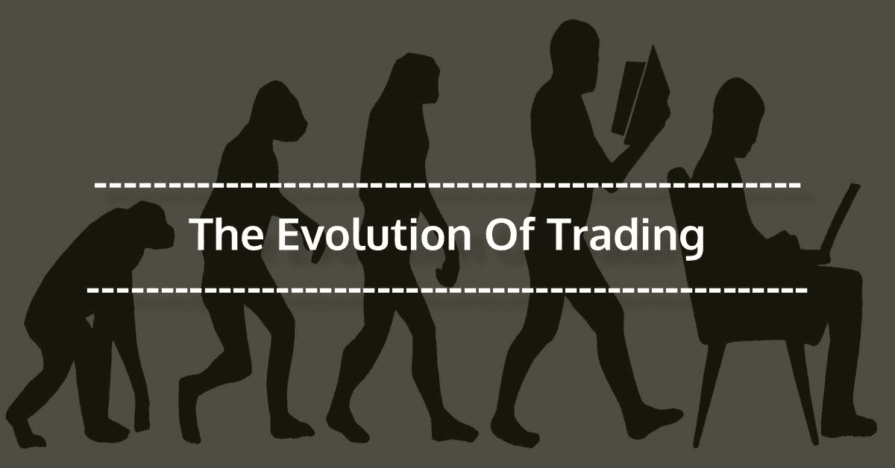

由尼廷·塔帕尔

### **贸易史**

交易的发展是人类旅程中最重要的因素之一。人类已经进化了几个世纪，如果他们被限制在地理范围内，这是不可能的。

贸易是一种为了共同利益将人们聚集在一起的系统，尽管原始社会只在宗教和文化活动中看到人们的聚集，这受到习俗或亲属关系的限制。

今天，贸易给各国带来了静态和动态的收益。贸易激发了技术的创新，导致了国家间更快更好的交流，创造了一个统一的贸易世界。让我带你经历“贸易之旅”,它在塑造现代经济中发挥了至关重要的作用，并让你了解简单的商品和服务交换是如何发展成为更加复杂的股票交易实践的。

#### **贸易的起源**

**文明之前的贸易:交易石头**

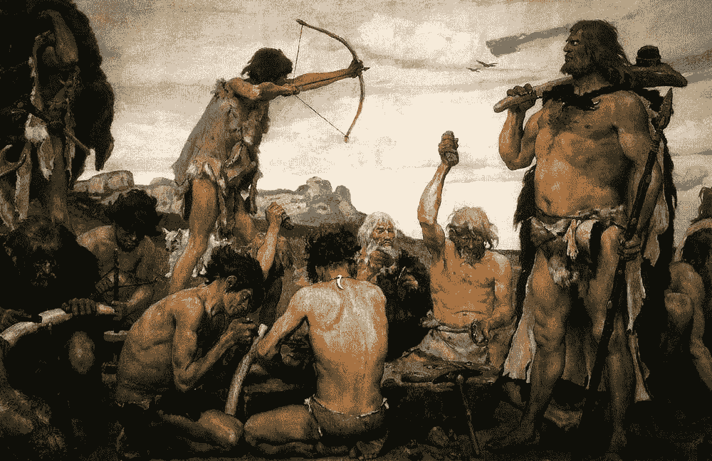

石器时代大约开始于 260 万年前；在这个时代，石器被用来打猎，人们自给自足。他们四处寻找食物和住所，贸易是在相对较小的范围内进行的，在较小的社区内，在较短的距离内。石器时代早期(石器时代旧石器阶段)没有农耕和商人的概念。贸易是史前人类的主要工具，他们交换货物和服务，包括狩猎设备和被认为有巨大价值的石头。

**使用货币:**易货系统

#### **公元前 17000 年至公元前 9000 年**

**第一次长途贸易:黑曜石&农业**

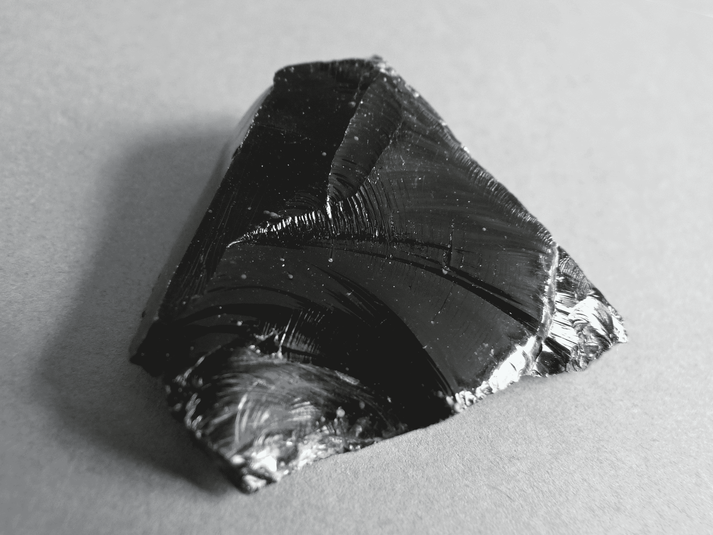

黑曜石

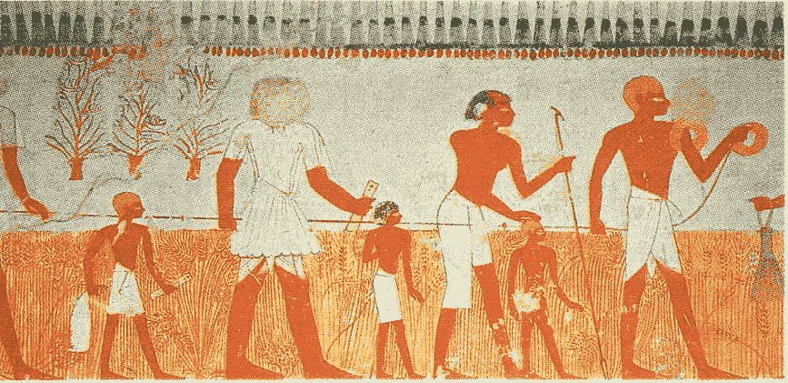

《收获》展示了梅内那墓中的一幅壁画

黑曜石是公元前 17000 年后广泛使用的贸易物品，因为这种材料在金属使用之前非常受欢迎。黑曜石被用来制作切割工具，比其他可用材料更受青睐，因为它也象征着部落的更高地位。

在地中海地区，黑曜石的交易距离为 900 公里。

随着新石器时代(新石器时代)的引入，即从公元前 9000 年开始，农业开始发展，人们开始驯养动物和种植作物，这导致社区在一个地方定居。

随着农业和新农具的出现，有了更多的剩余食物，这些食物被用来交换其他有用的商品(易货贸易制度)。不同社区之间开始进行贸易，不仅交换剩余的食物，还交换农具(石头制成的工具)和手工艺品。由此，一个新的商人社会阶层产生了；他们会步行数千英里与其他社区进行贸易。

使用的货币:牲畜、盐、金属、稀有宝石等商品

#### **公元前 8000 年至公元前 6000 年**

**成熟的贸易体系:正在崛起的文明**

现在是公元前 8000 年，世界人口在 500 万左右。人们现在已经学会了耕作和驯养动物的艺术，农业正在蓬勃发展，一个生产粮食的经济已经出现。

陶器传统在现在被称为亚洲、日本、韩国、中国、墨西哥和更多的地方兴起。黑曜石仍然是贸易习惯的重要组成部分，但是现在有了更多的贸易(物物交换),包括牲畜、剩余产品、盐、铜、贝壳、陶器、兽皮、农具、种子等。

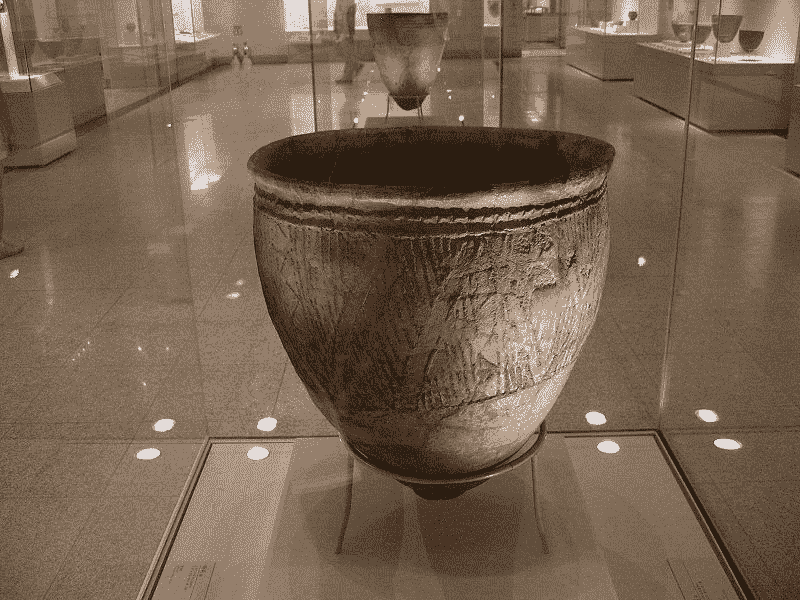

在釜山发现的韩国新石器时代的壶

在接下来的几个世纪里，人们开始居住在世界的其他地方，包括印度河流域、约旦、爱尔兰、安纳托利亚、苏格兰、北美、尼日利亚、土耳其、挪威、意大利、欧洲、埃及等。饰品(金和铜)出现了，并在世界各地有巨大的需求。

基于居住区域，这些文化群体开始适应基于邻近地区自然资源可用性的必需品。现在的物品不仅仅限于功能，还具有美学价值。

新定居下来的人现在开始从几百英里以外的地方进口异国商品。

使用的货币:武器、金属制品、陶器、铜、植物产品等形式的货币。

#### **公元前 5000 年至公元前 4000 年**

**重要发明:fast &编年史**

“轮子”的发明和发展是贸易史的重要组成部分。这个见证了轮子使用的文明比他们的祖先有更好的优势，因为他们有更大的能力生产食物，制造商品，并在更远的距离运输人和货物。

最早的轮子是由一块实心木头制成的。

社区开始扩大，因为他们在短时间内走更远的距离变得更加容易，而且没有必要靠近粮食生产区。轮子也用于制作陶器；这是早期文明的重要组成部分。

5000 年到 4000 年(T2)这段时间也很重要，因为这是原始文字或第一种书写形式被发现的时候。人们现在能够更好地通勤和交流。

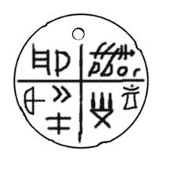

粘土护身符，一块托特利亚石板，可追溯到公元 200 年。公元前 4500 年

使用的货币:易货，陶罐或工具，种子，谷物，工具等

#### **公元前 3000 年至公元前 1000 年**

**崛起中的国际贸易:印度的商队**

Ebla(叙利亚)在第三个千年成为一个突出的贸易中心。属于不同王国的社区之间的贸易繁荣发展。随着越来越多的发明成为贸易相关活动的催化剂，商品的流动增加了，新的职业也出现了。

到公元前 2000 年，前死水岛塞浦路斯通过将其丰富的铜矿资源运往近东和埃及，成为地中海的主要参与者，这些地区因其自身的自然资源如纸莎草纸和羊毛而富裕。以航海技术闻名的腓尼基，在整个地中海兜售其珍贵的雪松木和亚麻染料。中国通过交易玉石、香料以及后来的丝绸而繁荣起来。英国分享其丰富的锡。

随着骆驼的驯化，陆上贸易路线变得流行起来，被称为商队的商队利用这些贸易路线与印度和地中海进行贸易。城镇开始以前所未有的方式涌现，中转站或商队到船只的港口随处可见。

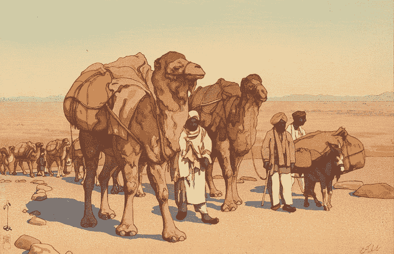

一队骆驼穿越星光灿烂的沙漠之夜

资料来源:sahapedia.org

正是在这个时候，熏香路线被用来运输乳香和没药，它们被用作油、香水、熏香和药物，这些只在阿拉伯半岛的南端(今天的也门和阿曼)被发现。

使用的货币:金、银、铜、牛、贝壳、盐、商品交换等

#### **公元前 700 年至公元 1500 年**

**贸易路线:主年和更多**

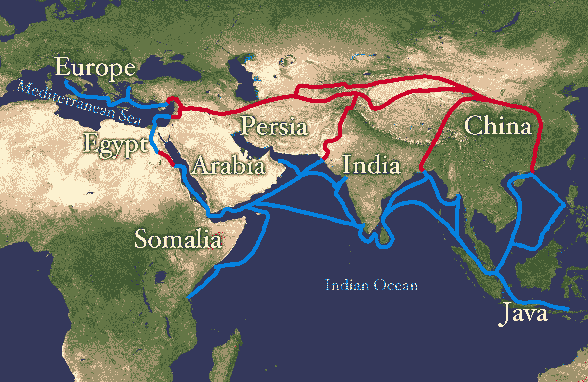

武尔奇城成为贸易和制造中心的枢纽。

希腊殖民者在萨罗纳建立了贸易中心。殖民地的建立允许奢侈品的进出口，如陶器、酒、石油、金属制品和纺织品。

汉朝开辟了中国和中亚之间的“丝绸之路”贸易路线。许多不同种类的商品沿着丝绸之路运输，它是世界上最古老的国际贸易路线之一。

从埃及到印度的第一次不间断航行开始于共同时代。印度的香料闻名世界，是向西方世界出口的主要商品。香料贸易促进了东西方之间新的外交关系，克里斯托弗在 1492 年出发并最终发现了美洲，部分原因是考虑到了香料贸易

从公元 7 世纪开始,“茶马古道”被用来交易中国茶叶和西藏战马。这条路线长达 6000 多英里，主要用于从中国向西藏和印度出口茶叶。

由于从北非到西非的跨撒哈拉贸易路线，黄金、盐和布料的贸易在非洲也蓬勃发展。这些贸易路线最早出现在公元 4 世纪，到公元 11 世纪，由一千多只骆驼组成的商队将带着货物穿越撒哈拉沙漠。

**使用的货币:**从青铜制成的小刀和铲子形状的金属开始，到印度和中国首先制造硬币，铸造硬币到汇票。

### **证券交易所的演变**

1531 年:比利时在安特卫普有一个证券交易所。经纪人和放债人将在那里会面，处理商业、政府甚至个人债务问题。没有期票、债券或真正的股票。

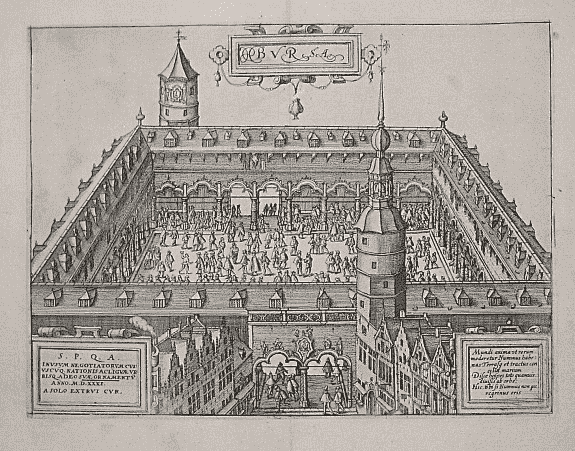

17 世纪:东印度公司的成立改变了做生意的方式。这些公司的股票将为公司所有航行的收益支付股息。这些是第一批现代股份公司。这使得公司可以要求更多的股份，并建立更大的车队。投资者的利润基于公司的规模，结合禁止竞争的皇家特许。

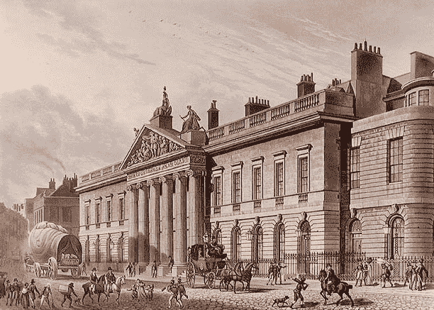

伦敦利登霍尔街的东印度大厦

1773 年:伦敦第一个证券交易所正式成立

18 世纪 80 年代:一名日本商人发明了烛台模式来预测大米市场的价格变动。 **1790 年:**美国投资市场的诞生以联邦政府发行 8000 万美元债券偿还独立战争债务为标志。两年后，“梧桐树协议”由 24 名股票经纪人签署，后来转移到 Tontine 咖啡屋进行交易。

1792 年:纽约证券交易所收购首次交易的证券

1817 年:纽约证券交易所的章程被采纳

19 世纪 30 年代:孟买首次出现了公司股票、银行股票和棉纺厂股票的交易。

19 世纪 40 年代:在加州淘金热期间，路边石经纪人为矿业公司创造了市场机会，促进了一个快速发展的新兴行业的发展。

1856 年:从 19 世纪 50 年代中期开始，一个由 22 名股票经纪人组成的非正式团体，带着当时可观的 1 卢比，开始在孟买市政厅对面的一棵榕树下投资。同样的榕树仍然矗立在孟买的霍尼曼圆形公园里。

1859 年:宾夕法尼亚西部发现石油后，石油股票在场外市场交易。

1860 年:交易所蓬勃发展，有 60 名经纪人。事实上，印度的“股票热”始于美国内战爆发，美国对欧洲的棉花供应停止。此外，经纪人增加到 250 人。一个非正式的股票经纪人团体成立了“本地股票和股票经纪人协会”，该协会于 1875 年正式成立为孟买证券交易所(BSE)。

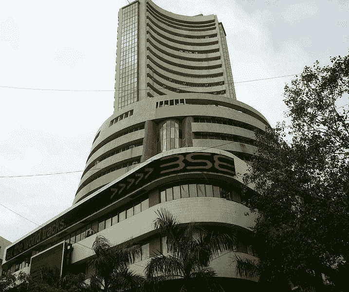

现今位于印度孟买的孟买证券交易所大楼

1864 年:由以前的路边石经纪人建立的股票经纪人公开委员会开始运作。它于 1869 年与纽约证券交易所合并。

另一方面，伦敦证交所成立于 1875 年，是亚洲最古老的证券交易所。它已经发展成为目前最重要的股票交易所。

19 世纪 90 年代:路边市场转移到交易所附近的宽街。

1904 年:伊曼纽尔·s·门德尔斯开始组织场外交易市场，鼓励合理和道德的交易。纽约场外市场机构成立于 1908 年，旨在规范交易行为。

1921 年:纽约路边市场在曼哈顿下城格林威治街的一栋新建筑里找到了一个新家。

1944 年:纽约场外交易市场成立时，制定了更高的经纪和上市标准。

**1956 年:**印度政府承认孟买证券交易所为该国第一家依据《证券合同(监管)法》成立的证券交易所。

1960 年:20 世纪 60 年代，网上股票交易账户还不存在。订单预订流程是通过致电您的经纪人并要求他代表您在自己的系统中输入订单来启动的。如果所订购的股票在纽约证券交易所交易，它将被调用到纽约证券交易所的交易大厅，例如，在经纪人的系统中，购买 100 股的订单与出售 100 股的订单相匹配。

如果是场外交易(OTC)股票，即没有在纽约证券交易所或美国证券交易所上市但仍在交易的股票，经纪人会通过电话打电话给做市商，他们会报出不同的价格来买卖股票。

**1969 年:**为了让经纪人在正常交易时间后发布买卖股票的报价，Instinet 作为第一个电子通信网络(ECN)成立

**20 世纪 70 年代:**纳斯达克成立。

**1971:** 全美证券交易商协会(National Association of Securities Dealers)是一个由场外交易(OTC)做市商组成的协会，成立于 1939 年，创建了第一个电子股票市场:全美证券交易商协会自动报价(NASDAQ)市场。

1975 年:证券交易委员会废除了固定佣金。这使得折扣佣金上升，促进了查尔斯·施瓦布和其他公司的发展。美国证券交易所推出期权市场。

1976 年:纽约证券交易所推出了指定订单周转(DOT)系统，允许经纪人将 100 股订单直接发送给场内的专家。这些不是真正的电子执行，因为专家仍然匹配订单，但它确实绕过了场内经纪人。

**80 年代:**电子交易的兴起。

1984 年:纽约证券交易所采用了更复杂的 SuperDOT 系统，允许高达 100，000 股的订单直接发送到交易大厅。更多的场内经纪人出局了。

1987 年:1987 年的崩盘被部分归咎于“投资组合保险”(做空股票组合的股指期货)。随着纳斯达克扩展小订单执行系统(SOES ),电子交易又向前迈进了一步，该系统允许小额交易的交易商以电子方式而不是通过电话输入订单。这样做是因为在 1987 年崩盘期间，许多经纪自营商干脆不接电话了。

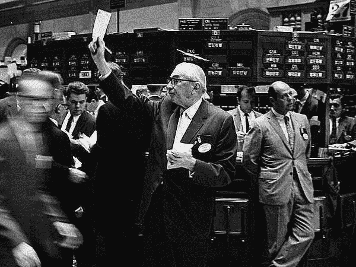

80 年代的股票经纪人

**1990-95:** 网上交易的兴起。

1994 年:NSE 于 1994 年 11 月 4 日开始交易。不到一年，NSE 的营业额就超过了 BSE。

1996-1999 年:随着互联网流量的急剧增加，在线交易开始爆炸式增长。小交易者突然可以像专业经纪人一样获得实时定价。“日内交易者”这个词进入了词汇表。

**2000 年代:** **十进制化，算法交易，高频交易。**

2000 年:NASD 从纳斯达克分离出来，成为一家上市公司。

2001 年:以便士为单位的股票交易开始了。纽约证券交易所推出了 Direct+，这有助于立即自动执行高达 1099 股的限价单。这是真正的电子交易(买卖订单的自动匹配)，是旧的场内专家系统结束的开始。

2005 年: <u>Reg-NMS</u> 改变一切- HFT 进入黄金时段。美国证券交易委员会将全国市场系统的所有规则合并为 NMS 规则，这迫使纽约证券交易所走向电子化，并促进了竞争性电子交易系统和交易所的发展。

纽约证交所于 12 月推出 NYSE Hybrid，试图将纽约证交所场内业务与场外电子交易结合起来。Direct+系统上的 1，099 个份额限制已被取消。专业人士在市场中的参与度开始大幅下降。

2006 年:纽约证券交易所股份化，成为一家营利性上市公司。这给了交易所开始盈利管理的动力，也给经纪人带来了更多基于竞争的动力。

2007 年:纽约证券交易所与泛欧交易所合并，泛欧交易所成立于 2000 年，由阿姆斯特丹、布鲁塞尔和巴黎交易所合并而成。

2008 年:纽约证券交易所取消了专家，将他们重新命名为指定做市商，尽管他们仍然负责维持股票市场的公平有序。 [Algo 交易在印度开始](https://blog.quantinsti.com/algorithmic-trading-india/)。

算法交易-市场交易量的百分比

2009 年:瑞士瑞信银行的高级执行服务(AES)部门推出了印度股票的算法交易。AES 算法套件包括传统算法策略和策略，前者寻求将交易量按时间划分，后者寻求以股票的交易量加权平均价格进行交易。

同年，软件开发商中本聪提出了比特币，这是一种基于数学证明的电子支付系统。

2010 年: Direct Edge，以前是一个 ECN，现在变成了一个交易所。在印度，印度国家证券交易所(NSE)从 2010 年 6 月开始向经纪公司提供额外的 **54 个协同定位服务器“机架”**，以提高交易速度。此外，采用固定协议。亚洲 algo 交易教育的先驱 Multiple QuantInsti 在印度推出并开始了第一个 Algo 交易教育项目。

2012 年:纽约证券交易所创造了一种叫做单一股票熔断机制的东西。如果道琼斯指数在特定时间内下跌特定点数，那么断路器将自动停止交易。该系统旨在降低股票市场崩溃的可能性，并在崩溃发生时，限制崩溃的损害。

截至 2012 年底，全球股票市场规模(总市值)约为 55 万亿美元。按国家划分，最大的市场是美国(约占 34%)，其次是日本(约占 6%)和英国(约占 6%)

**单幅 GIF 中的美国股市 40 年演变**

[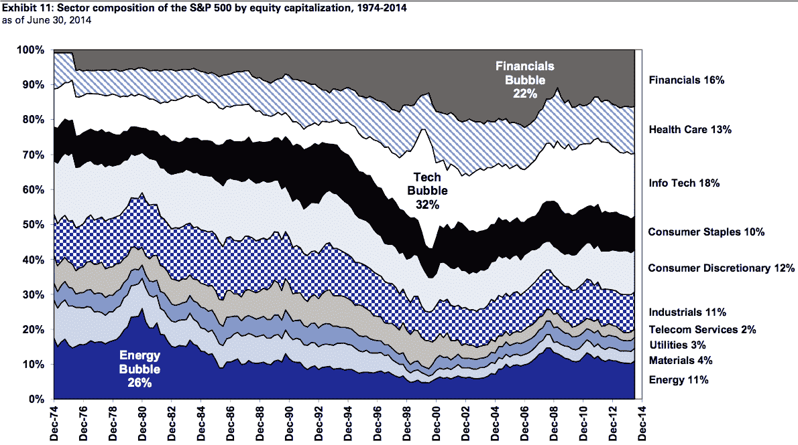T2】](https://d1rwhvwstyk9gu.cloudfront.net/2017/07/40-year-evolution-of-the-American-stock-market.gif)

***来源:https://qz . com/230196/the-40-years-of-the-the-u-s-one-stock market-gif/***

2013 年:2013 年，约 70%的美国股票是通过自动化交易实现的。[算法交易](https://www.quantinsti.com/)占印度现金股票总交易量的三分之一，几乎是衍生品交易量的一半。

**2015:** 社交媒体整合；彭博终端公司将实时推文整合到其经济数据服务中。彭博社交速度追踪关于特定公司的异常聊天记录。

**2017:** 纳斯达克破 6000，世界股市再创新高。

纳斯达克指数收盘上涨 41.7 点，收于 6025.5 点，此前曾创下 6031.91 点的历史新高。这一里程碑事件发生在该指数触及 5000 点关口逾 17 年之后。

正如伊莎贝尔·霍文正确引用的那样，“贸易的积极方面是世界被搅在一起”，几个世纪以来，我们人类通过相互帮助使世界走到一起而繁荣发展。交易的发展只是这个旅程的一部分，但我们还没有看到在不久的将来会有什么样的创新方法来塑造未来几代人的经济。

### **下一步**

如果你想学习算法交易的各个方面，那就去看看算法交易(EPAT)中的 T2 高管课程。该课程涵盖了统计学&计量经济学、金融计算&技术和算法&定量交易等培训模块。EPAT 让你具备成为成功交易者所需的技能。[现在报名](https://www.quantinsti.com/epat/)！