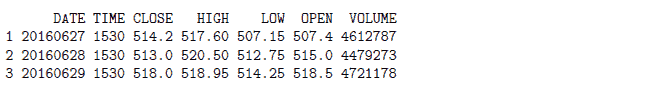
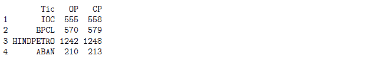
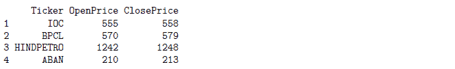

# r 每周简报第 12 卷

> 原文：<https://blog.quantinsti.com/r-weekly-bulletin-vol-xii/>


本周的 R 公告将涵盖如何解决 R 中一些常见错误的主题。希望您喜欢这份 R 每周公告。享受阅读！

### 快捷键

1.  查找和替换- Ctrl+F
2.  查找下一个- F3
3.  查找上一个- Shift+F3

### 解决问题的想法

#### 正在解析“无法打开连接”错误

当我们运行 R 脚本时，出现这个错误可能有两个原因:1)文件/连接无法打开，因为 R 找不到它(主要是由于路径错误)。onLoad()，因为包找不到系统依赖项

**举例:**

```
symbol = "AXISBANK"
noDays = 1
dirPath = paste(getwd(), "/", noDays, " Year Historical Data", sep = "")
fileName = paste(dirPath, symbol, ".csv", sep = "")
data = as.data.frame(read.csv(fileName))
```

文件中的警告(文件，“rt”):无法打开文件“C:/Users/Madhukar/Documents/ 1 年历史数据 AXISBANK.csv”:文件中没有这样的文件或目录错误(文件，“rt”):无法打开连接

我们得到这个错误是因为我们在代码中为“dirPath”对象指定了错误的路径。正确的路径如下所示。我们在粘贴函数中遗漏了在“年历史数据”后添加一个正斜杠。这导致了错误的道路，因此错误。

dirPath = paste(getwd()，"/"，noDays，"年历史数据/"，sep= " ")

添加正斜杠后，我们重新运行代码。下面我们可以看到在 R 控制台中打印的正确的目录路径和文件名。

**举例:**

```
symbol = "AXISBANK"
noDays = 1
dirPath = paste(getwd(), "/", noDays, " Year Historical Data/", sep = "")
fileName = paste(dirPath, symbol, ".csv", sep = "")
data = as.data.frame(read.csv(fileName))
print(head(data, 3))
```



#### 解决“找不到函数”错误

当一个 R 包没有被正确加载或者由于函数名的拼写错误，这个错误就会出现。

当我们运行下面显示的代码时，我们在控制台中得到一个“找不到 ymd 函数”错误。这是因为我们把“ymd”函数拼错成了“ymed”。如果我们不加载所需的包，这也会抛出一个“找不到函数 ymd”的错误。

**举例:**

```
# Read NIFTY price data from the csv file
df = read.csv("NIFTY.csv")
# Format date
dates = ymed(df$DATE)
```

eval(expr，envir，enclos)出错:找不到函数“ymed”

#### 解决“替换有”错误

当试图将值的向量分配给现有对象并且长度不匹配时，会发生此错误。

在下面的示例中，安讯士银行的股票价格数据有 245 行。在代码中，我们创建了从 1 到 150 的数字序列“s”。当我们试图将这个序列添加到 Axis Bank 数据集时，它会抛出一个“替换错误”,因为两者的长度不匹配。因此，为了解决这种错误，应该确保长度匹配。

**举例:**

```
symbol = "AXISBANK" ; noDays = 1 ;
dirPath = paste(getwd(),"/",noDays," Year Historical Data/",sep="")
fileName = paste(dirPath,symbol,".csv",sep="")
df = as.data.frame(read.csv(fileName))
# Number of rows in the dataframe "df"
n = nrow(df); print(n);
# create a sequence of numbers from 1 to 150
s = seq(1,150,1)
# Add a new column "X" to the existing data frame "df"
df$X = s
print(head(df,3))
```

＄tmp，" X "中的错误，value = c(1，2，3，4，5，6，7，:替换有 150 行，数据有 245 行

### 功能去神秘化

#### 通话功能

do.call 函数用于调用其他函数。要调用的函数作为 do.call 函数的第一个参数提供，而 do.call 函数的第二个参数是要调用的函数的参数列表。该函数的语法如下所示:

do.call(函数名，参数)

**示例:**让我们首先定义一个简单的函数，稍后我们将在 do.call 函数中调用它。

```
numbers = function(x, y) {
sqrt(x^3 + y^3)
}
# Now let us call this 'numbers' function using the do.call function. We provide the function name as # the first argument to the do.call function, and a list of the arguments as the second argument.

do.call(numbers, list(x = 3, y = 2))
```

[1] 5.91608

#### 重命名功能

rename 函数是 dplyr 包的一部分，用于重命名数据框的列。rename 函数的语法是将新名称放在=符号的左边，旧名称放在右边。考虑下例中给出的数据帧“df”。

**举例:**

```
library(dplyr)
Tic = c("IOC", "BPCL", "HINDPETRO", "ABAN")
OP = c(555, 570, 1242, 210)
CP = c(558, 579, 1248, 213)
df = data.frame(Tic, OP, CP)
print(df)
```



```
# Renaming the columns as 'Ticker', 'OpenPrice', and 'ClosePrice'. This can be done in the following 
# manner:

renamed_df = rename(df, Ticker = Tic, OpenPrice = OP, ClosePrice = CP)
print(renamed_df)
```



#### 重叠函数

lapply 函数是 R 基础包的一部分，它将一个列表“x”作为输入，并返回一个与“x”长度相同的列表，其中的每个元素都是对 x 的相应元素应用函数的结果。该函数的语法如下所示:

lapply(x，Fun)其中，x 是一个向量(原子或列表), Fun 是要应用的函数

**例 1:**

让我们创建一个包含两个元素的列表，OpenPrice 和 ClosePrice。我们将使用 lapply 函数计算每个元素中值的平均值。

```
x = list(OpenPrice = c(520, 521.35, 521.45), ClosePrice = c(521, 521.1, 522))
lapply(x, mean)
```

OpenPrice [1] 520.9333 美元

close store[1]521 3667 美元

**例 2:**

```
x = list(a = 1:10, b = 11:15, c = 1:50)
lapply(x, FUN = length)
```

十美元

5 美元

50 美元

### 下一步

我们希望你喜欢这个公告。在[下一期每周简报](https://blog.quantinsti.com/r-weekly-bulletin-vol-xiii)中，我们将为读者列出更多有趣的方式方法加上 R 函数。