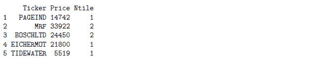
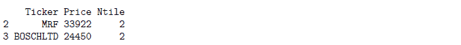

# r 每周简报第十卷

> 原文：<https://blog.quantinsti.com/r-weekly-bulletin-vol-x/>


本周的 R 公告将涵盖使用 ntile 函数对数据进行分组、如何自动打开文件以及使用 R 格式化 Excel 表格的主题。希望您喜欢这份 R 每周公告。享受阅读！

### 快捷键

1.  折叠选定的块- Alt+L
2.  展开选定的块- Shift+Alt+L
3.  全部折叠- Alt+0

### 解决问题的想法

#### 使用 ntile 函数对数据分组

ntile 函数是 dplyr 包的一部分，用于对数据进行分组。该函数的语法由下式给出:

ntile(x，n)

其中，“x”是值的向量,“n”是将数据分成的桶/组的数量。

**举例:**

在这个例子中，我们首先从两个向量创建一个数据帧，一个包含股票符号，另一个包含它们各自的价格。然后，我们将 Price 列中的值分成两组，等级被填充到名为“Ntile”的新列中。在最后一行中，我们使用 subset 函数只选择那些属于第二个存储桶的值。

```py
library(dplyr)
Ticker = c("PAGEIND", "MRF", "BOSCHLTD", "EICHERMOT", "TIDEWATER")
Price = c(14742, 33922, 24450, 21800, 5519)

data = data.frame(Ticker, Price)

data$Ntile = ntile(data$Price, 2)
print(data)
```



```py
ranked_data = subset(data, subset = (Ntile == 2))
print(ranked_data)
```



#### 自动打开保存的文件

如果您正在保存执行 R 脚本时返回的输出，并且还想在运行代码后打开文件，您可以使用 shell.exec 函数。此函数使用 Windows 文件关联中指定的应用程序打开指定的文件。

文件关联将文件与能够打开该文件的应用程序相关联。更常见的是，文件关联关联一类文件(通常由文件扩展名决定，如。txt)和相应的应用程序(例如文本编辑器)。

下面的示例说明了函数的用法。shell.exec(文件名)

**举例:**

```py
df = data.frame(Symbols=c("ABAN","BPCL","IOC"),Price=c(212,579,538))
write.csv(df,"Stocks List.csv")
shell.exec("Stocks List.csv")
```

#### excel 表格列宽的快速格式

我们可以使用下面给出的命令行格式化 excel 表格的列宽。在该示例中，第一行将加载由文件名指定的 excel 工作簿。在第三行和第四行，autoSizeColumn 函数为每个工作表调整列的宽度，这是在“colIndex”中指定的。最后一行将在进行必要的格式更改后再次保存工作簿。

**举例:**

```py
wb = loadWorkbook(file_name)
sheets = getSheets(wb)
autoSizeColumn(sheets[[1]], colIndex=1:7)
autoSizeColumn(sheets[[2]], colIndex=1:5)
saveWorkbook(wb,file_name)
```

### 功能去神秘化

#### 选择功能

choose 函数计算组合 nCr。该函数的语法如下所示:

选择(n，r)

其中，n 是元素的数量，r 是子集元素的数量

nCr = n！/(r！* (n-r)！)

**例子:**

```py
choose(5, 2)

```

[1] 10

```py
choose(2, 1)

```

[1] 2

#### 样本函数

sample 函数从给定的向量中随机选择 n 个项目。样本的选择没有替换，这意味着该功能不会两次选择相同的项目。该函数的语法如下所示:

样本(向量，n)

**举例:**考虑一个由一只股票的年收入增长数据组成的向量。我们使用样本函数随机选择 5 年的收入增长。

```py
Revenue = c(12, 10.5, 11, 9, 10.75, 11.25, 12.1, 10.5, 9.5, 11.45)
sample(Revenue, 5)
```

[1] 11.45 12.00 9.50 12.10 10.50

一些统计过程需要替换抽样，在这种情况下，您可以为 sample 函数指定 replace= TRUE。

**举例:**

```py
x = c(1, 3, 5, 7)
sample(x, 7, replace = TRUE)
```

[1] 7 1 5 3 7 3 5

#### runif 和 rnorm 函数

runif 函数生成一个介于 0 和 1 之间的均匀随机数。runif 函数的自变量是要生成的随机值的个数。

**举例:**

```py
# This will generate 7 uniform random number between 0 and 1.
runif(7)
```

[1] 0.6989614 0.5750565 0.6918520 0.3442109 0.5469400 0.7955652 0.5258890

```py
# This will generate 5 uniform random number between 2 and 4.
runif(5, min = 2, max = 4)
```

[1] 2.899836 2.418774 2.906082 3.728974 2.720633

rnorm 函数根据正态分布生成随机数。函数 rnorm 代表正态分布的随机数生成器。该函数的语法如下所示:

rnorm(n，均值，标准差)

**举例:**

```py
# generates 6 numbers from a normal distribution with a mean of 3 and standard deviation of 0.25
rnorm(6, 3, 0.25)
```

[1] 3.588193 3.095924 3.240684 3.061176 2.905392 2.891183

### **下一步**

我们希望你喜欢这个公告。在[下一期每周简报](https://blog.quantinsti.com/r-weekly-bulletin-vol-xi)中，我们将为读者列出更多有趣的方式方法加上 R 函数。