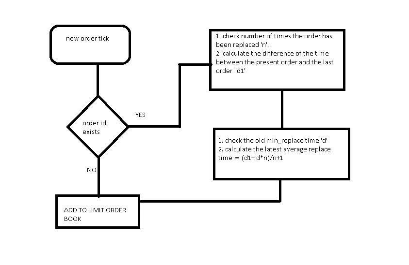

# 分离人类和 HFT 算法订单[EPAT 项目]

> 原文：<https://blog.quantinsti.com/project-work-segregating-human-hft-algo-orders/>

由[Narasimha Sriharsha kand uri](https://www.linkedin.com/in/narasimha-sriharsha-kanduri-400b5110b/)

### **简介**

市场价格由参与者决定。趋势市场和区间市场是参与者的情绪。通过分析参与者，我们可以得出各种各样的结论。考虑两个极端的参与者，HFT·阿尔戈斯和人类。

现在让我们分析面向人的命令。人类不能每秒钟替换订单数百次，也不能以分数调整价格以便从中获利。另一方面，算法甚至可以在几分之一秒内替换订单，他们试图从甚至很小的优势中获利。

该研究的思想是根据订单执行前替换订单的最短时间来分离人和机器订单。如果最小替换时间大于阈值时间 Ts，则该订单被认为是人工订单，否则为 HFT 算法订单。然后，使用具有人类和 HFT 算法的样本数据来确定隔离的有效性，该样本数据具有人类和 HFT 算法的订单详细信息。

### **背景**

该研究基于历史逐笔成交点(TBT)样本数据。历史数据中的每个分笔成交点(订单)都被归属于“算法”或“非算法”。因此，如果我们可以根据平均替换时间(ts)来分离订单，我们就可以使用历史数据的属性来比较我们的效率。

### **实施**

回溯测试的程序是用 python 编写的，对于某些函数，使用了 cython 库。以下是根据平均更换时间分离交易的流程图。

程序中增加了计算平均替换时间和基于平均替换时间的订单分离的函数。还给出了由汇总生成混淆矩阵的程序。

#### 运行程序的说明:

1.  安装了 spyder 的 Windows pc 和所有模块

    > rbtree、odict、numpy、pandas、gzip、日志记录、操作系统、系统、时间、csv、副本

2.  解开代码
3.  将待测试的数据放在与代码相同的文件夹中(假设它是 datatest.csv)
4.  使用

    > python 编译 c 代码.\setup.py build_ext - inplace

5.  使用

    > 运行程序输出. datanew.csv

6.  所有已执行订单的汇总以及它们的平均修改时间、修改次数都在汇总文件中
7.  生成混淆矩阵

    > 对摘要. csv 运行 classification.py

8.  python class ification . py summary . CSV

### **结论**

分离完成后，根据以下规则生成混淆矩阵，并将结果用于分析。

当平均更换时间小于 1 秒时，属于算法的订单被归类为算法的百分比较高，随着平均更换时间的增加，该百分比降低。对于人类订单，这个百分比变化不大，保持在 36%到 47%的范围内，这意味着有一些算法也被用来在更高的时间框架内交易。此外，在 10 秒阈值附近，百分比也略有上升。

注意:这些结论/观察并不是最终的，因为市场会不断调整自己，结果会随着最新数据而变化。

### **关于作者**

Narasimha Sriharsha K .是一名全职交易员和市场爱好者。他花了大部分时间试图找到下一个入口/出口。他主要交易期货和期权。他对股票市场的兴趣促使他在 QuantInsti 研究 EPAT。

### **项目动机**

没有一种策略在所有的牛市、熊市和横盘行情中都有效，但是通过分析市场参与者的行为，我们可以使用更适合这种情况的策略。这个前提，Larrys Harris 的《市场微观结构》一书和 Raizada 先生关于市场微观结构的演讲是这个项目的灵感来源。

如果你想学习算法交易的各个方面，那就去看看算法交易(EPAT)中的 T2 高管课程。该课程涵盖了统计学&计量经济学、金融计算&技术和算法&定量交易等培训模块。EPAT 让你具备成为成功交易者所需的技能。[现在报名](https://www.quantinsti.com/epat/)！