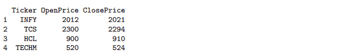
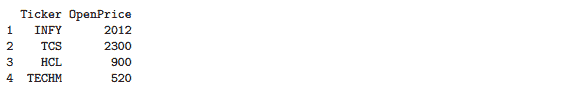
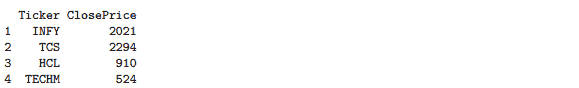
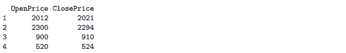
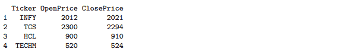
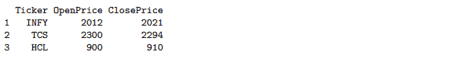
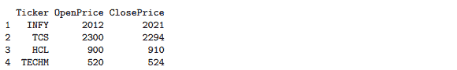
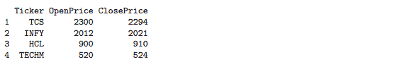

# r 每周简报第九卷

> 原文：<https://blog.quantinsti.com/r-weekly-bulletin-vol-ix/>


本周的 R 公告将涵盖如何使用 R 列出文件、提取文件名和创建文件夹的主题。希望你喜欢这个 R 每周公告。享受阅读！

### 快捷键

1.  运行当前块- Ctrl+Alt+C
2.  运行下一个块- Ctrl+Alt+N
3.  运行当前函数定义- Ctrl+Alt+F

### 解决问题的想法

#### 如何列出带有特定扩展名的文件

要列出具有特定扩展名的文件，可以使用 list.files 函数中的 pattern 参数。例如，要列出 csv 文件，请使用以下语法。

**举例:**

```py
files = list.files(pattern = "\\.csv$")
```

这将列出当前工作目录中的所有 csv 文件。要列出任何其他文件夹中的文件，您需要提供文件夹路径。

```py
 list.files(path = "C:/Users/MyFolder", pattern = "\\.csv$")
```

末尾的$表示这是字符串的结尾。添加中。确保只匹配带有扩展名的文件。战斗支援车

#### 使用 gsub 函数提取文件名

当我们从 google finance 下载股票数据时，文件名与股票数据符号相对应。如果我们想从文件名中提取股票数据符号，我们可以使用 gsub 函数。该函数搜索模式参数的匹配项，并用替换参数中给出的替换值替换所有匹配项。该函数的语法如下所示:

```py
 gsub(pattern, replacement, x)
```

在哪里，

pattern -是一个字符串，包含要在给定的字符向量中匹配的正则表达式。替换-匹配模式的替换。x -是寻找匹配的字符向量。

在下面给出的示例中，我们提取了存储在“Reading MFs”文件夹中的文件的文件名。我们已经在 R 工作目录中下载了两家公司的股票价格数据，即 MRF 公司和佩吉得公司

**举例:**

```py
folderpath = paste(getwd(), "/Reading MFs", sep = "")
temp = list.files(folderpath, pattern = "*.csv")
print(temp)
```

[1] "MRF.csv" "PAGEIND.csv "

```py
gsub("*.csv$", "", temp)
```

[1]" paging in "的 MRF

#### 使用 R 创建一个文件夹

在“dir.create”函数的帮助下，可以通过 R 创建一个文件夹。该函数使用路径的最后一个元素中指定的名称创建一个文件夹。尾部路径分隔符被丢弃。

语法如下所示:

```py
dir.create(path, showWarnings = FALSE, recursive = FALSE)
```

**举例:**

```py
dir.create("D:/RCodes", showWarnings = FALSE, recursive = FALSE)
```

这将在 D 驱动器中创建一个名为“RCodes”的文件夹。

### 功能去神秘化

#### 选择功能

select 函数来自 dplyr 包，可用于选择您需要的数据框的某些列。考虑示例中给出的数据帧“df”。

**举例:**

```py
library(dplyr)
Ticker = c("INFY", "TCS", "HCL", "TECHM")
OpenPrice = c(2012, 2300, 900, 520)
ClosePrice = c(2021, 2294, 910, 524)
df = data.frame(Ticker, OpenPrice, ClosePrice)
print(df)
```



```py
# Suppose we wanted to select the first 2 columns only. We can use the names of the columns in the 
# second argument to select them from the main data frame.

subset_df = select(df, Ticker:OpenPrice)
print(subset_df)
```



```py
# Suppose we want to omit the OpenPrice column using the select function. We can do so by using
# the negative sign along with the column name as the second argument to the function.

subset_df = select(df, -OpenPrice)
print(subset_df)
```



```py
# We can also use the 'starts_with' and the 'ends_with' arguments for selecting columns from the
# data frame. The example below will select all the columns which end with the word 'Price'.

subset_df = select(df, ends_with("Price"))
print(subset_df)
```



#### 滤波函数

过滤器函数来自 dplyr 包，用于从数据框中提取行的子集。这个函数类似于 r 中的 subset 函数。

**举例:**

```py
library(dplyr)
Ticker = c("INFY", "TCS", "HCL", "TECHM")
OpenPrice = c(2012, 2300, 900, 520)
ClosePrice = c(2021, 2294, 910, 524)
df = data.frame(Ticker, OpenPrice, ClosePrice)
print(df)
```



```py
# Suppose we want to select stocks with closing prices above 750, we can do so using the filter 
# function in the following manner:

subset_df = filter(df, ClosePrice > 750)
print(subset_df)
```



```py
# One can also use a combination of conditions as the second argument in filtering a data set.

subset_df = filter(df, ClosePrice > 750 & OpenPrice < 2000)
print(subset_df)
```


#### 排列功能

arrange 函数是 dplyr 包的一部分，用于根据其中一列对数据框的行进行重新排序。通过使用特殊的 desc()运算符，可以按降序或升序排列列。

**举例:**

```py
library(dplyr)
Ticker = c("INFY", "TCS", "HCL", "TECHM")
OpenPrice = c(2012, 2300, 900, 520)
ClosePrice = c(2021, 2294, 910, 524)
df = data.frame(Ticker, OpenPrice, ClosePrice)
print(df)
```



```py
# Arrange in descending order

subset_df = arrange(df, desc(OpenPrice))
print(subset_df)
```



```py
# Arrange in ascending order.

subset_df = arrange(df, -desc(OpenPrice))
print(subset_df)
```


### **下一步**

我们希望你喜欢这个公告。在接下来的每周公告中，我们将为读者列出更多有趣的方式和方法以及 R 函数。

**更新**

我们注意到一些用户在从雅虎和谷歌金融平台下载市场数据时面临挑战。如果你正在寻找市场数据的替代来源，你可以使用 [Quandl](https://www.quandl.com/) 来获得同样的信息。