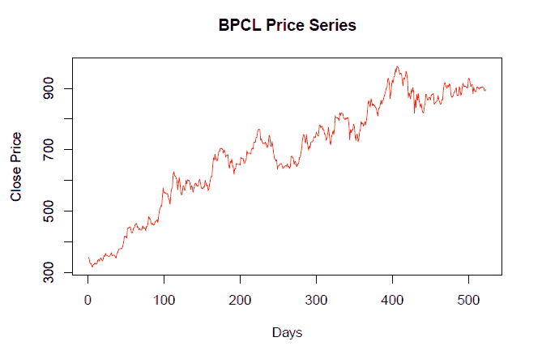
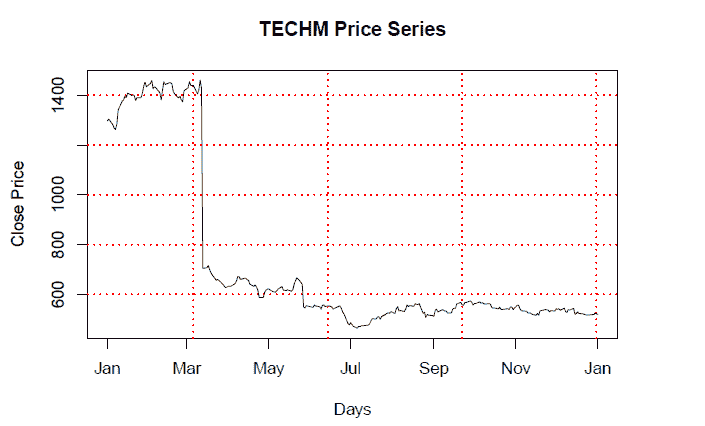
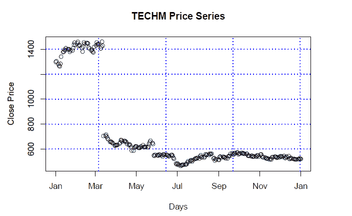
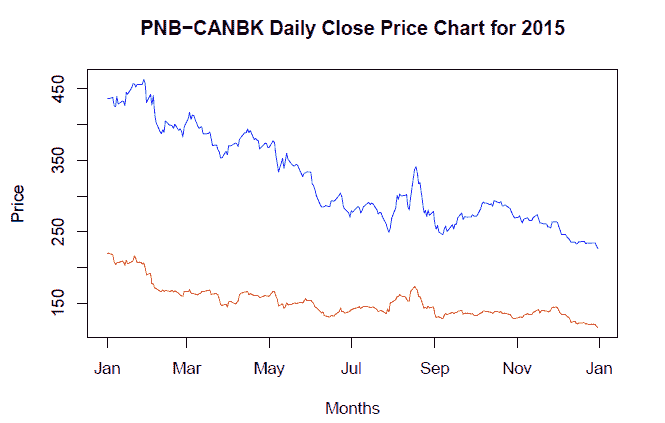

# r 每周简报第八卷

> 原文：<https://blog.quantinsti.com/r-weekly-bulletin-vol-viii/>


本周的 R bulletin 将涵盖绘制图表的主题，如保存图表、添加网格以及在单个图表中绘制多个数据集。希望你喜欢这个 R 周刊。享受阅读！

### 快捷键

1.  运行当前文档- Ctrl+Alt+R
2.  从文档开头运行到当前行- Ctrl+Alt+B
3.  从当前行运行到文档结尾- Ctrl+Alt+E

### 解决问题的想法

#### 将图保存到文件

r 允许您以不同的文件格式保存绘图，如 PNG、JPEG 或 PDF。以下示例概述了在 r 中保存图的过程。

**示例:**我们想为 BPCL 生成一个 2 年收盘价序列图，然后将该图保存到一个 PNG 文件中。我们首先调用 png 函数，并提供所需的文件名、绘图宽度和高度。然后，我们绘制价格序列以及绘图函数所需的参数。最后，我们使用 dev.off 函数关闭图形文件。文件保存在当前工作目录中，除非您指定了其他所需的路径。

```
library(quantmod)
bpcl = getSymbols("BPCL.NS", src = "yahoo", from = "2014-01-01", to = "2016-01-01",
                  auto.assign = FALSE)

bpcl_cl = Cl(bpcl)

plot.ts(bpcl_cl, main = "BPCL Price Series", xlab = "Days", ylab = "Close Price",
        type = "l", col = "red")
```



```
# Call the png function, Plot the vectors, and finally close the graphics file
png("Saving plot.png", width = 680, height = 480)
plot.ts(bpcl_cl, main = "BPCL Price Series", xlab = "Days", ylab = "Close Price",
        type = "l", col = "red")
dev.off()
```

pdf 2

```
# Saving the plot in pdf

pdf("Saving plot.pdf")
plot.ts(bpcl_cl, main = "BPCL Price Series", xlab = "Days", ylab = "Close Price",
        type = "l", col = "red")
dev.off()
```

pdf 2

#### 向绘图添加网格

可以使用网格功能将网格添加到绘图中。为了绘制网格，我们首先使用 type="n "调用 plot 函数来初始化图形框架，而不显示数据。下一步，我们调用 grid 函数来绘制网格。最后，我们调用 lines 函数来绘制覆盖在网格上的图形。如果我们想要点而不是线，我们可以使用点函数。

**举例:**

```
library(quantmod)
techm = getSymbols("TECHM.NS", src = "yahoo", from = "2015-01-01", to = "2016-01-01",
                   auto.assign = FALSE)
techm_cl = coredata(Cl(techm))
days = index(Cl(techm))
# Adding grid to a line chart

plot(days, techm_cl, main = "TECHM Price Series", xlab = "Days", ylab = "Close Price", type = "n")
grid(col = "red", lwd = 1.5)
lines(days, techm_cl)
```



```
# Adding grid to a point chart

plot(days, techm_cl, main = "TECHM Price Series", xlab = "Days", ylab = "Close Price", type = "n")
grid(col = "blue", lwd = 1.5)
points(days, techm_cl)
```



#### 绘制多个数据集

为了绘制多个数据集，我们使用 plot 这样的高级函数，然后使用 lines 这样的低级函数。由于多个数据集可能具有不同的 X 轴和 Y 轴范围，因此以这样一种方式设置两个轴的范围很重要，即绘图包含来自多个数据集的所有数据点。

在下面的例子中，我们绘制了两只股票的 1 年每日收盘价序列，即 PNB 和 CANBK。我们使用 range 函数来确定 xlim 和 ylim 参数。对两个数据集的收盘价序列调用 range 函数可以确保我们绘制出所有的数据点。此后，我们调用 PNB 股票收盘价序列的高级“绘图”函数，并定义其他必要的参数。然后，我们使用低级的“lines”函数来添加 CANBK 股票的收盘价序列。

**举例:**

```
library(quantmod)
pnb = getSymbols("PNB.NS", src = "yahoo", from = "2015-01-01", to = "2015-12-31",
                  auto.assign = FALSE)

canbk = getSymbols("CANBK.NS", src = "yahoo", from = "2015-01-01", to = "2015-12-31",
                    auto.assign = FALSE)

pnb_close = coredata(Cl(pnb))
canbk_close = coredata(Cl(canbk))
date = index(pnb)

main = "PNB-CANBK Daily Close Price Chart for 2015"
xlim = range(as.Date(date))
ylim = range(c(pnb_close, canbk_close))

plot(date, pnb_close, type = "l", lty = 1, pch = 19, col = "red", xlab = "Months",
     ylab = "Price", main = main, xlim = xlim, ylim = ylim)
# Add a line
lines(date, canbk_close, type = "l", lty = 1, pch = 18, col = "blue")
```



### 功能去神秘化

#### 下载.文件

download.file 函数帮助从网站下载文件。这可以是网页、csv 文件、R 文件等。该函数的语法如下所示:

**download.file(** url **，** destfile **)**

其中，url -要下载的文件的统一资源定位符(URL)destfile-保存下载文件的位置，即带有文件名的路径

**示例:**在这个示例中，该函数将从“url”参数中给定的路径下载文件，并以“betawacc.xls”的名称将其保存在 D 驱动器的“Skills”文件夹中。

```
url = "http://www.exinfm.com/excel%20files/betawacc.xls"
destfile = "D:/Skills/wacc.xls"
download.file(url, destfile)
```

#### 文件.复制和文件.重命名

file.copy 函数将文件从一个文件夹复制到另一个文件夹，而 file.rename 函数重命名给定文件夹中的现有文件。

**例子:**函数中要复制的文件的路径作为第一个参数被提及，要复制的位置作为第二个参数被提及。

```
file.copy("C:/Users/MyFolder/TATACHEM.csv", "D:/Documents/TATACHEM.csv")
```

**示例:**函数中把要重命名的文件的路径作为第一个参数提及，把重命名后的文件的位置作为第二个参数提及。语法如下所示:

```
file.rename(from=(path of the file), to=(path of the file))
```

#### file.exists 和 file.remove

file.exists 函数用于检查一个特定的文件是否存在于设置的工作目录或其他指定为函数参数的文件夹中。file.remove 函数用于删除一个特定的文件，如果它存在于设定的工作目录中。

**示例:**这将检查“MyFolder”文件夹中是否存在“TATACHEM.csv”文件。

```
file.exists("C:/Users/MyFolder/TATACHEM.csv")
[1] TRUE
```

这将从“我的文件夹”文件夹中删除“TATACHEM.csv”文件。

```
file.remove("C:/Users/MyFolder/TATACHEM.csv")
```

### **下一步**

我们希望你喜欢这个公告。在接下来的每周公告中，我们将为读者列出更多有趣的方式和方法以及 R 函数。

**更新**

我们注意到一些用户在从雅虎和谷歌金融平台下载市场数据时面临挑战。如果你正在寻找市场数据的替代来源，你可以使用 [Quandl](https://www.quandl.com/) 来获得同样的信息。