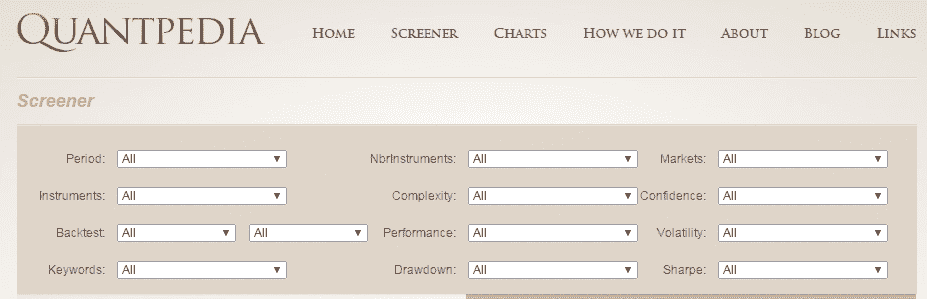
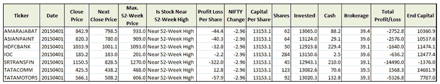
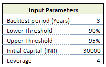
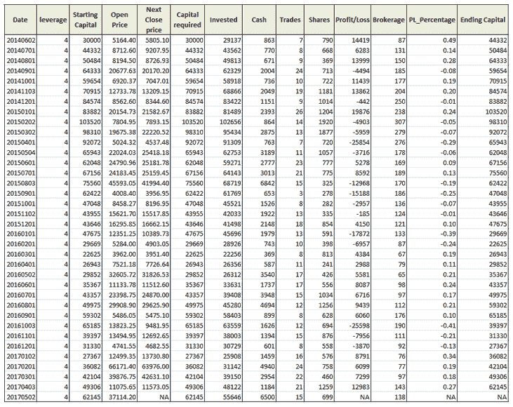
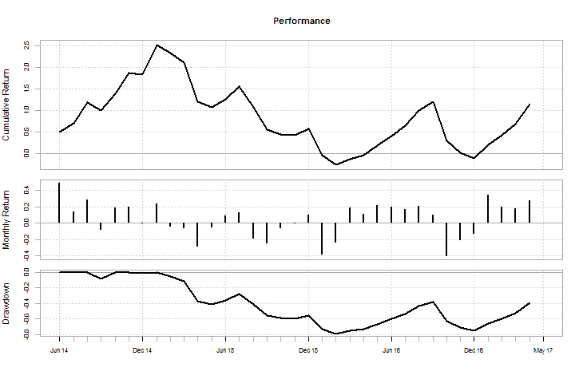

# 交易策略:股票 52 周高点效应

> 原文：<https://blog.quantinsti.com/trading-strategy-52-weeks-high-effect-in-stocks/>


由[米林德·帕拉德卡](https://www.linkedin.com/in/milind-paradkar-b37292107/)

在今天的算法交易中，拥有交易优势是最关键的因素之一。这很简单。如果你没有优势，就不要交易！因此，作为一个量化分析师，你总是在寻找好的交易思路。Quantpedia 网站是广受欢迎的[量化交易策略](https://quantra.quantinsti.com/course/quantitative-trading-strategies-models)的良好资源之一。Quantpedia 有数以千计的金融研究论文，可以用来创建有利可图的交易策略。


Quantpedia 上的“筛选”页面根据不同的参数，如周期、工具、市场、复杂性、性能、亏损、波动性、夏普等，对数百种交易策略进行了分类。



Quantpedia 已经向用户免费提供了一些交易策略。在这篇文章中，我们将探讨一个这样的交易策略，列在他们的网站上，名为“52 周股票高点效应”。

### **股市 52 周高点效应**

Quantpedia 页面<sup>[【1】](http://quantpedia.com/Screener/Details/18)</sup>为该交易策略提供了详细的描述，其中包括 52 周高效解释、源研究论文、其他相关论文、策略表现的可视化以及其他相关交易策略。

### **什么是 52 周高效？**

让我们把量子百科上提供的清晰解释写在这里-

*“52 周高点效应”指出，价格接近 52 周高点的股票比价格远离 52 周 **-** 高点的股票有更好的后续回报。投资者将 52 周高点作为他们评估股票价值的“锚”。当股价接近 52 周高点时，投资者不愿意把价格一直标到基本面价值。因此，当股价接近 52 周高点时，投资者反应不足，这就产生了 52 周高点效应。*

### **源文件**

源论文<sup>[【2】](http://papers.ssrn.com/sol3/papers.cfm?abstract_id=1787378)</sup>“行业信息与 52 周高效效应”由、Bradford D. Jordan 和 Mark H. Liu 撰写。

金融论文称，交易员将 52 周高点作为一个参考点，以此评估消息的潜在影响。当好消息推动股票价格接近或达到 52 周新高时，交易者不愿意抬高股票价格，即使该消息是合理的。信息最终占据上风，价格上涨，导致延续。它同样适用于 52 周低点。

作者开发的交易策略是在股价接近 52 周高点的行业买入股票，在股价远离 52 周高点的行业做空股票。他们发现行业 52 周高点交易策略比 George 和 Hwang (2004)提出的个人 52 周高点交易策略更有利可图。

### **使用 R 编程制定我们的 52 周高效战略**

理解了 52 周高点效应后，我们将尝试使用 R 编程回测一个简单的交易策略。请注意，我们并不是要复制作者在他们的研究论文中提出的交易策略。

我们使用在印度国家证券交易所(NSE)上市的约 140 只股票的每日数据，对我们的交易策略进行了为期 3 年的回溯测试。

#### **战略简介**

交易策略读取列表中每只股票的每日[历史数据](https://quantra.quantinsti.com/course/day-trading-strategies)，并在每个月初检查股票价格是否接近其 52 周高点。我们已经在下面的交易策略制定过程的第 4 步中展示了如何检查这种情况。对于所有通过这个条件的股票，我们在那个月形成一个等权重的投资组合。我们在月初持有这些股票的多头头寸，并在下个月初平仓。我们在回溯测试期间的每个月都遵循这个过程。最后，我们计算并绘制交易策略的绩效指标。

现在，让我们一步步了解交易策略制定的过程。为了便于参考，我们在交易策略的各个步骤下发布了相关部分的 R 代码片段。

#### **交易策略制定的过程**

##### 步骤 **1**

首先，我们设置回溯测试周期，以及用于确定股票是否接近其 52 周高点的上限和下限。

```py
# Setting the lower and upper threshold limits
lower_threshold_limit = 0.90 # (eg.0.90 = 90%)
upper_threshold_limit = 0.95 # (eg.0.95 = 95%)
# Backtesting period (Eg. 1 = 1 year) minimum period selected should be 2 years.
noDays = 4
```

##### **第二步**

在这一步中，我们使用来自 r 的 read.csv 函数读取历史股票数据。我们使用来自 Google finance 的数据，它由开盘价/最高价/最低价/收盘价(OHLC)和成交量值组成。

```py
# Run the program for each stock in the list
for(s in 1:length(symbol)){

print(s)

dirPath = paste(getwd(),"/4 Year Historical Data/",sep="") 
fileName = paste(dirPath,symbol[s],".csv",sep="")
data = as.data.frame(read.csv(fileName))
data$TICKER = symbol[s]}
# Merge NIFTY prices with Stock data and select the Close Price
data = merge(data,data_nifty, by = "DATE") 
data = data[, c("DATE", "TICKER","CLOSE.x","CLOSE.y")] 
colnames(data) = c("DATE","TICKER","CLOSE","NIFTY")
N = nrow(data)
```

##### **第三步:**

由于我们使用每日数据，我们需要确定每个月的开始日期。开始日期不一定是每个月的 1 号<sup>1 号</sup>，因为 1 号<sup>1 号</sup>可以是周末或证券交易所的假日。因此，我们写一个 R 代码，它将决定每个月的第一天。

```py
# Determine the date on which each month of the backtest period starts

data$First_Day = ""

day = format(ymd(data$DATE),format="%d")
monthYr = format(ymd(data$DATE),format="%Y-%m")
yt = tapply(day,monthYr, min)

first_day = as.Date(paste(row.names(yt),yt,sep="-"))
frows = match(first_day, ymd(data$DATE))
for (f in frows) {data$First_Day[f] = "First Day of the Month"}

data = data[, c("TICKER","DATE", "CLOSE","NIFTY","First_Day")]
```

##### **第四步:**

检查股票是否在 52 周高点附近。在这一部分，我们首先计算每只股票的 52 周最高价。然后，我们使用 52 周的最高价格计算上限和下限。

###### **举例:**

如果下限阈值= 0.90，上限阈值= 0.95，52 周上限= 1200，则阈值范围由下式给出:

阈值范围=(0.90 * 1200)–(0.95 * 1200)

阈值范围= 1080 到 1140

如果本月初的股价在这个范围内下跌，我们就认为该股接近 52 周高点。我们还在该步骤中加入了一个附加条件。该条件检查过去 30 天的股票价格是否达到了当前 52 周的最高价格，以及它现在是否在阈值范围内。这样的股票将不包括在我们的投资组合中，因为我们假设股价在达到今天的 52 周高点后正在下跌。

```py
# Check if the stock is near its 52-week high at the start of the each month

data$Near_52_Week_High = "" ; data$Max_52 = numeric(nrow(data)); 
data$Max_Not = numeric(nrow(data));

frows_tp = frows[frows >= 260]
for (fr in frows_tp){

   # This will determine the max price in the last 1 year (252 trading days)
   data$Max_52[fr] = max(data$CLOSE[(fr-252):(fr-1)]) 

  # This will check whether the max price has occurred in the last "x" days.
  data$Max_Not[fr] = max(data$CLOSE[(fr-no_max):(fr-1)]) 

  if ((data$CLOSE[fr] >= lower_threshold_limit * data$Max_52[fr])
      & (data$CLOSE[fr] <= upper_threshold_limit * data$Max_52[fr])
      & (data$Max_Not[fr] != data$Max_52[fr]) == TRUE ){
  data$Near_52_Week_High[fr] = "Near 52-Week High"
  } else {
  data$Near_52_Week_High[fr] = "Not Near 52-Week High"
  }

}
```

##### **第五步:**

对于所有符合上述标准的股票，我们创建一个只做多的投资组合。进场价格等于月初的价格。我们在下个月初结清我们的多头头寸。我们考虑股票的收盘价作为我们的进场和出场交易。

```py
# Enter into a long position for stocks at each start of month

data = subset(data,select=c(TICKER,DATE,CLOSE,NIFTY,First_Day,Max_52,Near_52_Week_High)
             ,subset=(First_Day=="First Day of the Month"))
data$NEXT_CLOSE = lagpad(data$CLOSE, 1)
colnames(data) = c("TICKER","DATE","CLOSE","NIFTY","First_Day","Max_52","Near_52_Week_High",
                   "NEXT_CLOSE")

data$Profit_Loss = numeric(nrow(data)); data$Nifty_change = numeric(nrow(data));

for (i in 1:length(data$CLOSE)) { 
  if ((data$Near_52_Week_High[i] == "Near 52-Week High") == TRUE){
  data$Profit_Loss[i] = round(data$CLOSE[i+1] - data$CLOSE[i],2)
  data$Nifty_change[i] = round(Delt(data$NIFTY[i],data$NIFTY[i+1])*100,2)
  } 
}

for (i in 1:length(data$CLOSE)) { 
  if ((data$Near_52_Week_High[i] == "Not Near 52-Week High") == TRUE){
  data$Profit_Loss[i] = 0
  data$Nifty_change[i] = round(Delt(data$NIFTY[i],data$NIFTY[i+1])*100,2)
  } 

}
```

##### **第六步:**

在这一步中，我们编写了一个 R 代码，它创建了回溯测试期间每个月所有交易的汇总表。下面显示了一个样本汇总表。它还包括当月每笔交易的盈利/亏损。

```py
# Create a Summary worksheet for all the trades during a particular month

final_data = final_data[-1,]
final_data = subset(final_data,select=c(TICKER,DATE,CLOSE,NEXT_CLOSE,Max_52,
                                        Near_52_Week_High,Profit_Loss,Nifty_change),
                                        subset=(Near_52_Week_High == "Near 52-Week High"))

colnames(final_data) = c("Ticker","Date","Close_Price","Next_Close_Price",
                         "Max. 52-Week price","Is Stock near 52-Week high",
                         "Profit_Loss","Nifty_Change")

merged_file = paste(date_values[a],"- Summary.csv")
write.csv(final_data,merged_file)
```



##### **第七步:**

最后一步，我们计算整个回溯测试期间的投资组合绩效，并使用 r 中的 PerformanceAnalytics 包绘制权益曲线。投资组合绩效保存在 CSV 文件中。

```py
cum_returns = Return.cumulative(eq_ts, geometric = TRUE)
print(cum_returns)

charts.PerformanceSummary(eq_ts,geometric=TRUE, wealth.index = FALSE)
print(SharpeRatio.annualized(eq_ts, Rf = 0, scale = 12, geometric = TRUE))
```

投资组合表现的样本摘要如下所示。在这种情况下，我们交易策略的输入参数如下:



###  **绘制股权曲线**



从权益曲线可以看出，我们的交易策略在初始阶段表现良好，但在后验阶段的中期出现了下滑。交易策略的夏普比率为 0.4098。

```py
Cumulative Return 1.172446

Annualized Sharpe Ratio (Rf=0%) 0.4098261
```

这是一个简单的交易策略，我们用 52 周高效解释开发的。人们可以进一步调整这种交易策略，以提高其性能，使其更加稳健，或者在不同的市场进行尝试。

### **下一步**

访问 Gopal 提交的[最终项目](/strategy-using-trend-following-indicators-macd-st-adx/)，作为他在 QuantInsti 的[算法交易(EPAT)](https://www.quantinsti.com/) 高管课程的一部分。该项目涵盖了基于 MACD、超级趋势和用 Python 编码的 ADX 等指标的趋势跟踪策略。

**更新**

我们注意到一些用户在从雅虎和谷歌金融平台下载市场数据时面临挑战。如果你正在寻找市场数据的替代来源，你可以使用 [Quandl](https://www.quandl.com/) 来获得同样的信息。

*免责声明:股票市场的所有投资和交易都有风险。在金融市场进行交易的任何决定，包括股票或期权或其他金融工具的交易，都是个人决定，只能在彻底研究后做出，包括个人风险和财务评估以及在您认为必要的范围内寻求专业帮助。本文提到的交易策略或相关信息仅供参考。*