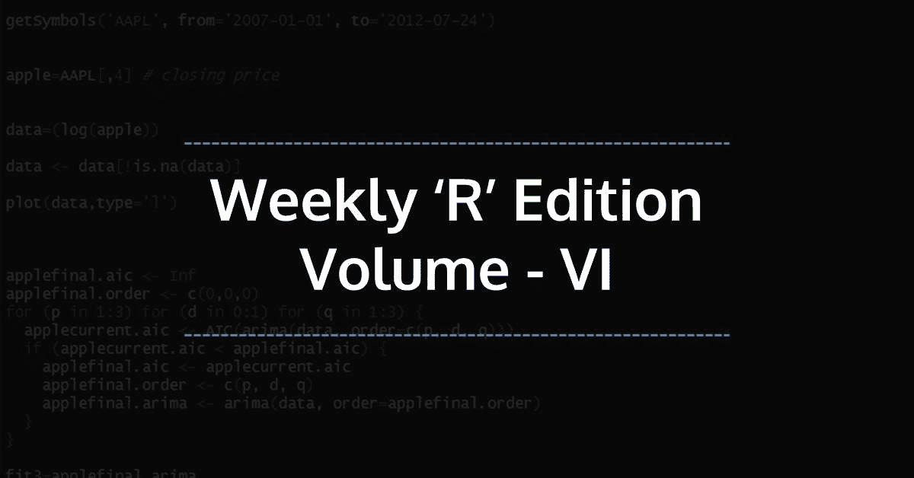
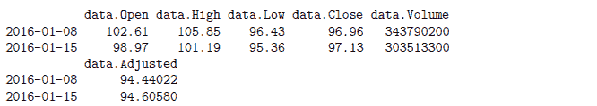

# r 每周简报第六卷

> 原文：<https://blog.quantinsti.com/r-weekly-bulletin-vol-vi/>



本周的 R 公告将涵盖诸如如何解析 R 中的毫秒、如何格式化日期以及提取日期和时间的特定部分的方法等主题。希望你喜欢这个 R 周刊。享受阅读！

### 快捷键

1.  缩进-在行首点击 Tab 键
2.  升级- Shift+Tab
3.  转到特定行- Shift+Alt+G

### 解决问题的想法

#### 如何在 R 中解析毫秒

当 R 从文本或电子表格文件中读取日期时，它通常会将它们存储为字符向量或因子。要将它们转换成日期，我们需要解析这些字符串。可以使用 strptime 函数完成解析，该函数返回 POSIXlt 日期。

要解析日期，必须告诉 strptime 字符串的哪些位对应于日期的哪些位。日期格式是使用字符串指定的，其组成部分用百分号后跟一个字母来指定。请参见下面的示例。这些组件与其他固定字符(如时间中的冒号或日期中的破折号和斜线)组合在一起，形成一个完整的规范。

**举例:**

```py
strptime("25/06/2016 09:50:24", "%d/%m/%Y %H:%M:%S")
```

[1]“2016-06-25 09:50:24 IST”

如果一个字符串与格式字符串中的格式不匹配，则它取值 NA。例如，指定破折号而不是斜线会导致解析失败:

**举例:**

```py
strptime("25-06-2016 09:50:24", "%d/%m/%Y %H:%M:%S")
```

[1]纳

为了解析 R 中的毫秒数，我们使用以下格式字符串:

**举例:**

```py
strptime("25-06-2016 09:50:24.975", "%d-%m-%Y %H:%M:%OS")
```

[1]“2016-06-25 09:50:24.975 IST”op = options(digits . secs = 3)options(op)

options 函数允许用户设置和检查各种全局选项，这些选项会影响 R 计算和显示结果的方式。options 函数的参数“digits.secs”控制以秒为单位格式化时间值时要打印的最大位数。有效值为 0 到 6，默认值为 0。

#### 如何设置日期格式

我们可以使用 strftime ("string format time ")函数按照我们的要求格式化日期。这个函数对 POSIXct 和 POSIXlt 日期类都有效，它将日期变量转换为字符串。

**举例:**

```py
now_time = Sys.time()
# Let us first check the class of the the now_time variable by calling the
# class function.

class(now_time)
```

[1]" posi xct " " POSIX "

可以看出，它是一个“POSIXct”变量。为了正确格式化日期，我们需要使用正确的命名约定。例如，%B 表示月份的全名，%p 表示 AM/PM 时间指示器，依此类推。有关约定的完整列表，请查看函数的帮助页面。所需的格式约定放在引号中，并构成函数的第二个参数。strftime 函数用法的示例如下所示。

```py
strftime(now_time, "%I:%M%p %A, %d %B %Y")
```

[1]“2017 年 4 月 29 日星期六上午 9:16”

#### 提取日期和时间的特定部分

r 有两个标准的日期时间类，POSIXct 和 POSIXlt。POSIXct 类将日期存储为自 1970 年开始以来的秒数，而 POSIXlt 将日期存储为一个列表，其中包含秒、分钟、小时、一个月中的某一天等。可以使用列表索引来访问 POSIXlt 日期的各个部分。这些组件可以使用“松开”功能查看。

**示例:**在这个示例中，我们使用 Sys.time 函数，它给出当前的日期和时间。我们使用 as 将它转换成 POSIXlt 类。POSIXlt 函数。现在我们可以提取所需的组件。

```py
time_now = as.POSIXlt(Sys.time())
print(time_now)
```

[1]“2017-04-29 09:16:06 IST”

```py
unclass(time_now)
```

6.642435 美元

最低[1] 16 美元

$小时[1] 9

$mday [1] 29

$mon [1] 3

第[1]年 117 美元

$wday [1] 6

118 美元

$isdst [1] 0

$zone [1] "IST "

19800 美元

attr(，" tzo ")[1]"是""是"

```py
# To extract minutes
time_now$min
```

[1] 16

```py
# To extract day of the month
time_now$mday
```

[1] 29

### 功能去神秘化

#### %within%和%m+%函数

**%它返回逻辑真或假作为输出。函数需要使用 interval 函数创建的日期时间间隔。我们使用 ymd 函数将非日期时间对象转换成日期时间对象。**

**举例:**

```py
library(lubridate)
dates = interval("2016-03-03", "2016-06-03")
d = ymd("2016-04-21")
d %within% dates
```

[1]正确

**%m+%函数:**该函数用于给定的日期时间对象加上或减去月份。

**例子:**

```py
# To add a month to a date-time objects
library(lubridate)
d = ymd("2016-04-21")
d %m+% months(1)
```

[1] "2016-05-21"

```py
# To create a sequence of months from a given date-time object
library(lubridate)
d = ymd("2016-04-21")
d %m+% months(1:3)
```

[1] "2016-05-21" "2016-06-21" "2016-07-21"

```py
# To subtract a year from a given date-time object
d = ymd("2016-04-21")
d %m+% years(-1)
```

[1] "2015-04-21"

#### to.period 函数

to.period 函数是 xts 包的一部分。它将 OHLC 或单变量对象转换为低于给定数据对象的指定周期。

例如，函数可以将每日系列转换为每月系列，将每月系列转换为每年系列，将一分钟系列转换为每小时系列。

**举例:**

```py
library(quantmod)
data = getSymbols("AAPL", src = "yahoo", from = "2016-01-01", to = "2016-01-15",
       auto.assign = FALSE)
nrow(data)
```

[1] 10

```py
# Convert the above daily data series to weekly data.
to.period(data, period = "weeks")
```



有效的周期字符串包括:“秒”、“分”、“小时”、“天”、“周”、“月”、“季度”和“年”。

要将每日数据转换为每月数据，语法如下:

**df = to.period(data，period = 'months')**

结果将包含给定期间的开盘价和收盘价，以及新期间的最大值和最小值，分别反映在新高和新低中。如果某个时间段的体积可用，也将计算新的体积。

#### period.max 和 period.min 函数

period.max 和 period.min 函数是 xts 包的一部分。period.max 用于在给定要计算的部分的任意索引的情况下，计算每个周期的最大值。period.min 函数以类似的方式计算最小值。

语法如下所示:

```py
period.max(x, index)
period.min(x, index)
```

其中，x -表示单变量数据对象索引-表示端点的数值向量

**举例:**

```py
library(xts)
# compute the period maximum
period.max(c(1, 1, 4, 2, 2, 6, 7, 8, -1, 20), c(0, 3, 5, 8, 10))
```

3 5 8 10 4 2 8 20

```py
# compute the period minimum
period.min(c(1, 1, 4, 2, 2, 6, 7, 8, -1, 20), c(0, 3, 5, 8, 10))
```

3 5 8 10 1 2 6 -1

### **下一步**

我们希望你喜欢这个公告。在[下一期每周简报](https://blog.quantinsti.com/r-weekly-bulletin-vol-vii)中，我们将为读者列出更多有趣的方式方法加上 R 函数。

**更新**

我们注意到一些用户在从雅虎和谷歌金融平台下载市场数据时面临挑战。如果你正在寻找市场数据的替代来源，你可以使用 [Quandl](https://www.quandl.com/) 来获得同样的信息。