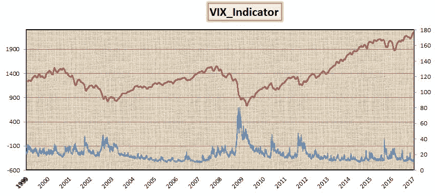
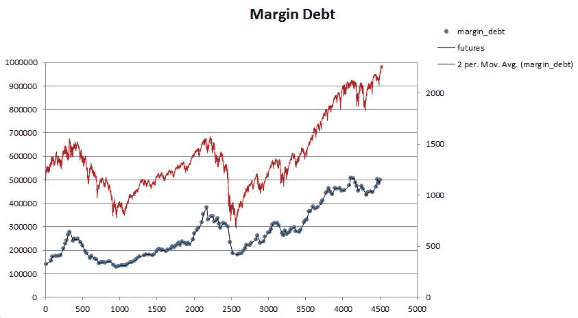
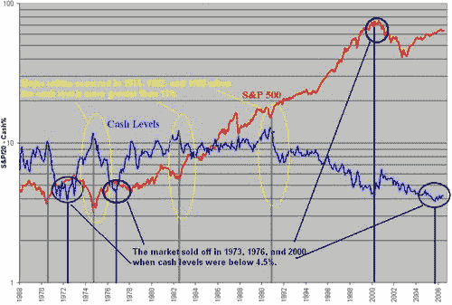

# 情绪交易指标和策略——第二部分

> 原文：<https://blog.quantinsti.com/sentiment-trading-indicators-strategy-part-2/>

由杰伊·马尼尔

在我们关于情绪指标的[上一篇文章](https://blog.quantinsti.com/sentiment-trading-indicators-1/)中，我们看到了如何使用看跌/看涨比率、Arms 指数或短期交易指数(TRIN)等情绪指标进行交易，并围绕这些情绪指标制定策略。在本帖中，我们将探索更多这样的情绪指标，并举例说明使用这些指标可以设计出不同的策略。

## **波动指数**

VIX 是芝加哥期权交易所(CBOE)波动率指数的注册股票代码。这是对标准普尔 500 指数期权在未来 30 天的隐含波动率的测量。

### **VIX 作为一个指标**

*   CBOE 波动率指数(VIX)是标准普尔 500 指数隐含波动率的最新市场估计，通过采用实时标准普尔 500 指数期权的买价/卖价(期权价格)的中点来计算。
*   在 VIX 波动率指数的每一个基点，它提供了一个从最后一个基点开始的 30 天内市场波动的即时指标。
*   因此，波动指数**是前瞻性的**，预测未来市场的波动。
*   VIX 以百分点引用，即 VIX 为 20 表示在 68%的置信水平下或在正态概率分布的一个标准偏差内，标准普尔 500 指数任一方向的预期年变化为 20%。
*   VIX 的通用计算公式为

*   https://www.cboe.com/micro/vix/vixwhite.pdf[CBOE 波动率指数(VIX)的计算有点复杂，但要了解细节，可以参考](https://www.cboe.com/micro/vix/vixwhite.pdf)

### **VIX 解读**

*   实际上，高 VIX 对应于指数水平的价格下降。
*   在理解其中的原因之前，理解期权定价的基础是很重要的。期权价格=内在价值+外在价值；其中外在价值是时间价值和波动性的总和。因此，波动性在期权定价中起着重要的作用。
*   由于波动性，市场下跌通常会导致看跌期权溢价上升。此外，投资者对看跌期权的需求很高，因为持有股票的投资者希望通过购买这些看跌期权来确保他们的股票投资。这种需求是由于进一步预期市场将在实现下跌后下跌，因为波动性导致风险较高。市场波动是由于价格下跌和投资者担心失去投资或获得的资本。因此，他们可能决定通过出售标的资产来获取收益或实现亏损。这增加了期权的溢价，导致 VIX 急剧上升。
*   一般来说，VIX 值超过 30 表明市场存在高度不确定性和恐惧。
*   较低的 VIX 值表明，由于市场中出现的反弹，预计市场将保持平静。
*   上涨增加了投资者的贪婪，他们预计市场会继续上涨。因此，期权卖方以不同的执行价格为他们的看涨期权定价，使得投资者购买期权有足够的利润，但期权在到期前兑现的概率不会太高。在反弹中，买入更多的看涨期权，降低(看跌/看涨比率)PCR 比率——表明市场看涨。投资者可能不希望在某一特定价格水平上一次性实现所有收益，因为他们预计市场会进一步上涨，只会将投资组合中的一小部分系统性地出售给希望进入这轮涨势并持有投资组合中另一部分的新买家。定价过高的股票可能会出现稳步反弹和小幅修正，从而降低整体波动性。
*   这反过来又降低了 VIX 值。VIX 低于 20 通常表明市场平静。

### **策略**

我们将采取基于 VIX 的反向头寸。采取逆势头寸是指在市场大幅下跌时‘买入’，在市场非理性上涨时‘卖出’。反向投资者受益于这样一个理论，即当有某种证券出现积极或消极的群体行为时；由于普遍的看涨或看跌情绪，它会导致证券的错误定价。

*   当 VIX 指数高时(通常高于 30)，我们买入标的指数。由于这表明市场是熊市，隐含波动率很高，我们买入，因为我们预计熊市将从这一水平进行修正，并预计隐含波动率将从这一点回到其均值，表明牛市。

另一个策略是“做空”,即 delta 为正，vega 为负。Delta 为正意味着，随着股价上涨，期权价格也上涨，vega 为负意味着可以从隐含波动率下降中受益。

*   当 VIX 很低(通常低于 15)时，这表明市场看涨，可能会出现回调。我们做“多头”,即 delta 为负，vega 为正，或者我们可以卖出指数。

图片:VIX 水平和相应的标准普尔 500 指数水平

## **保证金债务指标**

一个普通的**现金账户**允许你购买与账户中可用现金金额等值的证券。例如，如果你的账户上有 5000 美元，你想投资在交易所以 100 美元交易的 ABC 公司的股票，那么你可以购买(5000/$100) 50 股 ABC 公司的股票。但是，如果根据你的分析，ABC 公司被低估了，而你预计该股票的价值在短期内会上涨，你可以利用这个机会，要求你的经纪人借钱给你，以便购买你账户上的证券。为此，经纪人会要求你开立一个**保证金账户**。保证金账户是你和你的经纪人之间的协议，经纪人同意借给你一定比例的钱，用于购买金融证券(股票、债券和其他金融工具)。这笔贷款的抵押品将是所购买的金融证券(例如我们的 ABC 公司股票)。然而，在您贷款购买这些证券并签署保证金账户协议之前，有几个先决条件。

*   在用保证金购买证券时，投资者支付的部分称为保证金，经纪人借给你的部分称为保证金债务。
*   这些由各种投资者承担的债务由交易所汇总并公布，因为经纪人需要向交易所报告这些数据。

### **解读**

*   随着时间的推移，未偿还保证金债务总额的增加将与市场的上涨相一致，这表明了积极的购买和看涨的情绪。
*   投资者用保证金购买股票的一个理性原因是，自由现金已经耗尽，投资者仍然看到了买入的机会，因此，投资者用保证金买入股票。
*   但每个保证金账户都有自己的信用额度，即经纪商借给投资者的比例。当这些保证金投资者达到他们的保证金信用限额时，他们继续购买的能力下降，因为市场需求减少，价格可能会停滞不前，甚至可能因为需求减弱而下降。
*   这种疲软的需求是投资者达到其购买自有资产(或投资者的现金)和保证金债务(购买贷款证券的能力)能力极限的结果。
*   这可能导致股票价格或整个指数下跌，从而导致追加保证金。
*   无法获得自由现金和价格下降，并可能迫使投资者或经纪人出售这些保证金账户中的证券，进一步增加抛售压力，进一步将价格降至新低。
*   因此，保证金债务的增加往往与市场价格的上升相一致，而保证金债务的减少往往与市场价格的下降相一致。

### **策略**

*   在历史最低水平的保证金债务，我们将购买指数期货，因为有额外的空间来购买保证金证券，这可能是一个超卖市场的迹象。
*   在历史最高水平的保证金债务，我们将出售指数期货，因为没有更多的空间来购买保证金证券和触发保证金通知的可能性。

图片:保证金债务图表和相应的标准普尔 500 指数水平

### **共同基金现金头寸指标**

共同基金持有市场上所有可投资资产的很大一部分。

*   共同基金现金头寸是共同基金的现金与总资产的比率。

共同基金现金头寸=(共同基金的现金/共同基金的总资产)。

*   这些现金可以是手头的现金，也可以是投资于高流动性货币市场证券的现金，赚取名义回报率。
*   一般来说，这种现金头寸最高可达 5%，这些基金需要随时保持可用，以处理股票赎回、日常运营费用等。
*   现金也每天从客户(投资者)的存款、获得的利息和收到的股息中进入共同基金。
*   在基金经理卖出头寸并持有资金进行再投资后，现金也会增加。

#### **解读**

*   在市场上涨期间，基金经理会希望迅速将现金投入市场，因为现金(理想或货币市场工具)只能获得接近无风险的回报率。把钱留在现金中会降低回报，因为用这些现金投资上涨趋势可以获得高于无风险利率的收益，并提高基金的业绩或整体回报。
*   因此，一般来说，当市场出现中长期上涨趋势时，共同基金的现金头寸低于 4.5 - 5%，因为最大的现金投资于市场，并期望最大限度地利用这些现金。
*   同样，在下跌趋势中，现金投资将获得接近无风险的利率，这将高于市场中可能获得的负回报。因此，基金的现金投资余额增加，期望改善基金的业绩或整体回报。
*   一般来说，在这种短期和中期下跌趋势中，共同基金的现金头寸可能会增加到 11%以上。
*   分析师通常将此解读为逆向投资
*   这是因为当共同基金积累现金时；基金经理看跌，这表明这些基金未来在市场上的购买力。
*   较高的共同基金现金比率表明，市场价格在不久的将来可能会上涨。
*   另一方面，当共同基金的现金很少时，这意味着它们已经被投资，市场价格反映了它们的购买。这使得市场价格上涨的空间变小，因为基金经理预计价格会上涨。

#### **策略**

*   当共同基金的现金比率比最近几年前的现金头寸大幅上升时，我们会买入指数期货。

**共同基金现金头寸水平和相应的标准普尔 500 指数&水平；**图片来源:caps.fool.com

## **结论**

永远记住，当你交易时，不要孤立地使用这些情绪指标。使用不止一个情绪指标的指示，试着理解这种模式背后的基本面和合理性，但要有足够的勇气进行反向操作，利用其他投资者的恐惧或贪婪。在我们关于使用期权情绪指标进行[交易的课程中，我们更深入地研究了这些概念，其中也包括可下载的代码。](https://quantra.quantinsti.com/course/trading-using-options-sentiment-indicators) 

## **下一步**

详细学习期权交易策略。参加我们的 3 门课程包，Python 中的期权交易策略:初级、中级和高级。与 NSE 学院联合开发。该套餐提供 30%的折扣，[单击此处](https://quantra.quantinsti.com/campaign/machine-learning-courses?utm_source=qiblog&utm_medium=referral)了解更多信息。