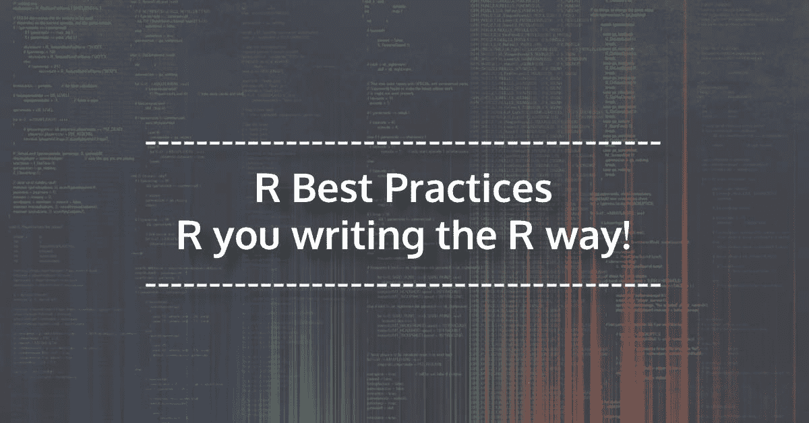
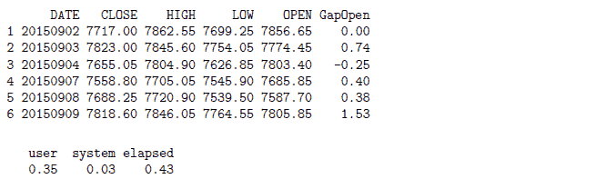
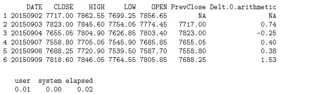
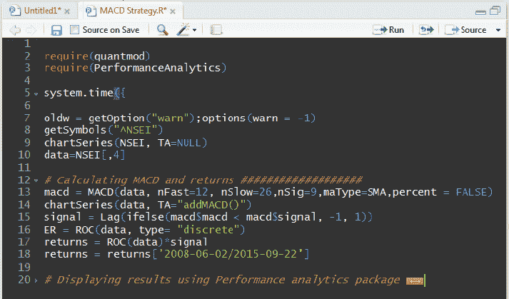
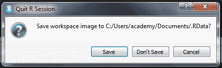

# 最佳实践:用正确的方式写作！

> 原文：<https://blog.quantinsti.com/r-best-practices-r-you-writing-the-r-way/>



由[米林德·帕拉德卡](https://www.linkedin.com/in/milind-paradkar-b37292107/)

任何程序员在日常工作中都不可避免地要编写大量代码。然而，并不是所有的程序员都养成了写清晰代码的习惯，这些代码很容易被其他人理解。原因之一可能是程序员缺乏对编写程序时遵循的最佳实践的认识。对于程序员新手来说尤其如此。在这篇文章中，我们列出了一些 R 编程的最佳实践，它们将提高代码的可读性、一致性和可重复性。请继续阅读！

### 在 R 中写作的最佳实践

1)描述你的代码——当你开始编码时，在第一行描述 R 代码做什么。对于随后的代码块，遵循描述代码块的相同方法。这使得其他人很容易理解和使用代码。

**举例:**

```
# This code captures the 52-week high effect in stocks
# Code developed by Milind Paradkar
```

**2)加载包**–在第一行描述完你的代码后，使用库函数列出并加载执行你的代码所需的所有相关包。

**举例:**

```
library(quantmod);  library(zoo); library(xts);
library(PerformanceAnalytics); library(timeSeries); library(lubridate);
```

使用更新的包–在编写代码时，确保你使用的是最新更新的 R 包。要检查任何 R 包的版本，可以使用 packageVersion 函数。

**举例:**

```
packageVersion("TTR")
[1] ‘0.23.1’
```

**4)将所有源文件组织在同一个目录中—**将您的代码中使用/来源的所有必要文件存储在同一个目录中。您可以使用各自的相对路径来访问它们。

**举例:**

```
# Reading file using relative path
df = read.csv(file = "NIFTY.csv", header = TRUE)
# Reading file using full path
df =  read.csv(file = "C:/Users/Documents/NIFTY.csv", header = TRUE)
```

**5)使用一致的数据结构类型—**R 编程语言允许不同的数据结构，如向量、因子、数据帧、矩阵和列表。对特定类型的数据结构使用类似的命名。这将使识别代码中使用的相似数据结构变得容易，并容易发现问题。

**示例:**您可以通过添加来命名代码中使用的所有不同的数据帧。df 作为后缀。

```
aapl.df   = as.data.frame(read.csv(file = "AAPL.csv", header = TRUE))
amzn.df = as.data.frame(read.csv(file = "AMZN.csv", header = TRUE))
csco.df  = as.data.frame(read.csv(file = "CSCO.csv", header = TRUE))
```

缩进你的代码–缩进让你的代码更容易阅读，尤其是当有多个嵌套语句时，比如 For-loop 和 if 语句。

**举例:**

```
# Computing the Profit & Loss (PL) and the Equity
dt$PL = numeric(nrow(dt))
for (i in 1:nrow(dt)){
   if (dt$Signal[i] == 1) {dt$PL[i+1] = dt$Close[i+1] - dt$Close[i]}
   if (dt$Signal[i] == -1){dt$PL[i+1] = dt$Close[i] - dt$Close[i+1]}
}
```

**7)删除临时对象–**对于运行在数千行代码中的长代码来说，在临时对象在代码中发挥作用后删除它们是一个好的做法。这可以确保 R 不会变成内存问题。

**8)为代码计时–**您可以使用 system.time 功能为代码计时。您还可以使用相同的函数来找出不同代码块所用的时间。该函数返回计算表达式或代码块所花费的时间(秒)。计时代码将有助于找出任何瓶颈，并通过对脚本进行必要的修改来帮助加速您的代码。

为了找出不同块所用的时间，我们在 system.time 函数的调用中将它们用花括号括起来。

该函数返回的两个重要指标包括:I)用户时间——代码向 CPU 收取的时间；ii)运行时间——执行整个代码所用的时间

**例如:**

```
# Generating random numbers
system.time({
mean_1 = rnorm(1e+06, mean = 0, sd = 0.8)
})

user    system    elapsed
0.40      0.00       0.45
```

**9)使用矢量化—**矢量化可以加快代码的执行速度，尤其是在处理大型数据集时。可以使用 ifelse 语句或 with 函数之类的语句进行矢量化。

**举例:**考虑一下俏皮的 1 年期价格系列。让我们使用两种方法(使用 for-loop 和 with 函数)找到每天的缺口，并使用 system.time 函数对它们计时。请注意执行 for 循环所用的时间，以及执行 with 函数和 lagpad 函数所用的时间。

```
library(quantmod)
# Using FOR Loop
system.time({
df = read.csv("NIFTY.csv")
df = df[,c(1,3:6)]
df$GapOpen = double(nrow(df))
for ( i in 2:nrow(df)) {
df$GapOpen[i] = round(Delt(df$CLOSE[i-1],df$OPEN[i])*100,2)
}
print(head(df))
})
```



```
# Using with function + lagpad, instead of FOR Loop
system.time({
df = read.csv("NIFTY.csv")
df = dt[,c(1,3:6)]

lagpad = function(x, k) {
c(rep(NA, k), x)[1 : length(x)]
}

df$PrevClose = lagpad(df$CLOSE, 1)
df$GapOpen_ = with(df, round(Delt(df$PrevClose,df$OPEN)*100,2))
print(head(df))
})
```



**10)折叠代码**–折叠代码是 R 程序员可以折叠代码行或代码段的一种方式。这允许在需要时隐藏代码块，并使浏览冗长的代码变得更容易。代码折叠可以通过两种方式完成:I)代码的自动折叠 ii)用户定义的代码折叠

**自动折叠代码:** RStudio 自动提供折叠代码的灵活性。当程序员编写函数或条件块时，RStudio 会自动创建可折叠的代码。

**用户自定义代码折叠:**用户也可以通过使用编辑- >折叠- >折叠或简单地选择一组代码并按下 Alt+L 键来折叠任意一组代码。

**用户定义的折叠也可以通过代码段来完成:**要插入一个新的代码段，可以使用代码- >插入段命令。或者，任何包含至少四个尾随破折号(-)、等号(=)或井号(#)的注释行将自动创建一个代码段。



**11)严格审查和测试你的代码—**一旦你的代码准备好了，确保你在不同的输入参数上严格测试它。确保 for-loop、if 语句、ifelse 语句等语句中使用的逻辑是正确的。让你的同事审查你的代码以确保工作的高质量是一个好主意。

**12)不要保存你的工作空间****–**当你想退出时，它会检查你是否想保存你的工作空间。建议不要保存工作区，并在一个干净的工作区中开始下一个 R 会话。来自先前 R 会话的对象可能导致难以调试的错误。



这些是用 R 编写的一些最佳实践，你可以遵循它们来使你的代码易于阅读、调试并确保一致性。

### **下一步**

[“高位做空”](https://blog.quantinsti.com/shorting-high-algo-trading-strategy-r/)是项目工作中制定的策略之一。这篇文章简要解释了这个策略和编码部分。

*免责声明:股票市场的所有投资和交易都涉及风险。在金融市场进行交易的任何决定，包括股票或期权或其他金融工具的交易，都是个人决定，只能在彻底研究后做出，包括个人风险和财务评估以及在您认为必要的范围内寻求专业帮助。本文提到的交易策略或相关信息仅供参考。T3】*