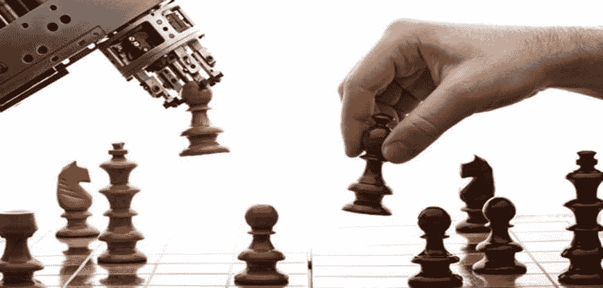
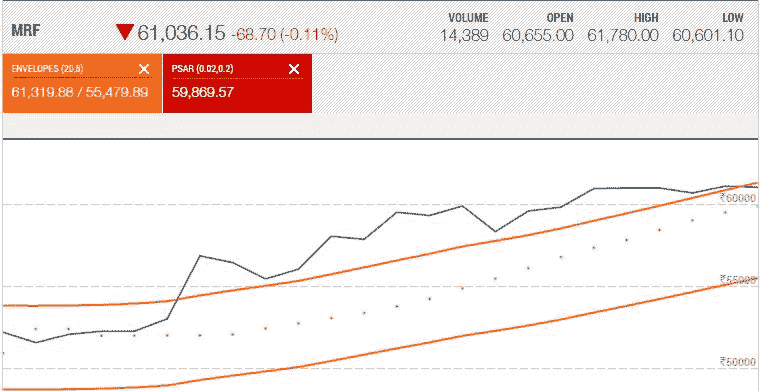
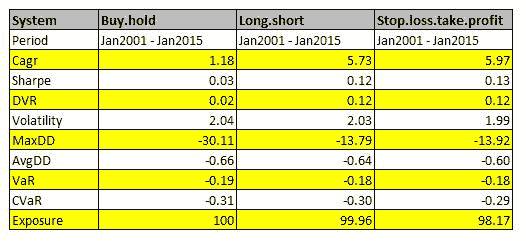

# 算法交易与全权交易

> 原文：<https://blog.quantinsti.com/algorithmic-trading-vs-discretionary-trading/>

由尼廷·塔帕尔

### **简介**

如果你是全权交易者，你可能以前问过这些问题

*   算法交易的未来[是怎样的？](/algorithmic-trading-india/)
*   我应该从全权委托交易转为算法交易吗？
*   算法交易正在接管金融市场吗？
*   这场人机大战，谁会赢？

为了回答这些问题，我们首先需要知道是什么使这些实践彼此不同。

在这篇文章中，我们将尝试解读所有与算法交易和自主交易相关的问题。

### **全权委托交易**

全权交易者有一套他们在交易实践中遵循的规则，这些规则会根据他们的经验和最适合他们的方式进行修改或替换。一些人严格遵循这些规则，而另一些人则倾向于试验，直到他们觉得已经破解了代码，并继续对他们的策略进行必要的修改。

全权交易者研究信号和图表，然后决定是否买入或卖出资产。交易员在全权委托交易中发号施令，即何时进入或退出头寸。

在自主交易中，最大风险来自于交易者在不受控制的情绪影响下做出的决定。在大多数情况下，这些情绪会导致无法合理辩护的交易。因此，为了获利，不仅要有一个有利可图的策略，还要检查自己的情绪，这变得极其重要。

### **算法交易**

系统交易者使用算法来做出交易相关的决策，或者预测他们从投资中获利的最佳机会。算法根据市场条件、股票类型、市场等而改变。

一个系统的交易者不能依靠手动研究图表和阅读信号来忍受不确定性。他/她更喜欢根据历史数据做出预测，建立一个适合市场条件的算法策略，编码并启动它。他们的角色变成了一个旁观者，根据已经建立的逻辑监控算法的性能，并在算法性能下降或停止工作时做出必要的改变。

### **关键差异化因素**

#### [交易策略](/algorithmic-trading-strategies/):

全权交易者的交易策略来自于通过学习图表、市场条件、理解指示信号和其他相关因素收集的信息，这些信息帮助他们在下单或决定何时退出之前起草一套特定的规则。

另一方面，算法交易者发现仅仅依靠图表收集的结果是有风险的。下单或退出的决定取决于算法。算法的设计基于:

*   衍生品知识
*   编程技能
*   统计与概率
*   风险管理技能
*   史料研究
*   预测

这由具有所需技能组合的 algo [专业人员来完成。该系统研究市场，并根据算法的逻辑集做出决策。](/top-skills-nailing-quant-trader-interview/)

#### 人类情绪的影响:

全权交易者在决策时容易受到情绪因素的影响。在预测可能导致重大损失的结果时，交易者往往倾向于为自己的情绪偏见辩护。

在算法交易中，受情绪相关因素影响的风险几乎为零。数学模型纯粹基于指令集，消除了任何情绪的干预，无论是贪婪、恐惧、错误的直觉等等。

#### 自动化:

全权委托交易的做法限制了为你发号施令的自动化系统的使用。它由交易者手动管理，系统对你下一步想做什么没有什么发言权。

算法交易员不需要监控市场和阅读图表，因为交易是自动完成的。输入系统的信息由黑匣子进行处理，并提出最佳可能结果的建议。一旦交易者确信了结果，他们就可以打开算法，只需筛选进程并做出相应的改变。

#### 预定义的规则:

全权交易者没有预先定义的规则。购买或退出是基于交易者的经验和研究做出的，这可能导致每次执行有多个交易规则。

算法交易的规则是预先定义好的，并经过回溯测试。历史数据的回溯测试增加了成功结果的可能性。交易被置于由算法控制的预定义水平。

#### 分析当前市场状况:

由于市场条件的突然变化，全权交易者的冲动行为可能导致损失。这可能是因为缺乏了解或者没有读懂市场的波动性。

情绪分析等技术有助于算法在这种情况下表现更好，并能够根据外部因素解读市场波动。

#### 全权交易者观察到的指标

全权交易者对上述价格图表的一组典型观察结果可列举如下:

*   总体趋势是上升的
*   我应该把止损和限价放在哪里？
*   能够影响上升趋势的当前新闻
*   移动平均线也在上升
*   电流指示器发出反转信号

#### 算法交易者观察到的指标

算法交易者的观察和结论可以列举如下:

*   算法成功的概率是多少，它为我盈利的概率是多少？
*   历史数据表明了什么？
*   基于当前和历史趋势对股票的未来估计
*   一只股票的时间序列说明了什么
*   我设计的策略的误差幅度是多少？

### **结论**

技术是进化的一部分，我们人类创造了将定义本世纪的技术。适应新的更好的交易方式类似于获得更好的结果，你不能逃避。算法减少了误差幅度，消除了“人为因素”,如情绪、基于人工交易的错误、陈旧的交易策略等

像超级计算机一样，算法交易遵循严格的规则和逻辑。

引用艾伯特·希布斯的话:“尽管我没能登上月球，但我的机器做到了”

所以让你的机器为你赚钱吧。

### **下一步**

如果你想学习算法交易的各个方面，那就去看看算法交易(EPAT)中的 T2 高管课程。该课程涵盖了统计学&计量经济学、金融计算&技术和算法&定量交易等培训模块。EPAT 让你具备成为成功交易者所需的技能。[现在报名](https://www.quantinsti.com/epat/)！