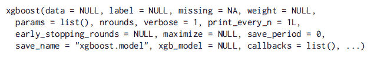
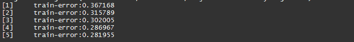
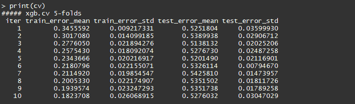
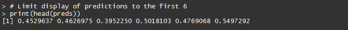
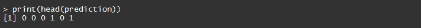
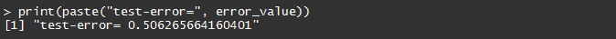
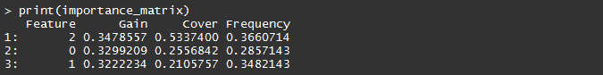
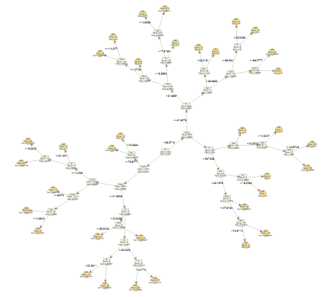

# 使用极端梯度推进(XGBoost)预测市场

> 原文：<https://blog.quantinsti.com/forecasting-markets-using-extreme-gradient-boosting-xgboost/>

由[米林德·帕拉德卡](https://www.linkedin.com/in/milind-paradkar-b37292107/)

近年来，[用于交易的机器学习](https://quantra.quantinsti.com/course/introduction-to-machine-learning-for-trading)因其在交易中的有利可图的应用而引起了很多好奇。许多机器学习模型，如线性/逻辑回归、支持向量机、神经网络、基于树的模型等。正在被尝试和应用于分析和预测市场。研究人员发现，与其他机器学习模型相比，一些模型的成功率更高。极端梯度推进也称为 [XGBoost](https://blog.quantinsti.com/xgboost-python/) 就是这样一种机器学习模型，吸引了机器学习从业者的大量关注。

在本帖中，我们将介绍 XGBoost 的基础知识，它是许多 kaggle 竞赛的获胜模型。然后，我们尝试使用 R 编程中的“xgboost”包开发一个 XGBoost 股票预测模型。

## **XGBoost 及相关概念的基础知识**

极端梯度推进(XGBoost)模型由陈天琦开发，是梯度推进框架的一种实现。梯度推进算法是一种用于构建基于树的预测模型的机器学习技术。([机器学习:决策树介绍](https://blog.quantinsti.com/understanding-decision-trees/))。

Boosting 是一种集成技术，其中添加了新的模型来纠正现有模型产生的错误。模型按顺序添加，直到不能再进一步改进。

集成技术使用树集成模型，它是一组分类和回归树(CART)。使用集成方法是因为单个 CART 通常没有很强的预测能力。通过使用一组 CART(即，树集合模型)，考虑多棵树的预测的总和。

梯度推进是一种方法，在这种方法中，创建新模型来预测先前模型的残差或误差，然后将它们相加在一起以做出最终预测。

XGBoost 模型的目标如下:

**Obj = L+****ω**

其中，L 是控制预测能力的损失函数，ω是控制简单性和过拟合的正则化分量

需要优化的损失函数(L)可以是回归的均方根误差、二元分类的对数损失或多类分类的对数损失。

正则化分量(ω)取决于树叶的数量和在树集合模型中分配给树叶的预测分数。

它被称为梯度提升，因为它使用了一种[梯度下降算法](http://www.onmyphd.com/?p=gradient.descent)来最小化添加新模型时的损失。梯度推进算法支持回归和分类预测建模问题。

[T2】](https://www.quantinsti.com/learn-algo-trading/)

## **样本 XGBoost 模型:**

我们将使用“xgboost”R 包来创建一个样本 XGBoost 模型。这里可以参考“xgboost”包[的文档。](https://cran.r-project.org/web/packages/xgboost/xgboost.pdf)

**安装并加载 xgboost 库—**

我们使用 install.packages 函数在 R 中安装 xgboost 库。为了加载这个包，我们使用库函数。我们还加载运行代码所需的其他相关包。

```
install.packages("xgboost")
# Load the relevant libraries
library(quantmod); library(TTR); library(xgboost);
```

**创建输入特征和目标变量—**我们获取一只股票的 5 年 OHLC 和成交量数据，并使用该数据集计算技术指标(输入特征)。计算的指标包括相对强度指数(RSI)、平均方向指数(ADX)和抛物线 SAR (SAR)。我们在计算指标中创建一个滞后，以避免前瞻偏差。这为我们提供了在 r 中构建 XGBoost 模型的输入特性，因为这是一个示例模型，所以我们只包含了几个指标来构建我们的输入特性集。

```
# Read the stock data 
symbol = "ACC"
fileName = paste(getwd(),"/",symbol,".csv",sep="") ; 
df = as.data.frame(read.csv(fileName))
colnames(df) = c("Date","Time","Close","High", "Low", "Open","Volume")
# Define the technical indicators to build the model 
rsi = RSI(df$Close, n=14, maType="WMA")
adx = data.frame(ADX(df[,c("High","Low","Close")]))
sar = SAR(df[,c("High","Low")], accel = c(0.02, 0.2))
trend = df$Close - sar
# create a lag in the technical indicators to avoid look-ahead bias 
rsi = c(NA,head(rsi,-1)) 
adx$ADX = c(NA,head(adx$ADX,-1)) 
trend = c(NA,head(trend,-1))
```

我们的目标是使用这些输入特征预测每日股票价格变化的方向(上涨/下跌)。这使得它成为一个二元分类问题。我们计算每日价格变化，如果每日价格变化为正，则分配正 1。如果价格变化是负的，我们指定一个零值。

```
# Create the target variable
price = df$Close-df$Open
class = ifelse(price > 0,1,0)
```

**将输入特征组合成一个矩阵-**将输入特征和上述步骤中创建的目标变量组合成一个矩阵。我们在 xgboost 模型中使用矩阵结构，因为 XGBoost 库允许矩阵格式的数据。

```
# Create a Matrix
model_df = data.frame(class,rsi,adx$ADX,trend)
model = matrix(c(class,rsi,adx$ADX,trend), nrow=length(class))
model = na.omit(model)
colnames(model) = c("class","rsi","adx","trend")
```

**将数据集分为训练数据和测试数据—**在下一步中，我们将数据集分为训练数据和测试数据。使用这个训练和测试数据集，我们创建各自的输入特征集和目标变量。

```
# Split data into train and test sets 
train_size = 2/3
breakpoint = nrow(model) * train_size

training_data = model[1:breakpoint,]
test_data = model[(breakpoint+1):nrow(model),]
# Split data training and test data into X and Y
X_train = training_data[,2:4] ; Y_train = training_data[,1]
class(X_train)[1]; class(Y_train)

X_test = test_data[,2:4] ; Y_test = test_data[,1]
class(X_test)[1]; class(Y_test)
```

**在训练数据集上训练 XGBoost 模型—**

我们使用 xgboost R 函数来训练模型。xgboost R 函数的参数如下图所示。



xgboost R 函数中的数据参数用于输入要素数据集。它接受矩阵、dgCMatrix 或本地数据文件。nrounds 参数指的是最大迭代次数(即添加到模型中的树的数量)。obj 参数指的是定制的目标函数。它返回给定预测和数据的梯度和二阶梯度。

```
# Train the xgboost model using the "xgboost" function
dtrain = xgb.DMatrix(data = X_train, label = Y_train)
xgModel = xgboost(data = dtrain, nround = 5, objective = "binary:logistic")
```

**输出—**输出是训练数据集上的分类误差。



**交叉验证**

我们还可以使用 xgboost R 的交叉验证功能，即 xgb.cv。在这种情况下，原始样本被随机划分为 n 个相同大小的子样本。在 nfold 子样本中，保留一个子样本作为测试模型的验证数据，其余(nfold - 1)子样本用作训练数据。然后，交叉验证过程重复 n 次，每个 nfold 子样本仅用一次作为验证数据。

```
# Using cross validation
dtrain = xgb.DMatrix(data = X_train, label = Y_train)
cv = xgb.cv(data = dtrain, nround = 10, nfold = 5, objective = "binary:logistic")
```

**Output-**xgb . cv 返回包含交叉验证结果的 data.table 对象。



[T2】](https://www.quantinsti.com/learn-algo-trading/)

**对测试数据进行预测**

为了对看不见的数据集(即测试数据)进行预测，我们对其应用了经过训练的 XGBoost 模型，该模型给出了一系列数字。

```
# Make the predictions on the test data
preds = predict(xgModel, X_test)
# Determine the size of the prediction vector
print(length(preds))
# Limit display of predictions to the first 6
print(head(preds))
```

**输出—**



这些数字看起来不像二元分类{0，1}。因此，在我们能够使用这些结果之前，我们必须执行一个简单的转换。在下面显示的示例代码中，我们将预测的数字与阈值 0.5 进行比较。阈值可以根据建模者的目标、建模者想要跟踪和优化的度量(例如 F1 分数、精确度、召回率)来改变。

```
prediction = as.numeric(preds > 0.5)
print(head(prediction))
```

**输出-**



**测量模型性能**

可以使用不同的评估指标来衡量模型性能。在我们的例子中，我们将计算一个简单的指标，平均误差。它将预测得分与阈值 0.50 进行比较。

例如:如果预测得分小于 0.50，则(preds > 0.5)表达式给出的值为 0。如果这个值不等于测试数据集中的实际结果，那么它被认为是错误的结果。

我们将所有预测值与 Y_test 中的相应数据点进行比较，并计算平均误差。下面给出了测量性能的代码。或者，我们可以使用命中率或创建混淆矩阵来衡量模型性能。

```
# Measuring model performance
error_value = mean(as.numeric(preds > 0.5) != Y_test)
print(paste("test-error=", error_value))
```

**输出-**



**绘制特征重要性集合-** 我们可以通过使用 xgb.importance 函数来找到模型中最重要的特征。

```
# View feature importance from the learnt model
importance_matrix = xgb.importance(model = xgModel)
print(importance_matrix)
```



**绘制 XGBoost 树**

最后，我们可以使用 xgb.plot.tree 函数绘制 XGBoost 树。为了将绘图限制在特定数量的树上，我们可以使用 n *first* tree 参数。如果为空，则绘制模型的所有树。

```
# View the trees from a model
xgb.plot.tree(model = xgModel)
# View only the first tree in the XGBoost model
xgb.plot.tree(model = xgModel, n_first_tree = 1)
```



## **结论**

这篇文章介绍了流行的 XGBoost 模型，以及用 R 编程预测股票价格每日变化方向的示例代码。读者可以看到我们以前的一些机器学习博客(下面给出了链接)。我们将在未来的帖子中涵盖更多的机器学习概念和技术。

[算法交易的 R 预测建模](https://blog.quantinsti.com/predictive-modeling-algorithmic-trading/) [机器学习及其在外汇市场的应用](https://blog.quantinsti.com/machine-learning-application-forex-markets-working-models/)

## **下一步**

阅读我们的帖子“使用 ARIMA 模型预测股票回报”，该帖子涵盖了流行的 ARIMA 预测模型来预测股票回报，并演示了使用 R 编程进行 ARIMA 建模的一步一步的过程。

*免责声明:股票市场的所有投资和交易都涉及风险。在金融市场进行交易的任何决定，包括股票或期权或其他金融工具的交易，都是个人决定，只能在彻底研究后做出，包括个人风险和财务评估以及在您认为必要的范围内寻求专业帮助。本文提到的交易策略或相关信息仅供参考。T3】*

## 下载数据文件

*   ACC.csv