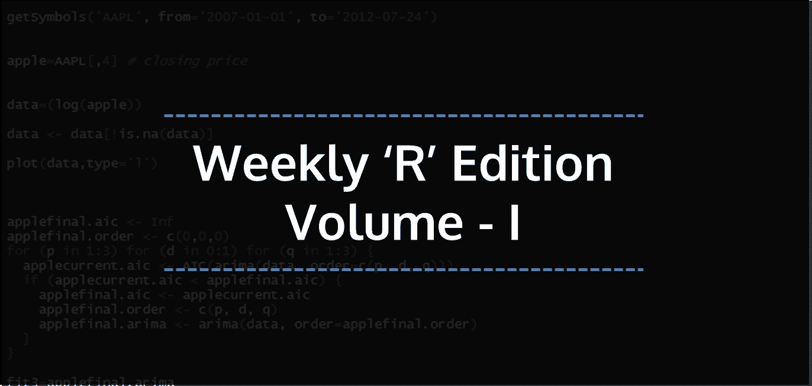

# r .每周简报第一卷

> 原文：<https://blog.quantinsti.com/r-weekly-bulletin-vol-i/>



我们从 R 每周公告开始，它将包含一些有趣的用 R 写代码和解决 bug 问题的方式和方法。我们还将为初学者介绍 R 函数和快捷键。我们知道用 R 编写代码的方法不止一种，公告中列出的解决方案可能不是您唯一的参考点。尽管如此，我们相信列出的解决方案将对我们的许多读者有所帮助。希望你喜欢我们的每周简报。享受阅读它们吧！

### **快捷键**

1.  将光标移动到 R 源代码编辑器- Ctrl+1
2.  将光标移动到 R 控制台- Ctrl+2
3.  要清除 R 控制台- Ctrl+L

### **解题思路**

#### **创建用户输入功能**

为了在 R 中创建用户输入功能，我们可以使用 readline 函数。这给了我们在代码运行时为我们选择的变量设置输入值的灵活性。

例如:假设我们已经编写了一个回溯测试策略。我们希望有选择回溯测试周期的灵活性。为此，我们可以创建一个用户输入“n”，表示以年为单位的回溯测试期，并在代码的开头添加如下所示的行。

当代码运行时，它将提示用户输入“n”的值。输入值后，R 代码将在设定的时间内执行，并产生所需的输出。

```
n = readline(prompt = "Enter the backtest period in years: ")
```

#### **每 x 秒刷新一次代码**

为了每 x 秒刷新一次代码，我们可以使用 while 循环和 Sys.sleep 函数。“while 循环”一直执行封闭的命令块，直到条件保持满足。我们将代码放在 while 语句中，并保持条件为真。通过保持条件为真，它将继续循环。在代码的最后，我们添加了 Sys.sleep 函数，并以秒为单位指定延迟时间。这样，代码将每隔“x”秒刷新一次。

**例子:**在这个例子中，我们将 x 值初始化为零。代码每 1 秒刷新一次，它会一直打印 x 的值，你可以按键盘上的 escape 键终止代码。

```
x = 0 
while (TRUE) { 
x = x + 1 print(x) 
Sys.sleep(1) 
}
```

#### **顺序运行多个 R 脚本**

要运行多个 R 脚本，可以有一个包含要运行的脚本名称的主脚本。运行主脚本将导致其他 R 脚本的执行。假设主脚本的名称是“NSE 股票”。r”。在这个脚本中，我们将提到我们希望在源函数中运行的脚本的名称。在本例中，我们希望运行“顶级收益者”。r”和“最大输家”。r”脚本。这些将是“NSE 股票”的一部分。r "如下所示，我们运行主脚本来运行这两个脚本。

```
source("Top gainers.R")
source("Top losers.R")
```

将 R 脚本名包含在“source”函数中会导致 R 接受来自指定文件的输入。从该文件中读取并解析输入，直到到达文件的末尾，然后在所选的环境中按顺序计算解析后的表达式。或者，也可以将 R 脚本名放在一个向量中，并使用 sapply 函数。

**举例:**

```
filenames = c("Top gainers.R", "Top losers.R") 
sapply(filenames, source)
```

#### **将美国格式的日期转换为标准日期格式**

美国的日期格式是 mm/dd/yyyy 类型，而 ISO 8601 的标准格式是 yyyy-mm-dd。要将日期从美国格式转换为标准日期格式，我们将使用 as。日期函数和格式函数。下面的示例说明了该方法。

**举例:**

```
# date in American format dt = "07/24/2016" # If we call the as.Date function on the date, it will  
# throw up an error, as the default format assumed by the as.Date function is yyyy-mmm-dd.
as.Date(dt)
```

char tote(x)中的错误:字符串不是标准的明确格式

```
# Correct way of formatting the date 
as.Date(dt, format = "%m/%d/%Y")
```

[1] "2016-07-24"

#### **如何从文件夹中删除所有现有文件**

要从特定文件夹中删除所有文件，可以使用取消链接功能。指定文件夹的路径作为函数的参数。带有星号的正斜杠被添加到路径的末尾。下面给出了语法。

**unlink(" path/*)**

**举例:**

```
unlink("C:/Users/Documents/NSE Stocks/*")
```

这将删除“NSE 股票”文件夹中的所有文件。

### **功能去神秘化**

#### **write.csv 函数**

如果您想在 csv 文件中保存数据帧或矩阵，R 提供了 write.csv 函数。write.csv 函数的语法如下所示:

**write.csv(x，file="filename "，row.names=FALSE)**

如果我们指定 row.names=TRUE，该函数将为每一行添加一个取自数据的 row.names 属性的标签。如果您的数据没有行名，那么函数只使用行号。默认情况下，写入列标题行。如果不需要列标题，请设置 col.names=FALSE。

**举例:**

```
# Create a data frame 
Ticker = c("PNB","CANBK","KTKBANK","IOB") 
Percent_Change = c(2.30,-0.25,0.50,1.24) 
df = data.frame(Ticker,Percent_Change) 
write.csv(df, file="Banking Stocks.csv", row.names=FALSE)
```

这将把“df”数据帧中包含的数据写入“Banking Stocks.csv”文件。文件保存在 R 工作目录中。

#### **修复功能**

fix 函数显示作为参数提供的函数的底层代码。

**举例:**

```
fix(sd)
```

标准差函数的底层代码如下所示。当我们使用“sd”作为参数执行 fix 函数时，就会显示这个消息。

```
function (x, na.rm = FALSE) 
sqrt(var(if (is.vector(x) || is.factor(x)) x else as.double(x), na.rm = na.rm))
```

#### **download.file 功能**

download.file 函数帮助从网站下载文件。这可以是网页、csv 文件、R 文件等。该函数的语法如下所示:

**download.file(** url **，** destfile **)**

其中，url -要下载的文件的统一资源定位符(URL)destfile-保存下载文件的位置，即带有文件名的路径

**示例:**在本例中，该函数将从“url”参数中给定的路径下载文件，并以“betawacc.xls”的名称将其保存在 D 驱动器的“Skills”文件夹中。

```
url = "http://www.exinfm.com/excel%20files/betawacc.xls"
destfile = "D:/Skills/wacc.xls"
download.file(url, destfile)
```

### **下一步**

我们希望你喜欢这个公告。在接下来的每周公告中，我们将为读者列出更多有趣的方式和方法以及 R 函数。