# I B- I brokers R 包的体系结构解释

> 原文：<https://blog.quantinsti.com/r-implementation-in-interactive-brokers-api/>


由[米林德·帕拉德卡](https://www.linkedin.com/in/milind-paradkar-b37292107/)

在上一篇关于使用 IBrokers 包的文章中，我们向读者介绍了 IBrokers 包的一些基本功能，这些功能用于通过 R 检索市场数据、查看账户信息以及执行/修改订单。这篇文章将介绍 IBrokers 包的结构，该包将使 R 用户能够构建他们的定制交易策略，并通过交互式经纪人交易工作站(TWS)执行这些策略。

### **交互式经纪人 API 架构概述**

在我们解释 IBrokers 包的底层结构之前，让我们先来概述一下交互式代理 API 架构。Interactive Brokers 提供了可以在 Windows、Linux 和 MacOS 上运行的 API 程序。API 与 IB TWS 建立连接。反过来，TWS 连接到 IB 数据中心，因此，所有通信都通过 TWS 路由。

IBrokers R 包使用户能够用 R 编写他的策略，并通过 IB TWS 帮助它执行。下面是流程结构图。*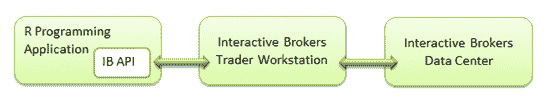T2】*

### **从 TWS 获取数据**

为了从 IB TWS 中检索数据，IBrokers R 包包括五个重要的函数。

*   reqContractDetails:检索详细的产品信息。
*   reqMktData:检索实时市场数据。
*   reqMktDepth:检索实时订单簿数据。
*   reqRealTimeBars:检索实时 OHLC 数据。
*   reqHistoricalData:检索历史数据。

除了这些功能之外，还有帮助功能，使用户能够容易地创建上述数据功能。这些助手功能包括:

*   twsContract:创建一个通用协定对象。
*   tws quality/tws STK:用于创建权益合同对象的包装程序
*   twsOption/twsOPT:用于创建选项协定对象的包装。
*   twsFuture/twsFUT:创建期货合同对象的包装程序。
*   twsFuture/twsFOP:创建期货期权合约对象的包装程序。
*   twsCurrency/twsCASH:用于创建货币合约对象的包装程序。

**举例:**

```py
tws = twsConnect()
reqMktData(tws, twsSTK("AAPL"))
```

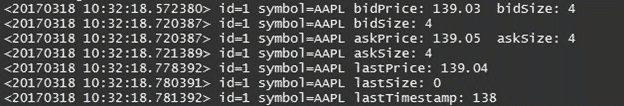

### **实时数据模型结构**

当使用数据函数访问市场数据流时，TWS API 接收到的数据流遵循特定的路径，该路径能够将这些数据流存储到相关的消息类型中。下面显示的是 reqMktData 函数的参数列表。

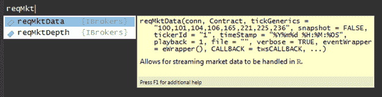 **示例:**reqMktData 函数的参数

**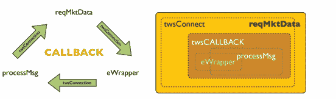T2】**

来源:R -马尔科姆·谢灵顿的算法交易

**实时数据模型**

在下面的小节中，我们将看到这个数据模型是如何工作的，以及如何定制实时数据函数(例如 reqMktData)的参数来创建 r 中用户定义的自动交易程序。

### **使用回调参数**

像 reqMktData、reqMktDepth 和 reqRealTimeBars 这样的数据函数都有一个特殊的回调参数。默认情况下，该参数从 IBrokers 包中调用 twsCALLBACK 函数。

twsCALLBACK 函数的一般逻辑是从 TWS 接收每个传入消息的标头。然后将它与 eWrapper 对象一起传递给 processMsg 函数。eWrapper 对象可以维护状态数据(价格)，并具有管理来自 TWS 的所有传入消息类型的函数。一旦 processMsg 调用返回，就会出现另一个无限循环。

在下面显示的传入消息示例中，我们用绿色圈出了一条消息(1 6 1 4 140.76 1 0)。第一个数字(即 1)是报头，其余数字(即 6 1 4 140.76 1 0)构成了消息的正文。

来自函数 reqMktData 调用的传入消息

根据消息类型，收到的每条消息都将调用适当命名的 eWrapper 回调。默认情况下，如果没有指定，代码将调用默认方法，通过 cat 将结果打印到屏幕上。

**默认方法示例:**

**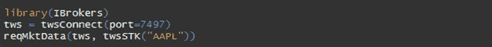T2】**

结果:

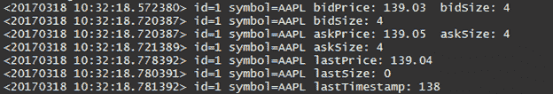

设置 CALLBACK = NULL 会将原始消息级数据发送到 cat，cat 又会使用该函数的 file 参数将数据返回到标准输出，或者通过打开的连接、文件或管道进行重定向。

**回调参数设置为空的示例:**

**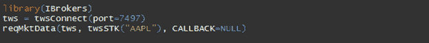T2】**

结果: **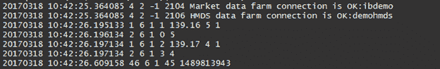**

回调，通过回调和事件包装器，被设计为允许实时数据流的 R 级处理。回调有助于定制输出(即输入的结果)，该输出可用于根据用户定义的标准在 R 中创建自动交易程序。

**tw callback 函数的内部代码**

回调函数(即 twsCALLBACK 函数)内部是一个循环，它获取传入的消息类型，并在每个新消息时调用 processMsg 函数。

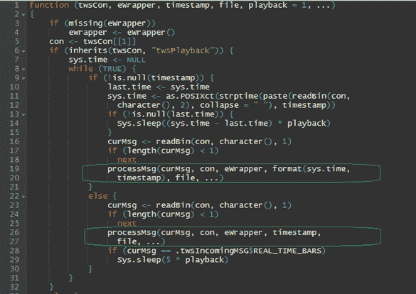twcallback 函数的内部代码片段

### **ProcessMsg 函数**

processMsg 函数内部是一系列 if-else 语句，这些语句根据已知的传入消息类型进行分支。processMsg 函数的内部代码结构片段如下所示。

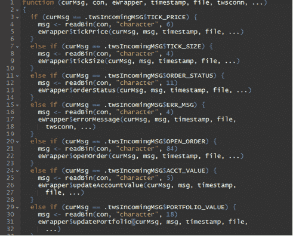processMsg 函数的内部代码片段

### **eWrapper 关闭**

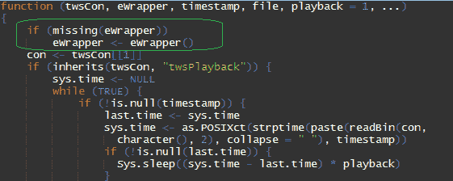使用 eWrapper 函数在 twsCALLBACK 中创建 eWrapper 闭包

eWrapper 函数创建一个 eWrapper 闭包，以允许自定义的传入消息管理。eWrapper 闭包包含一个函数列表，用于管理所有传入的消息类型。每个消息在 eWrapper 中都有一个对应的函数，用于处理每个传入消息类型的特定细节。

eWrapper 闭包中包含的函数列表

数据环境是。数据，用访问器方法获取。数据，赋值。这些方法可以从闭包对象 eWrapper$get 中调用。数据，eWrapper$assign。数据等。通过创建一个 eWrapper 实例，并以函数调用的方式调用它，可以修改嵌入在对象中的任何或所有特定方法。

### **总结****I brokers 包的内部结构**

我们已经在上面看到了 IBrokers 包的内部结构是如何工作的。总结整个机制，可以描述如下:

向 TWS 请求数据->tw callback->processMsg->eWrapper

### **实时数据模型**

我们将使用 Jeff Ryan 发布的 [snapShotTest 代码示例](http://past.rinfinance.com/agenda/2010/JeffRyan_Tutorial.pdf)。下面的代码修改了 twsCALLBACK 函数。这个修改后的回调用作 reqMktData 函数的参数。当我们使用 reqMktData 函数时，使用修改后的回调的输出比普通输出更便于阅读。【T2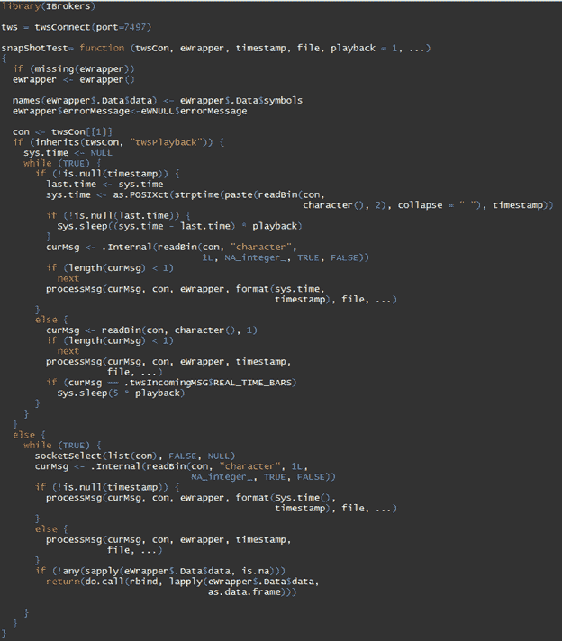

snapShotTest 代码中的另一个变化是将来自 IB API 的任何错误消息记录到一个单独的文件中。(在默认方法下，eWrapper 将此类错误消息打印到控制台)。为此，我们使用 eWrapper 创建了一个不同的包装器(debug=NULL)。一旦我们构建了它，我们就可以将它的 errorMessage()函数分配给我们应该使用的 eWrapper。

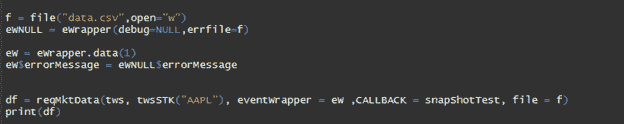

然后，我们应用一个简单的交易逻辑，如果最后的买入价高于预先设定的阈值，就会产生买入信号。人们可以类似地调整 twsCALLBACK 的逻辑，根据自己的交易策略需求创建自定义回调。

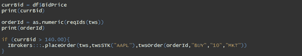 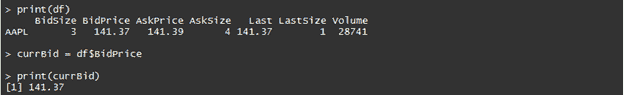

****【IB 交易员工作站(TWS)****

****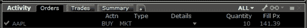T2】****

### ****结论****

**最后，这篇文章详细概述了 IBrokers 包的架构，它是交互式代理 API 的 R 实现。Interactive Brokers 与 QuantInsti 合作主办了一场名为[“在 Interactive Brokers 上使用 R 进行交易”](https://www.youtube.com/watch?v=gdQ_svOV7kc)的网络研讨会，该研讨会于 2017 年 3 月 2 日举行，由 QuantInsti 总监 Anil Yadav 主持。您可以点击上面提供的链接来了解更多关于 IBrokers 包的信息。点击下面的下载按钮，获取网上研讨会中使用的相关 R 文件。**

****声明:****

**本软件不以任何方式隶属于 Interactive Brokers 或其任何附属机构，也没有得到其认可或批准。它没有任何保证，除非用户能够阅读并理解源代码，否则不应该在实际交易中使用。IBrokers 是 TWS API 的纯 R 实现。**

### ****下一步****

**如果你想学习算法交易的各个方面，那就去看看算法交易(EPAT)中的 T2 高管课程。该课程涵盖了统计学&计量经济学、金融计算&技术和算法&定量交易等培训模块。EPAT 让你具备成为成功交易者所需的技能。[现在报名](https://www.quantinsti.com/epat/)！**