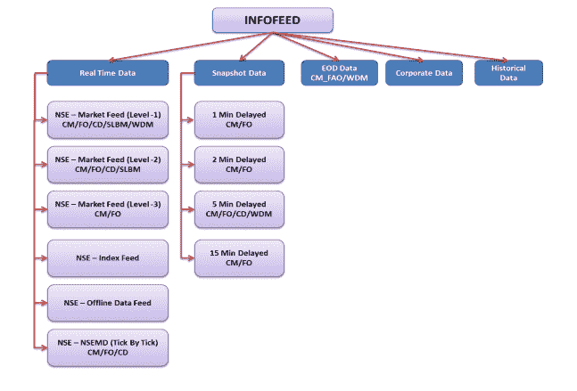
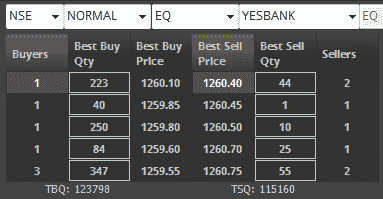
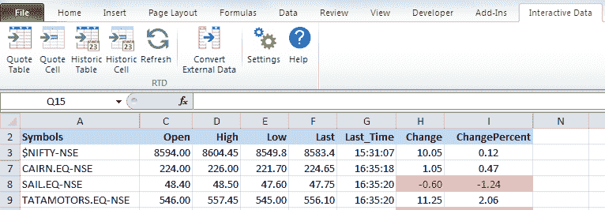
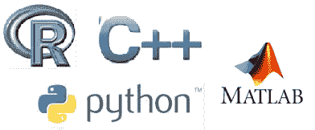

# 开始算法交易前要知道的 5 件事

> 原文：<https://blog.quantinsti.com/5-things-know-starting-algorithmic-trading/>

由[米林德·帕拉德卡](https://www.linkedin.com/in/milind-paradkar-b37292107/)

随着美国市场超过 70%的交易量实现自动化，算法的崛起似乎比以往任何时候都更加不可避免。机械工作正在向计算机转移，只有那些能驯服机器的人才能统治贸易市场。用算法交易的技能武装自己是为金融市场的变化做准备的最好方法之一。

市场上最近的一个趋势是 DIY 交易者的出现。白天，他们做日常工作，晚上，哄孩子睡觉后，他们运行自己的算法交易策略。

这篇文章特别针对那些想学习算法交易并希望建立自己的交易系统的人。作为算法交易者，你的成功不仅取决于你的量化技能，还很大程度上取决于你选择的分析、设计和执行策略的过程和工具。

让我们熟悉一下交易所需的工具吧！

### 1.数据就是一切(嗯，差不多！)

算法交易的第一个也是最重要的方面是数据。数据是算法交易者最好的朋友。交易者需要访问他打算以旧换新的交易所的各个部分的数据。这些数据最初是如何产生的？让我们以新兴市场的交易所为例:

印度国家证券交易所有限公司

NSE 为资本市场部门(CM)、期货和期权部门(F&O)、批发债务市场部门(WDM)、证券借贷市场(SLBM)、货币衍生品市场部门(CDS)和公司数据提供市场报价和数据。

这些报价由 DotEx 国际有限公司提供，该公司是 NSE 的 100%子公司，专门用于此目的。它向各种信息机构广播实时数据。

NSE 提供 5 种不同类型的数据产品，即。

*   实时数据(1 级、2 级、3 级和逐节拍数据)
*   快照数据
*   一天结束时(EOD)数据
*   公司数据
*   史料

**来源:**【www.nseindia.com】T2

现在，让我们试着理解 1 级、2 级、3 级和逐滴答(TBT)数据。

级别 1 数据包括最佳出价和最佳要价，加上出价大小和要价大小。级别 2 提供高达 5 个最佳买价和卖价的市场深度数据，级别 3 提供高达 20 个最佳买价和卖价的市场深度数据。逐笔成交点(TBT)数据包括每份订单或订单中的变更。

二级数据示例- NSE:YESBANK

对于新的交易者来说，1 级数据足以分析价格图表，设计策略和做出交易决定。其他类型的数据通常由有经验的交易者和高频交易公司/机构使用。

NSE 向授权数据供应商(授权数据供应商/再经销商列表 [ [1](https://www.nseindia.com/content/press/List_data_Vendors.pdf) ] )提供数据，再由后者将数据再分发给贸易公司和零售商。

印度市场的一些数据供应商包括:

*   [电子信号](http://www.esignal.com/)
*   [全局数据馈送](http://www.globaldatafeeds.in/)
*   [iCharts](http://www.icharts.in/)
*   [艇首](http://www.vbiz.in/bestrt.html)

一些数据供应商仅提供数据馈送，而其他一些供应商提供图表平台和其他分析工具，用于创建观察列表、跟踪不同市场、制定战略、生成买入/卖出信号等。

一个交易者可以通过一个桥把这个平台和他的经纪人的平台连接起来，然后执行订单。数据供应商通常会在他们的网站上列出代理合作伙伴，以及他们的提要与不同图表平台的兼容性。

#### eSignal

让我们以 eSignal 为例，列出这些数据供应商提供的一些服务。eSignal 是全球领先的数据供应商，提供三种主要产品

*   签名
*   经典的
*   精英

**签名**是最受欢迎的一种，它的一些重要特征包括:

*   流式实时数据
*   具有可定制研究的高级图表
*   股票、期货、外汇和期权
*   回溯测试
*   使用 Qlink 或 RTD 下载数据
*   1 年的日内历史数据
*   新闻、评论和研究

除了[算法交易平台](/top-algo-trading-platforms-india/)，eSignal 还提供 QLink 服务，可以快速简单地将实时流数据下载到 Excel 工作表中。交易者可以使用工作表函数/宏在 excel 中执行进一步的分析和构建策略，并通过 Excel API 执行它们。

**T2】**

### 2.图表平台

作为交易者，你必须熟悉不同的图表技术和基于图表的策略，这些技术和策略可以在市场中获利。有许多具有高级图表功能和分析的图表平台。

一些受交易者欢迎的图表平台包括:

*   [NinjaTrader](https://ninjatrader.com/)
*   [贸易站](https://www.tradestation.com/)
*   [MetaStock](https://www.metastock.com/)
*   [AmiBroker](https://www.amibroker.com/)
*   [电子信号](http://www.esignal.com/)

这些平台提供的功能包括实时扫描、技术指标数量、专家顾问、回溯测试、公司基本面、新闻服务、自动下单、预测、二级数据等。交易者应该根据自己的交易风格、特点和定价选择一个[算法交易平台](/top-algo-trading-platforms-india/)。

让我们以 MetaStock 为例，列出图表平台的一些特性。MetaStock 是一个非常受欢迎的平台，为个人日末交易者、实时交易者和外汇交易者提供解决方案。

提供的一揽子产品包括:

*   METASTOCK 实时
*   METASTOCK XENITH
*   METASTOCK 日线图
*   数据链
*   第三方加载项

METASTOCK 实时功能–

*   市场浏览器–扫描市场和证券
*   增强型系统测试器——测试你的交易想法
*   指标和交易系统-全面收集指标
*   专家顾问-行业专业人士的专家意见
*   预测工具——查看未来可能价格的工具

大多数图表平台都提供了一个试用期，交易者可以用它来评估平台是否能满足他的交易需求。

在订阅[算法交易平台](/top-algo-trading-platforms-india/)之前，交易者了解定价政策也是至关重要的，因为这些平台除了软件收费之外，还单独收取数据馈送费、交易费和第三方附加费用。

### 3.这都是关于编程的，宝贝

**T2】**

算法交易包括通过分析从数据供应商那里获得的历史/实时数据来设计和编码策略。上面提到的一些[算法交易平台](/top-algo-trading-platforms-india/)有他们自己的脚本语言，可以用来在平台中编码&回溯测试策略。

当 Van Rossum 开始在圣诞节期间忙于 Python 开发时，他想做一个对 Unix 和 C 黑客有吸引力的解释器。然而，今天 Python 是全世界算法交易者最感兴趣的语言之一。原因很简单，可以在这里找到[。](/python-best-programming-language-algorithmic-trading/)

在交易平台上使用 Python、Java、Matlab 等语言进行交易，是算法交易员广泛使用的一种方法。

有数百种外部分析包可以用这些语言来帮助开发各种交易策略，例如:

*   基于动量，
*   均值回复，
*   剥头皮，
*   基于机器学习算法的策略，
*   基于情感的策略等。

我们使用外部包装器来实现我们编写到交易平台中的代码。在我们关于 [IBPy](/ibpy-tutorial-implement-python-interactive-brokers-api/) 和 [IBridgePy](/implement-python-in-interactive-brokers-api/) 的文章中，我们已经讨论过使用两个这样的包装器在交互式经纪人上用 Python 实现算法交易策略。

建议课程:[使用交互式经纪人平台使用 IBridgePy 进行自动交易](https://quantra.quantinsti.com/course/Automated-Trading-IBridgePY-Interactive-Brokers-Platform)

因此，作为交易者，拥有良好的编程知识对于在市场中成功交易是至关重要的。QuantInsti 的 [EPAT](https://www.quantinsti.com/epat/) 课程包括 Python、R 和 MATLAB，学生不仅学习编程的基础知识，还学习使用这些语言为不同的市场设计不同的策略。

### 4.经纪人经纪人经纪人

算法交易的下一个方面是选择正确的经纪人。

选择合适的经纪人需要考虑的因素包括:

1.  交易平台的速度和可靠性
2.  提供的细分市场
3.  佣金
4.  杠杆和保证金要求
5.  制图软件与经纪人平台的兼容性
6.  代理提供的网关 API

印度市场一些受欢迎的经纪人包括:

*   [互动经纪人](https://www.interactivebrokers.co.in/en/home.php)
*   [万事达信托](http://www.mastertrust.co.in/mastertrader/)
*   Symphony Fintech 的 Presto ATS
*   [复合边缘](https://www.compositedge.com/)
*   [IIFL](http://www.indiainfoline.com/)
*   [选项使用](https://www.optionshouse.com/)
*   [光速交易](https://www.lightspeed.com/)
*   [Oanda](https://www.oanda.com/)
*   [Zerodha](https://zerodha.com/)

我们已经在[这篇文章](https://blog.quantinsti.com/top-algo-trading-platforms-india/)中详细介绍了[算法交易平台](https://blog.quantinsti.com/top-algo-trading-platforms-india/)。

作为一个想要自动化交易过程的算法交易者，你可以通过连接到你的经纪人的图表平台或者通过提供的网关 API 在真实市场中执行你的策略。可用的 API 通常由经纪人在其网站上列出。

像 Zerodha 这样的一些经纪人提供平台，这些平台是一组简单的 HTTP APIs，建立在交易所批准的基于网络的交易平台之上。这使用户能够以编程方式访问数据，如个人资料和资金信息、订单历史、头寸、实时报价等。

此外，它使用户能够使用他们选择的任何编程语言(从 excel VBAs 到 Python、Java、C#)在方便的时候下订单和管理投资组合。

因此，对于一个潜在的交易者来说，他必须熟悉 API 的工作原理和经纪人平台提供的其他相关功能。

### 5.一个击败算法交易的系统

到现在为止，你一定已经意识到作为一个算法交易者，你将会使用不同的应用程序(图表平台/编程工具/经纪人终端/新闻源等)。)，处理海量数据进行回溯测试，以及实时市场中的多任务处理。因此，有一个合适的计算机系统来满足所有这些需求而不会偶尔中断和罢工是至关重要的。

毕竟，这是自动化的目标，让事情顺利快速地完成(当然，没有情绪)。用笔记本电脑交易是不可靠的，会限制你的多任务处理能力。因此，算法交易宜使用多台显示器的高端桌面系统。

您需要价格合理的台式机，配备高速处理器、高内存、多台显示器和相关显卡、可靠的主板以及充足的存储空间。

交易者可以在研究自己的需求后购买合适的系统，或者咨询对计算机硬件和技术有丰富知识的人。

**最低要求:**

*   处理器:英特尔酷睿 2 双核 2.13Mhz
*   操作系统:如果需要 R，最好是 Windows7 Professional 或 Ubuntu x64
*   内存:3gb DDR3

### 下一步

这只是一个前奏，我们认为在你观看算法交易的信息会议之前，你应该知道。[点击此处](https://www.youtube.com/watch?v=nq0n9vOnkQo)观看 algo 交易的视频记录。在这个视频中，你不仅可以听到在冒险进入算法交易之前你应该知道的一切，而且是从这个行业的中坚分子那里听到的。

如果你想进入算法交易和量化交易的世界，我们可以通过我们的[算法交易(EPAT)](https://www.quantinsti.com/epat) 高管课程为你提供指导，让你具备在这一领域取得成功所需的必要技能和知识。

*<small>免责声明:本文提供的所有数据和信息仅供参考。QuantInsti 对本文中任何信息的准确性、完整性、现时性、适用性或有效性不做任何陈述，也不对这些信息中的任何错误、遗漏或延迟或因其显示或使用而导致的任何损失、伤害或损害负责。所有信息均按原样提供。</small>*