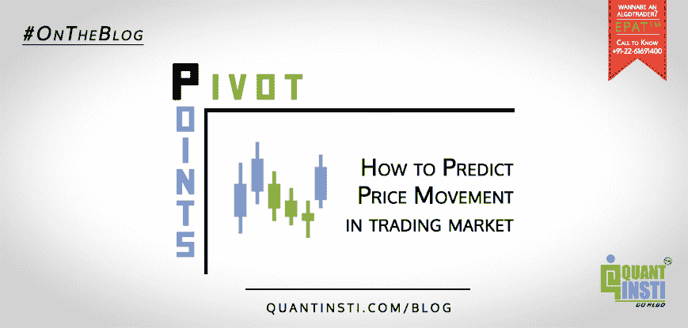
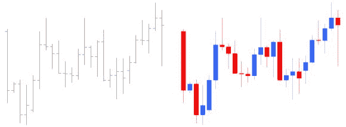
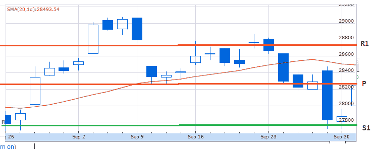

# 使用支点来预测交易市场的运动

> 原文：<https://blog.quantinsti.com/pivot-point-prediction-movement/>

我们在之前的文章中已经讨论过关于 [**烛台交易策略**](https://blog.quantinsti.com/japanese-candlestick-trading-strategy/) 。如果你错过了，就[点击这里](https://blog.quantinsti.com/candlestick-trading-a-momentum-strategy-with-example-excel-model/)阅读。许多技术被用来理解金融市场的行为。许多使用烛台策略的人经常一致同意，孤立地使用这种特殊策略可能没有好处。与使用条形图上的历史数据进行评估相比，烛台技术有助于更有效地评估机会。

### 为什么？

*图 1 -酒吧与烛台*

很明显，与简单的条形图相比，烛台法给出了清晰的数据图表。这有助于交易者对市场变化做出快速反应。

在本文中，我们将讨论**支点**。

### 什么是支点？

场内交易者在快速变化的环境中使用支点来设定关键水平。他们通过查看前一天的最高价、最低价和收盘价来计算当天的支点。

> *“支点是一个* *技术分析指标，用于确定市场在不同时间段的整体趋势。支点本身就是前一个交易日的最高价、最低价和收盘价的平均值。在接下来的一天，在支点上方交易被认为表明持续的看涨情绪，而在支点下方交易表明看跌情绪"[*[*1*](http://www.investopedia.com/terms/p/pivotpoint.asp#ixzz4MsUtRBwd)*]*

支点被战略性地用来抓住支撑点和阻力点，从而帮助识别价格可能反转的区域。支点用于确定反转可能发生的位置，交易者可以构思出更有可能击中靶心的投资策略。使用支点计算，我们可以考虑贸易进入或退出。作为经验法则；交易在 P 以上是看跌，在 P 以下是看涨(这里 P 是支点)。不管你选择哪个级别，这两个都是主要价格运动的指标。现在让我们来看看我们是如何得到这个 p 的。

### 计算轴心点

然而，枢轴点的计算可以通过几种方法进行；我们将坚持使用使用以下参数的 5 分制:

1.  前一天的高点(H)
2.  前一天的低点(L)
3.  前一天的收盘价格(C)
4.  2 个支撑水平(S 1 和 S 2
5.  2 个阻力等级(R 1 和 R 2

由于该等式将具有上述 5 个价格点，因此它被称为 5 点系统。

为了计算 P，我们将:

**R2 = P+(H-L)= P+(R1-S1)**

**【R1 =(P×2)-L**

**P =(H+L+C)/3**T3】

**【S1 =(P×2)-H**

**S2 = P-(H-L)= P-(R1-S1)**

比方说，我正在查看 2016 年 9 月的 Sensex 图表。

然后，

**H = 29077.28**

**L = 27716.78**

**C = 27865.96**

**P = (H + L + C) / 3 = 28220.0067**

类似地，我们将 P、H、L & C 的值放入其他方程中，得到以下值:

R1 = 28723.2333

**R2 = 29580.5067**

**S1 = 27362.7333**

S2 = 26859.5067

### 轴心点的时间框架

#### 前一天

当我们必须计算 1、5、10 和 15 分钟时间范围内的枢轴点时，我们将查看前一天的数据。因此，我们将根据前一天的 H，L 和 c 来制作日内图表。P 的值一旦设定，当天就保持不变。

#### 前一周

当我们必须计算 30 & 60 分钟时间范围内的关键点时，我们将查看前一周的数据。因此，我们将基于前一周的 H、L 和 c 来制作周内图表。P 值一旦设定，将在该周结束前保持不变。

#### 上个月

当我们有一整天的时间框架时，我们会查看前一个月的数据。因此，如果我们想要这个月(即 2016 年 10 月)的 P 值，那么我们将基于 2016 年 9 月的 H，L & C 进行计算。和前面的例子一样，P 的值在整个月中保持不变。根据上一节中的示例，我们得出 2016 年 9 月的 P= 28220.0067。当月结束后，将在 11 月 1 日计算 P 的新值。

*请注意，1 日是当月的第一个交易日，不一定是当月的 1 日。*

### 交易者如何使用支点

支点为价格运动设定了总基调。P 以上的流量是好的，表示功率。记住这个事实，P 是基于前期的统计数据。支点上方的移动表明力量，目标是到达主要阻力 R1。高于第一阻力位的扣球意味着更大的力量，目标是第二阻力位，R2。

反之亦然同样适用。低于支点的移动显示了 S1 目标的弱点。跌破 S1 显示出更大的弱点。

交易者用这些价值来决定他们的行动。如果价格下降到 S1 并保持不变，那么可以开始期待支撑位的上升。同样，如果价格上涨并到达 R1 或任何其他阻力位并突破，那么他们可能会预期下跌正在形成。为了强化这种预期，我们还必须看看指标信号。

### 最后

枢轴点(P)作为主要的支撑或阻力指标，因此，我们预测价格在这一点的移动将是最高的。贸易专家使用支点的目的如下:

1.  ##### general trend determination

就像我们之前提到的，向下的运动意味着看跌，向上的运动意味着看涨。

2.  ##### Decide to enter and exit

交易者根据支点决定何时何地进场或出场。例如，如果我看到价格突破阻力位(R ),那么我会下限价单买入 500 股。如果同样的趋势适用于支撑位，那么我会设置止损。

所以，你看枢轴点技术非常有效，对交易者预测市场运动非常有用。但是，你能在多大程度上成功地利用这一点，取决于你能在多大程度上利用它与其他技术指标，如烛台。

### 下一步

烛台和枢轴点是基于运动的技术。你可能也喜欢阅读其他[流行的算法交易策略](https://blog.quantinsti.com/algorithmic-trading-strategies/)，比如[统计套利](https://blog.quantinsti.com/statistical-arbitrage/)和[基于新闻的策略](https://blog.quantinsti.com/news-based-trading/)。我们建议你浏览一下我们的系列文章，看看[统计数据是如何用于交易策略](https://blog.quantinsti.com/basic-statistics-for-trading-strategies-i/)的。

因为在进入或升级到算法交易时，你需要分析和量化，所以必须学习编程(如果不是全部的话，也要学习一些),建立万无一失的系统，执行正确的策略。为了获得良好的学习体验，QuantInsti 提供了一个名为[算法交易高管课程(EPAT)](https://www.quantinsti.com/courses/epat/) 的综合课程，提供讲座录音和终身访问及支持。

作者 [Harikumar Krishnamoorthy](https://www.linkedin.com/in/harryislive?trk=hp-identity-photo)

*免责声明:股票市场的所有投资和交易都涉及风险。在金融市场进行交易的任何决定，包括股票或期权或其他金融工具的交易，都是个人决定，只能在彻底研究后做出，包括个人风险和财务评估以及在您认为必要的范围内寻求专业帮助。本文提到的交易策略或相关信息仅供参考。T3】*