# 使用 IBridgePy 在交互式代理 API 中实现 Python

> 原文：<https://blog.quantinsti.com/implement-python-in-interactive-brokers-api/>

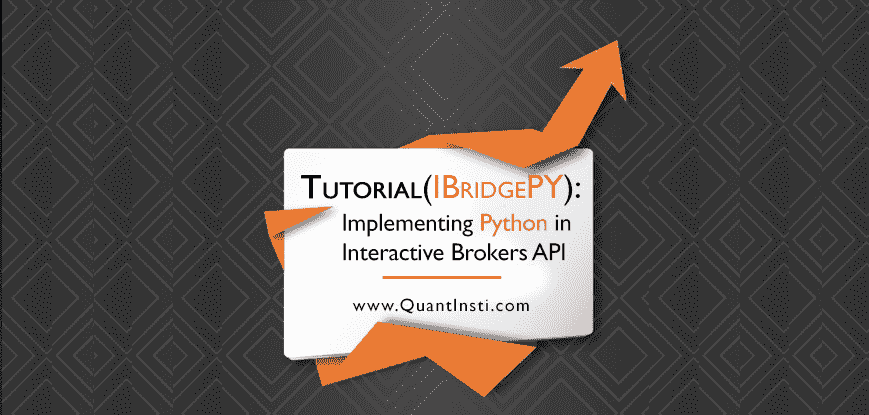

作者:哈里·库马尔·克里什纳摩尔提

在上一篇关于在交互式代理 API 中实现 Python 的 [<u>IBPy 教程中，我谈到了交互式代理、其 API 以及使用 IBPy 实现 Python 代码。在这篇文章中，我将谈论使用包装器在 IB 的 C++ API 中实现 python，该包装器由**刘辉**博士编写。</u>](/ibpy-tutorial-implement-python-interactive-brokers-api/)

#### 关于刘辉博士

> 刘辉博士是 Running River Investment LLC 的创始人，这是一家专门使用 Python 开发自动化交易策略的私人对冲基金。Hui 是 IBridgePy 的作者，IBridgePy 是一个著名的 Python 交易平台，允许交易者快速实施他们的交易策略。刘辉博士在中国清华大学获得材料科学与工程学士和硕士学位，在美国弗吉尼亚大学获得博士学位。他在美国印第安纳大学获得工商管理硕士学位，在印第安纳大学的研究兴趣是定量分析。

刘博士的 **IBridgePy** 是一个包装器，它将帮助你使用 Python 在交互式经纪人 API 中进行交易。QuantInsti 就此主题举办了一次非常成功的网上研讨会，我们有创纪录的注册人数(1000+)参加了由刘博士亲自主持的网上研讨会。我将在本文末尾分享网上研讨会的链接。

#### [T2】](https://www.quantinsti.com/informative-session-algorithmic-trading/)

### 杂交

IBridgePy 是最灵活、最友好的 Python 包之一，可用于在交互式代理 API 上实现 Python。和 IBPy 很不一样。

#### **如何？**

嗯，是第三方实现的**应用编程接口**，用来访问 IB 的交易员工作站。而 IBridgePy 的工作方式不同；它没有重新实现交互式代理的 API。相反，它帮助 Python 直接调用 IB 的 C++ API，因为它充当包装器。由于 IBridgePy 直接调用 IB 的 C++ API，因此，我们可以预计程序中的错误和异常会更少。

#### **为什么？**

原因很简单:互动经纪人 C++ API 由互动经纪人官方维护。事实上，当互动经纪人将有其平台的新版本时，API 也将更新。

### 使用 IBridgePy 有什么好处？

IbridgePy 有一些关键特性，这些特性使它对用户更有益，我将列举如下:

1.  灵活性
2.  易用性
3.  隐私

#### 灵活性

IBridgePy 最棒的一点是，你可以用它来交易任何种类的证券。你可以交易股票、期货、期权、外汇等。刘博士开发 IBridgePy 的动机之一是使应用程序更加灵活。在 IBridgePy 上，您可以使用任何 python 包并从任何地方访问数据源。

#### 易于使用

交互式代理 API 的复杂性已经完全被 IBridgePy 的**用户友好界面所掩盖。您将不必付出任何额外的努力来管理您的订单，或者编写代码来从服务器获取历史数据或报价，因为包装器会处理这些事情。**

#### 隐私

隐私是非常重要的，当你把你的证书交给一个运行在不同服务器上的第三方程序时，隐私是一个被忽视的因素。但是，IBridgePy 是在你的电脑上运行的，所以你的隐私完全在你的掌控之中。

### 谁应该使用 IBridgePy？

*   喜欢自动交易的人
*   那些想把它作为市场或股票筛选工具的人

### 如何安装 IBridgePy？

您可以简单地访问 [IBridgePy 网站](http://ibridgepy.com/download/)的下载部分，下载与您的 python 版本相匹配的安装文件。运行文件并安装必要的文件。

#### 先决条件

您应该在系统上安装以下程序:

1.  互动经纪人 TWS。我们已经在之前的文章中详细讨论了如何安装交互式经纪人 TWS。
2.  或者，您也可以使用 IB 网关(随 TWS 一起提供)
3.  您还应该在系统上安装一个 python 包。Anaconda Navigator 是运行 python 文件的好资源。
4.  您应该有 IbridgePy(和一组示例程序),您可以通过向上面提到的 IbridgePy 的电子邮件发送请求来获得。

#### TWS 还是 IB 网关？

TWS 和网关都可以用来交易。如果你对这个行业比较陌生，那么我会推荐 TWS，因为它对用户更友好。然而，如果你想节省时间，避免 IB 系统重启，那么就使用 IB 网关。

我们将遵循与前一篇文章相同的步骤。当登录屏幕出现时，检查 IB 网关并继续。当 IB 网关打开时，我们进入其配置，就像我们对 TWS 所做的那样。

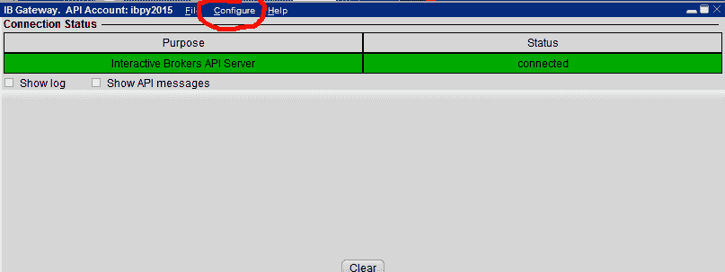

随后将手动配置 IB 网关。接下来，点击设置。虽然这里没有什么可改变的，但是我们可以根据您的需要设置端口，尽管不建议这样做。

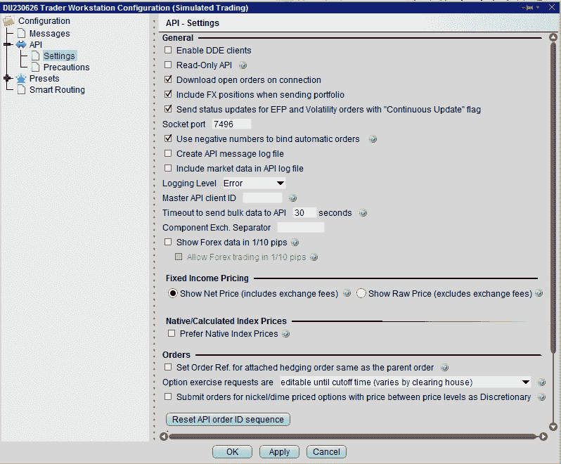

我们也将设置 TWS，就像我们在上一篇文章中所做的一样。配置后重新启动 TWS。

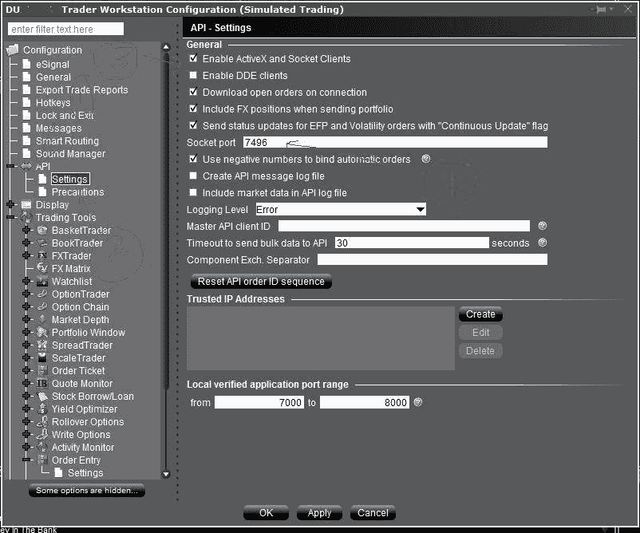

### 准备 IDE

本教程的下一个重要步骤是准备 Python 的 IDE。如果您使用的是 Python(XY)，那么您必须启动可执行文件并从那里运行 spyder:

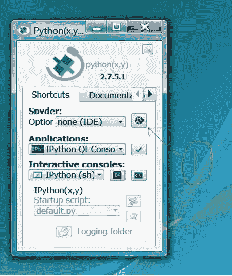

一旦 Spyder 启动，请遵循以下步骤:

1.  进入**视图**然后**窗格**并检查**编辑器**和**控制台**
2.  点击**工具**，然后选择 **PYTHONPATH 管理器**，将文件夹添加到 **Python 路径**中。在这里你将点击**添加路径**并选择你解压 **IBridgePy** 的文件夹。
3.  点击**关闭**以接受它。
4.  重启 Spyder。

### 运行示例程序

在 Spyder IDE 中单击 RUN_ME.py，方法是单击文件，然后单击打开。

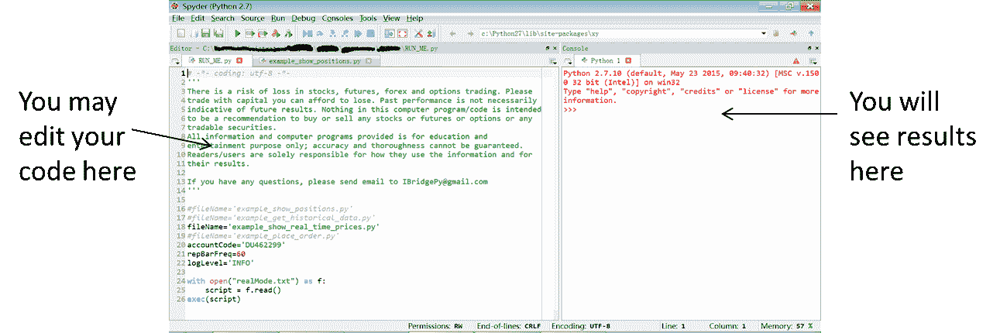

*RUN *ME.py 是程序，你可以把它作为入口来运行，但是例子*移动*均线* cross.py 是保存交易策略的文件。

在此之后，请确保您登录到 IB TWS 或 IB 网关。点击绿色三角形或按 F5 键。

### 解码代码结构

就像我在上一篇文章中讨论的程序结构一样，我也将在这里讨论代码结构。

我们定义了 **initialize()** ，这是一个内建的方法来声明只运行一次的变量。

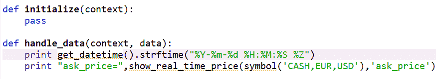

接下来我们定义 **handle_data()** ，这也是一个进行交易决策的内置方法。这里给出了两个输入**(上下文，数据)**。**上下文**包含了 **initialize()** 中声明的变量。而**数据**是每天或每分钟接收的直播馈送。

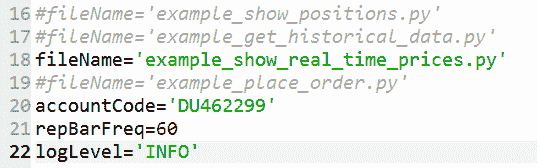

**第 16 行~第 19 行:**你可以通过注释掉其他算法来选择一个你想要执行的算法

**第 20 行:**您的互动经纪人账户代码

**第 21 行:**handle _ data(context，data)函数的频率或多长时间运行一次，60 表示每分钟运行一次，1 表示每秒运行一次。

第 22 行:有 4 个级别显示结果

*   **错误:**仅显示错误信息
*   **信息:**典型用户将使用它来了解您的算法的结果
*   调试:当你调试你的算法时，你可能知道更多的信息
*   如果你真的想知道发生了什么，你会看到大量的信息

### IBridgePy 的三块基石

以下是构成 IbridgePy 基石的三个最引人注目的内置函数:

*   显示实时价格
*   请求 _ 数据
*   下订单

#### 实时报价

每当你需要实时报价时，那么你可以使用内置函数**显示*真实*时间 _ 价格**T4】

在上面一行中，您将看到使用的参数是现金、欧元、美元，这些参数将返回指定货币的实时汇率。

同样，你可以用 **STK、**T2、美元来代替，用美元来表示苹果股票的价值。STK 是安全类型，我们在上一篇关于使用 IBPy 在交互式代理 API 中实现 Python 的文章中已经详细讨论过。

#### 获取历史数据

**request_data** 是用于从交互式代理获取历史数据的函数。您还必须指定一个参数**历史数据**。

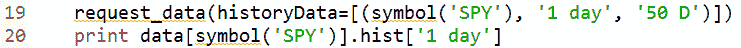

##### 涉及的参数

*   使用这些参数，我们选择需要获得历史数据的工具，在上面的例子中是 SPY，它是一个跟踪 S&P500 指数的 ETF
*   接下来，我们指定时间间隔，在我们的示例中是**‘1 天’**
*   回溯周期是下一个参数，我们在其中指定所需历史数据的周期。在我们的示例中，它是**‘50d’**表示从今天开始往回 50 天。
*   检索到的历史数据保存在 pandas 数据帧中，该数据帧保存在 hist(数据类的一个属性)中，保存在名为 data 的字典中。

##### 输出

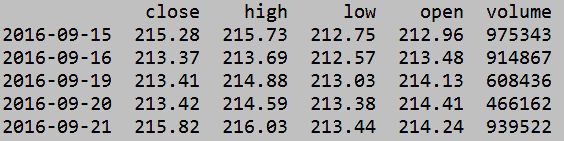

#### 请求多个历史数据

就像您从交互式代理请求特定时间段的历史数据一样，您也可以一次获取多个历史数据。看看下面的代码:

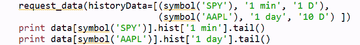

我指定了间谍和 AAPL，指定的时间间隔分别是 **1 分钟** (1 分钟)和 **1 天**。指定的周期分别为 **1 D** & **10 D** (D =天数)。类似地，我们也在输出函数中指定了需求。

##### 输出

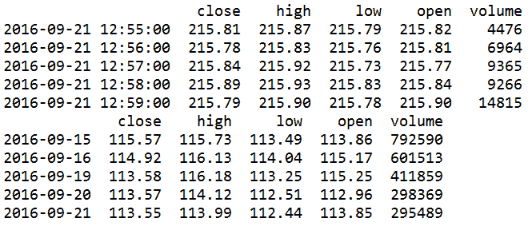

#### 下订单

下单是我们整个流程中的重要步骤，下面是我们如何使用 IBridgePy 在交互式经纪人上下单:

*   下达市价订单:订单(符号('证券')，x)

这里 security 是目标证券，例如 SPY，x 是股份数。–x 表示**卖出**，x 表示**买入**。

例如，订单(符号(' SPY ')，100)

*   目标安全是间谍
*   行动是当 n > 0 时购买 100 股
*   如果是-100，那么负数意味着卖出，-100 =卖出 100 股
*   order_target(symbol('SPY ')，100)将根据您的持仓通过买入或卖出来调整头寸，直到您持有 100 股

*   下限价单/止损单
    *   order(symbol('SPY ')，100，LimitOrder(213.42))下达限价订单，以每股 213.42 美元的价格购买 100 股 SPY 股票
    *   order(symbol('SPY ')，-100，StopOrder(213.42))下达止损单，以每股 213.42 美元的价格卖出 100 股 SPY 股票

*   强烈建议使用 order_status_monitor()跟踪您所下订单的状态

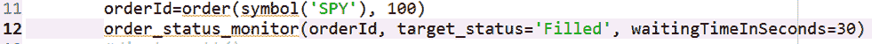

就像在前面的教程中一样，我们已经指定了一个 orderId，这里我们还指定了一个函数 orderId，它是您的订单请求的唯一标识。对于市价订单，您应该将“已完成”作为订单请求的终点，这意味着订单已经在交互式经纪人处执行。

对于限价单和止损单，预期状态为“已提交”，这意味着订单已被 IB 接受，正在等待执行。对于高流动性证券，完成交易不会花费太长时间(几秒钟)。

IbridgePy。交易者*单个*账户是该模块的名称，随后是**请求**购买 100 股。接下来是**账户余额**。

你可以在这里观看刘辉博士网上研讨会的录像。

[https://www.youtube.com/embed/Cg3gejGX3Xk](https://www.youtube.com/embed/Cg3gejGX3Xk)

多年来，我们已经看到试图安装 IBridgePy 的用户所面临的一些常见障碍，我们写这一节是因为我们相信这将有助于简化过程，让用户更专注于他们想要的东西，即应用他们的交易策略。

我无法下载 IBridgePy，该链接将我带到 404 页面。你能帮我做这件事吗？

请使用此链接下载 IBridgePy。您还必须创建一个帐户来访问这些文件。

当我想在 Spyder 上运行 RUN_ME.py 时，它给了我一种不同的语言，为什么呢？
类似于:strategies/PK×o # iWüà4yjìZ ~ pòa；

在 Spyder 上访问之前，您需要先解压缩从 [Download 下载的 zip 文件——最容易回溯测试和实时交易的 Python 平台](https://ibridgepy.com/download/)。

**我得到以下错误:
“从 IBridgePy 导入 IBC PP”
“导入错误:DLL 加载失败:找不到指定的模块。”**

**我该怎么办？**

如果下载的 IBridgePy 版本与您系统中的 python 不匹配，就会出现错误。该错误的另一个原因是您的系统上安装了多个 python 版本。解决方法是从你的系统中卸载不匹配的 Python。

求解步骤:

1.  检查是否下载了正确的 IBridgePy 版本。(它解决了大多数问题)
2.  如果您使用的是 Windows，请确保使用了 Anaconda。
3.  检查是否安装了多个 Python 版本。如果是，卸载未使用的 python 版本。或者，使用正确的 Python 执行 RUN_ME.py。
4.  您可以使用不同版本的 python 在 Spyder 上执行 RUN_ME.py，方法是:
5.  工具→首选项→ Python 解释器→设置所需 Python 解释器的路径
6.  您也可以通过用所需的 python 版本在蟒蛇上创建一个新环境，然后使用该环境运行 Spyder 或 Jupyter 来实现这一点。

**我收到以下错误消息:**

**" error message =无法连接，因为客户端 id 已被使用。请使用唯一的客户端 id 重试。**

这是 IB API 最新版本中的一个已知问题。无论何时启动 TWS，都会分配一个客户端 id，在代码结束时，客户端 id 仍然是活动的。因此，下次运行代码时，您将会看到一条错误消息，提示客户端 id 已经在使用中。当 IB 在 IB API 中发布修复程序时，此问题将得到永久解决。

不幸的是，与此同时，您可以在再次运行代码之前重启内核。重新启动时，将使用新的客户端 id，从而解决问题。

关于这一点的视频指南可以从这里获得:[使用 Python 与交互式经纪人进行交易:无法连接，因为客户端 id 已经在使用中。](https://www.youtube.com/watch?v=l4Cl9iSY4Bk)

**我得到以下错误:**

**导入错误:python37.dll 的模块使用与此版本的 Python 冲突**

确保从网站上下载了正确版本的 IBridgePy。这个版本应该与您的 spyder 环境使用的 python 版本一致。如果没有，就会有冲突。

如何知道运行 Sypder 的客户端能够连接到 IB TWS/网关上的服务器？

运行 RUN_ME.py 后，您会得到类似以下内容的帐户摘要:

IBridgePy 版本 9.1.4

文件名= example_show_positions.py

####开始初始化交易者####

##账户余额 DU229341 ##

经纪人 _ 服务 _ 工厂。broker service _ callback::_ get _ account _ info _ one _ tag:EXIT，没有基于 account code = du 229341 tag = TotalCashValue 的值

活动账户代码为['DU229341 '，' DU229347']

**我在 spyder 上使用模拟账户运行 RUN_ME.py 时出现以下编码错误:**

**" unicode decode 错误:“charmap”编解码器无法解码位置 1035 的字节 0x9d:字符映射到<未定义的> "**

您可以添加 encoding="utf8 "，在 configuration.py 文件的第 83 行中突出显示。该文件位于 C:\Users\...\ IBridgePy _ Win _ Anacondaxx _ YY \ configuration . py

用 open(os.path.join(os.getcwd()，' Strategies '，fileName)，encoding="utf8 ")作为 f:

script = f.read()

**在学习 IBridgePy 课程后，我试图从交互式经纪人那里下载价格数据用于回溯测试，交互式经纪人的平台抛出一条错误消息:
IBridgePy 版本 5 . 2 . 3
fileName = example _ get _ historical _ data . py
# # # #开始初始化交易者####
..............................................
####初始化交易者完成# # #
STK、间谍、美元的历史数据**

**经纪人 _ 客户 _ 工厂。回调:errorId = 13 error code = 162 error message =历史市场数据服务错误消息:美国运通 STK
broker_client_factory 没有市场数据许可。回调:EXIT IBridgePy version = 5.2.3
发生了异常，使用%tb 查看完整的回溯。**

如果您在获取数据时使用的是模拟账户，那么您将无法访问所有的报价机。您的访问权限将主要限于外汇对。在这种情况下，尝试下面的代码来获取数据。