# Excel 中的长短移动平均交叉策略回测

> 原文：<https://blog.quantinsti.com/vectorized-backtesting-in-excel/>

雅克·儒贝尔

现在，对于那些知道我是一个博客作者的人来说，这篇文章可能会觉得有点偏离我传统的写作风格，但是本着进化的精神，受我的一个朋友 Stuart Reid (TuringFinance.com)的启发，我将遵循下面的[博客文章](http://www.fastcompany.com/3042312/most-creative-people/the-secrets-of-writing-smart-longform-articles-that-go-absolutely-viral)中建议的一些技巧。

作为 EPAT 项目的一名学生，我很高兴了解到其他人在进行[回溯测试](https://quantra.quantinsti.com/course/backtesting-trading-strategies)时使用的方法。像往常一样，我们从开始回溯测试 Excel，然后迁移到 r

我之前写过一个关于 Excel 回溯测试的[博客系列，然后转到 R](http://www.quantsportal.com/building-a-simple-moving-average-sma-crossover-strategy-in-microsoft-excel/) ，我非常有兴趣看到 QuantInsti 团队使用的一个稍微不同的方法。

请[下载 Excel 电子表格](https://d1rwhvwstyk9gu.cloudfront.net/2015/10/Backtesting-Example-1.xlsx),以便您可以在我们进行的过程中遵循示例。

**“通过计算交易价格，它为实施 MAE 分析打开了一些非常有趣的大门”**

该方法的一个主要区别在于，它为以下性能指标打开了大门:

*   总正回报
*   负回报
*   积极交易
*   负面交易
*   命中率
*   平均收入
*   最大反向偏移

但苦于不能像我最初的方法(我喜欢把我们看作一个矢量化的回溯测试)那样绘制股票曲线，然而，你可以很容易地合并股票曲线，就像我在这篇文章中所做的那样。

构建交易策略的“Hello World”:“多空均线交叉策略”。

### **第一步:获取数据**

您可以从几个地方获取数据，但是在这个例子中，我们将从 Yahoo Finance 获取数据。我将建立这个例子使用谷歌作为一个共享。

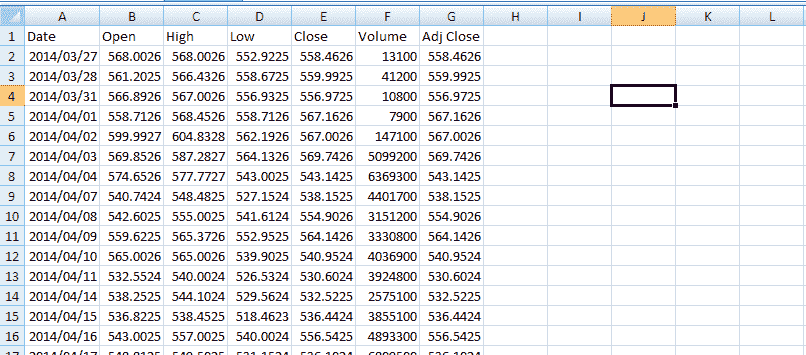

CSV 文件格式的雅虎价格数据

### **第二步:创建一个长短期简单移动平均线(SMA)的列**

在这个例子中，我希望你利用 5 日和 25 日的均线。对于那些刚接触交易策略的人来说，均线就是收盘价除以观察次数的总和。

**2.1)创建短期 SMA (5 天)**

在 Excel 中使用以下公式:=AVERAGE(G2:G6)

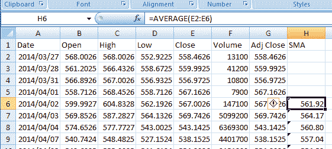

**2.2)创建长期 SMA (25 天)**

在 Excel 中使用以下公式:=AVERAGE(E2:E26)

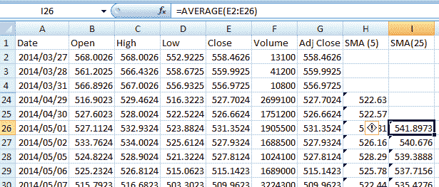

### **第三步:生成交易信号**

在这一步，读者将会发现与我之前关于构建矢量化回溯测试器的博文的一个主要区别。为了绘制股票曲线，我将在这篇文章中加入我最初的方法。

我们需要做的下一件事是产生买入和卖出信号

***第三步的逻辑:***

***如果:***

在前一天,( 5)SMA 在(25)SMA 的下方，而在当天,( 5)SMA 现在在(25)SMA 的上方，

***然后:***

在当前字段中写入字符串“BUY”

***否则如果:***

在前一天,( 5)SMA 在(25)SMA 之上，而在当天,( 5)SMA 现在在(25)SMA 之下，

***然后:***

在当前字段中写入字符串“SELL”

***其他:***

将空字符串""添加到当前字段。

这在 Excel 中用以下公式表示:

= IF(AND(H26>I26，H25 <i25>I25)，" SELL "，""))</i25>

**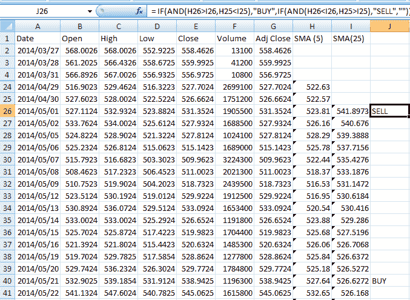T2】**

**注:**

SMAs 是根据收盘价计算的，不进行收盘调整，因为我们希望交易信号是根据价格数据生成的，不受支付的股息的影响。

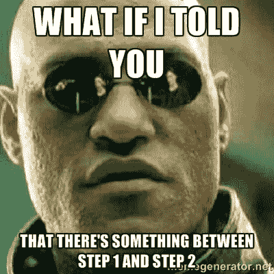

### **第四步:获取交易的买入/卖出价格**

在下一列中添加以下 Excel 公式:=IF(J26 <>" "，G27，K26)

逻辑如下:

如果前一天的交易信号列(对于滞后指标以消除前瞻偏差非常重要)不是空字符串，则使用当前字段上方的前一价格，否则将当前字段设置为当天的收盘价。

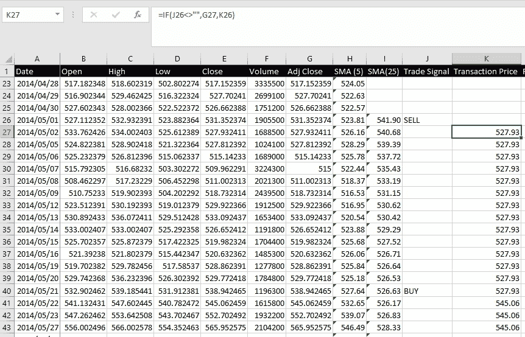

**注:**

有些人可能会说，你实际上无法获得当天的收盘，但如果你在收盘时下单，你就可以，即使在拍卖结束后，还有一些剩余订单可以填补，我之前工作的一只基金就是这样做的。

### **第五步:计算回报**

添加一个名为 returns 的列，该列使用以下 Excel 公式:=IF(J26="SELL "，K27/K26-1，IF(J26="BUY "，1-K27/K26，"")

逻辑:

***如果*** 前一天产生了卖出信号 ***那么*** 取今天的收盘价除以买入价再减 1。

***否则如果*** 前一天产生买入信号 ***那么*** 加 1 减(今天的收盘价除以买入价)。

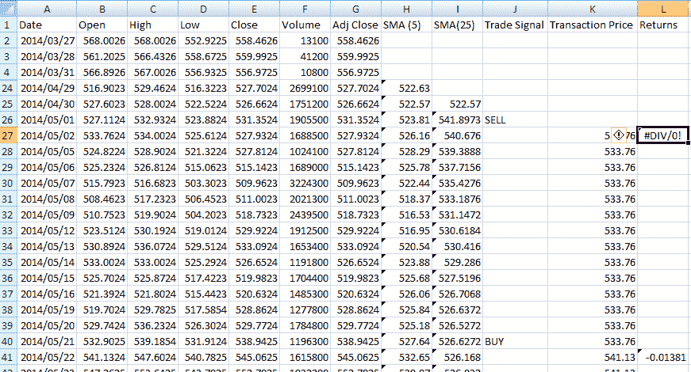

这个公式计算给定交易的回报。

### **第六步:计算一些性能指标**

*   正回报:=SUMIF(L:L，" > 0 ")
*   负回报:=SUMIF(L:L，" < 0 ")
*   正向交易:=COUNTIF(L:L，" > 0 ")
*   负交易:=COUNTIF(L:L，" < 0 ")
*   命中率=O4/(O4+O5)
*   平均回报率=平均值(L:L)

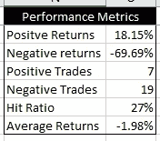

这些不是传统的投资组合业绩指标，但通过计算购买和销售价格，它为实施最大不利偏移分析打开了一些非常有趣的大门，这些分析可用于优化止损。

**“注意:由于没有记录交易的购买和销售价格，我无法在之前的方法中计算这些指标。”**

## **添加权益曲线**

### **第一步:添加两个新列，分别用于股票的日收益和自然对数日收益**

为此，我将利用调整后的收盘价，因为我希望支付的股息能够反映在我们的战略权益曲线和总回报曲线中。

每日回报的公式是:(今天的价格/昨天的价格)- 1

Excel 公式:=G3/G2-1

用于自然对数每日收益的公式是:LN(今天的价格/昨天的价格)

Excel 公式:= LN(G3/G2)

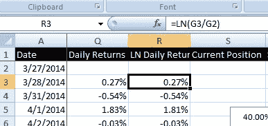

### **第二步:计算多头或空头持有信号**

在本专栏中，我们想知道我们目前是持有多头还是空头头寸。这用 1 表示长，用-1 表示短。

这建立在均线交叉策略的基础上，如果短期 SMA 高于长期 SMA，则做多，反之则做空。

注意:你必须将信号延迟一天，以消除前瞻偏差

在本例中，Excel 公式如下:=IF(H26>I26，1，-1)

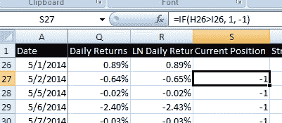

### **第三步:计算策略 ln 日收益**

这是容易的部分，简单地将自然日志日收益乘以当前头寸。

Excel 公式:=R27*S27

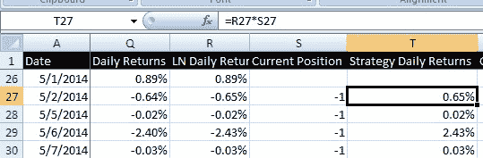

### 第四步:计算策略和股票的累计回报，就像你买入并持有一样。(这样做是为了做比较)

累积回报的公式很简单，对于 LN 回报，您只需使用=T27+U26 将它们相加。

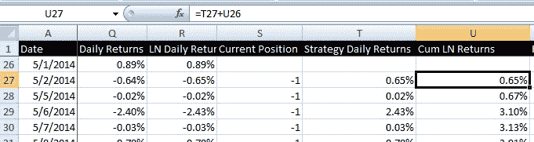

接下来，您需要使用以下公式来反转自然对数:=EXP(U27)-1

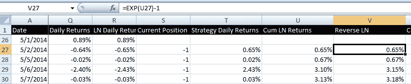

然后你需要计算股票的累积收益:

Excel 公式=(1+Q27)*(1+Q26)-1

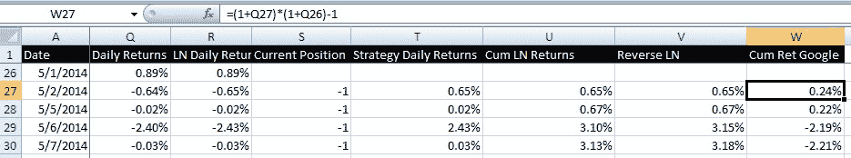

### **第五步:绘制回报图**

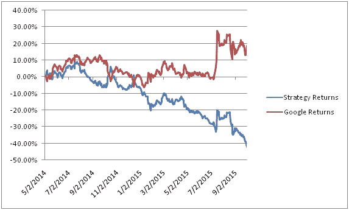

从上面的图表可以看出，在这个特定的时间框架和份额上，这种策略并不有利可图。我鼓励读者探索其他交易策略，尝试将 RSI 指标作为如何确定头寸的指南。

在 Excel 中进行回溯测试后，学习使用来自谷歌的数据和 CSV 格式的 OHLC 数据在 Zipline 上[导入和回溯测试。计算回测结果，如 PnL、交易数量等。](/importing-csv-data-zipline-backtesting/)

你可以通过对历史数据进行回溯测试来提高交易成功的可能性。Quantra 的这个关于[回溯测试交易策略](https://quantra.quantinsti.com/course/backtesting-trading-strategies)的课程正是你从交易中获得最大收益所需要的。从基本步骤、数据、规则、风险管理等方面学习一切。立即注册！

* * *

<small>***更新:*** 我们注意到一些用户在从雅虎和谷歌财经平台下载市场数据时面临挑战。如果您正在寻找市场数据的替代来源，您可以使用 [Quandl](https://www.quandl.com/) 进行同样的操作。</small>