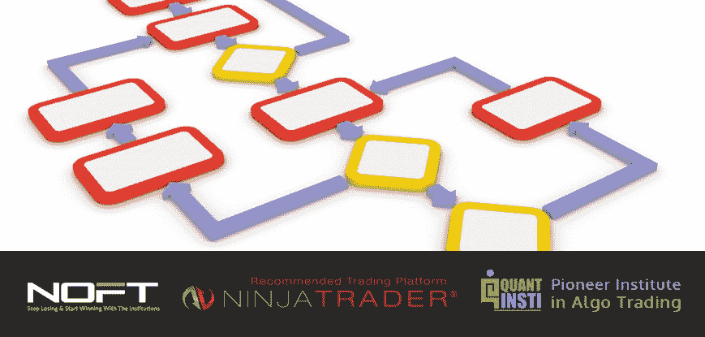

# 如何通过订单流序列分析获得实时交易优势

> 原文：<https://blog.quantinsti.com/webinar-how-to-gain-a-real-time-trading-edge-with-order-flow-sequence-analysis/>

### 

**日期:**2016 年 8 月 9 日星期二

**时间:**美国东部时间中午 12:00 |太平洋标准时间上午 9:00 | IST 时间晚上 9:30

### **为什么你不能错过这次培训**

你是否在对 200 多个静态参数进行回溯测试，希望创造出一个适用于所有市场条件的“圣杯”式自动化公式？即使你创造了一个能在几个月内赚 20，000 美元以上的公式，请放心:一旦机构和高频交易算法明白了你在做什么，它就不再起作用了。

如果你想获得真正的交易优势，你必须了解机构——它们创造并控制了你市场中高达 90%的交易量——是如何影响你每笔交易的价值和市场结构的。

### **本次网络研讨会将向您展示**

*   如何像机构交易者那样退后一步理解市场的实时结构和估值
*   为期货、股票甚至外汇制定实时订单流序列博弈计划和策略的最佳方式
*   哪些交易理念现在有效(哪些永远不会有效)
*   如何避免让你事后诸葛亮的“分析麻痹”
*   如果你想从你的分析中赚很多钱，为什么你不能“编码市场”
*   为什么你的分析必须包括实时的机构买家/卖家攻击行为
*   实时订单流序列分析如何始终如一地找到低风险/高回报的交易思路，给你一直想要的优势

### **演讲者简历**

**特洛伊·埃珀森，NOFT-Traders.com**

Troy Epperson 介绍如何通过订单流序列分析获得实时交易优势。Troy 在华尔街工作了 15 年，是美国一家著名对冲基金和自营公司的首席交易员。他全职交易，使用他在 NOFT-Traders.com 教学生的相同的机构订单流序列跟踪分析和工具

### **关于[NOFT-Traders.com](https://www.noft-traders.com/)T3】**

NOFT-Traders.com 是期货、股票和外汇交易者可以获得机构级培训和实时工具以停止亏损并开始与机构进行持续盈利交易的唯一在线场所。

我们广受欢迎的机构优势系统已经帮助 600 多名学生一劳永逸地解决了他们最大的交易位置、进场、止损、风险管理、出场和利润纪律问题。

我们的最新加入是我们的外汇阿尔法计划。这是唯一的在线机构级货币分析套件，帮助外汇交易者看到任何一对积极的机构买家和卖家——在你图表上的每根蜡烛线里面！

### **关于[NinjaTrader](https://www.quantinsti.com/affiliates/ninjatrader)T3】**

NinjaTrader Group，LLC 及其子公司为活跃的交易者提供屡获殊荣的交易软件和经纪服务。

NinjaTrader 成立于 2003 年，现已发展成为行业领导者，凭借一流的技术、高额折扣佣金和世界一流的支持，为全球 40，000 多名交易员提供支持。