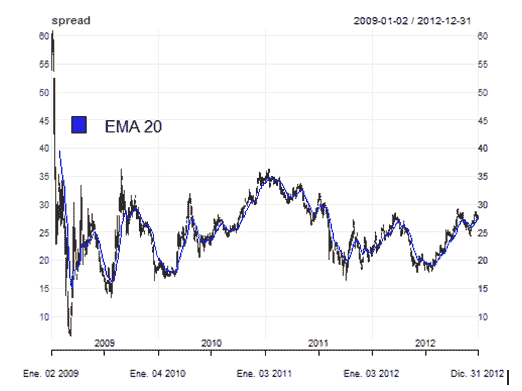
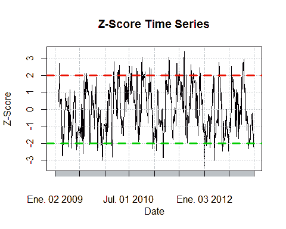
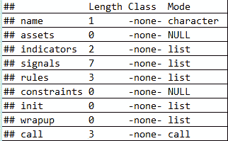
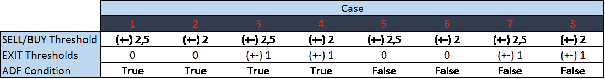
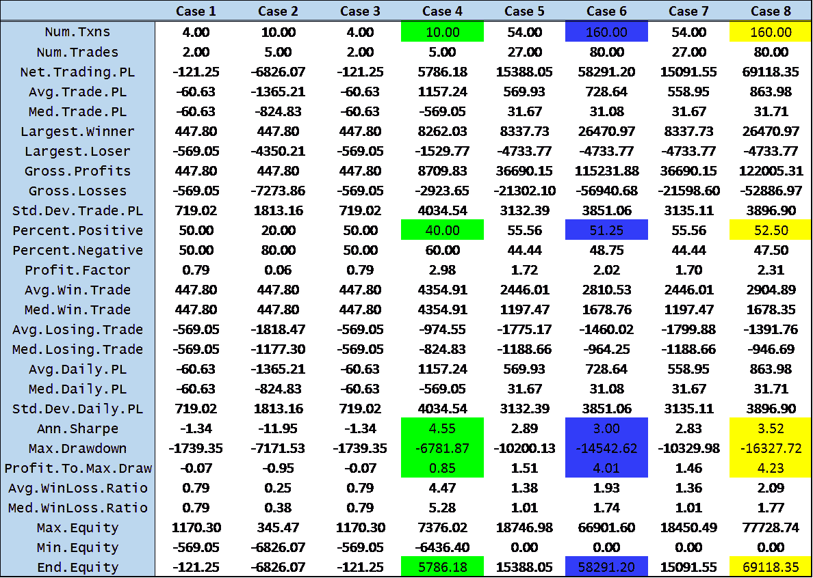
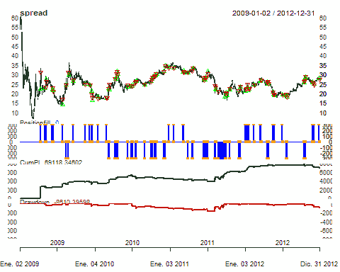
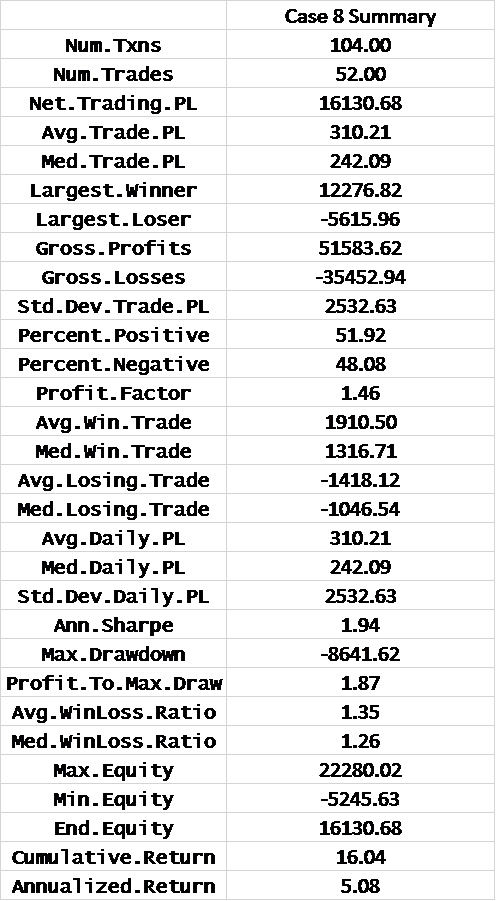
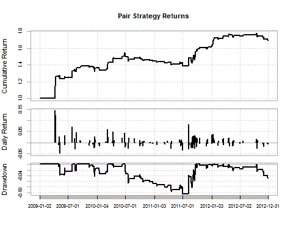

# 使用 Quantstrat 的配对交易策略和回溯测试[EPAT 项目]

> 原文：<https://blog.quantinsti.com/pair-trading-strategy-backtesting-using-quantstrat/>

马尔科·尼古拉斯·迪博

本文是作者提交的最后一个项目，作为他在 QuantInsti[算法交易(EPAT)](https://www.quantinsti.com/epat/) 高管课程的一部分。请务必查看我们的项目[页面](https://www.quantinsti.com/category/project-work-epat/)，看看我们的学生正在构建什么。

### **Marco Nicolas Dibo 最近的网络研讨会介绍**

[https://www.youtube.com/embed/nqSQoXpHqIk](https://www.youtube.com/embed/nqSQoXpHqIk)

这个关于配对交易和数据来源的有见地的网络研讨会涵盖了配对交易策略的基础知识，后面是两个例子。在第一个例子中，Marco 介绍了在同一交易所交易的不同股票的 pairs 交易策略，在第二个例子中，Marco 展示了在不同交易所交易的不同商品期货的 pairs 交易策略。Marco 还详细介绍了包括 Quandl 在内的不同数据源，这些数据源可用于创建[交易策略](https://blog.quantinsti.com/algorithmic-trading-strategies/)。

### **作者**

Marco 的职业生涯是一名交易员和投资组合经理，尤其关注股票和衍生品市场。他专门研究量化金融和算法交易，目前担任阿根廷 Valores S.A .的量化交易部门主管和副总裁。Marco 还是 Quanticko Trading SA 的联合创始人兼首席执行官，quanti cko Trading SA 是一家致力于开发高频交易策略和交易软件的公司。Marco 拥有圣安德烈斯大学的经济学学士学位和金融硕士学位。

### **简介**

在 EPAT 期间，我最喜欢的一门课是统计套利课，所以配对交易策略对我来说是个不错的主意。当股票价格的比值偏离均值时，我的策略会触发新订单。但是为了工作，我们首先要测试这一对是否被协整。如果配对比率是协整的，比率是均值回复的，与其均值的离差越大，反转的概率越高，这使得交易更有吸引力。我选择了下面一对股票:

*   美国银行
*   花旗集团

这个想法是这样的:如果我们发现两只股票是相关的(它们对应于同一个板块)，并且配对比率偏离了某个阈值，我们就做空价格高的股票，买入价格低的股票。一旦它们收敛到均值，我们平仓并从反转中获利。

### **交易策略逻辑**

逻辑很简单。该算法计算每一对股票的每日 Z 值。Z 得分是配对比率偏离其平均值的标准偏差数:

> *Z = (R - μ) / σ的平方*

其中 **R** 是两只股票的价格比率， *μ* 是比率的平均值， *σ* 是价格比率的标准差。

一旦 **Z 值**超出某个阈值，我们就满足发送订单所需的**第一个条件**。

但是该算法还必须满足第二个条件:它计算这两只股票的滚动增强 Dickey Fuller 测试。更具体地说，它从测试中获取 p 值。然后将其与定义的显著性水平(α)进行比较，如果 p 值小于α，则意味着价格比率序列是稳定的，并且满足第二个条件。如果两个条件都满足，那么算法就买输家，卖赢家。退出规则适用于特定的 Z 分数阈值。为了优化策略，我使用了以下变量:

1.  z 分数进入阈值
2.  z 分数退出阈值
3.  第二个条件(协整)对或错

### **代码详情和样本内回溯测试:**

回溯测试的样本期为 2009 年 1 月 1 日至 2012 年 12 月 31 日。使用以下参数计算 Z 得分:

1.  价格比率的移动平均值:20 天
2.  价格比率的标准偏差:20 天
3.  ADF 测试窗口:60 天
4.  初始股本= 100.000 美元
5.  买卖价差= 3000

当我们做空价差时，我们卖出**【C】**，买入**【BAC】**，当我们买入价差时，我们做的正好相反。我使用 quantstrat 库[**【1】**](https://quantstrattrader.wordpress.com/)对策略进行回溯测试。让我们深入研究代码:

```
# Load libraries

library(quantstrat)
library(tseries)
library(IKTrading)
library(PerformanceAnalytics)
# .blotter holds the portfolio and account object and .strategy holds the orderbook and strategy object

.blotter <- new.env()
.strategy <- new.env()
# fetch market data and plot the spread

symb1 <- 'C'
symb2 <- 'BAC'
getSymbols(symb1, from=startDate, to=endDate, adjust=TRUE)

getSymbols(symb2, from=startDate, to=endDate, adjust=TRUE)

spread <- OHLC(C)-OHLC(BAC)
colnames(spread)<-c("open","high","low","close")

symbols <- c("spread")
stock(symbols, currency = 'USD', multiplier = 1)

chart_Series(spread)

add_TA(EMA(Cl(spread), n=20), on=1, col="blue", lwd=1.5)
legend(x=5, y=50, legend=c("EMA 20"),
       fill=c("blue"), bty="n")
```



如前所述，我将使用 quantstrat 库来优化我的策略。为了使用 quantstrat，我们首先必须定义和初始化工具、策略、投资组合、账户和订单:

```
#Inititalize strategy, portfolio, account and orders

qs.strategy <- 'pairStrat'
initPortf(qs.strategy, symbols = symbols, initDate=initDate)

initAcct(qs.strategy, portfolios=qs.strategy, initDate=initDate,initEq=initEq)

initOrders(qs.strategy,initDate=initDate)
# Save strategy
strategy(qs.strategy, store = TRUE)
# rm.strat(pairStrat) # only when trying a new test
ls(.blotter) # .blotter holds the portfolio and account object

ls(.strategy) # .strategy holds the orderbook and strategy object
```

然后，我们计算并将我们的两个战略指标添加到战略中:

*   z 分数

*   ADF 测试(对或错)

```
# a) Z-Score
PairRatio <- function(x) { #returns the ratio of close prices for 2 symbols
  x1 <- get(x[1])
  x2 <- get(x[2])
  rat <- log10(Cl(x1) / Cl(x2))
  colnames(rat) <- 'Price.Ratio'
  rat
}

Price.Ratio <- PairRatio(c(symb1[1],symb2[1]))

MaRatio <- function(x){

  Mavg <- rollapply(x, N , mean)
  colnames(Mavg) <- 'Price.Ratio.MA'
  Mavg
}

Price.Ratio.MA <- MaRatio(Price.Ratio)

Sd <- function(x){

  Stand.dev <- rollapply(x, N, sd)
  colnames(Stand.dev) <- "Price.Ratio.SD"
  Stand.dev
}

Price.Ratio.SD <- Sd(Price.Ratio)

ZScore <- function(x){

  a1 <- x$Price.Ratio
  b1 <- x$Price.Ratio.MA
  c1 <- x$Price.Ratio.SD

  z <- (a1-b1)/c1

  colnames(z)<- 'Z.Score'
  z

}
# b) Augmented Dickey Fuller

ft2<-function(x){
  adf.test(x)$p.value
}

Pval <- function(x){

  Augmented.df <- rollapply(x, width = N.ADF, ft2)
  colnames(Augmented.df) <- "P.Value"
  Augmented.df
}

P.Value <- Pval(Price.Ratio)

add.indicator(strategy = qs.strategy, name = "ZScore", arguments =
                list(x=merge(Price.Ratio,Price.Ratio.MA,Price.Ratio.SD)))

add.indicator(strategy = qs.strategy, name = "Pval", arguments =
                list(x=quote(Price.Ratio)))

```

在下图中，我们可以看到在此期间 Z 分数的演变，以及比率回复到平均值和极值的阈值的可能值。我在+/-2 Z-score 阈值中设置了一些线，这里似乎是对比率的反转。z 得分的这个值意味着配对比率是其平均值的+/-标准偏差。

```
Z.Score <- ZScore(x=merge(Price.Ratio,Price.Ratio.MA,Price.Ratio.SD))
plot(main = "Z-Score Time Series", xlab = "Date" , ylab = "Z-Score",Z.Score, type = "l" )
abline(h = 2, col = 2, lwd = 3 ,lty = 2)
abline(h = -2, col = 3, lwd = 3 ,lty = 2)
```



现在我们设置优化变量:

```
alpha = 1 # We set it to 0.1 if we want a 10% significance level. If we want to set the ADF test (second condition)
#off, we just change it to "1", in that case the p-value will always be lower than the significance level and the # and the strategy will not require the pair to be cointegrated.
# Z-Score entry and exit thresholds:

buyThresh = -2
sellThresh = -buyThresh
exitlong = 1
exitshort = 1

Before running our backtest, we have to add the signals, position limits and rules of our strategy:

add.signal(qs.strategy, name="sigThreshold",arguments=list(column="Z.Score", threshold=buyThresh,
     relationship="lt", cross=FALSE),label="longEntryZ")

add.signal(qs.strategy, name="sigThreshold",arguments=list(column="P.Value", threshold= alpha,
      relationship="lt", cross=FALSE),label="PEntry")

add.signal(qs.strategy, name="sigAND",
           arguments=list(columns=c("longEntryZ", "PEntry"), cross=FALSE),
           label="longEntry")

add.signal(qs.strategy, name="sigThreshold",arguments=list(column="Z.Score", threshold= exitlong,
           relationship="gt", cross=FALSE),label="longExit")

add.signal(qs.strategy, name="sigThreshold",arguments=list(column="Z.Score", threshold=sellThresh,
           relationship="gt", cross=FALSE),label="shortEntryZ")

add.signal(qs.strategy, name="sigAND", arguments=list(columns=c("shortEntryZ", "PEntry"), cross=FALSE),
           label="shortEntry")

add.signal(qs.strategy, name="sigThreshold",arguments=list(column="Z.Score", threshold= exitshort,
           relationship="lt", cross=FALSE),label="shortExit")

addPosLimit( portfolio = qs.strategy, # add position limit rules
             symbol = 'spread',
             timestamp = initDate,
             maxpos = 3000,
             longlevels = 1,
             minpos = -3000)

add.rule(qs.strategy, name='ruleSignal',arguments = list(sigcol="longEntry",
         sigval=TRUE, orderqty=3000,  osFUN = osMaxPos, replace = FALSE, ordertype='market',
         orderside='long', prefer = "open"), type='enter' )

add.rule(qs.strategy, name='ruleSignal', arguments = list(sigcol="shortEntry",
         sigval=TRUE, orderqty=-3000,  osFUN = osMaxPos, replace = FALSE,ordertype='market',
         orderside='short', prefer = "open"), type='enter')

add.rule(qs.strategy, name='ruleSignal', arguments = list(sigcol="longExit",
         sigval=TRUE, orderqty= 'all', ordertype='market', orderside='short', prefer = "open"), type='exit')

add.rule(qs.strategy, name='ruleSignal', arguments = list(sigcol="shortExit",
         sigval=TRUE, orderqty= 'all' , ordertype='market', orderside='long', prefer = "open"), type='exit')

summary(get.strategy(qs.strategy))

```



从我们的总结中可以看出，我们的战略中定义了 2 个指标、7 个信号和 3 条规则。现在我们可以运行回溯测试，检查交易和我们策略的性能。

```
applyStrategy(strategy = qs.strategy, portfolios = qs.strategy, mktdata = spread)

tns <-getTxns(Portfolio=qs.strategy, Symbol= symbols)
#Update portfolio, account, equity
updatePortf(qs.strategy)

updateAcct(qs.strategy)

updateEndEq(qs.strategy)

```

使用以下变量值进行了优化:



从样本内回测中，我们得到了以下结果:



从这个表中，我们可以得到优化策略的变量的值。乍一看，似乎有 3 个候选(案例 4、案例 6 和案例 8)。如果我们比较案例 6 和案例 8，我们得出的结论是，案例 8 是最好的，因为它有更大的年度夏普比率和利润与最大提款之比，更高的正交易百分比，更大的期末权益和相同的交易次数。所以现在我们只剩下两个候选人:4 号和 8 号。如果我们只检查具有最大年化夏普比率的一个，我们更喜欢情况 4。案例 8 也没有考虑到数列必须协整，而案例 4 考虑到了，所以这是案例 4 的另一个优势。但是，如果我们考虑交易数量、最大提款利润、期末权益、正交易百分比以及夏普比率差异不大的事实，我们肯定会选择案例 8 作为我们的最佳候选。

### **样本外回溯测试:**

既然我们已经优化了策略并获得了参数的最佳值，我们可以运行一个样本外黑测试，看看策略的表现如何。回溯测试的样本期从 2013 年 1 月 1 日到 2015 年 12 月 31 日，阈值和规则的优化值如下:

*   z 分数购买阈值= -2
*   z 分数卖出阈值= 2
*   z 分数长退出阈值= -1
*   z 分数短退出阈值= 1
*   ADF 测试=假

下图向我们展示了不同的交易、期末权益和我们策略的提款结果:

```
chart.P2 = function (Portfolio, Symbol, Dates = NULL, ..., TA = NULL)
{
  pname <- Portfolio
  Portfolio <- getPortfolio(pname)
  if (missing(Symbol))
    Symbol <- ls(Portfolio$symbols)[[1]]
  else Symbol <- Symbol[1]
  Prices = get(Symbol)
  if (!is.OHLC(Prices)) {
     if (hasArg(prefer))
       prefer = eval(match.call(expand.dots = TRUE)$prefer)
     else prefer = NULL
  Prices = getPrice(Prices, prefer = prefer)
}
freq = periodicity(Prices)
switch(freq$scale, seconds = {
  mult = 1
}, minute = {
  mult = 60
}, hourly = {
  mult = 3600
}, daily = {
  mult = 86400
}, {
  mult = 86400
})
if (!isTRUE(freq$frequency * mult == round(freq$frequency,
0) * mult)) {
  n = round((freq$frequency/mult), 0) * mult
}
else {
  n = mult
}
tzero = xts(0, order.by = index(Prices[1, ]))
if (is.null(Dates))
  Dates <- paste(first(index(Prices)), last(index(Prices)),
                 sep = "::")
Portfolio$symbols[[Symbol]]$txn <- Portfolio$symbols[[Symbol]]$txn[Dates]
Portfolio$symbols[[Symbol]]$posPL <- Portfolio$symbols[[Symbol]]$posPL[Dates]
Trades = Portfolio$symbols[[Symbol]]$txn$Txn.Qty
Buys = Portfolio$symbols[[Symbol]]$txn$Txn.Price[which(Trades >
0)]
Sells = Portfolio$symbols[[Symbol]]$txn$Txn.Price[which(Trades <
0)]
Position = Portfolio$symbols[[Symbol]]$txn$Pos.Qty
if (nrow(Position) < 1)
  stop("no transactions/positions to chart")
if (as.POSIXct(first(index(Prices))) < as.POSIXct(first(index(Position))))
  Position <- rbind(xts(0, order.by = first(index(Prices) -
1)), Position)
Positionfill = na.locf(merge(Position, index(Prices)))
CumPL = cumsum(Portfolio$symbols[[Symbol]]$posPL$Net.Trading.PL)
if (length(CumPL) > 1)
  CumPL = na.omit(na.locf(merge(CumPL, index(Prices))))
else CumPL = NULL
if (!is.null(CumPL)) {
  CumMax <- cummax(CumPL)
  Drawdown <- -(CumMax - CumPL)
  Drawdown <- rbind(xts(-max(CumPL), order.by = first(index(Drawdown) -
1)), Drawdown)
}
else {
  Drawdown <- NULL
}
if (!is.null(Dates))
  Prices = Prices[Dates]
chart_Series(Prices, name = Symbol, TA = TA, ...)
if (!is.null(nrow(Buys)) && nrow(Buys) >= 1)
  (add_TA(Buys, pch = 2, type = "p", col = "green", on = 1))
if (!is.null(nrow(Sells)) && nrow(Sells) >= 1)
  (add_TA(Sells, pch = 6, type = "p", col = "red", on = 1))
if (nrow(Position) >= 1) {
  (add_TA(Positionfill, type = "h", col = "blue", lwd = 2))
  (add_TA(Position, type = "p", col = "orange", lwd = 2,
on = 2))
}
if (!is.null(CumPL))
  (add_TA(CumPL, col = "darkgreen", lwd = 2))
if (!is.null(Drawdown))
  (add_TA(Drawdown, col = "darkred", lwd = 2, yaxis = c(0,
-max(CumMax))))
plot(current.chob())
}

chart.P2(qs.strategy, "spread", prefer = "close")
```



从下表中我们可以看出，样本外回测的结果不如样本内回测的结果好。



年度夏普比率仍然为正，但小于我们之前得到的 3.52。利润与最大提款权之比远低于 4.23，但最大提款权从 16327 降至 8641。我们的策略在实施的三年中，累计回报率为 16.04%，年化回报率为 5.08%。

```
returns <- PortfReturns(qs.strategy)
charts.PerformanceSummary(returns, geometric=FALSE, wealth.index=TRUE, main = "Pair Strategy Returns")
```

### 

### 结论

当我在算法交易中开始[执行程序时，我的想法是学习如何建立一个量化交易策略的模型，回测它，然后优化它。感谢我的教授和 QuantInsti 的员工，我觉得目标已经实现。课程的一切都很棒，我会推荐给所有对学习算法交易感兴趣的人](https://www.quantinsti.com/epat/)[。](https://www.quantinsti.com/)

让我们带你看一个金融专业 MBA 学生的故事，在 EPAT 项目的帮助下，这个故事将激励你走向成功的算法交易生涯。[这个成功故事](https://blog.quantinsti.com/epat-cater-need-essential-skill-sets-required-algorithmic-trading/)讲述了 Jayalaxmi 的历程，她在参加 EPAT 项目之前是一名金融分析师。成功完成课程后，Jayalaxmi 加入了总部位于康涅狄格州老格林威治的 WorldQuant LLC。