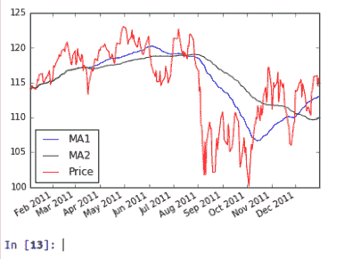
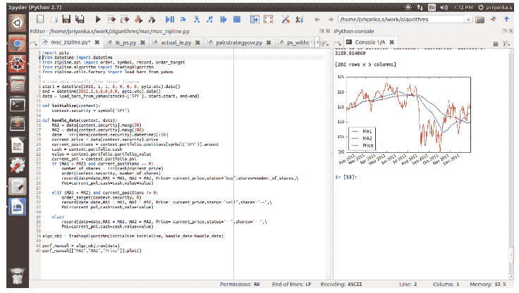

# Zipline Python:好处、安装、结构等

> 原文：<https://blog.quantinsti.com/introduction-zipline-python/>

由普里扬卡·萨赫

### **简介**

Python 已经成为金融交易中最受程序员欢迎的语言之一，因为它易于使用，用户友好，并且有足够多的科学库，如 Pandas、NumPy、PyAlgoTrade、Pybacktest 等等。

当交易频率为低/中时，Python 是自动交易的绝佳选择，即持续时间不少于几秒钟的交易。它有多个 APIs 库，可以链接起来，使它更优化，更便宜，并允许多种贸易想法的更大探索性发展。

[T4】](https://www.quantinsti.com/python-basics-handbook)

正是由于这些原因，Python 有一个非常互动的用户在线社区，他们分享、再分享并批判性地评论彼此的工作或代码。最流行的基于网络的回溯测试系统之一是 **[QuantConnect](https://www.quantconnect.com/) 。**

QuantConnect 利用 C#和 Python。它自夸提供了丰富的历史资料。QuantConnect 自 2015 年起支持与互动经纪商的实时交易。

**Zipline** 是一个用于交易应用的 Python 库。这是一个事件驱动的系统，支持回溯测试和实时交易。

在这篇文章中，我们将学习如何安装滑索，然后如何实施移动平均交叉策略，并计算 P&L，投资组合价值等。

本文分为以下四个部分:

*   滑索的好处
*   安装(如何在本地安装 Zipline)
*   结构(在 Python 中用 Zipline 编写代码的格式)，
*   用 Python 中的 Zipline 编码移动平均交叉策略。

### **滑索的好处**

*   易用性
*   由于移动平均和线性回归等许多常见统计数据可以从用户编写的算法中轻松访问，因此 Zipline“包含电池”。
*   历史数据的输入和性能统计的输出基于 Pandas 数据框架，以便很好地集成到现有 PyData 生态系统中
*   【matplotlib、scipy、statsmodels 和 sklearn 等统计和机器学习库支持最先进交易系统的开发、分析和可视化

### **安装**

#### **使用画中画**

假设您已经拥有了所有必需的非 Python 依赖项，那么您可以通过用 pip 在 Python 中安装 Zipline

```py
# code
pip install Zipline
```

#### **使用康达**

在 Python 中安装 Zipline 的另一种方法是通过 conda 包管理器，它是 Anaconda 的一部分，也可以通过 pip install conda 安装。

一旦 conda 设置完成，你就可以从 conda-forge 频道安装滑索:

```py
#code
conda install -c conda-forge zipline
```

### **基本结构**

Python 中的 Zipline 为代码提供了一种特殊的结构，其中包括定义几个函数来运行数据集上的算法，如下所述。

```py
#code
from Zipline.api import order, record, symbol
from Zipline.algorithm import TradingAlgorithm
def initialize(context):
   pass

def handle_data(context, data):
  order(symbol('AAPL'), 10)
  record(AAPL=data.current(symbol('AAPL'), 'price'))

algo_obj = TradingAlgorithm(initialize=initialize, handle_data=handle_data)
perf_manual = algo_obj.run(data)
```

因此，首先我们必须导入代码中需要的一些函数。每个滑索算法都包含两个你必须定义的函数:

*** initialize(上下文)和* handle_data(上下文，数据)**

在算法开始之前，Zipline 调用 **initialize()** 函数并传入一个上下文变量。Context 是一个全局变量，允许您存储从一个算法迭代到下一个算法迭代需要访问的变量。

算法初始化后，Zipline 为每个事件调用一次**【handle _ data()**函数。每次调用时，它都传递相同的上下文变量和一个名为 data 的事件帧，该事件帧包含当前的交易棒线，包括每只股票的开盘价、最高价、最低价和收盘价(OHLC)以及成交量。

算法中常用的所有函数都可以在 Zipline.api 模块中找到。这里我们使用 order(arg1，arg2 ),它接受两个参数:一个安全对象和一个数字，该数字指定您想要**订购多少股票(如果是负数，order()将卖出/做空股票)。在本例中，我们希望在每次迭代中订购 10 股苹果股票。**

**现在，第二个方法 record()允许您在每次迭代中保存变量的值。您为它提供变量的名称以及变量本身。在算法运行完毕后，你可以把你记录的所有变量都记录下来，我们将学习如何去做。**

**要运行这个算法，你需要调用**trading algorithm()**，它使用两个参数:initialize function 和 handle_data。然后，调用 run 方法，使用数据作为运行算法的参数(数据是存储股票价格的 panda 数据帧)**

****run()** 首先调用 initialize()函数，然后通过 handle *数据()流式传输每日的历史股价。在每次调用处理*数据()之后，我们指示 Zipline 订购 10 只 AAPL 股票。**

### ****如何在 Python 中用 Zipline 编写移动平均线交叉策略****

#### ****移动平均线****

**它是一种证券在一定时期内的简单平均值。**

#### ****交叉****

**移动平均线交叉是交易者使用移动平均线的常用方法。当快速移动平均线(即短期移动平均线)穿过慢速移动平均线(即长期移动平均线)上方(被视为**)或下方(被视为**)时，就会发生交叉。******

******现在我们将学习如何在 Python 中使用 Zipline 来实现这个策略。导入库并初始化算法中使用的变量。******

******代码分为 5 部分******

*   ******初始化******
*   ******初始化方法******
*   ******句柄 _ 数据方法******
*   ******策略逻辑******
*   ******跑某事******

#### ********初始化********

******#代码******

```py
**import pytz
from datetime import datetime
from Zipline.api import order, symbol, record, order_target
from Zipline.algorithm import TradingAlgorithm
from Zipline.utils.factory import load_bars_from_yahoo
import pyexcel
# Load data manually from Yahoo! finance
start = datetime(2011, 1, 1, 0, 0, 0, 0, pytz.utc).date()
end = datetime(2012,1,1,0,0,0,0, pytz.utc).date()

data = load_bars_from_yahoo(stocks=['SPY'], start=start,end=end)**
```

******load*bars*from _ Yahoo()**是获取股票和时间段的函数，您需要获取这些数据。这里我用的是 2011 年到 2012 年之间的间谍股，你可以根据你的情况来改变这个。****

#### ******初始化方法******

```py
**#code
def initialize(context):
  context.security = symbol('SPY')**
```

****现在我们将定义初始化函数，context.security 表示我们正在处理的股票，在我们的例子中是它的 SPY。****

#### ******句柄 _ 数据方法******

```py
**#code
def handle_data(context, data):
  MA1 = data[context.security].mavg(50)
  MA2 = data[context.security].mavg(100)
  date = str(data[context.security].datetime)[:10]
  current_price = data[context.security].price
  current_positions = context.portfolio.positions[symbol('SPY')].amount
  cash = context.portfolio.cash
  value = context.portfolio.portfolio_value
  current_pnl = context.portfolio.pnl**
```

******handle_data()** 包含了我们想要做的所有操作，主要代码为我们的算法。我们需要计算不同窗口的移动平均值，Zipline 提供了一个内置函数**【mavg()**，它使用一个整数来定义窗口大小。****

****另外，Zipline 会自动计算当前的价格、投资组合的 T2 价值等。我们可以只调用变量，在这个算法中，我已经计算了当前的*头寸、价格、现金、投资组合*价值和 PnL。****

#### ******策略逻辑******

```py
**#code (this will come under handle_data function only)
if (MA1 > MA2) and current_positions == 0:
    number_of_shares = int(cash/current_price)
    order(context.security, number_of_shares)
    record(date=date,MA1 = MA1, MA2 = MA2, Price= 
current_price,status="buy",shares=number_of_shares,PnL=current_pnl,cash=cash,value=value)

elif (MA1 < MA2) and current_positions != 0:
     order_target(context.security, 0)
     record(date=date,MA1 = MA1, MA2 = MA2, Price= current_price,status="sell",shares="--",PnL=current_pnl,cash=cash,value=value)

else:
    record(date=date,MA1 = MA1, MA2 = MA2, Price= current_price,status="--",shares="--",PnL=current_pnl,cash=cash,value=value)**
```

****现在，根据比较移动平均线的条件，下单买入或卖出的逻辑。****

1.  ****如果短均线大于长均线，并且您的当前持仓量为 0，那么您需要计算股票数量并下单****
2.  ****如果短期移动平均线小于长期移动平均线，并且您的 current_positions 不为 0，那么您需要卖出您当前持有的所有股票。****
3.  ****第三个条件是，如果什么都不满足，那么什么都不做，只记录需要保存的变量。****

#### ******运行******

****为了运行这个算法，你需要下面的代码:****

```py
**#code
algo_obj = TradingAlgorithm(initialize=initialize,handle_data=handle_data)
perf_manual = algo_obj.run(data)
perf_manual[["MA1","MA2","Price"]].plot()**
```

****您也可以使用 plot()方法绘制图形****

#### ******战略图******

********

******使用滑索的屏幕快照******

********

### ******结论******

****我们希望你会发现 Python 中 zipline 的介绍和使用相同的实现策略是有用的。在我们的下一篇文章中，我们将向您展示如何使用 Zipline 导入和[回测 CSV 格式的数据。对于使用 python 构建技术指标，这里有几个](/importing-csv-data-zipline-backtesting/)[的例子](/build-technical-indicators-in-python/)。****

### ******下一步******

****学习使用来自谷歌的数据和 CSV 格式的 OHLC 数据在 Zipline 上导入和回溯测试。在我们的帖子'[中计算回测结果，如 PnL、交易数量等，在 Zipline 中导入 CSV 数据以进行回测](https://blog.quantinsti.com/importing-csv-data-zipline-backtesting/ "Permalink to Importing CSV Data in Zipline for Backtesting")。****

******更新******

****我们注意到一些用户在从雅虎和谷歌金融平台下载市场数据时面临挑战。如果你正在寻找市场数据的替代来源，你可以使用 [Quandl](https://www.quandl.com/) 来获得同样的信息。****

*****免责声明:股票市场的所有投资和交易都有风险。在金融市场进行交易的任何决定，包括股票或期权或其他金融工具的交易，都是个人决定，只能在彻底研究后做出，包括个人风险和财务评估以及在您认为必要的范围内寻求专业帮助。本文提到的交易策略或相关信息仅供参考。*****

### ******下载数据文件******

****Python 代码中的 Zipline****