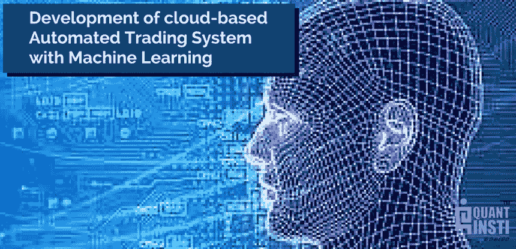
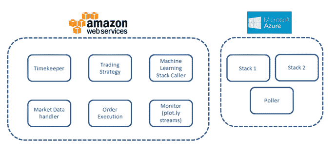
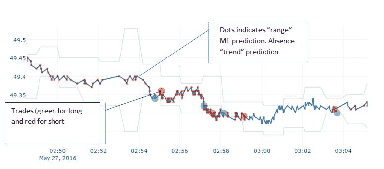
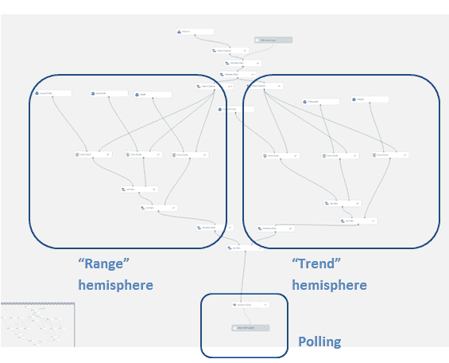
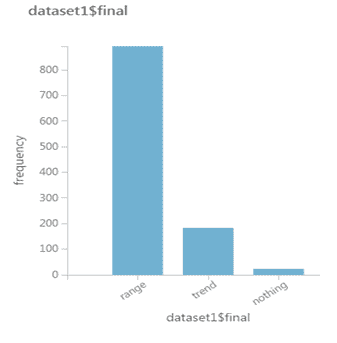
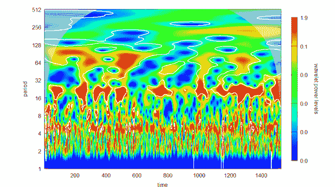
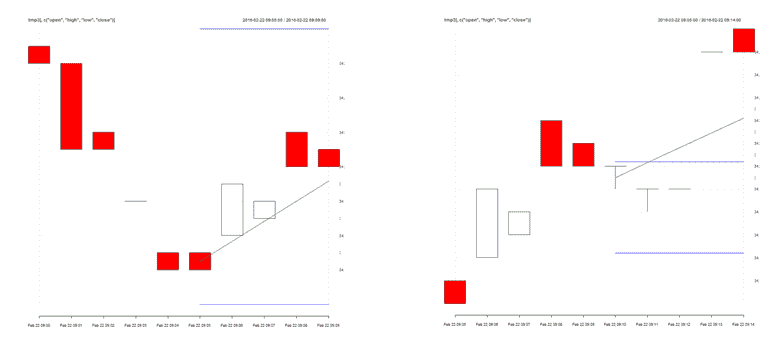

# 利用机器学习开发基于云的自动交易系统[EPAT 项目]

> 原文：<https://blog.quantinsti.com/epat-project-automated-trading-maxime-fages-derek-wong/>

## 

本文是作者提交的最后一个项目，作为他们在 QuantInsti 的算法交易(EPAT)执行程序课程的一部分。

### **作者**

[ Maxime Fages ](https://sg.linkedin.com/in/maxime-fages-9876101) Maxime 的职业生涯跨越了价值和风险的战略层面，过去几年特别关注交易行为和[市场微观结构](/market-microstructure/)。他在并购、基金管理或当前的公司战略中采用了量化的角度，并且一直是一个狂热的开源软件用户。Maxime 拥有欧洲工商管理学院的 MBA 学位和法国国立高等艺术学院的工程硕士学位；他目前是芝加哥商品交易所集团的战略总监 APAC。

[Derek Wong](https://www.linkedin.com/in/derekbwong)

Derek 在 CBOT 开始了他的职业生涯，然后上楼专注于自营交易和策略开发。他管理全球多策略投资组合，专注于期货和期权领域。他目前是福瑞贸易投资有限公司系统交易副总监。

### **构思**

在算法交易(EPAT)高管课程(T1)讲座结束时，德里克和我花了大量时间通过各种媒体交换意见。我们讨论了一个项目的想法，同样的主题让我们兴奋不已。首先，我们对处理期货而不是现金工具感兴趣。第二，我们都有使用 R 进行定量研究的丰富经验，并且都有兴趣在执行方面动手，尤其是在 Python 中实现事件驱动的策略(在 EPAT 项目之前我们都不知道这一点)。第三，我们花了几个小时讨论和评估用于交易的应用程序的[机器学习的性能，并且非常渴望尝试我们的想法。最后，我们对实际的架构设计非常感兴趣，特别是管理任何机器学习框架的可变资源需求的最佳方式(训练与评估)。](https://quantra.quantinsti.com/course/introduction-to-machine-learning-for-trading)

因此，我们项目的范围自然而然地产生了:**开发一个完全基于云的自动化交易系统，该系统将利用简单、快速的均值回复或趋势跟踪执行算法，并调用机器学习技术在这些算法之间切换**。

### **项目描述**

[EPAT](https://www.quantinsti.com/epat/) 项目的机器学习课程使用了[支持向量机](/trading-using-machine-learning-python-svm-support-vector-machine/)，并证明了它在预测波动性方面的表现略好于 [GARCH 模型](https://quantra.quantinsti.com/course/quantitative-trading-strategies-models)。文献表明，递归[神经网络](https://quantra.quantinsti.com/course/neural-networks-deep-learning-trading-ernest-chan)模型在正确的情况下甚至可以表现得更好[1]，并且组合模型(“厚建模”)可能会减轻过度拟合问题[2]。这确实是一个吸引人的前景，但是我们对使用 ML 框架(主要是 e1071、caret 和用于 R 的 nnet，以及优秀的 scikit-learn 或 Python 中更简单的 pybrain)的涉猎揭示了一个关键问题:资源管理。在中档台式计算机上，大多数模型的学习阶段可能会非常漫长，而且大多数数据集的庞大规模会占用大量 RAM。例如，一台相对高端的 PC 使用 GPU 优化可能会做得相当好。然而，这将带来成本之外的进一步挑战:管理这样一个系统本身就是一门艺术，而且我们没有这方面的经验。此外，上面提到的大多数库可能很难正确设置；这对于机器学习研究来说尤其成问题，因为例如神经元系数没有可以容易地进行健全检查的显著值。表现不佳的模型有足够多的潜在根本原因，不需要增加一层业余管理，尤其是在我们的规模上。

### **结构**



*图 1:技术堆栈*

我们的架构相对简单，并且被设计成驻留在远程服务器中。在提取历史市场数据的启动序列之后，计时器流程触发均值和标准差的更新[3]以及增量分钟数据条的更新。每 5 分钟，它将触发一次机器学习堆栈的调用，以获得接下来 5 分钟的评估。从代理流出的数据由处理程序排队并处理，以更新所有关键的交易参数。一个非常简单的策略是持续评估信号:如果机器学习堆栈显示趋势状态，它会将 Z 分数阈值作为开始趋势，否则它会进行均值回归交易。信号被排队，订单执行将获取它们并“天真地”处理订单。实际上，执行在出价(长)或要价(短)时执行限价单，并等待 ack(当从代理的 API 捕捉到 ack 消息时，ack 消息被推入第三个队列中)。如果在超时参数内未检测到确认，订单将被视为过期，如果是初始头寸订单，订单将被取消；如果是获利回吐订单或止损订单，订单将被更改为市价订单。从 ack 推断的填充被添加到 plot.ly 监视器(第三方流图表)。



*图 2:实时监控，交易执行和指标*

我们不会公布[机器学习](/trading-using-machine-learning-python/)模型的全部细节，但总的原则是，我们有两个分别训练的“半球”来预测测距或趋势条件。每个半球都有三个不同的模型，每个模型都有特定的参数，每一方都会对模型进行投票，以决定即将到来的情况。如果双方意见不一致(例如检测到“范围”和“趋势”条件)，堆栈将评估模型的置信参数以做出决定。



*图 3:机器学习栈概述*



*图 4:样本外结果分布*

Azure Machine Learning Studio 的一个非常好的特性是它支持定制功能的开发。在我们的案例中，我们开发了一个简单的投票方法来投票给两个“半球”,如果出现不一致的情况，就选择总体信心最高的一方。

```py
# Map 1-based optional input ports to variables
dataset1 <- maml.mapInputPort(1) # class: data.frame
#simple polling 
dataset1$trend_poll <- ifelse((dataset1$trend_NN == "trend") +(dataset1$trend_TCdeep == "trend") + (dataset1$trend_boostDT == "trend") >
                                (dataset1$trend_NN == "notrend") +(dataset1$trend_TCdeep == "notrend") + (dataset1$trend_boostDT == "notrend"), "trend", "notrend")
#poll trend confindence (as in "sum of confidence if youwere right")
dataset1$trend_poll_conf <- (dataset1$trend_NN == dataset1$trend_poll)*dataset1$trend_NNprob+
  (dataset1$trend_TCdeep == dataset1$trend_poll)*dataset1$trend_TCdeepprob+
  (dataset1$trend_boostDT == dataset1$trend_poll)*dataset1$trend_boostDTprob
#simple polling as the threshold is not really helping
dataset1$range_poll <- ifelse((dataset1$range_NN == "range") +(dataset1$range_TCdeep == "range") + (dataset1$range_boostDT == "range") >
                                (dataset1$range_NN == "norange") +(dataset1$range_TCdeep == "norange") + (dataset1$range_boostDT == "norange"), "range", "norange")
#poll trend confindence (as in "sum of confidence if youwere right")
dataset1$range_poll_conf <- (dataset1$range_NN == dataset1$range_poll)*dataset1$range_NNprob+
  (dataset1$range_TCdeep == dataset1$range_poll)*dataset1$range_TCdeepprob+
  (dataset1$range_boostDT == dataset1$range_poll)*dataset1$range_boostDTprob

dataset1$final <- ifelse(dataset1$trend_poll == "trend" & dataset1$range_poll == "norange", "trend",
                         ifelse(dataset1$trend_poll == "notrend" & dataset1$range_poll == "range", "range",
                                ifelse(dataset1$trend_poll == "trend" & dataset1$range_poll == "range",
                                       ifelse(dataset1$trend_poll_conf>dataset1$range_poll_conf,"trend","range"),"nothing")))

data.set <- as.data.frame(dataset1$final)
# Select data.frame to be sent to the output Dataset port
maml.mapOutputPort("data.set")

```

*R 片段 1:简单的轮询设备，连接到 Azure Stack 网络*

在一些罕见的情况下，双方都没有信号，在这种情况下，我们在 5 mn 内不做任何事情。这个 5 mn 的选择并不完全是任意的，而是我们对“稳定的”(即使是暂时的)交易环境的看法和 WTI 的实际确定周期之间的一种有根据的妥协[4](小波包[非常有用)。](https://cran.r-project.org/web/packages/wavelets/wavelets.pdf)



*图 5:WTI 价格的小波(频谱)视图*

样本外性能达到了令人印象深刻的 74%，非常重要的是，我们的样本仅限于 6 个月的 1 分钟棒线。处理数据的 R 代码是 github 库的一部分，本质上转换了一系列“标准”指标(SMA、LMA、RSI、ATR 等)。)为前 5 mn 进单个 50 个数据点(输入)+ 1 输出。Azure 框架上的培训速度很快，出色的界面使得用 python 或 r 添加自定义代码变得很容易。从培训到一个实时的 RESTful API 非常简单，响应时间明显低于 100 毫秒。



| *图 6:用于训练的“范围”条件输入* | *图 7:用于训练的“趋势”条件输入* |

```py
#eyeball using quantmod
eyeb<-function(x){
i=x
start <- index(df)[1]+i*60*5
mid <-start+5*60
end <- start+10*60
tmp <- df[index(df) >=start & index(df) < mid]
tmp2 <- df[index(df) >=mid & index(df) < end]
tmp3 <- df[index(df) >=start & index(df) < end]

mychartTheme <- chart_theme()
mychartTheme$rylab = T 
chart_Series(tmp3[,c("open","high","low","close")], theme=mychartTheme)

slp_av <- mean(tail(tmp2$trend,3))
ln_slp <- function(x){xts(coredata(first(x)+slp_av*as.numeric((index(x)-first(index(x))))),order.by=index(x))}
dummy <- (tmp2$high+tmp2$low)/2
add_TA(ln_slp(dummy),on=1, col=3)
ta_up <- xts(rep(mean(tmp$close)+z_thresh*last(tmp$atr),length(index(tmp2))),order.by = index(tmp2))
add_TA(ta_up, on=1, col=4)
ta_dn <- xts(rep(mean(tmp$close)-z_thresh*last(tmp$atr),length(index(tmp2))),order.by = index(tmp2))
add_TA(ta_dn, on=1, col=4)

}

```

*R 片段 2:眼球函数生成图 6 & 7*

### **交易策略开发**

我们确定了三个指导原则，并在战略制定过程中坚持这些原则。首先，我们需要一种策略，这种策略将极大地依赖和利用机器学习架构。其次，我们需要策略以这样一种方式执行，即来自不同制度状态的绩效的实证分析将允许我们判断交易策略本身，但也可以查看机器学习是否实时执行良好。最后，当然，对于所有的交易策略，我们都希望它有利可图。

我们的机器学习架构的内在复杂性导致我们在交易策略上保持相对简单。这是必要的，有几个原因，简化的交易逻辑让我们避免了经典的策略发展陷阱。例如:过度拟合、限制自由度、混淆逻辑错误和数据污染。当运行几种不同类型的训练和回溯测试时，首先是机器学习架构，然后是开发交易逻辑本身，这使陷入经典策略开发陷阱的机会增加了一倍。

交易系统是基于我们计算的频率统计推断。我们决定使用一个简单的统计方法，Z 分数作为我们策略的基础。这是一个极其简单的标准统计公式。这样做的原因是因为我们不希望 ML 结构和我们的交易逻辑模型的结合带来额外的复杂性。

```py
zscore = (self.last_trade - self.cur_mean)/self.cur_sd
```

*Python 片段 1: z-score 公式片段*

### **录入触发流程**

我们的参赛条件简单地基于两个因素，主要是机器学习市场机制状态和 Z 分数生成的触发条件。

| **进入条件** | 高于 Z 分数阈值 | 低于 Z 分数阈值 |
| 测距机制状态 | 卖空 | 买空 |
| 趋势政权状态 | 买空 | 卖空 |

*表 1:进入条件逻辑矩阵*

```py
if abs(zscore) >= self.zscore_thresh and \
                abs(zscore) <= settings.Z_THRESH + settings.Z_THRESH_UP and \
                self.trading.is_set() and \
        (self.fill_dict == [] or self.fill_dict[-1]["type"] != "main") and \
                self.flag != "nothing":
    self.exec_logger.info("signal for main detected - strategy")
    try:

        if zscore >= self.zscore_thresh:
            if self.flag == "trend":
                action = "BUY"

            if self.flag == "range":
                action = "SELL"

        if zscore <= -self.zscore_thresh:
            if self.flag == "trend":
                action = "SELL"

            if self.flag == "range":
                action = "BUY"

```

*Python 片段 2:交易逻辑触发条件*

我们使用简单对称触发逻辑的理由如下。通过保持绝对最简单的触发方法，我们可以最大限度地依赖机器学习。如果市场机制由于触发器的简单性质而不正确，如果包括市场摩擦，产生的独立 alpha 值应该接近于 0 或负值。这是假设短期高频数据的市场是一个几何布朗运动(GBM)过程，如随机游走。

如果机器学习可以检测到什么时候不是这种情况，并且有一些分布的尾部偏离了对数正态分布，那么我们可以生成 alpha。例如，我们有三种状态:趋势、范围和无。如果 GBM 为真，那么时间序列要么不存在，要么在范围内。图 4 清楚地表明了这一点，但是，我们确实显示了统计意义上的大部分时间花在趋势区域。这表明时间序列在峰度上存在方差，并且具有随机波动性。由于过度的峰度，这导致我们可以从趋势策略中产生 alpha。然而，一个标准的 Z 值不能辨别这些不同的时间序列状态，它假设了一个正态分布。因此，当且仅当机器学习架构能够准确地辨别市场制度状态时，交易触发器才能够变得有利可图。

这种策略还包括我们的机器学习两个半球中存在的相同类型的假设，即在不同的制度下，我们应该有两种类型的市场价格分布。一种是更薄的，导致更厚的尾巴，标志着一种趋势。另一种可能是更正常的，甚至是尾部相对较薄的扁 kurtic，导致一个范围制度。

Z 分数将假设正态分布，这意味着我们希望利用的所有目标活动都在尾部。因此，通过使用 Z 分数触发器，我们可以简单地做到这一点，并且只在我们判断为极端值的地方有触发点，希望利用不同的尾部条件。我们的参数触发点是 2 到 2.5 之间的任何 Z 值(Z *THRESH 和 Z* THRESH + Z *THRESH* UP)

### **退出**

鉴于我们的主要目标，我们的退出也非常简单。我们使用两种退出条件。对于“区间”制度[均值回复](https://quantra.quantinsti.com/course/python-mean-reversion-strategies-ernest-chan)交易，多头使用高于我们的 Z_TARGET 的 Z 值，空头使用低于我们的 Z _ TARGET 的 Z 值。我们预计平均恢复活动将是 Z 分数为 0，但我们有一个稍大的范围来关闭我们参数中的+/-0.2 的位置。我们还有一个额外的 4 点跟踪止损，这是用于两个系统。然而，趋势交易是唯一的退出条件。

### **参数**

我们的参数集直接取自正态分布假设。在我们的架构中，这些由一个单独的配置文件控制，这使得修改变得容易。我们使用的 Z 得分阈值(Z *THRESH)为 2，并限制为 2.5(Z*THRESH+Z*THRESH*UP)。这就是为什么我们不试图进入已经背离很远的交易。跟踪止损的止损点*偏移量是以点为单位的，Z* 目标是 0.2 的 Z 值，我们在均值附近关闭均值回复位置。

```py
# trading parameters
Z_THRESH = 2
Z_THRESH_UP = 0.5
STOP_OFFSET = 0.04
Z_TARGET = 0.2

```

*Python 片段 3:交易逻辑参数*

### 项目进展如何？

我们一直使用的参数导致每小时 14x-16x 的旋转(7-8 次旋转)。这一数字意义重大，尤其是从名义价值的角度来看:每天的名义交易额约为 1650 万美元，利润率约为 5000 万美元(然而，从净资产收益率的角度来看，后者是唯一有趣的参数)

该策略表现相当好:45%在每份合约 1.8 个基点左右获利，29%在每份合约 1.7 个基点左右亏损，26%亏损。然而，平均利润，在 ca。每笔往返交易的 0.32 点必须与 IB 每笔交易向我们收取的 1.42 美元相比较[5]；散户交易者的经济状况很艰难。2.84 美元的经纪费和交易费带来的 3.2 美元的净利润，理论上会产生 20%-30%的月利润率。这可能看起来令人印象深刻，但考虑到所涉及的杠杆远不能补偿不可预见的、奇怪的市场条件(与公告相关的峰值、流动性下降)可能产生的潜在损失，更不用说运营风险(漏洞或系统崩溃)了。此外，还不清楚我们是否能在不出现重大下滑的情况下，将策略扩展到足以让一些“真正的”投资获得回报。

另一方面，资源成本低得离谱:AWS 微实例免费一年，鉴于 azure 完成了繁重的工作(ML ),这对我们来说是足够的处理能力，Azure 堆栈的价格不到 10 美元/米(“seat ”,然后是 1000 个 API 调用的 50 美分)

### **结论**

关于交易，我们的三个主要结论是:

*   只要有可能，软件作为机器学习的服务是绝对有意义的。50 毫秒-100 毫秒的响应时间是一个明确的限制，但低于这个标准的增量投资和运营风险非常大。对于任何更长的 horizon 应用程序来说，这项技术，尤其是微软的 Azure ML Studio，都是值得探索的。
*   即使是在 outrights 上，用有限的资源进行自动交易仍然有可能赚钱。然而，交易所/经纪费可以迅速侵蚀甚至取消利润。激励/分级计划对于这些策略的盈利至关重要。是的，这是显而易见的，但我们现在有了第一手的经验。
*   在显而易见的研究和编码部分之间，将抽象概念设计成可操作的对象和代码可能更像是艺术而不是科学。在那个领域拥有实际经验(和失败)显然是有好处的。

### **对未来学生/程序员的建议:**

*   探索图书馆，并彻底了解它们可以/将要做什么。例如，IBPY 具有简单存在的优点。文档几乎不存在，但是它有大量调用所有 API 功能的包装器。有可能我们最终会重写一些已经存在的功能(当我们这样做时，我们的实现很可能是最差的)
*   “*棋如斗剑，先想后动*”——吴唐门。这种古老的智慧肯定也适用于开发，尤其是当涉及到类和并发性时。由于我们没有这种开发或设计软件架构的经验，我们从黑进 [James Ma“高频”项目](https://github.com/jamesmawm/High-Frequency-Trading-Model-with-IB)开始。可以肯定地说，詹姆斯在我们的项目中的出色工作几乎没有留下任何东西；解决由范围差异引起的限制最终总是以块和重构告终。最终，我们将**节省大量时间，花更多时间思考概念模块，然后从头开始朝它们努力**(注意，当时我们不知道如何做，Jame 的工作是一个很好的引导)。讽刺的是，我们最终的架构看起来非常像 Quantinsti 的[系统架构 101](/algorithmic-trading-system-architecture/) 中的那个。
*   我们工作中的大部分 R/Python 都涉及顺序工作流，迭代开发。交易系统涉及从交易所流出的数据、基于信号、确认或订单等的订单推送。事后看来，这当然是“线程”和“并发”的叫法，但是 James 已经(非常好地)成功地保持了他的工作顺序，并且只依赖于类。这对我们来说并不奏效，并且与前面提到的问题结合起来导致了第一次重构(不成功，因为我们押错了任务库: [threading](https://docs.python.org/2/library/threading.html) )。如果同时使用 python 3.5 或 [**的话，我们非常鼓励任何研究 python 交易的人去**钻研****](https://docs.python.org/3/library/concurrent.futures.html) **[**asyncio**](https://docs.python.org/3/library/asyncio.html) **。期货**** **也是 2.7 的后移植**(我们用的是后者)。现在，多重处理有它自己令人沮丧的挑战:线程在沉默中死去，(不是)线程安全的对象，等等。并且通常是非常不同的设计范例。从积极的一面来看，当它起作用时，令人难以置信的满足
*   质量保证可能是开发中最不性感的方面。这也是我们已经并将投入大量学习/阅读时间的领域。这种技能在笔记本型环境中并不重要，因为大多数情况下，调试可以一步一步地进行。当然，当多个线程与不同来源的数据交互时，这是一种非常不同的情况。到处编写打印语句是不够的，无论是[](https://docs.python.org/2/library/logging.html)****还是**[**trace back**](https://docs.python.org/2/library/traceback.html)**都是非常值得投入时间的库。**公平地说，没有一个是特别直观的(顺便说一下，[异常](https://docs.python.org/2/tutorial/errors.html)类的使用也是如此),但是系统化的 try/except 和日志记录确实是救命稻草**
***   “现在感受痛苦或以后感受痛苦”这个老掉牙的说法在发展问题上尤为贴切。使用类和其他不太直观的对象和进程分类法是一把双刃剑。大多数类和函数不会直接进行测试，试图在集成测试中测试基本功能(例如，输出的正确类型)会导致灾难。我们最终使用非常好的 [__main__](https://docs.python.org/3/library/__main__.html) python 语义来“搭建”运行所需的基础的单个类，作为一个穷人的 [unitest](https://docs.python.org/2.7/library/unittest.html) (另一个非常关键的不性感的库)。最后，开发测试特性所需的时间并不是微不足道的(我们假设可能是 20%左右)，但是这是一个非常好的资源利用。一个很好的例子是，我们没有建立一个市场模拟器。这是我们做出的决定，基于我们实际上与 IB 交易的有限利益(很大程度上是由于合同限制)，以及坦率地说，基于我们在开始时拥有的技能。仅从时间角度来看，这是一个非常糟糕的决定:在 IB 上注册的引导序列大约有 20 秒长。考虑到信号的发生，这可能最少需要 30 秒，而在 4 小时的开发序列中，可能需要 20 到 30 次重启。保守估计，10-20 分钟的时间浪费或 5%-10%的生产力损失。这甚至是在能够测试具体情况而不是等待情况发生之前，并且在我们看来，毫无疑问，即使中途咬紧牙关也会有很大的好处(包括参数调整)。**

 **概括地说，这是关键的收获:完成一个项目的 80%是容易和有趣的部分。艰难而乏味的是最后的 20%，这也是实际技能重要的地方(尤其是在质量保证方面)。

在这个过程中，我们收获了很多，感谢老师们的帮助和指导。鉴于我们各自的合同限制，我们不打算继续公开发布该程序，但计划在近期再次合作。

Github 库:[https://github.com/FaGuoMa/Azure-IB/.](https://github.com/FaGuoMa/Azure-IB/)

### **参考文献**

[1]实证金融学中的非线性时间序列模型——Philip Hans Franses，Dick van Dijk 使用基于波动率的递归神经网络进行变化方向预测——Stelio be kiros 和 Dimitris Georgoutsos

[2]组合分类器比选择最好的一个更好吗——Saso Dzeroski 和 Bernard Zenko 流行的集成方法:一项实证研究

[3]对于标准差，我们使用了无偏估计量(R . ALM gren–时间序列分析和统计套利，NUY)

[4]金融时间序列的小波多分辨率分析

[5]零售佣金是 0.85 美元的经纪费加上 1.45 美元的纽约商品交易所交易费。然而，根据 NYMEX/CME 和 IB 的分级交易量计划，费率可能分别为每笔交易 0.65 美元和 0.77 美元

### 后续步骤

对于更多这样的学生项目，如果你是一名程序员或科技专业人士，想创建自己的自动化交易平台，请查看使用 R. 的[统计套利策略。从日常从业者的实时互动讲座中学习自动交易。](/epat-project-student-jacques-joubert/)[算法交易高管课程](https://www.quantinsti.com/courses/epat/)涵盖统计学&计量经济学、金融计算&技术和算法&量化交易等培训模块。[现在报名](https://www.quantinsti.com/courses/epat/scholarship-test/)！**